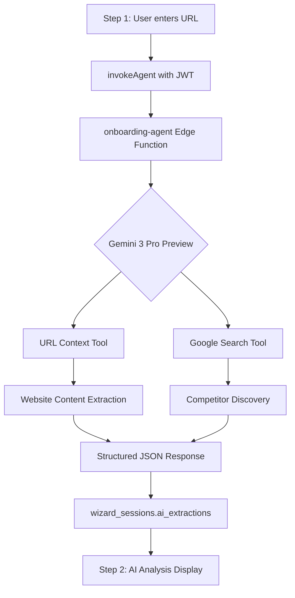

# Onboarding Agent - URL Context & Google Search Grounding

## Overview

The `onboarding-agent` edge function uses **Gemini 3 Pro Preview** with two powerful tools:

1. **URL Context** - Reads website content directly
2. **Google Search Grounding** - Discovers competitors and market trends

## Architecture



## Implementation Details

### URL Context + Search Grounding Request

```typescript
const geminiResponse = await fetch(
  `https://generativelanguage.googleapis.com/v1beta/models/gemini-3-pro-preview:generateContent?key=${GEMINI_API_KEY}`,
  {
    method: "POST",
    headers: { "Content-Type": "application/json" },
    body: JSON.stringify({
      contents: [{ parts: [{ text: prompt }] }],
      generationConfig: {
        temperature: 0.2,
        maxOutputTokens: 2000,
        responseMimeType: "application/json",
      },
      tools: [
        // URL Context - reads the website content directly
        { urlContext: { urls: [url] } },
        // Google Search grounding - discovers competitors and market trends
        { google_search: {} },
      ],
    }),
  }
);
```

### Extracted Fields

| Field | Source | Description |
|-------|--------|-------------|
| `company_name` | URL Context | Company name from website |
| `description` | URL Context | 2-3 sentence description |
| `industry` | URL Context | Industry categories |
| `competitors` | Google Search | Competitor companies |
| `market_trends` | Google Search | Relevant market trends |
| `stage` | Inferred | Startup stage (Pre-seed, Seed, etc.) |
| `target_market` | URL Context | Target customer segment |

## Frontend Integration

### JWT Authentication Pattern

All edge function calls use the `invokeAgent` helper to ensure JWT is explicitly attached:

```typescript
// src/hooks/onboarding/invokeAgent.ts
export async function invokeAgent<T>(body: Record<string, unknown>): Promise<T> {
  const { data: { session }, error } = await supabase.auth.getSession();
  
  if (!session?.access_token) {
    throw new Error("No active Supabase session");
  }

  const response = await supabase.functions.invoke('onboarding-agent', {
    body,
    headers: {
      Authorization: `Bearer ${session.access_token}`,
    },
  });

  if (response.error) throw response.error;
  return response.data as T;
}
```

### Hook Usage

```typescript
// useEnrichment.ts
const enrichUrlMutation = useMutation({
  mutationFn: (params: EnrichUrlParams): Promise<EnrichmentResult> =>
    invokeAgent({
      action: 'enrich_url',
      session_id: params.session_id,
      url: params.url,
    }),
});
```

## Onboarding Flow

### Step 1: Context & Enrichment
- User enters website URL, description, target market
- "Smart Autofill" triggers `enrich_url` action
- AI extracts company info + discovers competitors via Google Search

### Step 2: AI Analysis
- Displays extracted data with confidence scores
- User can edit AI-detected fields (human-in-the-loop)
- Readiness score calculated with `calculate_readiness`

### Step 3: Smart Interview
- Adaptive questions based on stage/industry
- Answers processed to extract signals
- Traction/funding data captured

### Step 4: Review & Score
- Investor readiness score (0-100)
- AI-generated summary with strengths/improvements
- Complete wizard creates startup record

## Troubleshooting

### "missing sub claim" Error
- **Cause**: JWT not attached to edge function call
- **Fix**: Use `invokeAgent` helper instead of direct `supabase.functions.invoke`

### Empty AI Extractions
- **Cause**: Website blocking or Gemini API error
- **Fix**: Check edge function logs, verify GEMINI_API_KEY is configured

### Step 4 Completion Failure
- **Cause**: Missing org_id for new users
- **Fix**: Edge function now handles missing org gracefully

## Related Files

- `supabase/functions/onboarding-agent/index.ts` - Edge function
- `src/hooks/onboarding/invokeAgent.ts` - JWT helper
- `src/hooks/onboarding/useEnrichment.ts` - Enrichment mutations
- `src/hooks/useWizardSession.ts` - Session management
- `src/pages/OnboardingWizard.tsx` - Main wizard component
