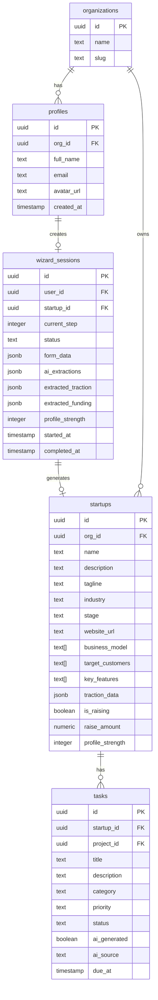
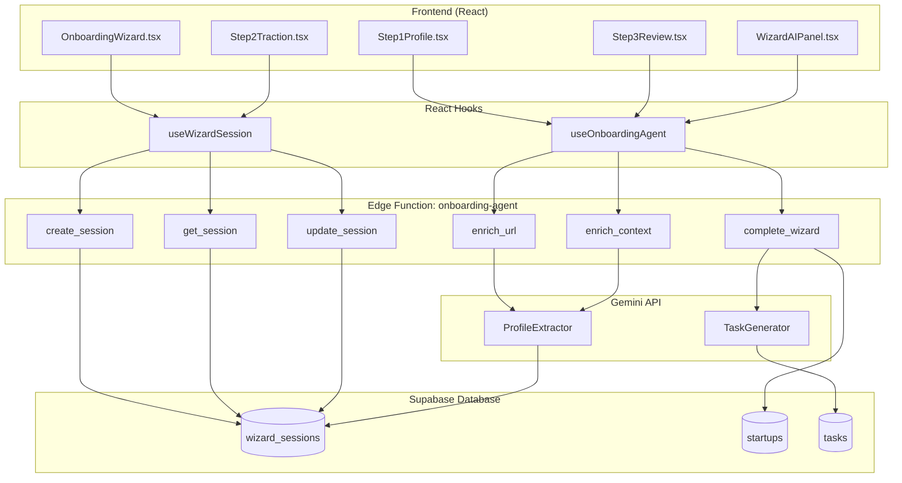
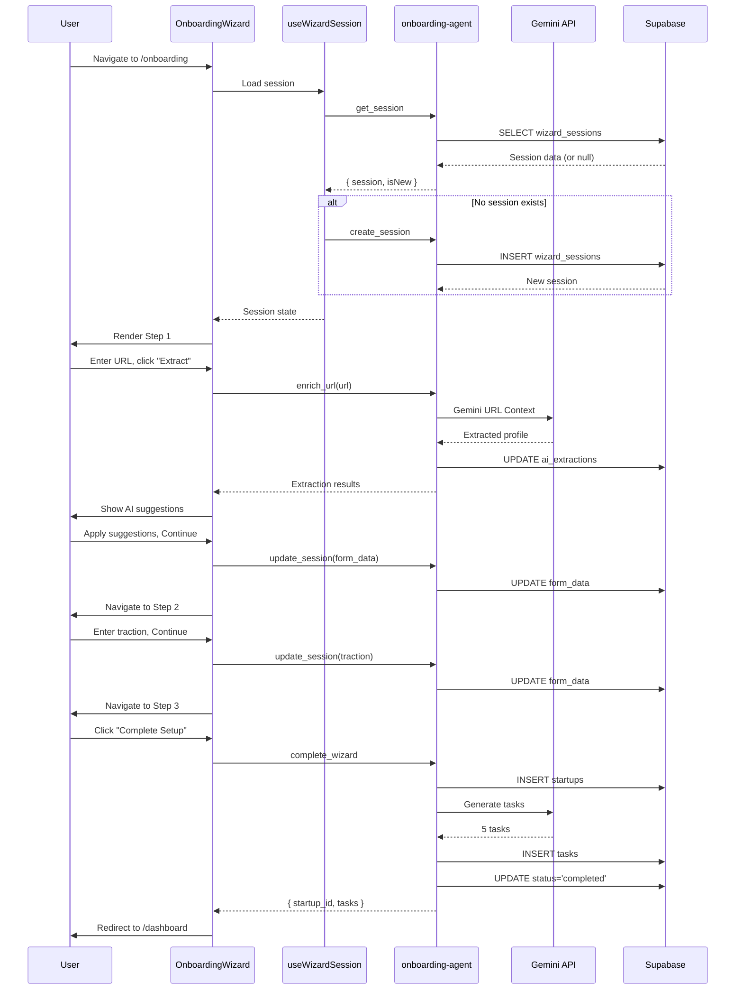
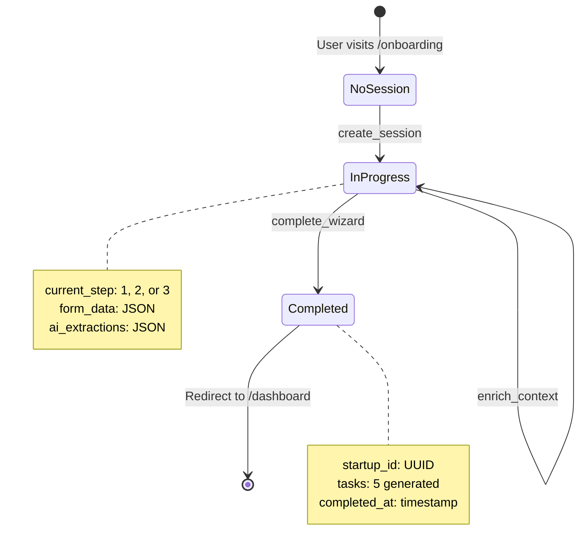
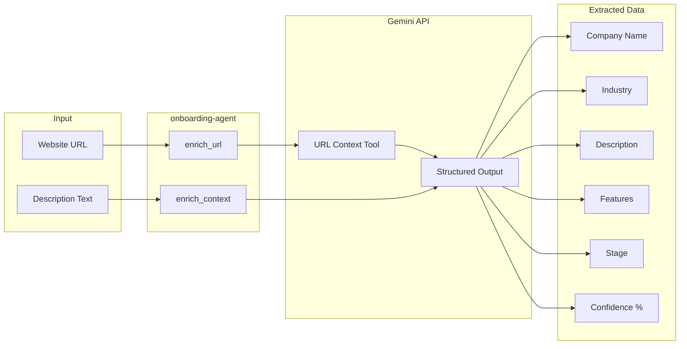
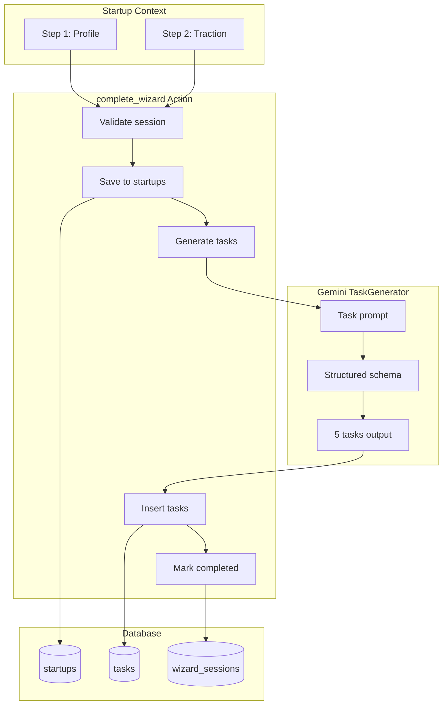
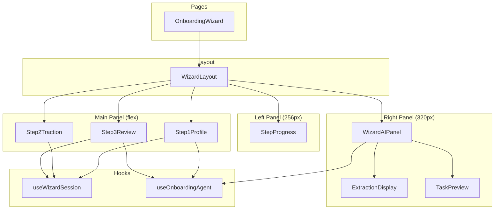
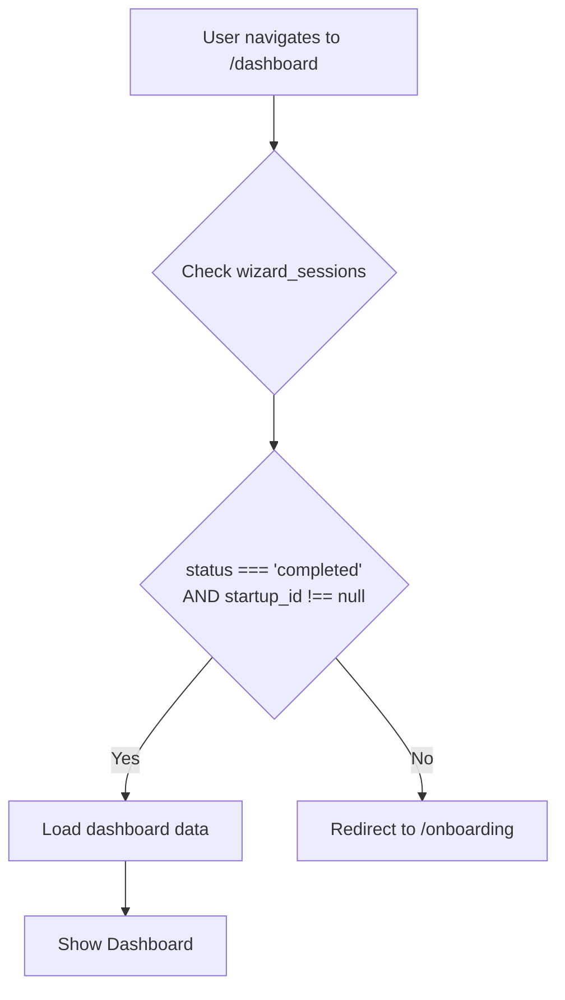
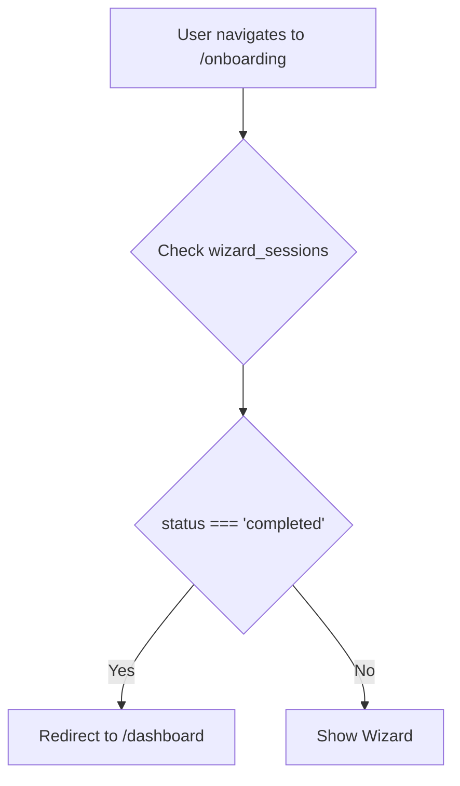

# Onboarding System Diagrams

## Database Entity Relationship

---

## Edge Function Architecture

---

## Wizard Data Flow Sequence

---

## Wizard Session State Machine

---

## AI Extraction Flow

---

## Task Generation Flow

---

## Component Hierarchy

---

## Dashboard Redirect Logic

---

## Wizard Redirect Logic

