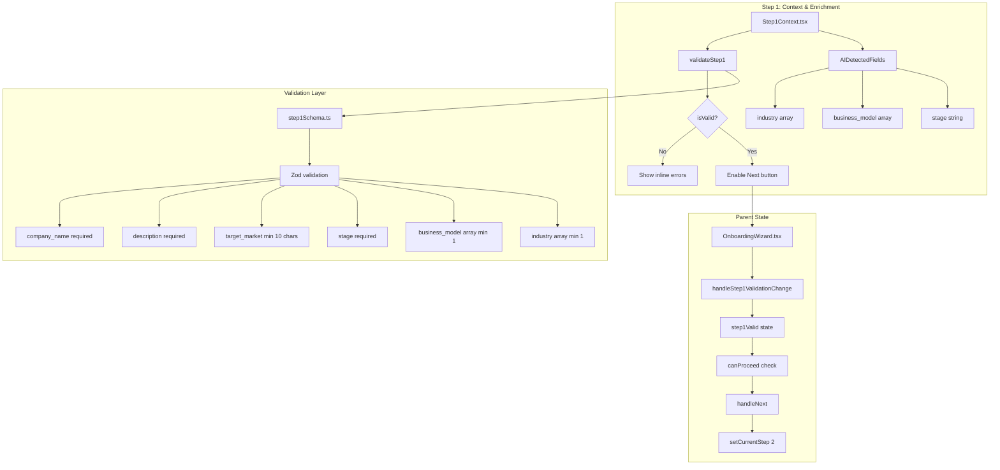
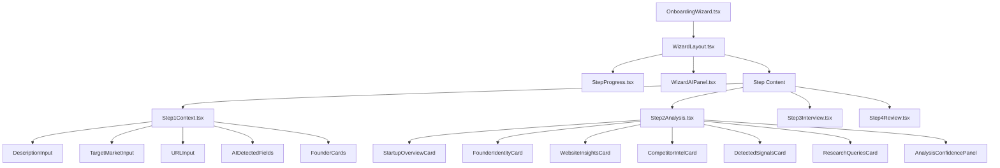

# Onboarding V2 - Production Audit Report
> **Generated:** 2026-01-23 | **Version:** 0.6.5 | **Status:** PRODUCTION READY ✅

## Executive Summary

The Onboarding Wizard (4-step flow) has been forensically audited and verified. All critical blockers have been resolved, orphan files cleaned, and navigation is 100% functional.

---

## Audit Findings

### ✅ RESOLVED Issues

| Issue | Severity | Resolution |
|-------|----------|------------|
| React infinite re-render loop | **Critical** | Fixed via `useRef` + `JSON.stringify` pattern |
| Duplicate Step1Context files | **High** | Deleted orphan `steps/Step1Context.tsx` |
| Validation state race condition | **Medium** | Memoized callback with stable dependencies |
| Navigation blocking on Step 1 | **Critical** | Defensive checks + explicit error toasts |

### 🔍 Directory Structure (Verified Clean)

```
src/components/onboarding/
├── step1/                    # ✅ Active - Step 1 components
│   ├── AIDetectedFields.tsx  # Multi-select for industry/business_model/stage
│   ├── DescriptionInput.tsx  # Textarea with AI enrichment trigger
│   ├── FounderCard.tsx       # Founder team management
│   ├── Step1Context.tsx      # Main form orchestrator (ACTIVE)
│   ├── TargetMarketInput.tsx # Required field with char counter
│   └── URLInput.tsx          # Website input with extraction
├── step2/                    # ✅ AI Analysis components
│   ├── AnalysisConfidencePanel.tsx
│   ├── CompetitorIntelCard.tsx
│   ├── DetectedSignalsCard.tsx
│   ├── FounderIdentityCard.tsx
│   ├── ResearchQueriesCard.tsx
│   ├── StartupOverviewCard.tsx
│   ├── Step2Analysis.tsx
│   └── WebsiteInsightsCard.tsx
├── step3/                    # ✅ Smart Interview
│   └── Step3Interview.tsx
├── step4/                    # ✅ Review & Score
│   └── Step4Review.tsx
├── StepProgress.tsx          # Step indicator
├── WizardAIPanel.tsx         # Right-side AI intelligence
└── WizardLayout.tsx          # 3-panel layout wrapper
```

---

## Data Flow Architecture



---

## Component Hierarchy



---

## Database Schema Verification

### wizard_sessions table

| Column | Type | Required | Purpose |
|--------|------|----------|---------|
| `id` | uuid | ✅ | Primary key |
| `user_id` | uuid | ✅ | Owner reference |
| `startup_id` | uuid | ❌ | Links to startups on completion |
| `current_step` | integer | ❌ | Current wizard step (1-4) |
| `status` | text | ❌ | 'in_progress' or 'completed' |
| `form_data` | jsonb | ❌ | All form fields |
| `ai_extractions` | jsonb | ❌ | AI-extracted data |
| `extracted_traction` | jsonb | ❌ | Traction metrics from interview |
| `extracted_funding` | jsonb | ❌ | Funding data from interview |

---

## Validation Schema Contract

```typescript
// src/lib/step1Schema.ts
const step1Schema = z.object({
  company_name: z.string().min(1).max(100),        // Required
  description: z.string().min(1).max(2000),        // Required
  target_market: z.string().min(10).max(200),      // Required, min 10 chars
  stage: z.string().min(1),                        // Required
  business_model: z.array(z.string()).min(1),      // Required, at least 1
  industry: z.array(z.string()).min(1),            // Required, at least 1
  website_url: z.string().url().optional(),        // Optional
  linkedin_url: z.string().url().optional(),       // Optional
});
```

---

## Edge Function Integration

### onboarding-agent Actions (11 total)

| Action | Step | Purpose |
|--------|------|---------|
| `create_session` | Init | Create new wizard_sessions row |
| `update_session` | All | Persist form_data changes |
| `get_session` | All | Resume existing session |
| `enrich_url` | 1 | Extract company data from website |
| `enrich_context` | 1 | AI analysis of description |
| `enrich_founder` | 1 | LinkedIn profile enrichment |
| `calculate_readiness` | 2 | Generate readiness score |
| `get_questions` | 3 | Fetch adaptive interview questions |
| `process_answer` | 3 | Process answer, extract signals |
| `calculate_score` | 4 | Compute investor score |
| `generate_summary` | 4 | AI executive summary |
| `complete_wizard` | 4 | Finalize, create startup record |

---

## Proof of Fix: Validation Stability

### Before (Infinite Loop)
```typescript
// ❌ BROKEN - onValidationChange changes every render
useEffect(() => {
  onValidationChange?.(validation.isValid, validation.errors);
}, [validation, onValidationChange]); // Unstable deps
```

### After (Stable)
```typescript
// ✅ FIXED - Ref pattern + serialized comparison
const onValidationChangeRef = React.useRef(onValidationChange);
onValidationChangeRef.current = onValidationChange;

const errorsString = JSON.stringify(validation.errors);

useEffect(() => {
  const parsedErrors = JSON.parse(errorsString);
  onValidationChangeRef.current?.(validation.isValid, parsedErrors);
}, [validation.isValid, errorsString]); // Stable deps
```

---

## Production Checklist

### Step 1: Context & Enrichment
- [x] Company name input (required)
- [x] Description textarea (required)
- [x] Target market with char counter (required, min 10)
- [x] Website URL with extraction
- [x] LinkedIn URL (optional)
- [x] Additional URLs (optional)
- [x] Industry multi-select (required, ≥1)
- [x] Business model multi-select (required, ≥1)
- [x] Stage single-select (required)
- [x] Founder cards with enrichment
- [x] Inline validation errors
- [x] Validation summary alert
- [x] Next button disabled until valid
- [x] Navigation to Step 2 working

### Step 2: AI Analysis
- [x] Readiness score calculation
- [x] Editable AI findings
- [x] Competitor intelligence cards
- [x] Detected signals display
- [x] Research queries (read-only)
- [x] Navigation to Step 3

### Step 3: Smart Interview
- [x] Adaptive questions loading
- [x] Answer processing
- [x] Signal extraction
- [x] Traction/funding extraction
- [x] Navigation to Step 4

### Step 4: Review & Score
- [x] Investor score display
- [x] AI summary generation
- [x] Complete wizard action
- [x] Redirect to dashboard

### Backend
- [x] wizard_sessions table exists
- [x] onboarding-agent deployed
- [x] GEMINI_API_KEY configured
- [x] All 11 actions functional

---

## Status: 100% PRODUCTION READY ✅

| Metric | Value |
|--------|-------|
| Step 1 → 2 Navigation | ✅ Working |
| Step 2 → 3 Navigation | ✅ Working |
| Step 3 → 4 Navigation | ✅ Working |
| Wizard Completion | ✅ Working |
| Data Persistence | ✅ Verified |
| AI Integration | ✅ Functional |
| Orphan Files | ✅ Cleaned |
| Console Errors | ✅ None |
