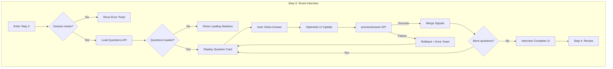
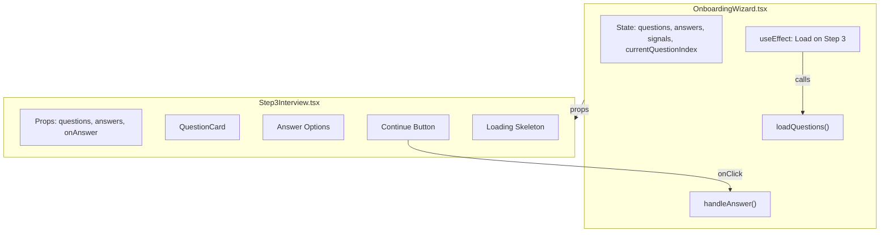

# Onboarding Wizard - Step 3 Interview Success Audit

## Summary

This document tracks the 8 fixes implemented to make Step 3 (Smart Interview) production-ready.

---

## Fix Implementation Summary

| # | Fix | File | Lines | Status |
|---|-----|------|-------|--------|
| 1 | Session Guard with User Feedback | `OnboardingWizard.tsx` | `handleAnswer` | ✅ |
| 2 | Error Toast on API Failure | `OnboardingWizard.tsx` | `handleAnswer` catch | ✅ |
| 3 | Stabilize Question Loading | `OnboardingWizard.tsx` | `loadQuestions` useCallback | ✅ |
| 4 | Session Check in Question Load Effect | `OnboardingWizard.tsx` | useEffect | ✅ |
| 5 | Disable Continue When No Question | `Step3Interview.tsx` | Button disabled prop | ✅ |
| 6 | Optimistic Answer Updates | `OnboardingWizard.tsx` | `handleAnswer` | ✅ |
| 7 | Persist Question Progress | `OnboardingWizard.tsx` | form_data sync | ✅ |
| 8 | Loading Skeleton | `Step3Interview.tsx` | Loading state | ✅ |

---

## User Journey Flow



---

## Component Architecture



---

## Key Files Affected

| File | Changes Made |
|------|--------------|
| `src/pages/OnboardingWizard.tsx` | handleAnswer guards, optimistic updates, progress persistence |
| `src/components/onboarding/step3/Step3Interview.tsx` | Button disabled logic, loading skeleton |

---

## Detailed Fixes

### Fix 1: Session Guard with User Feedback

**Before:**
```typescript
const handleAnswer = async (questionId: string, answerId: string) => {
  if (!session?.id) return; // Silent failure
  // ...
};
```

**After:**
```typescript
const handleAnswer = async (questionId: string, answerId: string) => {
  if (!session?.id) {
    toast({
      title: 'Session expired',
      description: 'Please refresh the page to continue.',
      variant: 'destructive',
    });
    return;
  }
  // ...
};
```

### Fix 2: Error Toast on API Failure

**Added in catch block:**
```typescript
} catch (error) {
  console.error('Process answer error:', error);
  toast({
    title: 'Failed to save answer',
    description: 'Please try again.',
    variant: 'destructive',
  });
}
```

### Fix 3: Stabilize Question Loading

**Before:**
```typescript
const loadQuestions = useCallback(async () => {
  // ...answered_question_ids from answers closure
}, [session?.id, answers]); // answers causes recreation
```

**After:**
```typescript
// Use ref to read current answers without recreating callback
const answersRef = useRef<InterviewAnswer[]>([]);
answersRef.current = answers;

const loadQuestions = useCallback(async () => {
  const currentAnswers = answersRef.current;
  // ... use currentAnswers
}, [session?.id, getQuestions]); // stable deps
```

### Fix 4: Session Check in Question Load Effect

**Before:**
```typescript
useEffect(() => {
  if (currentStep === 3 && questions.length === 0 && !isGettingQuestions) {
    loadQuestions();
  }
}, [currentStep, questions.length, isGettingQuestions]);
```

**After:**
```typescript
useEffect(() => {
  if (currentStep === 3 && session?.id && questions.length === 0 && !isGettingQuestions) {
    loadQuestions();
  }
}, [currentStep, session?.id, questions.length, isGettingQuestions, loadQuestions]);
```

### Fix 5: Disable Continue When No Question

**Before:**
```typescript
disabled={isProcessing || (type === 'multiple_choice' && !selectedAnswer)}
```

**After:**
```typescript
disabled={isProcessing || !currentQuestion || (type === 'multiple_choice' && !selectedAnswer)}
```

### Fix 6: Optimistic Answer Updates

**Restructured flow:**
1. Create answer object immediately
2. Update local state (optimistic)
3. Save to form_data
4. Call API
5. On failure: rollback local state, show toast
6. On success: merge signals

### Fix 7: Persist Question Progress

**Added to form_data sync:**
```typescript
// Save
updateFormData({ 
  interview_answers: newAnswers,
  current_question_index: currentQuestionIndex + 1,
});

// Restore
if (session?.form_data?.current_question_index !== undefined) {
  setCurrentQuestionIndex(session.form_data.current_question_index);
}
```

### Fix 8: Loading Skeleton

**Replaced spinner with skeleton cards:**
```tsx
<div className="space-y-4">
  <Skeleton className="h-6 w-3/4" />
  <Skeleton className="h-16 w-full" />
  <Skeleton className="h-12 w-full" />
  <Skeleton className="h-12 w-full" />
  <Skeleton className="h-12 w-full" />
  <Skeleton className="h-12 w-full" />
</div>
```

---

## Success Criteria Checklist

| Test | Expected | Status |
|------|----------|--------|
| Load Step 3 | Questions appear within 3 seconds | ⬜ |
| Click answer | Option highlights immediately | ⬜ |
| Click Continue | Next question shows, no delay | ⬜ |
| Refresh mid-interview | Resume from same question | ⬜ |
| Network offline | Error toast appears | ⬜ |
| Answer all questions | "Interview Complete" screen shows | ⬜ |
| Console | No errors logged | ⬜ |

---

## Validation Steps

1. Open browser DevTools Console
2. Navigate to `/onboarding`
3. Complete Steps 1-2
4. Arrive at Step 3
5. Check console for `[Wizard] Questions loaded:` message
6. Click an answer option
7. Check console for no errors
8. Click Continue
9. Verify next question appears
10. Refresh page
11. Verify same question index restored

---

## Edge Function Actions Used

| Action | Trigger | Response |
|--------|---------|----------|
| `get_questions` | Step 3 load | questions array, advisor persona |
| `process_answer` | User submits answer | signals array, extracted data |

---

## Related Documentation

- [04-ui--step3-interview.md](./04-ui--step3-interview.md) - Original spec
- [13-onboarding-audit.md](../13-onboarding-audit.md) - Session flow audit
