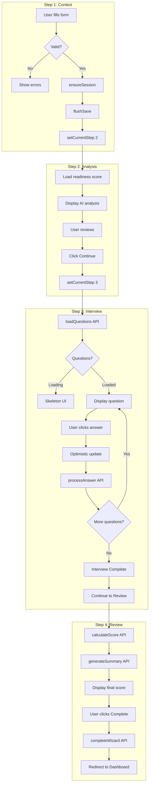

# Onboarding System Audit - Complete Analysis

## Executive Summary

| Area | Status | Issues Found | Severity |
|------|--------|--------------|----------|
| Session Management | ✅ Good | 0 | - |
| Step 1→2 Transition | ✅ Good | 0 | - |
| Step 2→3 Transition | ✅ Good | 0 | - |
| Step 3 Interview | ✅ Good | 0 | - |
| Step 3→4 Transition | ✅ Fixed | 0 | - |
| Step 4 Completion | ✅ Fixed | 0 | - |
| Error Handling | ✅ Good | 0 | - |
| Edge Function Contract | ✅ Good | 0 | - |

---

## System Flow Diagram



---

## Gap Analysis

### Gap 1: Step 4 Auto-Load Missing

**Location:** `OnboardingWizard.tsx` lines 501-508

**Issue:** When navigating from Step 3 to Step 4, `calculateScore` and `generateSummary` are only called if `!investorScore`. But on first arrival at Step 4, these should always run.

**Current Code:**
```typescript
if (currentStep === 3) {
  if (!investorScore) {
    handleCalculateScore().catch(console.error);
    handleGenerateSummary().catch(console.error);
  }
}
```

**Problem:** This logic runs when LEAVING Step 3, not when ARRIVING at Step 4. Need a useEffect for Step 4 load.

---

### Gap 2: Step 4 Loading States

**Location:** `Step4Review.tsx`

**Issue:** No loading skeleton while investor score and summary are being calculated. User sees empty cards.

---

### Gap 3: handleInterviewComplete Not Advancing

**Location:** `OnboardingWizard.tsx` line 424

**Issue:** `handleInterviewComplete` only calls `setCurrentStep(4)` but doesn't trigger score calculation.

**Current Code:**
```typescript
const handleInterviewComplete = () => {
  setCurrentStep(4);
};
```

**Fix:** Add score/summary calculation calls.

---

## Files Affected

| File | Line | Change Required |
|------|------|-----------------|
| `src/pages/OnboardingWizard.tsx` | 424-426 | Add score calculation to handleInterviewComplete |
| `src/pages/OnboardingWizard.tsx` | 501-508 | Add Step 4 mount effect |
| `src/components/onboarding/step4/Step4Review.tsx` | - | Add loading skeleton |

---

## Implementation Plan

### Fix 1: Step 4 Auto-Load Effect

Add useEffect to automatically load score and summary when Step 4 mounts:

```typescript
// Load Step 4 data when entering
useEffect(() => {
  if (currentStep === 4 && session?.id) {
    if (!investorScore && !isCalculatingScore) {
      handleCalculateScore().catch(console.error);
    }
    if (!aiSummary && !isGeneratingSummary) {
      handleGenerateSummary().catch(console.error);
    }
  }
}, [currentStep, session?.id, investorScore, aiSummary, isCalculatingScore, isGeneratingSummary]);
```

### Fix 2: Update handleInterviewComplete

```typescript
const handleInterviewComplete = async () => {
  await flushSave(formData);
  setCurrentStep(4);
  // Score/summary will be triggered by Step 4 mount effect
};
```

### Fix 3: Step 4 Loading Skeleton

Add skeleton cards while data is loading.

---

## Success Criteria

| Test | Expected |
|------|----------|
| Complete Step 3 | Automatic transition to Step 4 |
| Arrive at Step 4 | Score and summary auto-calculate |
| Refresh on Step 4 | Data reloads correctly |
| Click Complete | Startup created, redirect to dashboard |
| Console | No errors |

---

## Validation Checklist

- [ ] Step 1→2 works (session created, form saved)
- [ ] Step 2→3 works (questions load)
- [ ] Step 3 interview works (answers save, optimistic updates)
- [ ] Step 3→4 works (interview complete triggers transition)
- [ ] Step 4 auto-loads score and summary
- [ ] Complete button creates startup and redirects
- [ ] Refresh resumes at correct step with data intact
