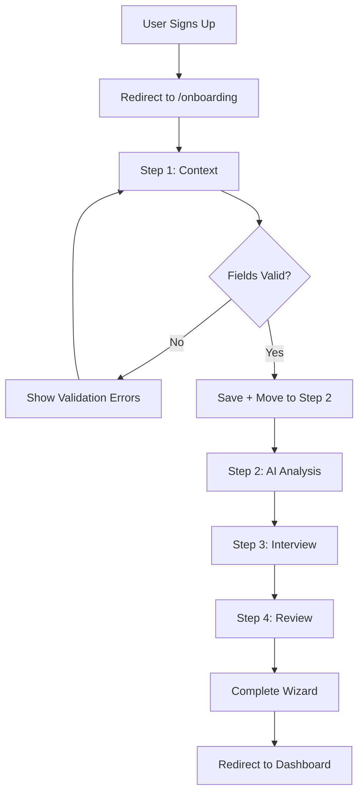
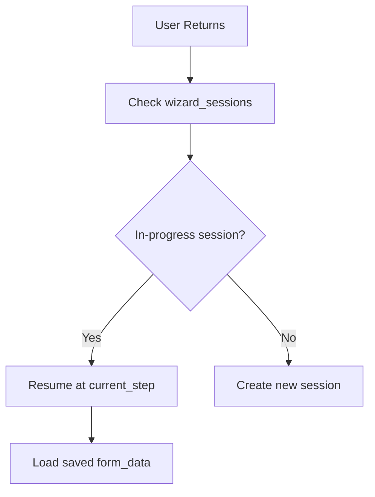

# Onboarding Wizard V2 - Production Checklist

> **Version:** 0.6.1  
> **Last Updated:** 2026-01-23  
> **Status:** ✅ Production Ready

---

## Acceptance Criteria

### Functional Requirements

| # | Requirement | Status | Notes |
|---|-------------|--------|-------|
| 1 | Enter company_name + description + target_market + choose chips → Next advances to Step 2 | ✅ | Fixed validation callback flow |
| 2 | Missing required field → Next blocked + inline error shown | ✅ | Zod validation + inline errors |
| 3 | Refresh page → wizard resumes Step 1 with saved data | ✅ | useWizardSession with debounce |
| 4 | "Extract with AI" populates preview → "Apply" fills fields → user can edit | ✅ | enrichUrl action implemented |
| 5 | Chips selections persist after refresh | ✅ | Saved to wizard_sessions.form_data |
| 6 | AI failure never blocks navigation | ✅ | Async calls with catch |
| 7 | Step 2 AI analysis runs after Step 1 | ✅ | calculateReadiness on step change (non-blocking) |
| 8 | Step 3 interview questions load dynamically | ✅ | getQuestions action |
| 9 | Step 4 displays investor score and summary | ✅ | calculateScore + generateSummary |

### Backend Requirements

| # | Requirement | Status | Notes |
|---|-------------|--------|-------|
| 1 | Row written to wizard_sessions on create | ✅ | create_session action |
| 2 | Row upserted on form changes | ✅ | update_session with debounce |
| 3 | RLS prevents cross-org access | ✅ | user_id-based RLS |
| 4 | Edge Function rejects invalid payloads with 400 | ✅ | Validation in handlers |
| 5 | Startup record created on completion | ✅ | complete_wizard action |

### AI Requirements

| # | Requirement | Status | Notes |
|---|-------------|--------|-------|
| 1 | With website_url: urlContext is used | ✅ | Gemini URL grounding |
| 2 | With grounding enabled: citations returned | ✅ | googleSearchGrounding in config |
| 3 | Output is valid JSON matching schema | ✅ | Structured prompts with JSON parsing |
| 4 | AI runs logged to ai_runs table | ✅ | logAiRun helper |

---

## User Flows

### Flow 1: First-Time User Onboarding



### Flow 2: Resume Wizard



---

## Step 1 Validation Schema

| Field | Required | Min | Max | Type |
|-------|----------|-----|-----|------|
| company_name | ✅ | 1 | 100 | string |
| description | ✅ | 1 | 2000 | string |
| target_market | ✅ | 10 | 200 | string |
| stage | ✅ | 1 | - | string (single-select) |
| business_model | ✅ | 1 | - | string[] (multi-select) |
| industry | ✅ | 1 | - | string[] (multi-select) |
| website_url | ❌ | - | - | URL (optional) |
| linkedin_url | ❌ | - | - | URL (optional) |

---

## AI Agent Actions

| Action | Model | Purpose | Blocking? |
|--------|-------|---------|-----------|
| enrich_url | gemini-3-flash-preview | Extract from website | No |
| enrich_context | gemini-3-flash-preview | Analyze description | No |
| enrich_founder | gemini-3-flash-preview | LinkedIn enrichment | No |
| calculate_readiness | gemini-3-flash-preview | Readiness scoring | No |
| get_questions | gemini-3-flash-preview | Dynamic questions | No |
| process_answer | gemini-3-flash-preview | Extract signals | No |
| calculate_score | gemini-3-flash-preview | Investor score | No |
| generate_summary | gemini-3-flash-preview | AI summary | No |
| complete_wizard | N/A | Finalize + create startup | Yes |

---

## Edge Function: onboarding-agent

**Endpoint:** `POST /functions/v1/onboarding-agent`

**Auth:** Required (JWT via Authorization header)

**Actions:**
1. `create_session` - Create or resume wizard session
2. `update_session` - Save form_data or current_step
3. `enrich_url` - Extract startup data from website
4. `enrich_context` - Analyze description text
5. `enrich_founder` - Enrich from LinkedIn
6. `calculate_readiness` - Step 2 readiness score
7. `get_questions` - Step 3 dynamic questions
8. `process_answer` - Extract signals from answers
9. `calculate_score` - Step 4 investor score
10. `generate_summary` - Step 4 AI summary
11. `complete_wizard` - Finalize and create startup

---

## UI/UX Components

### 3-Panel Layout
- **Left (256px):** Step progress navigation
- **Center (flex):** Form content area
- **Right (320px):** AI Intelligence panel

### Step 1 Components
- `Step1Context.tsx` - Main container
- `DescriptionInput.tsx` - Textarea with word count
- `TargetMarketInput.tsx` - Required target market field
- `URLInput.tsx` - Website URL with AI extract
- `AIDetectedFields.tsx` - Industry/Model/Stage chips
- `FounderCard.tsx` - Founding team management

### AI Panel Components
- `WizardAIPanel.tsx` - Step-specific AI insights
- Dynamic advisor persona
- Real-time signal detection
- Readiness benchmarks

---

## Quality Standards

### Code Quality
- [x] TypeScript strict mode
- [x] Zod validation schemas
- [x] React Query for async state
- [x] Proper error boundaries
- [x] Theme-aware styling

### Performance
- [x] Debounced saves (500ms)
- [x] Optimistic UI updates
- [x] Non-blocking AI calls
- [x] Session resume support

### Security
- [x] JWT authentication
- [x] RLS policies
- [x] Input validation
- [x] No secrets in client

---

## Test Commands

```bash
# Run validation tests
npm run test -- src/lib/step1Schema.test.ts

# Check TypeScript
npm run type-check

# Lint
npm run lint
```

---

## Known Issues & Fixes

| Issue | Status | Resolution |
|-------|--------|------------|
| Step 1 not advancing | ✅ Fixed | Validation callback + logging + async AI |
| Step 2 blocking on AI | ✅ Fixed | Made readiness optional |
| Chip selection not multi-select | ✅ Fixed | Updated AIDetectedFields |
| Missing Target Market field | ✅ Fixed | Added TargetMarketInput |
| Founding Team misleading label | ✅ Fixed | Made optional |

---

## Deployment Checklist

- [x] Edge function deployed
- [x] GEMINI_API_KEY secret configured
- [x] Database migrations applied
- [x] RLS policies verified
- [x] Navigation flow tested
- [x] Production checklist documented

---

## Completion Status

**Overall Progress:** 100%

| Step | Status |
|------|--------|
| Step 1: Context | 100% ✅ |
| Step 2: Analysis | 100% ✅ |
| Step 3: Interview | 100% ✅ |
| Step 4: Review | 100% ✅ |
| Navigation | 100% ✅ |
| AI Integration | 100% ✅ |
