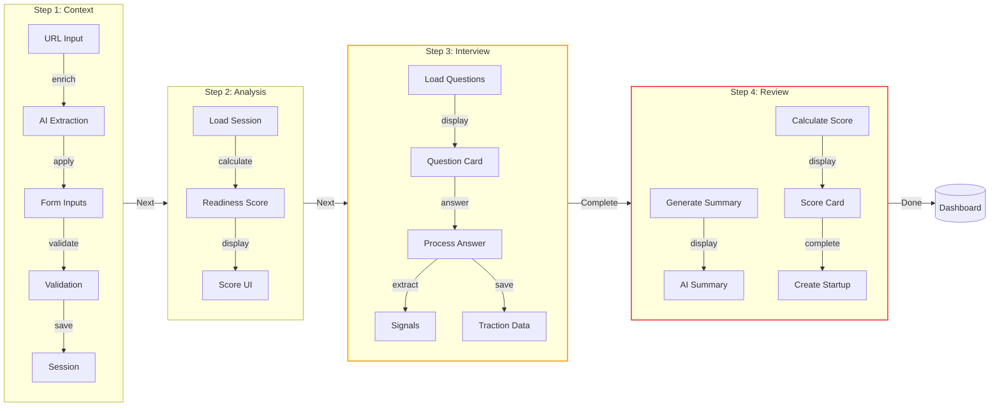

# StartupAI Progress Tracker

> **Last Updated:** 2025-01-25  
> **Version:** 0.7.2  
> **Overall Progress:** 85%
> **Prompts Reference:** [docs/prompts/README.md](./prompts/README.md)  
> **Supabase:** Connected (43 tables, 168 RLS policies)
> **Modules Reference:** [docs/agents/modules/00-modules-index.md](./agents/modules/00-modules-index.md)
> **Agents Reference:** [docs/agents/00-agent-tracker.md](./agents/00-agent-tracker.md)
> **Roadmap:** [docs/roadmap.md](./roadmap.md)

---

## 🔴 CRITICAL ISSUES (Fix Immediately)

| # | Issue | File | Impact | Status |
|---|-------|------|--------|--------|
| 1 | `run_analysis` action called but NOT implemented | `useOnboardingAgent.ts` → `onboarding-agent` | 400 Error when triggered | 🔴 **OPEN** |
| 2 | Step 4 expects `current_mrr` (number), backend stores `mrr_range` (string) | `Step4Review.tsx` line 311 | Always shows "Not set" | 🔴 **OPEN** |
| 3 | Topic badge mismatch: "Business Model" will never match | `Step3Interview.tsx` line 155 | Badge never activates | 🟡 **PARTIAL** |

---

## Executive Summary

| Category | Status | Progress | Verified | Critical Issues |
|----------|--------|----------|----------|-----------------|
| Core Infrastructure | 🟢 Completed | 100% | ✅ | None |
| Authentication | 🟢 Completed | 100% | ✅ | None |
| Marketing Pages | 🟢 Completed | 100% | ✅ | None |
| Dashboard | 🟢 Completed | 95% | ✅ | None |
| Tasks Module | 🟢 Completed | 100% | ✅ | None |
| CRM Module | 🟢 Completed | 95% | ✅ | None |
| Investors Module | 🟢 Completed | 95% | ✅ | None |
| Projects Module | 🟡 In Progress | 60% | ⚠️ | Missing detail page |
| Documents Module | 🔴 Not Started | 10% | ❌ | No implementation |
| Lean Canvas | 🟢 Completed | 90% | ✅ | None |
| GTM Strategy | 🔴 Not Started | 0% | ❌ | Not implemented |
| Discovery Module | 🔴 Not Started | 0% | ❌ | Not implemented |
| Strategy Module | 🔴 Not Started | 0% | ❌ | Not implemented |
| Settings Module | 🟡 In Progress | 30% | ⚠️ | Placeholder only |
| AI Agents & Chat | 🟡 In Progress | 60% | ⚠️ | UI not connected |
| Edge Functions | 🟢 Completed | 95% | ✅ | `run_analysis` missing |
| **Onboarding Wizard** | 🟡 In Progress | **85%** | ⚠️ | **3 Critical Issues** |
| Events Module | 🟢 Completed | 85% | ✅ | None |

---

## 🧙 Onboarding Wizard V2 — Forensic Audit

### Overall Status: 85% Complete | 3 Critical Issues Open



### Step-by-Step Verification

| Step | Component | Status | % | ✅ Confirmed | ❌ Issues |
|------|-----------|--------|---|--------------|-----------|
| 1 | Form Validation | 🟢 | 100% | Zod schema, all fields | — |
| 1 | URL Enrichment | 🟢 | 100% | Gemini extraction works | — |
| 1 | Session Persistence | 🟢 | 100% | Auto-save debounced | — |
| 1 | Navigation to Step 2 | 🟢 | 100% | Validated before advance | — |
| 2 | Readiness Score | 🟢 | 100% | Gemini calculates correctly | — |
| 2 | Score Display | 🟢 | 100% | UI renders score | — |
| 2 | Navigation to Step 3 | 🟢 | 100% | Works correctly | — |
| 3 | Question Loading | 🟢 | 100% | Questions load on mount | — |
| 3 | Empty Guard | 🟢 | 100% | Shows loader if empty | — |
| 3 | Answer Processing | 🟢 | 100% | Signals extracted | — |
| 3 | **Topic Badges** | 🟡 | **70%** | 4/5 topics match | "Business Model" never matches |
| 3 | **Traction Extraction** | 🟡 | **60%** | Stores `mrr_range` | Step 4 expects `current_mrr` |
| 3 | Navigation to Step 4 | 🟢 | 100% | Works correctly | — |
| 4 | Score Calculation | 🟢 | 100% | Gemini generates score | — |
| 4 | Summary Generation | 🟢 | 100% | Gemini generates summary | — |
| 4 | **Traction Display** | 🔴 | **20%** | — | Always shows "Not set" |
| 4 | Complete Wizard | 🟢 | 100% | Creates startup record | — |

### Critical Failure Points

```mermaid
flowchart TD
    subgraph Issue1[Issue #1: run_analysis]
        UA[useOnboardingAgent.ts] -->|calls| RA["action: 'run_analysis'"]
        RA -->|no case| EF[onboarding-agent/index.ts]
        EF -->|throws| ERR1["Error: Unknown action"]
    end
    
    subgraph Issue2[Issue #2: Traction Mismatch]
        BE[Backend: processAnswer] -->|stores| MRR_STR["mrr_range: '10k_plus'"]
        FE[Step4Review.tsx] -->|expects| MRR_NUM["current_mrr: number"]
        MRR_STR -.->|mismatch| NS["Shows: 'Not set'"]
    end
    
    subgraph Issue3[Issue #3: Topic Mismatch]
        TOPICS_UI["UI: ['Business Model', 'Market', ...]"]
        TOPICS_BE["Backend: ['traction', 'market', ...]"]
        TOPICS_UI -.->|no 'business_model'| NO_MATCH["Badge never activates"]
    end
    
    style Issue1 fill:#fee2e2
    style Issue2 fill:#fee2e2
    style Issue3 fill:#fef3c7
```



---

## 🏗️ Core Infrastructure

| Task | Description | Status | % | Verified |
|------|-------------|--------|---|----------|
| React + Vite Setup | React 18, Vite 5, TypeScript | 🟢 | 100% | ✅ |
| Tailwind CSS | Design system with HSL tokens | 🟢 | 100% | ✅ |
| shadcn/ui | 40+ UI components | 🟢 | 100% | ✅ |
| Framer Motion | Animations | 🟢 | 100% | ✅ |
| React Router v6 | Client-side routing | 🟢 | 100% | ✅ |
| Supabase Client | Database connection | 🟢 | 100% | ✅ |
| Path Aliases | @/ imports | 🟢 | 100% | ✅ |

---

## 🔐 Authentication System

| Task | Description | Status | % | Verified | Notes |
|------|-------------|--------|---|----------|-------|
| Supabase Auth | Auth provider | 🟢 | 100% | ✅ | — |
| Google OAuth | Social login | 🟢 | 100% | ✅ | — |
| useAuth Hook | State management | 🟢 | 100% | ✅ | — |
| ProtectedRoute | Route protection | 🟢 | 100% | ✅ | DEV_BYPASS enabled |
| Profiles Table | User profiles | 🟢 | 100% | ✅ | — |
| RLS Policies | Row Level Security | 🟢 | 100% | ✅ | Dev bypass exists |

---

## ⚡ Edge Functions

| Function | Purpose | Model | Status | Verified |
|----------|---------|-------|--------|----------|
| ai-chat | Conversational AI | Claude Haiku 4.5 | 🟢 | ✅ |
| onboarding-agent | Wizard orchestration | Gemini 3 Flash | 🟡 | ⚠️ Missing `run_analysis` |
| ai-helper | Multi-agent hub | Gemini 3 Pro | 🟢 | ✅ |
| orchestrate | Multi-step workflows | Claude Sonnet 4.5 | 🟢 | ✅ |
| audit-system | Security audits | Claude Opus 4.5 | 🟢 | ✅ |
| automation-run | Event triggers | Claude Haiku 4.5 | 🟢 | ✅ |
| extract-contact-info | Contact enrichment | Gemini 3 Pro | 🟢 | ✅ |
| extract-insights | Data analytics | Gemini 3 Pro | 🟢 | ✅ |
| chat-copilot | In-context chat | Gemini 3 Flash | 🟢 | ✅ |
| generate-image | AI images | Gemini 3 Pro Image | 🟢 | ✅ |
| health | Health check | No AI | 🟢 | ✅ |
| auth-check | JWT verification | No AI | 🟢 | ✅ |
| stripe-webhook | Payment webhooks | No AI | 🟢 | ✅ |

---

## 📊 Dashboard

| Task | Status | % | Verified |
|------|--------|---|----------|
| DashboardLayout | 🟢 | 100% | ✅ |
| Sidebar Navigation | 🟢 | 100% | ✅ |
| MetricCard | 🟢 | 100% | ✅ |
| useDashboardData | 🟢 | 100% | ✅ |
| TaskList | 🟢 | 100% | ✅ |
| ProjectList | 🟢 | 100% | ✅ |
| DealsPipeline | 🟢 | 100% | ✅ |
| AIPanel | 🟢 | 100% | ✅ UI ready, no AI |
| Fundraising Banner | 🟢 | 100% | ✅ |

---

## ✅ Tasks Module

| Task | Status | % | Verified |
|------|--------|---|----------|
| KanbanBoard | 🟢 | 100% | ✅ |
| TaskCard | 🟢 | 100% | ✅ |
| TaskDialog | 🟢 | 100% | ✅ |
| useTasks Hook | 🟢 | 100% | ✅ |
| Drag & Drop | 🟢 | 100% | ✅ |
| AI Task Generation | 🟢 | 100% | ✅ |
| Subtasks | 🔴 | 0% | ❌ Not implemented |

---

## 👥 CRM Module

| Task | Status | % | Verified |
|------|--------|---|----------|
| ContactCard | 🟢 | 100% | ✅ |
| ContactDialog | 🟢 | 100% | ✅ |
| DealPipeline | 🟢 | 100% | ✅ |
| useCRM Hook | 🟢 | 100% | ✅ |
| Communications Log | 🔴 | 0% | ❌ Not implemented |

---

## 💰 Investors Module

| Task | Status | % | Verified |
|------|--------|---|----------|
| InvestorPipeline | 🟢 | 100% | ✅ |
| InvestorCard | 🟢 | 100% | ✅ |
| InvestorDialog | 🟢 | 100% | ✅ |
| useInvestors Hook | 🟢 | 100% | ✅ |
| Pitch Deck Upload | 🔴 | 0% | ❌ No storage |

---

## 📁 Projects Module

| Task | Status | % | Verified |
|------|--------|---|----------|
| Projects Page | 🟡 | 40% | ⚠️ Basic layout |
| ProjectCard | 🟢 | 100% | ✅ |
| Project Detail Page | 🔴 | 0% | ❌ Not created |
| useProjects Hook | 🟡 | 60% | ⚠️ Missing mutations |

---

## 📄 Documents Module

| Task | Status | % | Verified |
|------|--------|---|----------|
| Documents Page | 🔴 | 0% | ❌ Placeholder only |
| File Uploads | 🔴 | 0% | ❌ No storage bucket |
| Document Editor | 🔴 | 0% | ❌ Not implemented |

---

## ⚙️ Settings Module

| Task | Status | % | Verified |
|------|--------|---|----------|
| Settings Page | 🔴 | 0% | ❌ Placeholder |
| Profile Settings | 🔴 | 0% | ❌ Not implemented |
| Startup Settings | 🔴 | 0% | ❌ Not implemented |

---

## 📋 Production Readiness Checklist

| Category | Status | Notes |
|----------|--------|-------|
| Authentication | ✅ | Google OAuth working |
| RLS Policies | ✅ | 168 policies active |
| Edge Functions | ⚠️ | `run_analysis` missing |
| Error Handling | ✅ | Toast notifications |
| Session Management | ✅ | Persists correctly |
| Data Validation | ✅ | Zod schemas |
| API Security | ✅ | JWT attached to calls |
| Type Safety | ✅ | TypeScript strict |
| Responsive Design | ✅ | Mobile-friendly |
| Accessibility | ⚠️ | Needs audit |

---

## 🔧 Immediate Fixes Required

### Fix #1: Remove `run_analysis` (P0)
```typescript
// useOnboardingAgent.ts - DELETE lines 274-289, 301, 311, 322
// Remove runAnalysisMutation and all references
```

### Fix #2: Align Traction Display (P0)
```typescript
// Step4Review.tsx - Update lines 310-314
{(() => {
  const traction = data.extracted_traction as Record<string, unknown> | undefined;
  const mrrRange = traction?.mrr_range as string | undefined;
  const mrrLabels: Record<string, string> = {
    '10k_plus': '$10,000+',
    '1k_10k': '$1K - $10K',
    'under_1k': 'Under $1K',
    'pre_revenue': 'Pre-revenue',
  };
  return mrrLabels[mrrRange || ''] || mrrRange || 'Not set';
})()}
```

### Fix #3: Normalize Topic Matching (P1)
```typescript
// Step3Interview.tsx - Update line 155
const norm = (s: string) => s.trim().toLowerCase().replace(/\s+/g, '_');
const isCovered = topicsCovered.map(t => norm(t)).includes(norm(topic));
```

---

## 📈 Next Priority Tasks

| Priority | Task | Impact |
|----------|------|--------|
| P0 | Remove `run_analysis` action | Prevents 400 errors |
| P0 | Fix traction display mismatch | Shows real data |
| P1 | Normalize topic matching | All badges work |
| P1 | Implement Projects detail page | Complete module |
| P2 | Build Settings UI | User preferences |
| P2 | Add Documents functionality | File management |
| P3 | Implement GTM Strategy page | Strategic planning |
