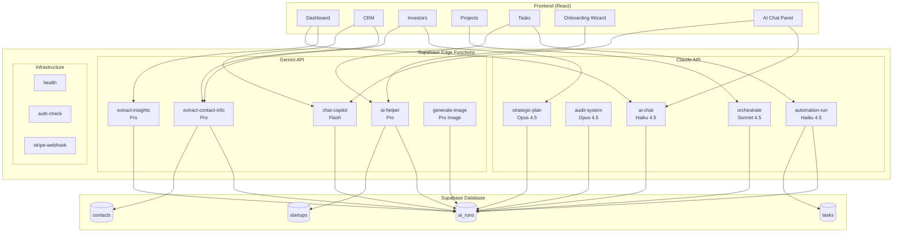
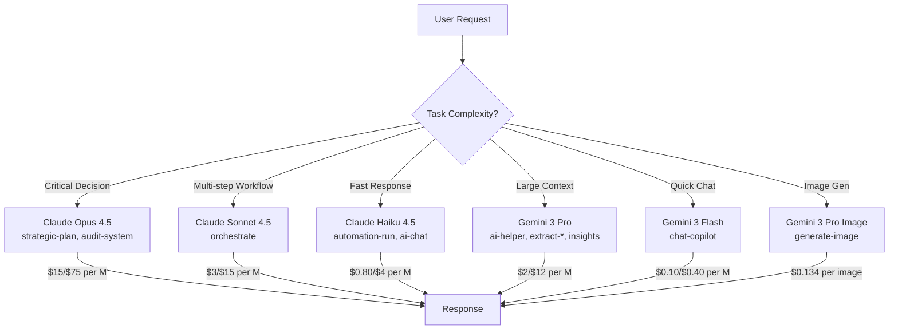
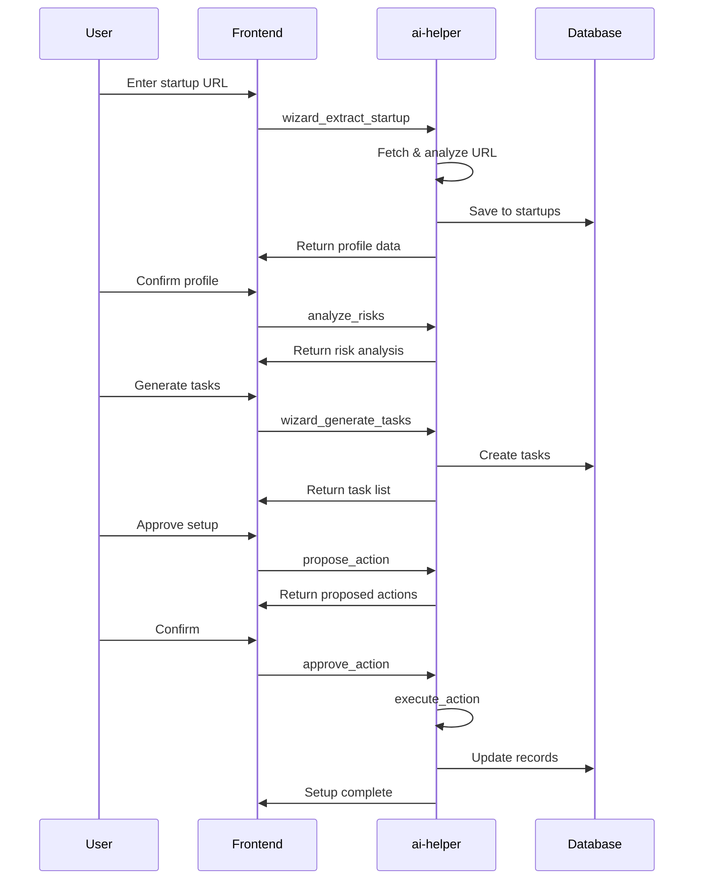
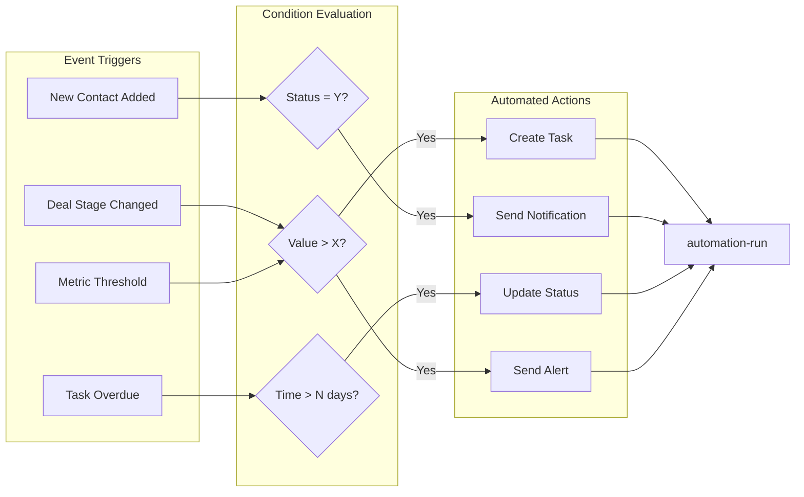

# Edge Functions Summary

**Last Updated:** 2026-01-16
**Total Functions:** 13 (5 Claude + 5 Gemini + 3 Non-AI)
**Status:** All DEPLOYED and ACTIVE

---

## Quick Reference

| Function | API | Model | Purpose |
|----------|-----|-------|---------|
| strategic-plan | Claude | Opus 4.5 | High-stakes strategic decisions |
| audit-system | Claude | Opus 4.5 | Security & compliance audits |
| orchestrate | Claude | Sonnet 4.5 | Multi-step workflow orchestration |
| automation-run | Claude | Haiku 4.5 | Fast event-based triggers |
| ai-chat | Claude | Haiku 4.5 | Conversational assistant |
| ai-helper | Gemini | 3 Pro | Multi-agent wizard hub |
| extract-contact-info | Gemini | 3 Pro | Contact enrichment from URLs |
| extract-insights | Gemini | 3 Pro | Data analytics & patterns |
| chat-copilot | Gemini | 3 Flash | Fast in-context chat |
| generate-image | Gemini | 3 Pro Image | AI image generation |
| health | - | - | System health check |
| auth-check | - | - | JWT verification |
| stripe-webhook | - | - | Payment webhooks |

---

## Function-to-Screen Mapping

### AI Functions by Dashboard Screen

| Screen/Feature | Functions Used | Purpose |
|----------------|----------------|---------|
| **Dashboard** | `extract-insights`, `ai-chat` | Metrics analysis, quick questions |
| **Onboarding Wizard** | `ai-helper` | Extract startup info, generate tasks |
| **CRM / Contacts** | `extract-contact-info`, `chat-copilot` | Enrich contacts, contextual help |
| **Investors** | `extract-contact-info`, `strategic-plan` | Investor research, fundraising strategy |
| **Projects** | `chat-copilot`, `orchestrate` | Project planning, workflow automation |
| **Tasks** | `automation-run`, `ai-helper` | Auto-create tasks, prioritization |
| **Documents** | `generate-image`, `strategic-plan` | Deck images, strategic content |
| **Settings / Admin** | `audit-system`, `health` | Security audits, system status |
| **Billing** | `stripe-webhook` | Subscription management |

### Wizard Flow Functions

| Wizard Step | Function | Action |
|-------------|----------|--------|
| 1. Enter URL | `ai-helper` | `wizard_extract_startup` |
| 2. Review Profile | `ai-helper` | `analyze_risks` |
| 3. Generate Tasks | `ai-helper` | `wizard_generate_tasks` |
| 4. Confirm Setup | `ai-helper` | `propose_action` → `approve_action` |

---

## Architecture Diagrams

### Overall Function Architecture



### Model Selection Flow



### Wizard Flow Sequence



### Automation Trigger Flow



---

## Function Details

### Claude Functions (5)

#### 1. strategic-plan
```
Model: claude-opus-4-5-20251101
Thinking: 10k budget
Use: Critical business decisions, fundraising strategy
Input: question, businessContext, constraints, alternatives
Output: Strategic options with pros/cons, recommendations
```

#### 2. audit-system
```
Model: claude-opus-4-5-20251101
Thinking: 10k budget
Use: Security audits, compliance checks (SOC2, GDPR, HIPAA)
Input: auditType, scope, complianceFramework
Output: Findings with severity levels, remediation steps
```

#### 3. orchestrate
```
Model: claude-sonnet-4-5-20250514
Thinking: 5k budget
Use: Multi-step workflows with dependencies
Input: workflowDefinition, steps, triggerContext
Output: Step-by-step execution results
```

#### 4. automation-run
```
Model: claude-haiku-4-5-20250110
Thinking: None
Use: Fast event triggers, condition evaluation
Input: triggerEvent, triggerConditions, actionDefinitions
Output: Actions taken with status
```

#### 5. ai-chat
```
Model: claude-haiku-4-5-20250110
Thinking: None
Use: Conversational assistant with startup context
Input: message, session_id, context
Output: Response with suggested_actions
```

### Gemini Functions (5)

#### 6. ai-helper
```
Model: gemini-3-pro-preview
Thinking: high
Use: Multi-agent wizard hub
Actions: wizard_extract_startup, analyze_risks, wizard_generate_tasks
Output: Action-specific structured data
```

#### 7. extract-contact-info
```
Model: gemini-3-pro-preview
Thinking: high
Use: Contact enrichment from LinkedIn/email
Input: linkedinUrl or email
Output: Structured contact with confidence score
```

#### 8. extract-insights
```
Model: gemini-3-pro-preview
Thinking: high
Use: Data analytics, trend analysis
Input: dataType, timeRange, questions
Output: Insights with confidence, recommendations
```

#### 9. chat-copilot
```
Model: gemini-3-flash-preview
Thinking: low
Use: Fast in-context chat
Input: message, sessionId, context
Output: Chat response with history
```

#### 10. generate-image
```
Model: gemini-3-pro-image-preview
Use: AI image generation for decks/docs
Input: imageType, description, style, aspectRatio
Output: Base64 image with alternatives
```

### Infrastructure Functions (3)

#### 11. health
```
Auth: None required
Use: Uptime monitoring
Output: { status, timestamp, version }
```

#### 12. auth-check
```
Auth: JWT required
Use: Token validation
Output: { user, profile, organization }
```

#### 13. stripe-webhook
```
Auth: Stripe signature
Use: Payment/subscription events
Events: checkout.session.completed, customer.subscription.*
```

---

## API Endpoints

Base URL: `https://[PROJECT_ID].supabase.co/functions/v1/`

| Function | Method | Auth | Endpoint |
|----------|--------|------|----------|
| ai-chat | POST | JWT | `/ai-chat` |
| ai-helper | POST | JWT | `/ai-helper` |
| audit-system | POST | JWT | `/audit-system` |
| automation-run | POST | JWT | `/automation-run` |
| chat-copilot | POST | JWT | `/chat-copilot` |
| extract-contact-info | POST | JWT | `/extract-contact-info` |
| extract-insights | POST | JWT | `/extract-insights` |
| generate-image | POST | JWT | `/generate-image` |
| orchestrate | POST | JWT | `/orchestrate` |
| strategic-plan | POST | JWT | `/strategic-plan` |
| health | GET | None | `/health` |
| auth-check | GET | JWT | `/auth-check` |
| stripe-webhook | POST | Stripe | `/stripe-webhook` |

---

## Cost Summary

| Tier | Functions | Input Cost | Output Cost |
|------|-----------|------------|-------------|
| Premium | strategic-plan, audit-system | $15/M | $75/M |
| Standard | orchestrate | $3/M | $15/M |
| Economy | automation-run, ai-chat | $0.80/M | $4/M |
| Gemini Pro | ai-helper, extract-*, insights | $2/M | $12/M |
| Gemini Flash | chat-copilot | $0.10/M | $0.40/M |
| Gemini Image | generate-image | $0.134/image | - |

---

## Integration Status

| Function | Backend Ready | Frontend Integrated |
|----------|---------------|---------------------|
| ai-chat | ✅ | ⏳ Pending |
| ai-helper | ✅ | ⏳ Pending |
| audit-system | ✅ | ⏳ Pending |
| automation-run | ✅ | ⏳ Pending |
| chat-copilot | ✅ | ⏳ Pending |
| extract-contact-info | ✅ | ⏳ Pending |
| extract-insights | ✅ | ⏳ Pending |
| generate-image | ✅ | ⏳ Pending |
| orchestrate | ✅ | ⏳ Pending |
| strategic-plan | ✅ | ⏳ Pending |
| health | ✅ | N/A (monitoring) |
| auth-check | ✅ | ⏳ Pending |
| stripe-webhook | ✅ | N/A (webhook) |

**Next Step:** Connect frontend components to edge functions via `supabase.functions.invoke()`

---

## Usage Example

```typescript
// Call an edge function from React
import { supabase } from '@/integrations/supabase/client';

const callAIChat = async (message: string) => {
  const { data, error } = await supabase.functions.invoke('ai-chat', {
    body: {
      message,
      context: { screen: 'dashboard' }
    }
  });

  if (error) throw error;
  return data;
};
```

---

*Generated by Claude Opus 4.5*
