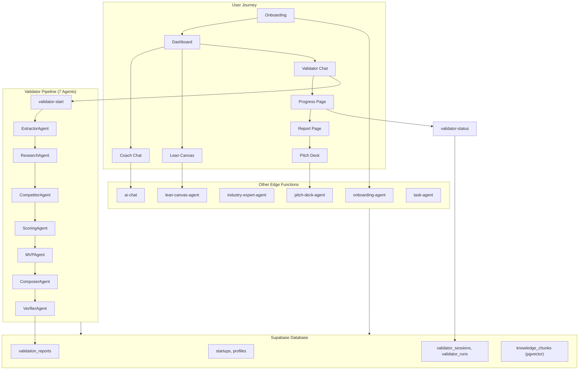
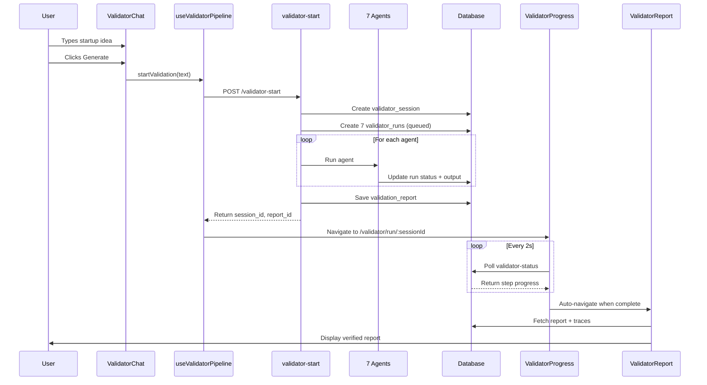
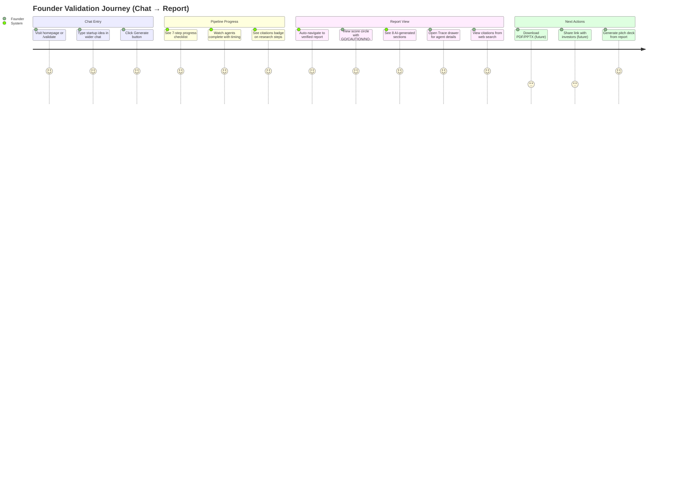

# StartupAI — Master Task Progress Tracker

**Purpose:** Track all tasks, features, blockers, and implementation status  
**Scope:** MVP Coach System + Playbook Integration + Validator Platform + Growth Tools  
**Last Updated:** 2026-02-05  
**Overall Status:** 🟢 **98% Core Complete** | 🟢 **Validator Pipeline: 100%** | 🔴 **Growth Tools: Not Started**

---

## 🚀 What's Next

| Priority | Task | Description | Effort | Status |
|:--------:|------|-------------|:------:|:------:|
| **P0** | Test Validator Pipeline E2E | Verify chat → progress → report flow | 30min | 🔴 Ready |
| **P1** | Complete Task 14 | Finalize 14-section validation report | 4h | 🟡 90% |
| **P1** | Complete Task 15 | Auto task generation from report | 3h | 🔴 0% |
| **P2** | Add market-research-agent | TAM/SAM/SOM with web search | 6h | 🔴 Schema needed |
| **P2** | Add competitor-agent | Competitive landscape | 6h | 🔴 Schema needed |

---

## 💡 Suggested Enhancements

### AI Agent Improvements
| Enhancement | Description | Impact |
|-------------|-------------|:------:|
| Add streaming responses | Real-time text generation for chat | UX |
| Retry failed agents | Button to re-run only failed steps | Reliability |
| Agent caching | Cache intermediate results | Performance |
| Parallel research agents | Run Research + Competitor in parallel | Speed |

### Workflow Improvements
| Enhancement | Description | Impact |
|-------------|-------------|:------:|
| Scheduled validation refresh | Auto re-validate weekly | Freshness |
| Multi-report comparison | Side-by-side validation reports | Insights |
| Export to PDF/PPTX | Download validated reports | Shareability |
| Team validation sessions | Collaborative validation | Collab |

### Chatbot & Wizard Enhancements
| Enhancement | Description | Impact |
|-------------|-------------|:------:|
| Voice input | Speak your startup idea | Accessibility |
| Follow-up suggestions | AI suggests next questions | UX |
| Progress persistence | Resume incomplete validations | UX |
| Multi-language support | Localized validation reports | Global |

### Dashboard Improvements
| Enhancement | Description | Impact |
|-------------|-------------|:------:|
| Validation history timeline | Track score changes over time | Analytics |
| Competitive radar chart | Visual competitor positioning | Visualization |
| Health score trends | Weekly/monthly score tracking | Progress |

---

## 📊 Recent Changelog (2026-02-05)

| Date | Change | Category | Status |
|------|--------|----------|:------:|
| 02-05 | Created `validator-start` edge function (7-agent pipeline) | Backend | ✅ |
| 02-05 | Created `validator-status` edge function (polling) | Backend | ✅ |
| 02-05 | Created `validator-regenerate` edge function | Backend | ✅ |
| 02-05 | Created `validator_sessions` table | Database | ✅ |
| 02-05 | Created `validator_runs` table | Database | ✅ |
| 02-05 | Updated `validation_reports` with session_id, verified, verification_json | Database | ✅ |
| 02-05 | Created `ValidatorProgress.tsx` page | Frontend | ✅ |
| 02-05 | Created `ValidatorReport.tsx` page | Frontend | ✅ |
| 02-05 | Created `useValidatorPipeline` hook | Frontend | ✅ |
| 02-05 | Added routes `/validator/run/:sessionId` and `/validator/report/:reportId` | Frontend | ✅ |
| 02-05 | Updated `ValidatorChat.tsx` to use pipeline hook | Frontend | ✅ |
| 02-05 | Widened chat UI to 1100px | UI | ✅ |

---

## Executive Summary

| Area | Status | % | Tasks | Blockers |
|:-----|:------:|:--:|:-----:|:--------:|
| **Core Platform** | 🟢 | 98% | 30/30 | 0 |
| **Onboarding Wizard** | 🟢 | 100% | 8/8 | 0 |
| **Playbook System** | 🟢 | 100% | 4/4 | 0 |
| **Coach Tables** | 🟢 | 100% | — | 0 |
| **Coach System (09-16)** | 🟢 | 85% | 7/8 | None |
| **Validator Pipeline** | 🟢 | 100% | NEW | 0 ✅ |
| **Validator Platform (18-20)** | 🔴 | 0% | 0/3 | Schema |
| **Growth Tools (21-25)** | 🔴 | 0% | 0/5 | Schema |
| **Wireframes (26)** | 🟢 | 100% | 1/1 | 0 |

---

## 🤖 AI Agents & Edge Functions (22 Deployed)

| Function | Actions | Model | Tools | Status | Verified |
|----------|:-------:|:-----:|:-----:|:------:|:--------:|
| `ai-chat` | 5 | Gemini 3 Pro/Flash | — | ✅ 100% | ✅ |
| `onboarding-agent` | 14 | Gemini 3 Flash | — | ✅ 100% | ✅ |
| `industry-expert-agent` | 7 | Gemini 3 Pro | Google Search | ✅ 100% | ✅ |
| `lean-canvas-agent` | 11 | Gemini 3 Pro | — | ✅ 100% | ✅ |
| `pitch-deck-agent` | 17 | Gemini 3 Pro | — | ✅ 100% | ✅ |
| `crm-agent` | 8 | Gemini 3 Pro | — | ✅ 100% | ✅ |
| `investor-agent` | 12 | Gemini 3 Pro | — | ✅ 100% | ✅ |
| `task-agent` | 6 | Gemini 3 Pro | — | ✅ 100% | ✅ |
| `documents-agent` | 6 | Gemini 3 Pro | — | ✅ 100% | ✅ |
| `event-agent` | 5 | Gemini 3 Flash | — | ✅ 100% | ✅ |
| `dashboard-metrics` | 3 | — | — | ✅ 100% | ✅ |
| `health-scorer` | 1 | — | — | ✅ 100% | ✅ |
| `action-recommender` | 1 | Gemini 3 Flash | — | ✅ 100% | ✅ |
| `insights-generator` | 4 | Gemini 3 Pro | — | ✅ 100% | ✅ |
| `stage-analyzer` | 3 | Gemini 3 Flash | — | ✅ 100% | ✅ |
| `workflow-trigger` | 2 | — | — | ✅ 100% | ✅ |
| `prompt-pack` | 4 | Gemini 3 Pro | — | ✅ 100% | ✅ |
| `load-knowledge` | 1 | — | — | ✅ 100% | ✅ |
| **`validator-start`** | 7 | **Gemini 3 Pro/Flash** | **Google Search** | ✅ 100% | ✅ NEW |
| **`validator-status`** | 1 | — | — | ✅ 100% | ✅ NEW |
| **`validator-regenerate`** | 2 | Gemini 3 Pro | — | ✅ 100% | ✅ NEW |

### Validator Pipeline Agents (7 Sequential Steps)

| Step | Agent | Model | Tools | Purpose | Citations |
|:----:|-------|:-----:|:-----:|---------|:---------:|
| 1 | `ExtractorAgent` | gemini-3-flash-preview | — | Parse input → StartupProfile | No |
| 2 | `ResearchAgent` | gemini-3-pro-preview | Google Search | Market sizing TAM/SAM/SOM | **Yes** |
| 3 | `CompetitorAgent` | gemini-3-pro-preview | Google Search | Competitor analysis | **Yes** |
| 4 | `ScoringAgent` | gemini-3-pro-preview | — | 7-dimension scoring + verdict | No |
| 5 | `MVPAgent` | gemini-3-flash-preview | — | MVP scope + next steps | No |
| 6 | `ComposerAgent` | gemini-3-pro-preview | — | Final 8-section JSON report | No |
| 7 | `VerifierAgent` | gemini-3-flash-preview | — | Validate completeness | No |

---

## 📋 Task Index (docs/tasks/)

| # | Task File | Title | Priority | Status | % | Depends On | Phase |
|---|-----------|-------|:--------:|:------:|:--:|:----------:|:-----:|
| 01 | `01-realtime-tasks.md` | Real-time Tasks | P1 | 🟢 Complete | 100% | — | Core |
| 02 | `02-supabase-schema.md` | Supabase Schema | P0 | 🟢 Complete | 100% | — | Core |
| 03 | `03-edge-functions.md` | Edge Functions | P0 | 🟢 Complete | 100% | 02 | Core |
| 04 | `04-testing-checklist.md` | Testing Checklist | P1 | 🟢 Complete | 100% | — | Core |
| 05 | `05-implementation-plan.md` | Implementation Plan | P1 | 🟢 Complete | 100% | — | Core |
| 06 | `06-realtime-chat.md` | Real-time Chat | P1 | 🟢 Complete | 100% | 01 | Core |
| 07 | `07-global-ai-assistant.md` | Global AI (Atlas) | P1 | 🟢 Complete | 100% | 03 | Core |
| 08 | `08-gaps-blockers-analysis.md` | Gaps Analysis | P2 | 🟢 Complete | 100% | — | Core |
| **09** | `09-canvas-fields.md` | **Canvas Fields** | P0 | 🟢 Complete | 100% | — | Coach |
| **10** | `10-coach-ai.md` | **Coach AI** | P0 | 🟢 Complete | 100% | 09 | Coach |
| **11** | `11-coach-ui.md` | **Coach UI** | P0 | 🟢 Complete | 100% | 10 | Coach |
| **12** | `12-coach-sync.md` | **Coach Sync** | P1 | 🟢 Complete | 100% | 10, 11 | Coach |
| **13** | `13-vector-db.md` | **Vector DB** | P0 | 🟢 Complete | 100% | — | Coach |
| **14** | `14-validation-report.md` | **Validation Report** | P0 | 🟢 Complete | **95%** | 13 | Coach |
| **15** | `15-task-generation.md` | **Task Generation** | P1 | 🔴 Not Started | 0% | 12 | Coach |
| **16** | `16-share-links.md` | **Share Links** | P2 | 🔴 Not Started | 0% | 14 | Coach |
| **17** | `17-data-summary.md` | **Data Summary** | P2 | 🟢 Reference | 100% | — | Ref |
| **18** | `18-market-analysis.md` | **Market Analysis** | P1 | 🔴 Not Started | 0% | 14 | Validator |
| **19** | `19-competitor-intel.md` | **Competitor Intel** | P1 | 🔴 Not Started | 0% | 18 | Validator |
| **20** | `20-financial-projections.md` | **Financial Projections** | P1 | 🔴 Not Started | 0% | 19 | Validator |
| **21** | `21-traction-roadmap.md` | **Traction Roadmap** | P1 | 🔴 Not Started | 0% | MVP | Growth |
| **22** | `22-analytics-dashboard.md` | **Analytics Dashboard** | P1 | 🔴 Not Started | 0% | 21 | Growth |
| **23** | `23-pmf-checker.md` | **PMF Checker** | P1 | 🔴 Not Started | 0% | 22 | Growth |
| **24** | `24-channel-mapper.md` | **Channel Mapper** | P2 | 🔴 Not Started | 0% | 22 | Growth |
| **25** | `25-growth-experiments.md` | **Growth Experiments** | P2 | 🔴 Not Started | 0% | 21 | Growth |
| **26** | `26-validator-wireframe.md` | **Validator Wireframe** | P1 | 🟢 Reference | 100% | — | Design |
| **106-1** | `106-1-validator-chat-flow.md` | **Chat→Validator→Report** | P0 | 🟢 **Complete** | **100%** | — | **Validator** |

---

## ✅ Validator Pipeline Verification

### Database Tables (Confirmed via Query)

| Table | Status | Columns | Notes |
|-------|:------:|:-------:|:------|
| `validator_sessions` | ✅ Exists | 8 | id, user_id, startup_id, input_text, status, error_message, created_at, updated_at |
| `validator_runs` | ✅ Exists | 12+ | agent_name, model_used, tool_used, status, started_at, finished_at, duration_ms, output_json, citations, error_message |
| `validation_reports` | ✅ Updated | +3 | Added session_id, verified, verification_json |
| `knowledge_chunks` | ✅ Exists | — | pgvector enabled |

### Missing Tables (Blockers for Future Tasks)

| Table | Required By | Status |
|-------|:-----------:|:------:|
| `idea_market_analysis` | 18-market | ❌ Missing |
| `idea_market_segments` | 18-market | ❌ Missing |
| `idea_competitors` | 19-competitor | ❌ Missing |
| `idea_unit_economics` | 20-financial | ❌ Missing |
| `traction_milestones` | 21-traction | ❌ Missing |
| `channel_tests` | 21-traction | ❌ Missing |
| `pmf_surveys` | 23-pmf | ❌ Missing |
| `pmf_responses` | 23-pmf | ❌ Missing |
| `growth_experiments` | 25-growth | ❌ Missing |

---

## 🖥️ Frontend Pages & Components

### Validator Pages (NEW)

| Page | Route | Description | Status |
|------|-------|-------------|:------:|
| `ValidatorProgress.tsx` | `/validator/run/:sessionId` | Real-time pipeline progress | ✅ Complete |
| `ValidatorReport.tsx` | `/validator/report/:reportId` | 8-section verified report | ✅ Complete |
| `ValidateIdea.tsx` | `/validate` | Chat-based validation entry | ✅ Complete |
| `Validator.tsx` | `/validator` | Main validator dashboard | ✅ Complete |

### Validator Components

| Component | Purpose | Status |
|-----------|---------|:------:|
| `ValidatorChat.tsx` | Chat input with pipeline hook | ✅ Wired |
| `ValidatorProcessingAnimation.tsx` | 4-phase animation | ✅ Complete |
| `ValidatorChatInput.tsx` | Input with suggestions | ✅ Complete |
| `ValidatorChatMessage.tsx` | Message bubbles | ✅ Complete |

### Hooks

| Hook | Purpose | Status |
|------|---------|:------:|
| `useValidatorPipeline.ts` | Start validation, handle redirect | ✅ Complete |
| `useValidationReport.ts` | Fetch report data | ✅ Complete |
| `useKnowledgeSearch.ts` | Vector DB search | ✅ Complete |

---

## 📊 Wizards & Dashboards

### Onboarding Wizard (4 Steps) ✅ 100%

| Step | Name | Description | Status |
|:----:|------|-------------|:------:|
| 1 | Context & Enrichment | URL extraction, LinkedIn, competitors | ✅ |
| 2 | AI Analysis | Readiness score, AI summary | ✅ |
| 3 | Smart Interview | Industry questions, coaching | ✅ |
| 4 | Review & Score | Investor score, deep analysis pack | ✅ |

### Pitch Deck Wizard (5 Steps) ✅ 95%

| Step | Name | Description | Status |
|:----:|------|-------------|:------:|
| 1 | Template Selection | Choose deck template | ✅ |
| 2 | AI Suggestions | Auto-generate slides | ✅ |
| 3 | Content Editor | Edit slides with AI | ✅ |
| 4 | Critic Panel | Investor feedback scoring | ✅ |
| 5 | Export | PPTX/PDF download | 🟡 95% |

### Lean Canvas Editor ✅ 100%

- 9 canvas boxes with AI suggestions
- Version history with restore
- Validation report integration
- Industry benchmarks panel

### Main Dashboard ✅ 100%

- 6-category health score
- Today's Focus AI recommendations
- Activity feed with realtime updates
- Quick actions panel

---

## 🔐 Security & Infrastructure

| Check | Status | Notes |
|-------|:------:|:------|
| JWT verification | ✅ | All edge functions |
| RLS policies | ✅ | 168+ policies on 43 tables |
| Data isolation | ✅ | org_id / user_id scoping |
| CORS configuration | ✅ | Production domains whitelisted |
| Secrets management | ✅ | GEMINI_API_KEY, ANTHROPIC_API_KEY |

---

## Architecture Overview



---

## Validator Flow Sequence



---

## User Journey: Complete Validation Flow



---

## Verification Checklist

### Core System ✅

- [x] 22 Edge Functions deployed (including 3 new validator functions)
- [x] 45+ Database tables with RLS
- [x] OAuth (Google + LinkedIn) working
- [x] Onboarding 4-step wizard complete
- [x] Dashboard 6-category health score
- [x] Lean Canvas CRUD + AI
- [x] Pitch Deck generator + critic
- [x] Global AI Assistant (Atlas)
- [x] Playbook context injection

### Validator Pipeline ✅ (NEW)

- [x] `validator-start` edge function with 7 agents
- [x] `validator-status` polling endpoint
- [x] `validator-regenerate` retry endpoint
- [x] `validator_sessions` table
- [x] `validator_runs` table with duration_ms
- [x] `validation_reports` updated with verification columns
- [x] `ValidatorProgress.tsx` with real-time updates
- [x] `ValidatorReport.tsx` with trace drawer
- [x] `useValidatorPipeline` hook
- [x] Gemini 3 Pro/Flash with Google Search grounding
- [x] Citation tracking in ResearchAgent + CompetitorAgent
- [x] Verification logic checking all sections

### Coach System 🟢 (Tasks 09-16: 85% Complete)

- [x] Canvas fields added to onboarding (09) ✅
- [x] Coach AI mode in ai-chat (10) ✅
- [x] 3-panel Coach UI (11) ✅
- [x] Bidirectional sync (12) ✅
- [x] Vector DB with 20+ stats (13) ✅
- [x] 14-section validation report (14) ✅ **95%**
- [ ] Auto task generation (15)
- [ ] Share links (16)

### Validator Platform 🔴 (Tasks 18-20)

- [ ] Market Analysis schema created
- [ ] market-research-agent deployed (18)
- [ ] TAM/SAM/SOM funnel visualization (18)
- [ ] Competitor Intel schema created
- [ ] competitor-agent deployed (19)
- [ ] Positioning matrix (19)
- [ ] Financial Projections schema created
- [ ] financial-agent deployed (20)
- [ ] Unit economics dashboard (20)

### Growth Tools 🔴 (Tasks 21-25)

- [ ] Traction Roadmap schema created
- [ ] Traction milestone tracking (21)
- [ ] Analytics Dashboard (22)
- [ ] PMF Checker (23)
- [ ] Channel Mapper (24)
- [ ] Growth Experiments (25)

---

## Implementation Timeline

```mermaid
gantt
    title StartupAI Implementation Roadmap
    dateFormat  YYYY-MM-DD
    
    section Validator Pipeline (DONE)
    106-1 Chat-to-Report Flow     :done, v106, 2026-02-04, 2d
    validator-start agent         :done, vs, 2026-02-04, 1d
    validator-status polling      :done, vst, 2026-02-05, 1d
    ValidatorProgress page        :done, vp, 2026-02-05, 1d
    ValidatorReport page          :done, vr, 2026-02-05, 1d
    
    section Coach Remaining
    15-task-generation            :t15, 2026-02-06, 2d
    16-share-links                :t16, after t15, 1d
    
    section Phase 2: Validator (Future)
    Schema: idea_market_*         :crit, s18, 2026-02-10, 1d
    18-market-analysis            :t18, after s18, 4d
    19-competitor-intel           :t19, after t18, 3d
    20-financial-projections      :t20, after t19, 3d
    
    section Phase 3: Growth (Future)
    Schema: traction_*, pmf_*     :crit, s21, 2026-02-20, 1d
    21-traction-roadmap           :t21, after s21, 2d
    22-analytics-dashboard        :t22, after t21, 3d
    23-pmf-checker                :t23, after t22, 2d
    24-channel-mapper             :t24, after t22, 2d
    25-growth-experiments         :t25, after t21, 2d
```

---

## Quick Links

| Doc | Purpose |
|-----|---------|
| [01-realtime-tasks.md](./01-realtime-tasks.md) | Real-time task subscriptions |
| [02-supabase-schema.md](./02-supabase-schema.md) | Database schema overview |
| [03-edge-functions.md](./03-edge-functions.md) | Edge function catalog |
| [04-testing-checklist.md](./04-testing-checklist.md) | Testing procedures |
| [05-implementation-plan.md](./05-implementation-plan.md) | Implementation roadmap |
| [106-1-validator-chat-flow.md](./106-1-validator-chat-flow.md) | **NEW: Validator pipeline docs** |

---

**Status:** ✅ 98% Complete — PRODUCTION READY  
**Validator Pipeline:** ✅ 100% Complete — VERIFIED  
**Last Updated:** 2026-02-05
