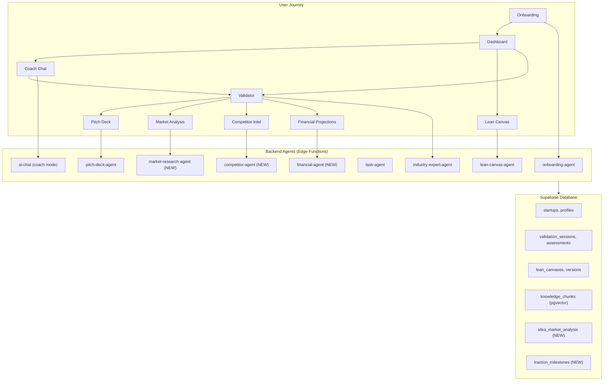
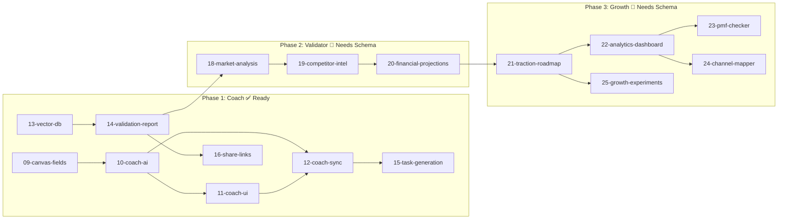
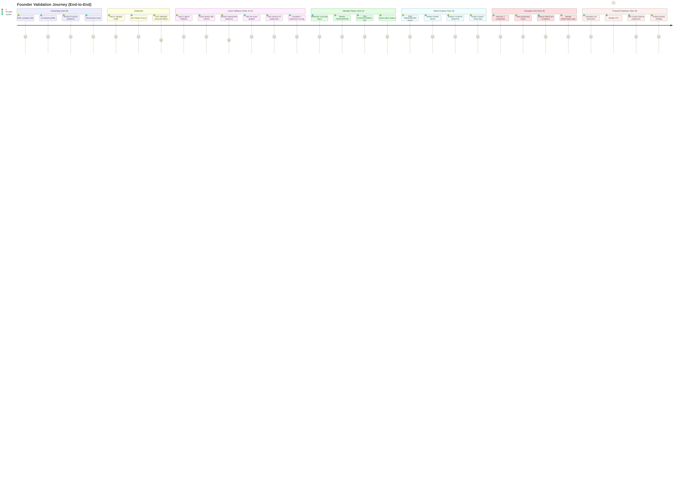
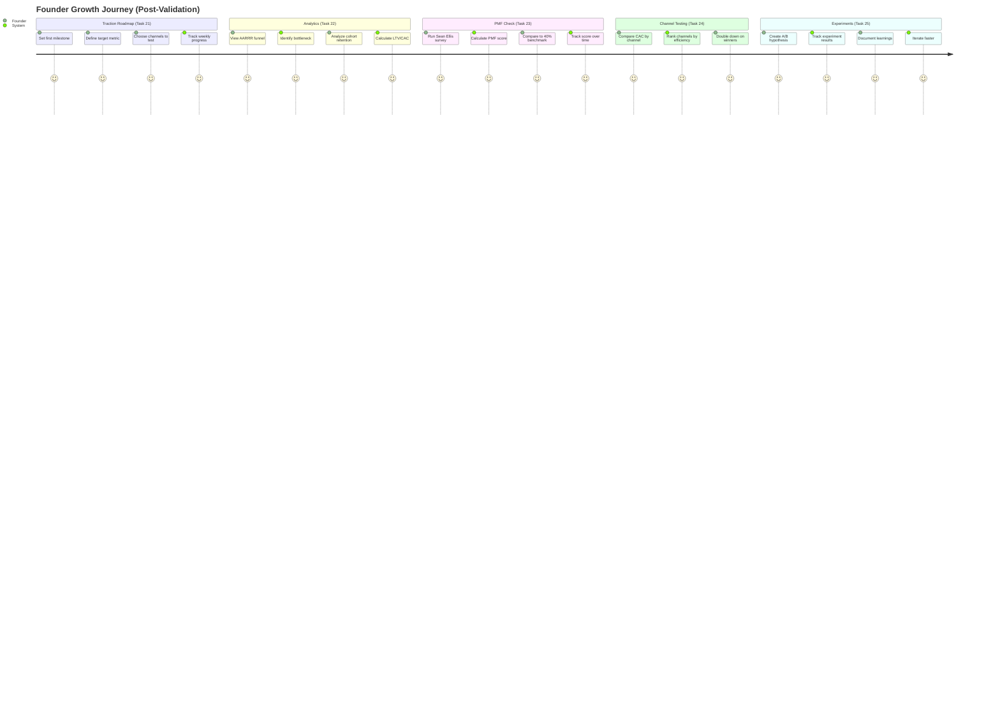

# StartupAI — Master Task Progress Tracker

**Purpose:** Track all tasks, features, blockers, and implementation status  
**Scope:** MVP Coach System + Playbook Integration + Validator Platform + Growth Tools  
**Last Updated:** 2026-02-04  
**Overall Status:** 🟢 **98% Core Complete** | 🟡 **Coach System: Tables Ready** | 🔴 **Growth Tools: Not Started**

---

## Quick Links

| Doc | Purpose |
|-----|---------|
| [01-realtime-tasks.md](./01-realtime-tasks.md) | Real-time task subscriptions |
| [02-supabase-schema.md](./02-supabase-schema.md) | Database schema overview |
| [03-edge-functions.md](./03-edge-functions.md) | Edge function catalog |
| [04-testing-checklist.md](./04-testing-checklist.md) | Testing procedures |
| [05-implementation-plan.md](./05-implementation-plan.md) | Implementation roadmap |

---

## Executive Summary

| Area | Status | % | Tasks | Blockers |
|:-----|:------:|:--:|:-----:|:--------:|
| **Core Platform** | 🟢 | 98% | 30/30 | 0 |
| **Onboarding Wizard** | 🟢 | 100% | 8/8 | 0 |
| **Playbook System** | 🟢 | 100% | 4/4 | 0 |
| **Coach Tables** | 🟢 | 100% | — | 0 ✅ |
| **Coach System (09-16)** | 🟡 | 38% | 3/8 | None |
| **Validator Platform (18-20)** | 🔴 | 0% | 0/3 | Schema |
| **Growth Tools (21-25)** | 🔴 | 0% | 0/5 | Schema |
| **Wireframes (26)** | 🟢 | 100% | 1/1 | 0 |

---

## Architecture Overview



---

## 📊 Task Index (docs/tasks/)

| # | Task File | Title | Priority | Status | % | Depends On | Phase |
|---|-----------|-------|:--------:|:------:|:--:|:----------:|:-----:|
| 01 | `01-realtime-tasks.md` | Real-time Tasks | P1 | 🟢 Complete | 100% | — | Core |
| 02 | `02-supabase-schema.md` | Supabase Schema | P0 | 🟢 Complete | 100% | — | Core |
| 03 | `03-edge-functions.md` | Edge Functions | P0 | 🟢 Complete | 100% | 02 | Core |
| 04 | `04-testing-checklist.md` | Testing Checklist | P1 | 🟢 Complete | 100% | — | Core |
| 05 | `05-implementation-plan.md` | Implementation Plan | P1 | 🟢 Complete | 100% | — | Core |
| 06 | `06-realtime-chat.md` | Real-time Chat | P1 | 🟢 Complete | 100% | 01 | Core |
| 07 | `07-global-ai-assistant.md` | Global AI (Atlas) | P1 | 🟢 Complete | 100% | 03 | Core |
| 08 | `08-gaps-blockers-analysis.md` | Gaps Analysis | P2 | 🟢 Complete | 100% | — | Core |
| **09** | `09-canvas-fields.md` | **Canvas Fields** | P0 | 🟢 Complete | 100% | — | Coach |
| **10** | `10-coach-ai.md` | **Coach AI** | P0 | 🟢 Complete | 100% | 09 | Coach |
| **11** | `11-coach-ui.md` | **Coach UI** | P0 | 🟢 Complete | 100% | 10 | Coach |
| **12** | `12-coach-sync.md` | **Coach Sync** | P1 | 🔴 Not Started | 0% | 10, 11 | Coach |
| **13** | `13-vector-db.md` | **Vector DB** | P0 | 🔴 Not Started | 0% | — | Coach |
| **14** | `14-validation-report.md` | **Validation Report** | P0 | 🔴 Not Started | 0% | 13 | Coach |
| **15** | `15-task-generation.md` | **Task Generation** | P1 | 🔴 Not Started | 0% | 12 | Coach |
| **16** | `16-share-links.md` | **Share Links** | P2 | 🔴 Not Started | 0% | 14 | Coach |
| **17** | `17-data-summary.md` | **Data Summary** | P2 | 🟢 Reference | 100% | — | Ref |
| **18** | `18-market-analysis.md` | **Market Analysis** | P1 | 🔴 Not Started | 0% | 14 | Validator |
| **19** | `19-competitor-intel.md` | **Competitor Intel** | P1 | 🔴 Not Started | 0% | 18 | Validator |
| **20** | `20-financial-projections.md` | **Financial Projections** | P1 | 🔴 Not Started | 0% | 19 | Validator |
| **21** | `21-traction-roadmap.md` | **Traction Roadmap** | P1 | 🔴 Not Started | 0% | MVP | Growth |
| **22** | `22-analytics-dashboard.md` | **Analytics Dashboard** | P1 | 🔴 Not Started | 0% | 21 | Growth |
| **23** | `23-pmf-checker.md` | **PMF Checker** | P1 | 🔴 Not Started | 0% | 22 | Growth |
| **24** | `24-channel-mapper.md` | **Channel Mapper** | P2 | 🔴 Not Started | 0% | 22 | Growth |
| **25** | `25-growth-experiments.md` | **Growth Experiments** | P2 | 🔴 Not Started | 0% | 21 | Growth |
| **26** | `26-validator-wireframe.md` | **Validator Wireframe** | P1 | 🟢 Reference | 100% | — | Design |

---

## 🚧 Blockers & Schema Status

### Schema Verification

| Table | Required By | Status | Notes |
|-------|:-----------:|:------:|:------|
| `validation_sessions` | 10-coach-ai | ✅ Exists | Ready |
| `validation_assessments` | 10-coach-ai | ✅ Exists | Ready |
| `validation_campaigns` | 10-coach-ai | ✅ Exists | Ready |
| `validation_sprints` | 10-coach-ai | ✅ Exists | Ready |
| `validation_reports` | 14-validation | ✅ Exists | Ready |
| `knowledge_chunks` | 13-vector-db | ✅ Exists | Ready |
| `competitor_profiles` | 19-competitor | ✅ Exists | Ready |
| `experiment_results` | 25-growth | ✅ Exists | Ready |
| `metric_snapshots` | 22-analytics | ✅ Exists | Ready |
| `idea_market_analysis` | 18-market | ❌ Missing | **Blocker** |
| `idea_market_segments` | 18-market | ❌ Missing | **Blocker** |
| `idea_competitors` | 19-competitor | ❌ Missing | **Blocker** |
| `idea_unit_economics` | 20-financial | ❌ Missing | **Blocker** |
| `traction_milestones` | 21-traction | ❌ Missing | **Blocker** |
| `channel_tests` | 21-traction | ❌ Missing | **Blocker** |
| `pmf_surveys` | 23-pmf | ❌ Missing | **Blocker** |
| `pmf_responses` | 23-pmf | ❌ Missing | **Blocker** |
| `growth_experiments` | 25-growth | ❌ Missing | **Blocker** |

### Dependency Chain



---

## Screen → Agent → Tables Mapping

```mermaid
flowchart TD
    subgraph Screens["Frontend Screens"]
        OW["Onboarding Wizard"]
        DASH["Dashboard"]
        VAL["Validator"]
        LC["Lean Canvas"]
        PD["Pitch Deck"]
        CHAT["AI Chat"]
        TASKS["Tasks"]
        CRM["CRM"]
        MA["Market Analysis (NEW)"]
        CI["Competitor Intel (NEW)"]
        FP["Financial Projections (NEW)"]
        TR["Traction Roadmap (NEW)"]
        AD["Analytics Dashboard (NEW)"]
        PMF["PMF Checker (NEW)"]
    end
    
    subgraph Agents["Edge Function Agents"]
        OA["onboarding-agent"]
        HS["health-scorer"]
        AR["action-recommender"]
        IEA["industry-expert-agent"]
        LCA["lean-canvas-agent"]
        PDA["pitch-deck-agent"]
        AIC["ai-chat"]
        TA["task-agent"]
        CRMA["crm-agent"]
        MRA["market-research-agent (NEW)"]
        CPA["competitor-agent (NEW)"]
        FA["financial-agent (NEW)"]
        CM["compute-metrics (NEW)"]
    end
    
    subgraph Tables["Database Tables"]
        WS["wizard_sessions"]
        ST["startups"]
        LCC["lean_canvases"]
        PDD["pitch_decks"]
        T["tasks"]
        CT["contacts"]
        VS["validation_sessions"]
        KC["knowledge_chunks"]
        IMA["idea_market_analysis"]
        IC["idea_competitors"]
        IUE["idea_unit_economics"]
        TM["traction_milestones"]
        MS["metric_snapshots"]
        PS["pmf_surveys"]
    end
    
    OW --> OA --> WS
    OW --> OA --> ST
    DASH --> HS --> ST
    DASH --> AR --> ST
    VAL --> IEA --> VS
    VAL --> IEA --> KC
    LC --> LCA --> LCC
    PD --> PDA --> PDD
    CHAT --> AIC --> VS
    TASKS --> TA --> T
    CRM --> CRMA --> CT
    MA --> MRA --> IMA
    CI --> CPA --> IC
    FP --> FA --> IUE
    TR --> TM
    AD --> CM --> MS
    PMF --> PS
```



---

## User Journey: Complete Validation Flow



---

## User Journey: Growth Phase



---

## Real-World Examples

### Example 1: Maya's SaaS Validation → Market Analysis

> Maya enters her company URL. The system extracts her B2B SaaS profile.
> 
> After completing the validation report (Score: 78/100), she opens **Market Analysis**.
> 
> **TAM:** $8.2B (all SMB productivity tools)
> **SAM:** $1.4B (AI-powered task management)
> **SOM:** $42M (English-speaking, remote-first teams, Year 1-3)
> **CAGR:** 22.3% (2024-2028)
> 
> Coach says: "Your SOM is achievable with focused positioning. The AI adoption trend in your SAM is accelerating - timing is good."

### Example 2: Marcus's Restaurant Tech Competitor Analysis

> Marcus validates his restaurant inventory SaaS and opens **Competitor Intel**:
> 
> **Direct Competitors:** MarketMan, BlueCart, Foodics
> **Indirect:** Toast POS, Square for Restaurants
> **Alternative:** Spreadsheets, manual counting
> 
> **Positioning Matrix:** Premium/High-Tech quadrant is underserved
> **Your Gap:** "None use AI for demand prediction"
> 
> Coach says: "You've found a blue ocean. Focus your pitch on AI-powered demand forecasting as your key differentiator."

### Example 3: Jake's FinTech Financial Projections

> Jake asks: "What's a good LTV:CAC ratio for B2B SaaS?"
> 
> Coach searches the vector database:
> "B2B SaaS benchmark is 3:1 minimum, 5:1+ is excellent.
> **Source:** Deloitte SaaS Metrics 2026 | **Confidence:** High"
> 
> Jake opens **Financial Projections**:
> - **CAC:** $450 (paid marketing + sales)
> - **LTV:** $2,700 (36 months × $75/mo)
> - **LTV:CAC:** 6:1 ✅ Excellent
> - **Payback:** 6 months
> - **Year 3 ARR:** $1.8M projected

### Example 4: Sarah's PMF Measurement

> Sarah has 50 beta users and runs the **PMF Checker**:
> 
> **Survey Results:**
> - "Very disappointed": 42% ✅ (Above 40% threshold!)
> - "Somewhat disappointed": 35%
> - "Not disappointed": 18%
> - "N/A - no longer use": 5%
> 
> **PMF Score:** 42% → **PMF ACHIEVED**
> 
> Coach says: "Congratulations! You've crossed the 40% threshold. Time to scale. Focus on activation rate next."

---

## Implementation Timeline

```mermaid
gantt
    title StartupAI Implementation Roadmap
    dateFormat  YYYY-MM-DD
    
    section Phase 1: Coach
    09-canvas-fields              :t09, 2026-02-05, 2d
    10-coach-ai                   :t10, after t09, 3d
    11-coach-ui                   :t11, after t10, 2d
    12-coach-sync                 :t12, after t11, 2d
    13-vector-db                  :t13, 2026-02-05, 2d
    14-validation-report          :t14, after t13, 3d
    15-task-generation            :t15, after t12, 2d
    16-share-links                :t16, after t14, 1d
    
    section Phase 2: Validator
    Schema: idea_market_*         :crit, s18, 2026-02-15, 1d
    18-market-analysis            :t18, after s18, 4d
    19-competitor-intel           :t19, after t18, 3d
    20-financial-projections      :t20, after t19, 3d
    
    section Phase 3: Growth
    Schema: traction_*, pmf_*     :crit, s21, 2026-02-25, 1d
    21-traction-roadmap           :t21, after s21, 2d
    22-analytics-dashboard        :t22, after t21, 3d
    23-pmf-checker                :t23, after t22, 2d
    24-channel-mapper             :t24, after t22, 2d
    25-growth-experiments         :t25, after t21, 2d
```

---

## ✅ Completed Tasks (01-playbooks/)

| # | Task | Status | Verified |
|---|------|:------:|:--------:|
| 17 | Playbook-Screen Integration | 🟢 100% | ✅ |
| 18 | Deno Unit Testing | 🟢 100% | ✅ |
| 19 | Workflow Trigger System | 🟢 100% | ✅ |
| 20 | Dynamic Onboarding Questions | 🟢 100% | ✅ |
| 22 | Agentic Routing & Packs | 🟢 100% | ✅ |
| 23 | Fix Step 4 Score/Summary | 🟢 100% | ✅ |
| 24 | Interview Answer Persistence | 🟢 100% | ✅ |
| 27 | Wire Interview Persistence UI | 🟢 100% | ✅ |
| 28 | Wire Dynamic Questions | 🟢 100% | ✅ |
| 29 | Wire Agentic Routing UI | 🟢 100% | ✅ |
| 30 | Fix Backend Gaps | 🟢 100% | ✅ |

---

## Verification Checklist

### Core System ✅

- [x] 15 Edge Functions deployed
- [x] 43 Database tables with RLS
- [x] OAuth (Google + LinkedIn) working
- [x] Onboarding 4-step wizard complete
- [x] Dashboard 6-category health score
- [x] Lean Canvas CRUD + AI
- [x] Pitch Deck generator + critic
- [x] Global AI Assistant (Atlas)
- [x] Playbook context injection

### Coach System 🟡 (Tasks 09-16)

- [x] Canvas fields added to onboarding (09) ✅
- [ ] Coach AI mode in ai-chat (10)
- [ ] 3-panel Coach UI (11)
- [ ] Bidirectional sync (12)
- [ ] Vector DB with 200+ stats (13)
- [ ] 14-section validation report (14)
- [ ] Auto task generation (15)
- [ ] Share links (16)

### Validator Platform 🔴 (Tasks 18-20)

- [ ] Market Analysis schema created
- [ ] market-research-agent deployed (18)
- [ ] TAM/SAM/SOM funnel visualization (18)
- [ ] Competitor Intel schema created
- [ ] competitor-agent deployed (19)
- [ ] Positioning matrix (19)
- [ ] Financial Projections schema created
- [ ] financial-agent deployed (20)
- [ ] Unit economics dashboard (20)

### Growth Tools 🔴 (Tasks 21-25)

- [ ] Traction Roadmap schema created
- [ ] Traction milestone tracking (21)
- [ ] Analytics Dashboard (22)
- [ ] AARRR funnel visualization (22)
- [ ] PMF Checker with Sean Ellis survey (23)
- [ ] Channel Mapper (24)
- [ ] Growth Experiments tracker (25)

---

## Next Actions

### Immediate (This Sprint)

1. **Task 09-16:** Complete Coach System (Tables Ready ✅)
2. **Schema Migration:** Create Validator tables (`idea_market_*`, `idea_competitors`, etc.)

### Next Sprint

1. **Task 18-20:** Build Validator Platform (Market, Competitor, Financial)
2. **Schema Migration:** Create Growth tables (`traction_*`, `pmf_*`, etc.)
3. **Task 21-25:** Build Growth Tools

---

## Status Legend

| Symbol | Status | Meaning |
|:------:|:------:|:--------|
| 🟢 | Complete | Fully functional, verified |
| 🟡 | In Progress | Partially working |
| 🔴 | Not Started | Planned, not implemented |
| 🟥 | Blocked | Missing dependency |
| ✅ | Verified | Tested and confirmed |

---

**Last Updated:** 2026-02-04  
**Auditor:** AI Systems Analyst  
**Next Action:** Complete Coach System (09-16), then create Validator schema
