# StartupAI — Master Task Progress Tracker

**Purpose:** Track all tasks, features, blockers, and implementation status  
**Scope:** MVP Coach System + Playbook Integration + Core Features  
**Last Updated:** 2026-02-04  
**Overall Status:** 🟢 **98% Core Complete** | 🟡 **Coach System: Tables Ready**

---

## Quick Links

| Doc | Purpose |
|-----|---------|
| [01-realtime-tasks.md](./01-realtime-tasks.md) | Real-time task subscriptions |
| [02-supabase-schema.md](./02-supabase-schema.md) | Database schema overview |
| [03-edge-functions.md](./03-edge-functions.md) | Edge function catalog |
| [04-testing-checklist.md](./04-testing-checklist.md) | Testing procedures |
| [05-implementation-plan.md](./05-implementation-plan.md) | Implementation roadmap |

---

## Executive Summary

| Area | Status | % | Tasks | Blockers |
|:-----|:------:|:--:|:-----:|:--------:|
| **Core Platform** | 🟢 | 98% | 30/30 | 0 |
| **Onboarding Wizard** | 🟢 | 100% | 8/8 | 0 |
| **Playbook System** | 🟢 | 100% | 4/4 | 0 |
| **Coach Tables** | 🟢 | 100% | — | 0 ✅ |
| **Coach System (NEW)** | 🟡 | 10% | 0/8 | None |
| **Vector DB** | 🔴 | 0% | 0/1 | knowledge_chunks |
| **Validation Reports** | 🟡 | 20% | — | None |

---

## Architecture Overview

---

## 📊 Task Index (docs/tasks/)

| # | Task File | Title | Priority | Status | % | Depends On |
|---|-----------|-------|:--------:|:------:|:--:|:----------:|
| 01 | `01-realtime-tasks.md` | Real-time Tasks | P1 | 🟢 Complete | 100% | — |
| 02 | `02-supabase-schema.md` | Supabase Schema | P0 | 🟢 Complete | 100% | — |
| 03 | `03-edge-functions.md` | Edge Functions | P0 | 🟢 Complete | 100% | 02 |
| 04 | `04-testing-checklist.md` | Testing Checklist | P1 | 🟢 Complete | 100% | — |
| 05 | `05-implementation-plan.md` | Implementation Plan | P1 | 🟢 Complete | 100% | — |
| 06 | `06-realtime-chat.md` | Real-time Chat | P1 | 🟢 Complete | 100% | 01 |
| 07 | `07-global-ai-assistant.md` | Global AI (Atlas) | P1 | 🟢 Complete | 100% | 03 |
| 08 | `08-gaps-blockers-analysis.md` | Gaps Analysis | P2 | 🟢 Complete | 100% | — |
| **09** | `09-canvas-fields.md` | **Canvas Fields** | P0 | 🔴 Not Started | 0% | — |
| **10** | `10-coach-ai.md` | **Coach AI** | P0 | 🔴 Not Started | 0% | 101-tables |
| **11** | `11-coach-ui.md` | **Coach UI** | P0 | 🔴 Not Started | 0% | 10 |
| **12** | `12-coach-sync.md` | **Coach Sync** | P1 | 🔴 Not Started | 0% | 10, 11 |
| **13** | `13-vector-db.md` | **Vector DB** | P0 | 🔴 Not Started | 0% | 101-tables |
| **14** | `14-validation-report.md` | **Validation Report** | P0 | 🔴 Not Started | 0% | 13 |
| **15** | `15-task-generation.md` | **Task Generation** | P1 | 🔴 Not Started | 0% | 12 |
| **16** | `16-share-links.md` | **Share Links** | P2 | 🔴 Not Started | 0% | 14 |
| **17** | `17-data-summary.md` | **Data Summary** | P2 | 🟢 Reference | 100% | — |

---

## 📋 New Tasks (09-16) Detail

### Task 09: Canvas Fields

> Add 6 essential questions to capture Lean Canvas data

| Aspect | Details |
|--------|---------|
| **Screens** | Onboarding Wizard (Steps 1 & 3), Chat Coach |
| **Edge Functions** | `onboarding-agent`, `ai-chat` |
| **AI Model** | gemini-3-flash-preview |
| **Tables** | `wizard_sessions`, `startups` |

**User Stories:**
- As a founder, I want to answer clear questions about my startup so my canvas is generated automatically
- As a founder, I want to describe how customers solve the problem today so my competitive position is clear

**Acceptance Criteria:**
- [ ] Step 1 has explicit "Problem" and "Solution" fields
- [ ] Step 3 interview includes "How do they solve it today?"
- [ ] Step 3 interview includes "How will customers find you?"
- [ ] Step 3 interview includes "Why you, why now?"
- [ ] Data maps to 9 Lean Canvas boxes

---

### Task 10: Coach AI

> Expert persona + industry knowledge + 6 phase handlers

| Aspect | Details |
|--------|---------|
| **Screens** | AI Chat (coach mode) |
| **Edge Functions** | `ai-chat` (extended with coach mode) |
| **AI Model** | gemini-3-pro-preview |
| **Tables** | `validation_sessions`, `validation_assessments`, `validation_campaigns`, `validation_sprints` |

**User Stories:**
- As a founder, I want to talk naturally to my coach so I don't need to learn frameworks
- As a founder, I want industry-specific advice so guidance applies to my market
- As a founder, I want coach to remember my progress so I continue where I left off

**Acceptance Criteria:**
- [ ] Coach mode activated via `mode: 'coach'` or active session
- [ ] 6 phase handlers: onboarding, assessment, constraint, campaign, sprint, review
- [ ] Expert persona with industry expertise
- [ ] Context loads in < 500ms, response in < 3s
- [ ] Retry logic with exponential backoff

---

### Task 11: Coach UI

> 3-panel layout: Nav | Validator | Coach Chat

| Aspect | Details |
|--------|---------|
| **Screens** | Validator (refactored) |
| **Edge Functions** | — |
| **AI Model** | — |
| **Tables** | — |

**User Stories:**
- As a founder, I want to see my scores while chatting so I understand what coach is referencing
- As a founder, I want to see phase progress so I know where I am in the journey
- As a founder, I want to click suggested actions so I don't have to type everything

**Acceptance Criteria:**
- [ ] 3-panel layout: Nav (80px) | Main (~60%) | Coach (~40%)
- [ ] Main panel shows Verdict, Tradeoffs, Evidence, Sprint Progress
- [ ] Coach panel shows Phase Progress, Messages, Quick Actions
- [ ] Coach panel collapsible with [−] button
- [ ] Responsive: tablet = slide-over drawer, mobile = toggle view

---

### Task 12: Coach Sync

> Bidirectional sync between Validator and Coach panels

| Aspect | Details |
|--------|---------|
| **Screens** | Validator (3-panel) |
| **Edge Functions** | — |
| **Tables** | — |

**User Stories:**
- As a founder, I want to click a concern to get explanation without asking
- As a founder, I want to see scores update live as coach assesses
- As a founder, I want smooth animations for polished experience

**Acceptance Criteria:**
- [ ] Click element in Main → Coach explains it
- [ ] Coach mentions element → Main highlights it
- [ ] Assessment scores update live
- [ ] < 100ms sync latency, smooth 60fps animations

---

### Task 13: Vector DB

> Load 200+ Tier A statistics into pgvector for RAG

| Aspect | Details |
|--------|---------|
| **Screens** | — (Backend infrastructure) |
| **Edge Functions** | `ai-chat` (query), `load-knowledge` (admin) |
| **AI Model** | text-embedding-004 |
| **Tables** | `knowledge_chunks` |

**User Stories:**
- As a founder, I want answers with sources so I can trust the advice
- As a founder, I want confidence levels so I know how reliable the answer is

**Acceptance Criteria:**
- [ ] pgvector extension enabled
- [ ] `knowledge_chunks` table with embeddings (vector 768)
- [ ] `search_knowledge()` SQL function for semantic search
- [ ] 200+ Tier A stats loaded (Deloitte, BCG, McKinsey, etc.)
- [ ] Coach answers include citations and confidence

---

### Task 14: Validation Report

> Generate 14-section validation reports with TAM/SAM/SOM

| Aspect | Details |
|--------|---------|
| **Screens** | Validator (3-panel layout) |
| **Edge Functions** | `lean-canvas-agent` (action: validate) |
| **AI Model** | gemini-3-pro-preview |
| **Tables** | `validation_reports`, `validation_sections` |

**User Stories:**
- As a founder, I want comprehensive validation so I know if my idea is viable
- As a founder, I want TAM/SAM/SOM numbers so I can communicate market size
- As an investor, I want structured report so I can quickly assess the opportunity

**Acceptance Criteria:**
- [ ] 14 sections (see task file for structure)
- [ ] Executive summary with GO/CAUTION/NO-GO verdict
- [ ] 7-dimension scoring (0-10 each)
- [ ] TAM/SAM/SOM with visualization
- [ ] Report generation < 60 seconds

---

### Task 15: Task Generation

> Auto-generate actionable tasks from Coach conversations

| Aspect | Details |
|--------|---------|
| **Screens** | Tasks page, Coach Panel |
| **Edge Functions** | `workflow-trigger`, `ai-chat` |
| **AI Model** | gemini-3-flash-preview |
| **Tables** | `tasks`, `task_suggestions` |

**User Stories:**
- As a founder, I want tasks auto-created so I don't forget advice
- As a founder, I want suggested due dates so I can prioritize

**Acceptance Criteria:**
- [ ] Tasks auto-extracted from Coach advice
- [ ] Task suggestions appear in Coach panel
- [ ] User can accept/modify/dismiss suggestions
- [ ] Tasks have category, priority, due date

---

### Task 16: Share Links

> Generate unique shareable URLs for validation reports

| Aspect | Details |
|--------|---------|
| **Screens** | Validator (share button), Public Report View |
| **Tables** | `report_shares`, `share_views` |

**User Stories:**
- As a founder, I want to share reports via link so investors can view online
- As a founder, I want to track views so I know when investors engage

**Acceptance Criteria:**
- [ ] Share button generates unique URL
- [ ] Public view works without login
- [ ] Optional email gate for access
- [ ] View count tracked
- [ ] Links can be revoked

---

## 🚧 Blockers & Dependencies

```mermaid
flowchart LR
    subgraph Phase1["Phase 1: Schema ✅"]
        T101["101-coach-tables<br/>✅ EXISTS"]
        T13A["knowledge_chunks<br/>✅ EXISTS"]
    end
    
    subgraph Phase2["Phase 2: Backend"]
        T10["10-coach-ai<br/>🟡 Ready"]
        T13["13-vector-db<br/>🟡 Ready"]
    end
    
    subgraph Phase3["Phase 3: Frontend"]
        T09["09-canvas-fields<br/>🟡 Ready"]
        T11["11-coach-ui<br/>🟡 Ready"]
        T12["12-coach-sync"]
    end
    
    subgraph Phase4["Phase 4: Features"]
        T14["14-validation-report<br/>🟡 Ready"]
        T15["15-task-generation"]
        T16["16-share-links"]
    end
    
    T101 --> T10
    T13A --> T13
    T10 --> T11
    T10 --> T12
    T11 --> T12
    T13 --> T14
    T12 --> T15
    T14 --> T16
```

### ✅ Resolved Blockers

| # | Blocker | Status | Resolution |
|---|---------|:------:|:----------:|
| 1 | **101-coach-tables** | ✅ Resolved | Tables exist in DB |
| 2 | **knowledge_chunks** | ✅ Resolved | Table exists in DB |

### Verified Tables

The following Coach system tables exist and are ready:

- `validation_sessions` ✅
- `validation_assessments` ✅  
- `validation_campaigns` ✅
- `validation_sprints` ✅
- `validation_experiments` ✅
- `validation_conversations` ✅
- `validation_reports` ✅
- `validation_verdicts` ✅
- `validation_runs` ✅
- `knowledge_chunks` ✅

---

## Screen → Agent → Tables Mapping

---

## User Journey: Complete Flow

---

## Implementation Order

---

## ✅ Completed Tasks (01-playbooks/)

| # | Task | Status | Verified |
|---|------|:------:|:--------:|
| 17 | Playbook-Screen Integration | 🟢 100% | ✅ |
| 18 | Deno Unit Testing | 🟢 100% | ✅ |
| 19 | Workflow Trigger System | 🟢 100% | ✅ |
| 20 | Dynamic Onboarding Questions | 🟢 100% | ✅ |
| 22 | Agentic Routing & Packs | 🟢 100% | ✅ |
| 23 | Fix Step 4 Score/Summary | 🟢 100% | ✅ |
| 24 | Interview Answer Persistence | 🟢 100% | ✅ |
| 27 | Wire Interview Persistence UI | 🟢 100% | ✅ |
| 28 | Wire Dynamic Questions | 🟢 100% | ✅ |
| 29 | Wire Agentic Routing UI | 🟢 100% | ✅ |
| 30 | Fix Backend Gaps | 🟢 100% | ✅ |

---

## Verification Checklist

### Core System ✅

- [x] 15 Edge Functions deployed
- [x] 43 Database tables with RLS
- [x] OAuth (Google + LinkedIn) working
- [x] Onboarding 4-step wizard complete
- [x] Dashboard 6-category health score
- [x] Lean Canvas CRUD + AI
- [x] Pitch Deck generator + critic
- [x] Global AI Assistant (Atlas)
- [x] Playbook context injection

### Coach System 🔴

- [ ] Coach tables created (101-coach-tables)
- [ ] Canvas fields added to onboarding (09)
- [ ] Coach AI mode in ai-chat (10)
- [ ] 3-panel Coach UI (11)
- [ ] Bidirectional sync (12)
- [ ] Vector DB with 200+ stats (13)
- [ ] 14-section validation report (14)
- [ ] Auto task generation (15)
- [ ] Share links (16)

---

## Real-World Examples

### Example 1: Maya's SaaS Validation

> Maya enters her company URL. The system extracts her B2B SaaS profile.
> In Step 3, she answers the 6 canvas questions with suggestion chips.
> After completion, her Lean Canvas is auto-generated.
> 
> She opens the Validator. The coach says: "Your SaaS scores 78/100.
> Strong product clarity, but zero customers. That's your bottleneck."
> 
> Maya clicks "No customers" in the main panel. Coach immediately explains:
> "This is exactly why demand validation is priority #1. I've seen founders
> who focus here first succeed 3x more often. Ready for a 90-day sprint?"
> 
> Coach generates 3 tasks: Interview 5 customers, Create landing page,
> Research competitors. Maya accepts all and starts working.

### Example 2: Jake's FinTech Validation

> Jake asks: "What's a good churn rate for B2B SaaS?"
> 
> Coach searches the vector database, finds Deloitte stat:
> "B2B SaaS benchmark is <5% monthly churn.
> **Source:** Deloitte State of AI 2026 (n=3,235) | **Confidence:** High"
> 
> The Problem Clarity card in the main panel glows briefly as Coach
> references it. Jake clicks to see the full breakdown.

---

## Status Legend

| Symbol | Status | Meaning |
|:------:|:------:|:--------|
| 🟢 | Complete | Fully functional, verified |
| 🟡 | In Progress | Partially working |
| 🔴 | Not Started | Planned, not implemented |
| 🟥 | Blocked | Missing dependency |
| ✅ | Verified | Tested and confirmed |

---

**Last Updated:** 2026-02-04  
**Next Action:** Create 101-coach-tables migration to unblock Coach system
