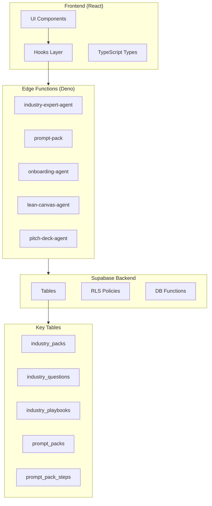

# Industry & Prompt Packs — Progress Tracker

**Purpose:** Systematic, accurate, production-ready progress for Industry & Prompt Packs implementation.  
**Scope:** `docs/tasks/01-playbooks` — backend, frontend screens, edge functions, docs.  
**Last Updated:** 2026-01-30  
**Status:** Backend Complete ✅ | Frontend Integration In Progress 🟡

---

## Executive Summary

| Area | Status | Progress | Notes |
|:-----|:------:|:--------:|:------|
| **Migrations** | 🟢 | 100% | All backend tables deployed |
| **Seeds** | 🟢 | 100% | 19 Industries + 54 Packs seeded |
| **Edge Functions** | 🟢 | 100% | 13/13 Deployed & Active |
| **Type Definitions** | 🔴 | 0% | `industry_packs` not in generated types |
| **Realtime Integration** | 🟢 | 100% | Private channels + broadcast ready |
| **Lovable Prompts** | 🟢 | 100% | 8/8 Screen specs in repo |
| **Frontend Screens** | 🔴 | 0% | 0/8 Screens implemented |
| **Testing** | 🟡 | 50% | Edge functions tested; UI pending |

---

## 🔴 Critical Blockers

| # | Issue | Impact | Status | Fix Required |
|---|-------|--------|--------|--------------|
| 1 | `industry_packs` table not in Supabase types | TypeScript errors in hooks | 🔴 **BLOCKING** | Run `supabase gen types` or create migration |
| 2 | `useIndustryPacks.ts` build errors | 20+ TS errors | 🔴 **BLOCKING** | Fix types or use typed edge function |
| 3 | `useStartupTypes.ts` build errors | 20+ TS errors | 🔴 **BLOCKING** | Same as above |

---

## Architecture Overview



---

## User Journey: Maria (FinTech Founder)

```mermaid
journey
    title Maria's Onboarding Journey
    section Step 1: Industry
      Select FinTech - Payments: 5: Maria
      See industry-specific context: 5: System
    section Step 2: Problem
      Answer compliance questions: 4: Maria
      AI sharpens problem statement: 5: System
    section Step 3: Founder Fit
      Share relevant experience: 4: Maria
      AI assesses founder-market fit: 5: System
    section Step 4: One-Liner
      Review AI-generated options: 5: Maria
      Select memorable pitch: 5: System
    section Post-Onboarding
      Dashboard shows health score: 5: System
      Canvas pre-filled with data: 5: System
      Pitch deck uses FinTech template: 5: System
```

---

## Implementation Phases

### Phase 0: Foundation ✅ Complete

| Task | Status | Verified |
|------|:------:|:--------:|
| Schema audit | 🟢 | ✅ |
| Edge functions audit | 🟢 | ✅ |
| RLS policies verified | 🟢 | ✅ |
| Types generated | 🔴 | ❌ Missing `industry_packs` |

### Phase 1: Type System Fixes 🔴 Required First

| Task | File | Status | Priority |
|------|------|:------:|:--------:|
| Add `industry_packs` to types | `types.ts` or migration | 🔴 | P0 |
| Fix `useIndustryPacks.ts` | `src/hooks/useIndustryPacks.ts` | 🔴 | P0 |
| Fix `useStartupTypes.ts` | `src/hooks/useStartupTypes.ts` | 🔴 | P0 |

### Phase 2: Core Playbook Screens 🔴 Not Started

| # | Screen | Route | Prompt File | Status | Priority |
|---|--------|-------|-------------|:------:|:--------:|
| 1 | Onboarding Wizard | `/onboarding` | `01-onboarding-wizard.md` | 🔴 | P0 |
| 2 | Validation Dashboard | `/validator` | `02-validation-dashboard.md` | 🔴 | P0 |
| 3 | Main Dashboard | `/app/dashboard` | `08-main-dashboard.md` | 🔴 | P0 |

### Phase 3: Value-Add Screens 🔴 Not Started

| # | Screen | Route | Prompt File | Status | Priority |
|---|--------|-------|-------------|:------:|:--------:|
| 4 | Lean Canvas Builder | `/canvas` | `03-lean-canvas-builder.md` | 🔴 | P1 |
| 5 | Pitch Deck Generator | `/pitch` | `04-pitch-deck-generator.md` | 🔴 | P1 |
| 6 | AI Chat Assistant | `/app/chat` | `05-ai-chat-assistant.md` | 🟡 | P1 |
| 7 | Task Management | `/app/tasks` | `06-task-management.md` | 🟢 | P1 |
| 8 | CRM & Contacts | `/app/contacts` | `07-crm-contacts.md` | 🟢 | P1 |

---

## Edge Function Status

| Function | Actions | Model | Status | Verified |
|----------|---------|-------|:------:|:--------:|
| `industry-expert-agent` | `get_industry_context`, `get_questions`, `coach_answer`, `validate_canvas`, `pitch_feedback`, `get_benchmarks`, `analyze_competitors` | Gemini 3 Flash/Pro | 🟢 | ✅ |
| `prompt-pack` | `search`, `run`, `apply` | Gemini/Claude | 🟢 | ✅ |
| `onboarding-agent` | `enrich_problem`, `assess_founder_fit`, `complete_wizard` | Claude Sonnet | 🟢 | ✅ |
| `lean-canvas-agent` | `generate`, `validate`, `suggest` | Gemini Pro | 🟢 | ✅ |
| `pitch-deck-agent` | `generate_slides`, `critique`, `refine` | Claude Sonnet | 🟢 | ✅ |
| `crm-agent` | Contact enrichment | Gemini Pro | 🟢 | ✅ |
| `investor-agent` | Investor matching | Gemini Pro | 🟢 | ✅ |
| `task-agent` | Task generation | Claude Haiku | 🟢 | ✅ |
| `dashboard-metrics` | Health scoring | Gemini Flash | 🟢 | ✅ |
| `insights-generator` | AI insights | Gemini Pro | 🟢 | ✅ |
| `stage-analyzer` | Stage classification | Gemini Flash | 🟢 | ✅ |
| `documents-agent` | Document processing | Claude Sonnet | 🟢 | ✅ |
| `event-agent` | Event management | Gemini Flash | 🟢 | ✅ |

---

## Database Tables

### Core Industry Tables

| Table | Rows | Status | Used By |
|-------|:----:|:------:|---------|
| `industry_packs` | 19 | 🟢 | All screens |
| `industry_questions` | 152+ | 🟢 | Onboarding, Validation |
| `industry_playbooks` | 19 | 🟢 | All AI agents |

### Prompt Pack Tables

| Table | Rows | Status | Used By |
|-------|:----:|:------:|---------|
| `prompt_packs` | 54 | 🟢 | All AI flows |
| `prompt_pack_steps` | 64 | 🟢 | Step execution |
| `prompt_pack_runs` | — | 🟢 | Run history |
| `feature_pack_routing` | 12 | 🟢 | Agent routing |
| `context_injection_configs` | 8 | 🟢 | Knowledge injection |

### Output Tables

| Table | Status | Used By |
|-------|:------:|---------|
| `playbook_runs` | 🟢 | Onboarding progress |
| `validation_reports` | 🟢 | Validator output |
| `lean_canvases` | 🟢 | Canvas data |
| `pitch_decks` | 🟢 | Deck slides |
| `startups` | 🟢 | Profile storage |
| `profiles` | 🟢 | User data |
| `tasks` | 🟢 | Generated tasks |

---

## Knowledge Injection System

```mermaid
flowchart LR
    subgraph Input["Context Detection"]
        Industry["Industry: FinTech"]
        Stage["Stage: Seed"]
        Feature["Feature: Pitch Deck"]
    end
    
    subgraph Filter["Knowledge Filter"]
        Map["Feature → Knowledge Map"]
    end
    
    subgraph Knowledge["Injected Knowledge"]
        IE["Investor Expectations"]
        SS["Success Stories"]
        RF["Red Flags"]
        BM["Benchmarks"]
    end
    
    subgraph Output["Enriched Prompt"]
        Prompt["System Prompt + Context"]
    end
    
    Input --> Filter
    Filter --> Knowledge
    Knowledge --> Output
```



### Feature → Knowledge Mapping

| Feature | Knowledge Slice |
|---------|-----------------|
| **Onboarding** | Failure patterns + Terminology |
| **Canvas** | GTM patterns + Benchmarks |
| **Pitch** | Investor expectations + Success stories + Red flags |
| **Validator** | Benchmarks + Red flags + Failure patterns |
| **Tasks** | GTM patterns + Failure patterns |
| **Chatbot** | All knowledge types |

---

## Next Actions (Priority Order)

### 🔴 Immediate (Blocking)

1. **Fix Type Errors**: Create migration for `industry_packs` table to sync types
2. **Update Hooks**: Fix `useIndustryPacks.ts` and `useStartupTypes.ts`
3. **Verify Build**: Ensure clean TypeScript compilation

### 🟡 Short-Term (This Sprint)

4. **Implement Onboarding Wizard** (01-onboarding-wizard.md)
5. **Implement Validation Dashboard** (02-validation-dashboard.md)
6. **Implement Main Dashboard** (08-main-dashboard.md)

### 🟢 Medium-Term (Next Sprint)

7. **Implement Lean Canvas Builder** (03-lean-canvas-builder.md)
8. **Implement Pitch Deck Generator** (04-pitch-deck-generator.md)
9. **Enhance AI Chat** (05-ai-chat-assistant.md)

---

## File Index

| File | Purpose |
|------|---------|
| `00-progress-tracker.md` | This file — master progress |
| `prd-industry-prompt-playbooks.md` | Product requirements |
| `roadmap.md` | Implementation phases |
| `lovable-prompts/00-index.md` | Screen prompts index |
| `lovable-prompts/00-backend-handoff-checklist.md` | Backend readiness |
| `lovable-prompts/01-onboarding-wizard.md` | Onboarding spec |
| `lovable-prompts/02-validation-dashboard.md` | Validation spec |
| `lovable-prompts/03-lean-canvas-builder.md` | Canvas spec |
| `lovable-prompts/04-pitch-deck-generator.md` | Pitch deck spec |
| `lovable-prompts/05-ai-chat-assistant.md` | Chat spec |

---

## Status Legend

| Symbol | Status | Meaning |
|:------:|--------|---------|
| 🟢 | Complete | Fully functional, verified, deployed |
| 🟡 | In Progress | Partially working or needs verification |
| 🔴 | Not Started / Blocked | Planned but not implemented |
| ✅ | Verified | Tested and confirmed working |
| ❌ | Failed | Broken or missing |

---

## Success Criteria

| Goal | Metric | Current |
|------|--------|:-------:|
| Industry selection used | 100% of onboarding flows | 🔴 0% |
| 8+ questions per industry | 19 industries × 8 questions | 🟢 ✅ |
| Prompt pack search/run/apply | Used by onboarding, validator, canvas, pitch | 🔴 0% |
| Structured JSON apply | To profile, canvas, slides, tasks | 🔴 0% |
| No TypeScript errors | Clean build | 🔴 ❌ |

---

**Last Updated:** 2026-01-30 12:00 EST
