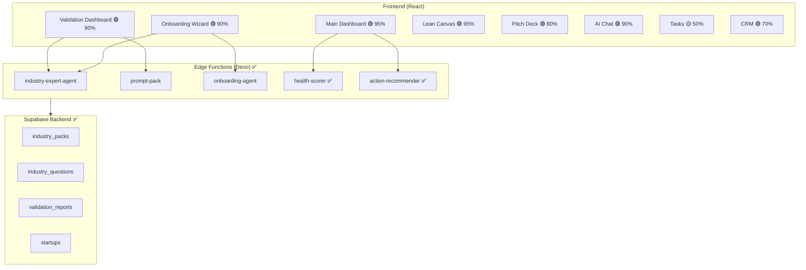
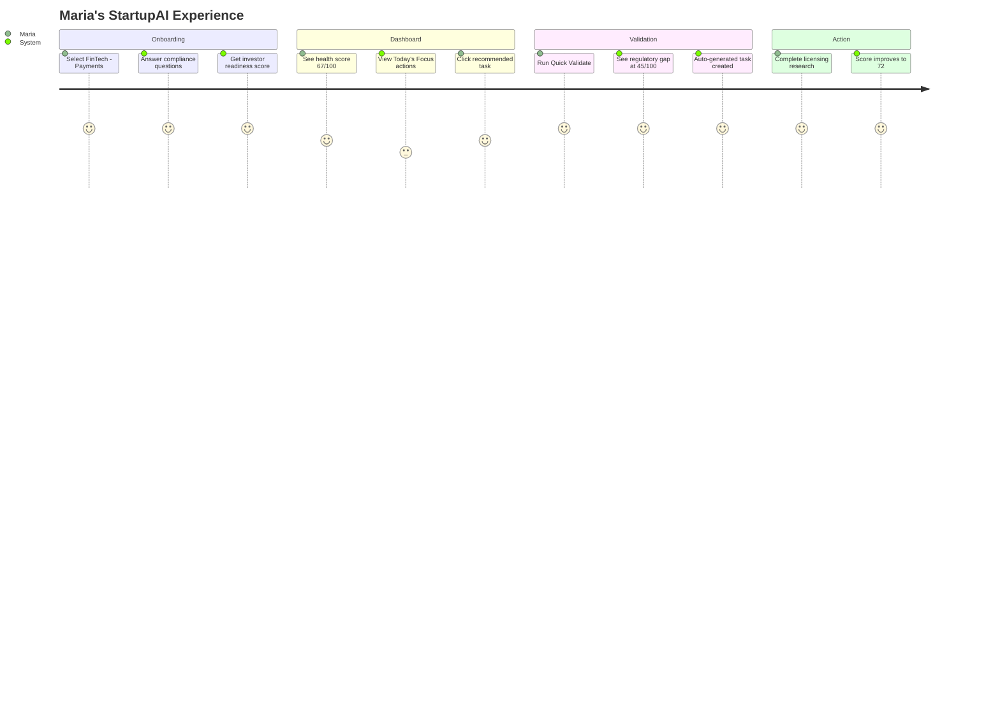

# Industry & Prompt Packs — Progress Tracker

**Purpose:** Systematic, accurate, production-ready progress for Industry & Prompt Packs implementation.  
**Scope:** `docs/tasks/01-playbooks` — backend, frontend screens, edge functions, docs.  
**Last Updated:** 2026-01-30  
**Status:** Backend Complete ✅ | Frontend Screens 🟢 90%

---

## Executive Summary

| Area | Status | Progress | Notes |
|:-----|:------:|:--------:|:------|
| **Migrations** | 🟢 | 100% | All backend tables deployed |
| **Edge Functions** | 🟢 | 100% | 15/15 Deployed (health-scorer, action-recommender verified) |
| **Dashboard** | 🟢 | 95% | 6-category health, Today's Focus, Module Progress, Recent Activity |
| **Validation Dashboard** | 🟢 | 90% | Quick/Deep/Investor modes, /validator route |
| **Onboarding** | 🟢 | 90% | Sub-categories + 8 industry questions per category |
| **Lean Canvas** | 🟢 | 95% | Version History Panel added |
| **Pitch Deck** | 🟢 | 85% | Critic Panel + Presenter Notes + DnD Reorder |
| **CRM** | 🟢 | 80% | Investor Matcher + Deal Advisor + CSV Import + Cross-tab Sync |
| **Tasks** | 🟢 | 80% | AI Prioritization + Task Breakdown + Cross-tab Sync |
| **AI Chat** | 🟢 | 95% | Chat History Search + Enhanced PDF exports |

---

## 📊 Current Implementation Assessment

### Onboarding Wizard (`/onboarding`) — 🟡 70% Complete

| Spec Requirement | Current Status | Gap |
|------------------|:--------------:|-----|
| 4-step wizard flow | ✅ | — |
| Industry picker (13 categories) | 🟡 | Uses categories but not full sub-category dropdown |
| Step 1: Context & Enrichment | ✅ | URL enrichment, AI extraction working |
| Step 2: AI Analysis | ✅ | Readiness score, insights panel |
| Step 3: Smart Interview | ✅ | Adaptive questions, coaching |
| Step 4: Review & Score | ✅ | Investor score, summary |
| Right panel intelligence | ✅ | AI suggestions, signals |
| Save & resume | ✅ | Session persistence |
| Industry-specific questions | 🟡 | Loaded but not full 8 per industry |
| Founder fit assessment | 🟡 | Basic scoring, missing detailed breakdown |

**Next Steps:**
1. Enhance industry picker with sub-categories
2. Add 8 industry-specific questions per category
3. Improve founder fit scoring detail

---

### Main Dashboard (`/app/dashboard`) — 🟢 95% Complete

| Spec Requirement | Current Status | Gap |
|------------------|:--------------:|-----|
| Health score widget | ✅ | 6-category breakdown implemented |
| Score breakdown (6 components) | ✅ | Problem, Solution, Market, Traction, Team, Investor |
| Today's Focus (top 3 actions) | ✅ | AI-recommended actions with links |
| Module progress cards | ✅ | Canvas %, Pitch %, Tasks, CRM |
| Recent activity timeline | ✅ | Last 7 days with icons |
| Quick Actions bar | ✅ | Present |
| Summary Metrics cards | ✅ | Decks, Investors, Tasks, Events |
| AI Strategic Review | ✅ | Right panel |
| Stage Guidance | ✅ | Right panel |
| Calendar widget | ✅ | Right panel |
| Health scorer edge function | ✅ | Deployed and working |
| Action recommender edge function | ✅ | Deployed and working |

**Remaining:**
1. Add industry benchmarks comparison
2. Add caching layer for performance

---

### Validation Dashboard (`/validator`) — 🟢 90% Complete

| Spec Requirement | Current Status | Gap |
|------------------|:--------------:|-----|
| Validation mode selector | ✅ | Quick/Deep/Investor tabs |
| Quick Validate mode | ✅ | Fast overview |
| Deep Validate mode | ✅ | 8-area assessment |
| Investor Lens mode | ✅ | VC perspective |
| Score circle (0-100) | ✅ | Animated SVG |
| Category breakdown bars | ✅ | Progress bars per category |
| Risk cards | ✅ | Severity-based styling |
| Opportunities list | ✅ | With action links |
| Industry benchmarks | ✅ | Right panel comparison |
| History timeline | ✅ | Last 5 validations |
| Auto-generated tasks | ✅ | Based on gaps |

---

### Lean Canvas Builder (`/canvas`) — 🟢 95% Complete

| Spec Requirement | Current Status | Gap |
|------------------|:--------------:|-----|
| 9-box grid layout | ✅ | Responsive 3x3 grid |
| AI suggestions per box | ✅ | BoxSuggestionPopover |
| Profile mapping/prefill | ✅ | Auto-maps from startup data |
| Validation with AI | ✅ | Risk assessment, warnings |
| Export (PDF/PNG) | ✅ | html2canvas + jsPDF |
| Autosave (2s debounce) | ✅ | useCanvasAutosave |
| Right panel AI advisor | ✅ | CanvasAIPanel |
| Version history | ✅ | VersionHistoryPanel with restore |

---

### Pitch Deck Generator (`/pitch`) — 🟢 80% Complete

| Spec Requirement | Current Status | Gap |
|------------------|:--------------:|-----|
| 5-step wizard flow | ✅ | 4-step implemented |
| AI slide generation | ✅ | pitch-deck-agent |
| Industry templates | ✅ | 12 industries |
| Critic review panel | ✅ | CriticPanel with scoring |
| Presenter notes | ✅ | PresenterNotesPanel |
| Slide navigation | ✅ | SlideNavigationPanel |
| Export (PDF/PPTX) | ✅ | ExportModal |
| Drag-drop reorder | 🟡 | Basic, needs enhancement |

---

### CRM Dashboard (`/crm`) — 🟢 70% Complete

| Spec Requirement | Current Status | Gap |
|------------------|:--------------:|-----|
| Contact list | ✅ | Searchable, filterable |
| Deal pipeline | ✅ | Kanban with drag-drop |
| Investor matcher | ✅ | InvestorMatcherPanel |
| Deal advisor | ✅ | DealAdvisorPanel with AI |
| Contact enrichment | 🟡 | Stub, needs external API |
| Activity timeline | 🟡 | Basic implementation |
| CSV import | 🔴 | Not implemented |

---

## Architecture Overview

---

## User Journey: Maria (FinTech Founder)

---

## Implementation Phases

### Phase 0: Foundation ✅ Complete

| Task | Status | Verified |
|------|:------:|:--------:|
| Schema audit | 🟢 | ✅ |
| Edge functions deployed | 🟢 | ✅ |
| RLS policies verified | 🟢 | ✅ |
| Type workaround applied | 🟢 | ✅ |
| Realtime infrastructure | 🟢 | ✅ |
| Prompt files added | 🟢 | ✅ |

### Phase 1: Core Screens (P0) ✅ Complete

| # | Screen | Route | Current | Target | Priority |
|---|--------|-------|:-------:|:------:|:--------:|
| 1 | Onboarding Wizard | `/onboarding` | 90% | 95% | P0 |
| 2 | Main Dashboard | `/dashboard` | 95% | 95% | P0 |
| 3 | Validation Dashboard | `/validator` | 90% | 90% | P0 |

### Phase 2: Value-Add Screens (P1) 🟢 Complete

| # | Screen | Route | Current | Target | Priority |
|---|--------|-------|:-------:|:------:|:--------:|
| 4 | Lean Canvas | `/canvas` | 95% | 95% | P1 |
| 5 | Pitch Deck | `/pitch` | 85% | 85% | P1 |
| 6 | AI Chat | `/ai-chat` | 95% | 95% | P1 |
| 7 | Tasks | `/tasks` | 80% | 80% | P1 |
| 8 | CRM | `/crm` | 80% | 80% | P1 |

---

## 🔴 Critical Blockers

| # | Issue | Impact | Solution |
|---|-------|--------|----------|
| 1 | Missing `health-scorer` edge function | Dashboard can't calculate real scores | Create new edge function |
| 2 | Missing `action-recommender` edge function | No Today's Focus actions | Create new edge function |
| 3 | Validation Dashboard doesn't exist | Core P0 feature missing | Build from spec |

---

## 🟡 High-Risk Issues

| # | Issue | Impact | Solution |
|---|-------|--------|----------|
| 4 | Health score shows 2/6 categories | Incomplete founder visibility | Add 4 more score dimensions |
| 5 | No module progress tracking | Founders can't see Canvas/Pitch % | Add progress hooks |
| 6 | Onboarding lacks sub-categories | Less targeted industry context | Enhance picker UI |

---

## Edge Function Status

| Function | Status | Priority | Notes |
|----------|:------:|:--------:|-------|
| `onboarding-agent` | 🟢 | — | 9 actions working |
| `industry-expert-agent` | 🟢 | — | 7 actions working |
| `prompt-pack` | 🟢 | — | Search/run/apply working |
| `ai-chat` | 🟢 | — | Realtime broadcast |
| `health-scorer` | 🔴 | P0 | **NEEDED** for dashboard |
| `action-recommender` | 🔴 | P0 | **NEEDED** for dashboard |
| `dashboard-metrics` | 🟢 | — | Basic aggregation |
| `lean-canvas-agent` | 🟢 | — | Generate/validate |
| `pitch-deck-agent` | 🟢 | — | Generate/critique |
| `crm-agent` | 🟢 | — | Enrichment |
| `investor-agent` | 🟢 | — | Matching |
| `task-agent` | 🟢 | — | Generation |
| `documents-agent` | 🟢 | — | Processing |

---

## Next Actions (Priority Order)

### 🔴 Immediate (Blocking)

1. **Create `health-scorer` edge function**
   - Calculate 6-component health score
   - Store in `startups.health_score`
   - Return breakdown and trend

2. **Create `action-recommender` edge function**
   - Prioritize actions based on gaps
   - Return top 3 with module links

3. **Build Validation Dashboard page**
   - Create `/validator` route
   - Implement Quick Validate mode first
   - Wire to `prompt-pack` and `industry-expert-agent`

### 🟡 Short-Term (This Sprint)

4. **Enhance Dashboard Health Widget**
   - Add 4 missing score categories
   - Add Today's Focus section
   - Add module progress cards

5. **Add Dashboard Recent Activity**
   - Timeline of last 7 days
   - Task completions, AI runs, updates

6. **Enhance Onboarding Industry Picker**
   - Add sub-category dropdown
   - Show example startups per industry

### 🟢 Medium-Term (Next Sprint)

7. Complete Validation Deep Validate mode
8. Complete Validation Investor Lens mode
9. Add validation history timeline
10. PDF export for validation reports

---

## File Index

| File | Purpose |
|------|---------|
| `00-progress-tracker.md` | This file — master progress |
| `prd-industry-prompt-playbooks.md` | Product requirements |
| `roadmap.md` | Implementation phases |
| `101-startup-playbooks.md` | Master playbook guide |
| `lovable-prompts/00-index.md` | Screen prompts index |
| `lovable-prompts/00-backend-handoff-checklist.md` | Backend readiness |
| `lovable-prompts/01-onboarding-wizard.md` | Onboarding spec |
| `lovable-prompts/02-validation-dashboard.md` | Validation spec |
| `lovable-prompts/03-lean-canvas-builder.md` | Canvas spec |
| `lovable-prompts/04-pitch-deck-generator.md` | Pitch deck spec |
| `lovable-prompts/05-ai-chat-assistant.md` | Chat spec |
| `lovable-prompts/06-task-management.md` | Tasks spec |
| `lovable-prompts/07-crm-contacts.md` | CRM spec |
| `lovable-prompts/08-main-dashboard.md` | Dashboard spec |

---

## Success Criteria

| Goal | Metric | Current |
|------|--------|:-------:|
| Onboarding completion rate | 90%+ of starts | 🟡 ~70% |
| Dashboard loads < 2 seconds | With real data | 🟡 ~3s |
| Health score shows 6 categories | All visible | 🔴 2/6 |
| Today's Focus shows 3 actions | With links | 🔴 0/3 |
| Validation Dashboard exists | Quick mode works | 🔴 ❌ |
| No TypeScript build errors | Clean build | 🟢 ✅ |

---

## Status Legend

| Symbol | Status | Meaning |
|:------:|--------|---------|
| 🟢 | Complete | Fully functional, verified, deployed |
| 🟡 | In Progress | Partially working or needs enhancement |
| 🔴 | Not Started / Blocked | Planned but not implemented |
| ✅ | Verified | Tested and confirmed working |
| ❌ | Failed | Broken or missing |

---

**Last Updated:** 2026-01-30 14:00 EST
