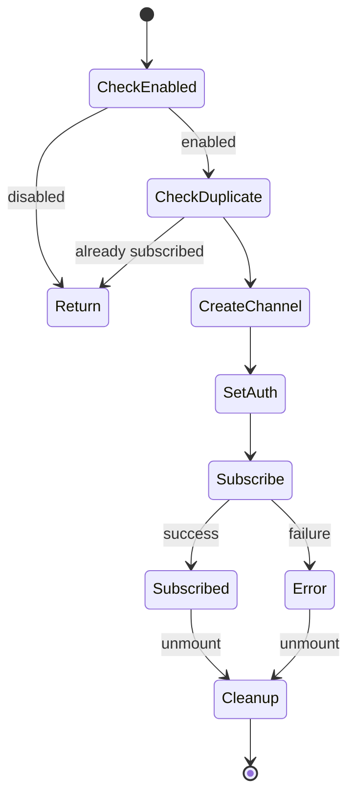
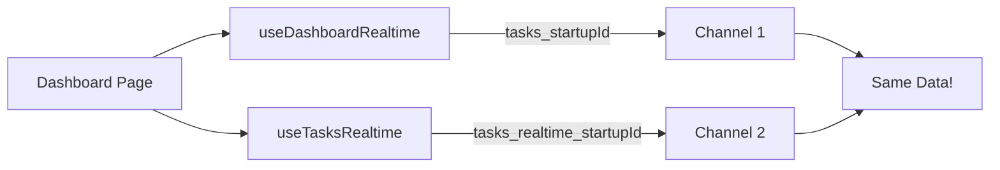
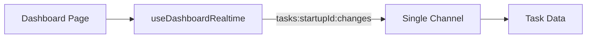

# Realtime Implementation Tasks

> Detailed breakdown of each implementation task with acceptance criteria

---

## Task 1: Update Supabase Client Config

**Priority:** 🟢 Low Risk  
**File:** `src/integrations/supabase/client.ts`  
**Effort:** 5 minutes

### Objective
Add realtime configuration for better debugging and reconnection handling.

### Changes Required
```typescript
export const supabase = createClient<Database>(
  SUPABASE_URL,
  SUPABASE_PUBLISHABLE_KEY,
  {
    auth: {
      storage: localStorage,
      persistSession: true,
      autoRefreshToken: true,
    },
    realtime: {
      params: {
        log_level: import.meta.env.DEV ? 'info' : 'warn',
      }
    }
  }
);
```

### Acceptance Criteria
- [ ] `log_level: 'info'` in development mode
- [ ] `log_level: 'warn'` in production
- [ ] Console shows realtime connection events in dev

---

## Task 2: Create Shared Realtime Hook

**Priority:** 🟢 Low Risk  
**File:** `src/hooks/realtime/useRealtimeChannel.ts` (NEW)  
**Effort:** 15 minutes

### Objective
Create a reusable hook that implements the correct pattern for private channels.

### Pattern Diagram



### Implementation

```typescript
import { useEffect, useRef, useCallback } from 'react';
import { supabase } from '@/integrations/supabase/client';
import { RealtimeChannel } from '@supabase/supabase-js';

interface UseRealtimeChannelOptions {
  topic: string;
  onBroadcast?: Record<string, (payload: unknown) => void>;
  enabled?: boolean;
}

export function useRealtimeChannel({ 
  topic, 
  onBroadcast, 
  enabled = true 
}: UseRealtimeChannelOptions) {
  const channelRef = useRef<RealtimeChannel | null>(null);
  const isSubscribedRef = useRef(false);

  const subscribe = useCallback(async () => {
    // Prevent duplicate subscriptions
    if (isSubscribedRef.current || channelRef.current?.state === 'subscribed') {
      return;
    }

    // Create channel with private: true for RLS authorization
    const channel = supabase.channel(topic, {
      config: {
        broadcast: { self: true, ack: true },
        private: true
      }
    });

    channelRef.current = channel;

    // Register broadcast handlers
    if (onBroadcast) {
      Object.entries(onBroadcast).forEach(([event, handler]) => {
        channel.on('broadcast', { event }, ({ payload }) => handler(payload));
      });
    }

    // Set auth before subscribing (required for private channels)
    await supabase.realtime.setAuth();

    // Subscribe
    channel.subscribe((status) => {
      if (status === 'SUBSCRIBED') {
        isSubscribedRef.current = true;
        console.log(`[Realtime] Subscribed to ${topic}`);
      } else if (status === 'CHANNEL_ERROR') {
        console.error(`[Realtime] Error on ${topic}`);
        isSubscribedRef.current = false;
      }
    });
  }, [topic, onBroadcast]);

  useEffect(() => {
    if (!enabled || !topic) return;

    subscribe();

    return () => {
      if (channelRef.current) {
        console.log(`[Realtime] Unsubscribing from ${topic}`);
        supabase.removeChannel(channelRef.current);
        channelRef.current = null;
        isSubscribedRef.current = false;
      }
    };
  }, [topic, enabled, subscribe]);

  return {
    channel: channelRef.current,
    isSubscribed: isSubscribedRef.current,
  };
}
```

### Acceptance Criteria
- [ ] Hook created in `src/hooks/realtime/useRealtimeChannel.ts`
- [ ] Supports `private: true` configuration
- [ ] Calls `setAuth()` before subscribing
- [ ] Prevents duplicate subscriptions
- [ ] Proper cleanup on unmount

---

## Task 3: Update useDashboardRealtime

**Priority:** 🟡 Medium  
**File:** `src/hooks/useRealtimeSubscription.ts`  
**Effort:** 30 minutes

### Current vs Target

| Aspect | Current | Target |
|--------|---------|--------|
| Channel type | `postgres_changes` | `broadcast` |
| Privacy | Public | Private (`private: true`) |
| Auth | None | `setAuth()` before subscribe |
| Duplicate check | None | Channel state ref |

### Broadcast Topic Pattern
```
{table}:{startupId}:changes
```

Examples:
- `tasks:abc-123:changes`
- `deals:abc-123:changes`
- `contacts:abc-123:changes`

### Migration Pattern

```typescript
// BEFORE (postgres_changes)
.on('postgres_changes', {
  event: '*',
  schema: 'public',
  table: 'tasks',
  filter: `startup_id=eq.${startupId}`
}, callback)

// AFTER (broadcast)
supabase.channel(`tasks:${startupId}:changes`, {
  config: { private: true }
})
.on('broadcast', { event: 'INSERT' }, (payload) => {
  const record = payload.new;
  // handle insert
})
.on('broadcast', { event: 'UPDATE' }, (payload) => {
  const record = payload.new;
  // handle update
})
.on('broadcast', { event: 'DELETE' }, (payload) => {
  const record = payload.old;
  // handle delete
})
```

### Acceptance Criteria
- [ ] Uses broadcast instead of postgres_changes
- [ ] Channel config includes `private: true`
- [ ] Calls `setAuth()` before subscribing
- [ ] Uses channelRef to prevent duplicates
- [ ] Handles INSERT/UPDATE/DELETE events
- [ ] Proper cleanup on unmount

---

## Task 4: Update usePitchDeckGeneration

**Priority:** 🔴 Critical  
**File:** `src/hooks/usePitchDeckGeneration.ts`  
**Effort:** 20 minutes

### Objective
Enable generation progress events with private channels.

### Channel Pattern
```
pitch_deck_generation:{deckId}
```

### Events
- `step_progress` - Generation step updates
- `step_complete` - Step finished
- `generation_complete` - Deck ready
- `generation_failed` - Error occurred

### Acceptance Criteria
- [ ] Uses `private: true`
- [ ] Calls `setAuth()` before subscribing
- [ ] Handles all generation events
- [ ] Proper cleanup

---

## Task 5: Deduplicate Task Subscriptions

**Priority:** 🟡 Medium  
**Files:** Multiple  
**Effort:** 20 minutes

### Problem


### Solution


### Acceptance Criteria
- [ ] Only one subscription per logical channel
- [ ] useTasksRealtime removed or uses shared hook
- [ ] No duplicate events in DevTools

---

## Tasks 6-10: Remaining Hooks

Apply the same pattern to:

| Task | Hook | Channel Pattern |
|------|------|-----------------|
| 6 | usePitchDeckRealtime | `pitchdeck:{deckId}:events` |
| 7 | useCRMRealtime | `crm:{startupId}:events` |
| 8 | useOnboardingRealtime | `onboarding:{sessionId}:events` |
| 9 | useEventsRealtime | `events:{startupId}:events` |
| 9 | useDocumentsRealtime | `documents:{startupId}:changes` |
| 9 | useInvestorsRealtime | `investors:{startupId}:events` |
| 9 | useChatRealtime | `chat:{sessionId}:events` |
| 10 | useCofounderPresence | `room:{roomId}:presence` |

### Common Pattern for All

```typescript
const channelRef = useRef<RealtimeChannel | null>(null);

useEffect(() => {
  if (!id) return;
  
  // Prevent duplicates
  if (channelRef.current?.state === 'subscribed') return;
  
  const channel = supabase.channel(`topic:${id}:events`, {
    config: { private: true }
  });
  
  channelRef.current = channel;
  
  // Set auth before subscribing
  supabase.realtime.setAuth().then(() => {
    channel.subscribe((status) => {
      if (status === 'SUBSCRIBED') {
        console.log('[Hook] Subscribed');
      }
    });
  });
  
  return () => {
    if (channelRef.current) {
      supabase.removeChannel(channelRef.current);
      channelRef.current = null;
    }
  };
}, [id]);
```
