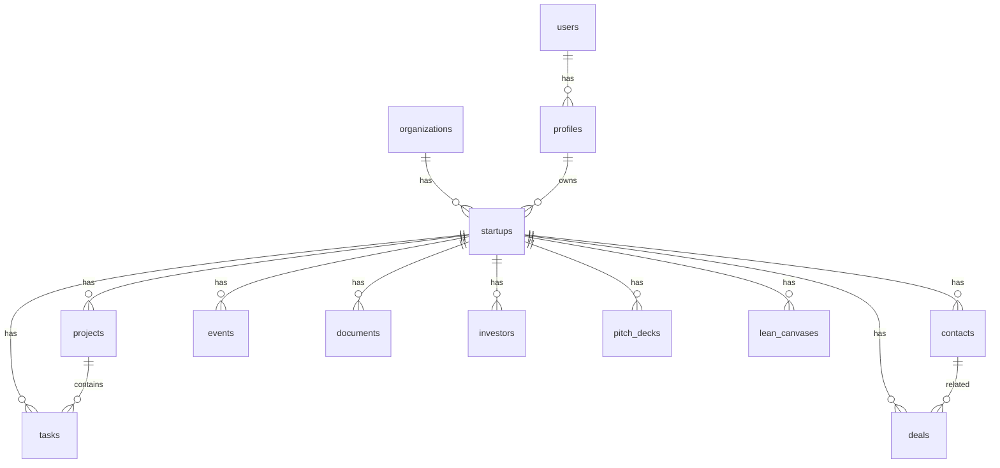

# Supabase Schema Reference

> Database schema, triggers, and RLS policies for realtime implementation

---

## Schema Overview



---

## Core Tables with Realtime

### Tasks
```sql
CREATE TABLE public.tasks (
  id UUID PRIMARY KEY DEFAULT gen_random_uuid(),
  startup_id UUID NOT NULL REFERENCES startups(id),
  project_id UUID REFERENCES projects(id),
  title TEXT NOT NULL,
  description TEXT,
  status TEXT DEFAULT 'pending',
  priority TEXT DEFAULT 'medium',
  due_at TIMESTAMPTZ,
  created_at TIMESTAMPTZ DEFAULT now(),
  updated_at TIMESTAMPTZ DEFAULT now()
);

-- Broadcast trigger
CREATE TRIGGER broadcast_tasks_changes
  AFTER INSERT OR UPDATE OR DELETE ON public.tasks
  FOR EACH ROW EXECUTE FUNCTION broadcast_table_changes();
```

### Deals
```sql
CREATE TABLE public.deals (
  id UUID PRIMARY KEY DEFAULT gen_random_uuid(),
  startup_id UUID NOT NULL REFERENCES startups(id),
  contact_id UUID REFERENCES contacts(id),
  name TEXT NOT NULL,
  amount NUMERIC,
  stage TEXT DEFAULT 'lead',
  probability NUMERIC,
  expected_close DATE,
  created_at TIMESTAMPTZ DEFAULT now(),
  updated_at TIMESTAMPTZ DEFAULT now()
);

-- Broadcast trigger
CREATE TRIGGER broadcast_deals_changes
  AFTER INSERT OR UPDATE OR DELETE ON public.deals
  FOR EACH ROW EXECUTE FUNCTION broadcast_table_changes();
```

### Contacts
```sql
CREATE TABLE public.contacts (
  id UUID PRIMARY KEY DEFAULT gen_random_uuid(),
  startup_id UUID NOT NULL REFERENCES startups(id),
  name TEXT NOT NULL,
  email TEXT,
  phone TEXT,
  company TEXT,
  title TEXT,
  type TEXT,
  created_at TIMESTAMPTZ DEFAULT now(),
  updated_at TIMESTAMPTZ DEFAULT now()
);

-- Broadcast trigger
CREATE TRIGGER broadcast_contacts_changes
  AFTER INSERT OR UPDATE OR DELETE ON public.contacts
  FOR EACH ROW EXECUTE FUNCTION broadcast_table_changes();
```

---

## Broadcast Trigger Function

```sql
CREATE OR REPLACE FUNCTION broadcast_table_changes()
RETURNS TRIGGER
SECURITY DEFINER
LANGUAGE plpgsql
AS $$
DECLARE
  topic TEXT;
  startup_id_val UUID;
BEGIN
  -- Get startup_id from the record
  startup_id_val := COALESCE(NEW.startup_id, OLD.startup_id);
  
  -- Build topic: {table}:{startup_id}:changes
  topic := TG_TABLE_NAME || ':' || startup_id_val::text || ':changes';
  
  -- Broadcast the change
  PERFORM realtime.broadcast_changes(
    topic,
    TG_OP,        -- INSERT, UPDATE, DELETE
    TG_OP,        -- event name
    TG_TABLE_NAME,
    TG_TABLE_SCHEMA,
    NEW,
    OLD
  );
  
  RETURN COALESCE(NEW, OLD);
END;
$$;
```

---

## RLS Policies for Realtime

### realtime.messages SELECT Policy
```sql
CREATE POLICY "Users can receive broadcasts for their startup"
ON realtime.messages FOR SELECT
TO authenticated
USING (
  -- Allow startup-scoped channels
  (
    topic LIKE '%:changes' AND
    EXISTS (
      SELECT 1 FROM profiles p
      JOIN startups s ON s.org_id = p.org_id
      WHERE p.id = auth.uid()
        AND topic LIKE '%:' || s.id::text || ':%'
    )
  )
  OR
  -- Allow user-specific channels
  topic LIKE 'user:' || auth.uid()::text || ':%'
  OR
  -- Allow session-specific channels (onboarding, pitch deck generation)
  EXISTS (
    SELECT 1 FROM wizard_sessions ws
    WHERE ws.user_id = auth.uid()
      AND topic LIKE 'onboarding:' || ws.id::text || ':%'
  )
);
```

### realtime.messages INSERT Policy
```sql
CREATE POLICY "Users can send to their startup channels"
ON realtime.messages FOR INSERT
TO authenticated
WITH CHECK (
  -- Same logic as SELECT
  EXISTS (
    SELECT 1 FROM profiles p
    JOIN startups s ON s.org_id = p.org_id
    WHERE p.id = auth.uid()
      AND topic LIKE '%:' || s.id::text || ':%'
  )
);
```

---

## Edge Functions with Realtime

### Functions That Broadcast

| Function | Broadcasts To | Events |
|----------|---------------|--------|
| `task-agent` | `tasks:{startupId}:changes` | INSERT, UPDATE |
| `crm-agent` | `crm:{startupId}:events` | contact_enriched, deal_scored |
| `pitch-deck-agent` | `pitchdeck:{deckId}:events` | slide_completed, deck_ready |
| `onboarding-agent` | `onboarding:{sessionId}:events` | enrichment_*, readiness_* |
| `event-agent` | `events:{startupId}:events` | event_enriched |
| `investor-agent` | `investors:{startupId}:events` | investor_scored |

---

## Topic Naming Convention

```
{scope}:{entity_id}:{type}

Examples:
├── tasks:abc-123:changes      (table changes)
├── deals:abc-123:changes      (table changes)
├── crm:abc-123:events         (agent events)
├── pitchdeck:xyz-789:events   (generation events)
├── onboarding:sess-456:events (wizard events)
└── user:uid-999:notifications (user-specific)
```

---

## Index Requirements for RLS

```sql
-- For efficient RLS policy checks
CREATE INDEX idx_profiles_org ON profiles(org_id, id);
CREATE INDEX idx_startups_org ON startups(org_id);
CREATE INDEX idx_tasks_startup ON tasks(startup_id);
CREATE INDEX idx_deals_startup ON deals(startup_id);
CREATE INDEX idx_contacts_startup ON contacts(startup_id);
CREATE INDEX idx_wizard_sessions_user ON wizard_sessions(user_id);
```
