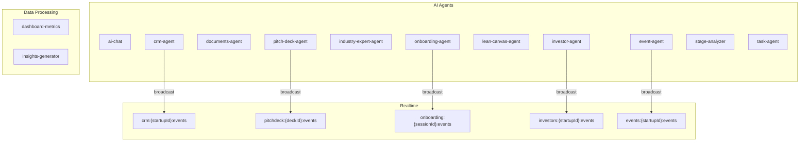

# Edge Functions Reference

> Overview of Supabase Edge Functions and their realtime integration

---

## Deployed Functions



---

## Function Details

### onboarding-agent
**Path:** `supabase/functions/onboarding-agent/`

**Purpose:** Handles onboarding wizard steps, URL enrichment, context analysis

**Realtime Events:**
- `enrichment_url_completed` - Website parsed
- `enrichment_context_completed` - AI context extracted
- `enrichment_founder_completed` - Founder profiles enriched
- `readiness_score_updated` - Overall score recalculated

**Channel:** `onboarding:{sessionId}:events`

---

### pitch-deck-agent
**Path:** `supabase/functions/pitch-deck-agent/`

**Purpose:** Generates pitch deck slides using AI

**Realtime Events:**
- `step_progress` - Current step progress
- `step_complete` - Step finished
- `slide_completed` - Individual slide ready
- `deck_ready` - All slides complete
- `generation_failed` - Error occurred

**Channel:** `pitchdeck:{deckId}:events`

---

### crm-agent
**Path:** `supabase/functions/crm-agent/`

**Purpose:** Contact enrichment, deal scoring

**Realtime Events:**
- `contact_enriched` - Contact data enriched
- `deal_scored` - Deal AI score updated
- `pipeline_suggestion` - AI recommendation

**Channel:** `crm:{startupId}:events`

---

### investor-agent
**Path:** `supabase/functions/investor-agent/`

**Purpose:** Investor matching and fit scoring

**Realtime Events:**
- `investor_scored` - Fit score calculated
- `match_found` - New investor match

**Channel:** `investors:{startupId}:events`

---

### event-agent
**Path:** `supabase/functions/event-agent/`

**Purpose:** Event recommendations and enrichment

**Realtime Events:**
- `event_enriched` - Event details enriched
- `recommendation_generated` - New event recommendation

**Channel:** `events:{startupId}:events`

---

### task-agent
**Path:** `supabase/functions/task-agent/`

**Purpose:** AI-powered task creation and management

**Realtime:** Uses database triggers (not direct broadcast)

---

### ai-chat
**Path:** `supabase/functions/ai-chat/`

**Purpose:** General AI chat assistant

**Realtime Events:**
- `message_received` - New message
- `typing_indicator` - AI is generating

**Channel:** `chat:{sessionId}:events`

---

## Broadcasting from Edge Functions

### Pattern
```typescript
// Inside edge function
import { createClient } from 'https://esm.sh/@supabase/supabase-js@2'

const supabase = createClient(
  Deno.env.get('SUPABASE_URL')!,
  Deno.env.get('SUPABASE_SERVICE_ROLE_KEY')!
)

// Send realtime event
await supabase.channel(`topic:${id}:events`)
  .send({
    type: 'broadcast',
    event: 'event_name',
    payload: { data }
  })
```

### Using realtime.send (Database Function)
```sql
-- Called from trigger or edge function via RPC
SELECT realtime.send(
  'topic:id:events',  -- topic
  'event_name',       -- event
  '{"key": "value"}'::jsonb,  -- payload
  false               -- is_private (true for private channels)
);
```

---

## Function → Channel Mapping

| Function | Channel Pattern | Privacy |
|----------|-----------------|---------|
| onboarding-agent | `onboarding:{sessionId}:events` | Private |
| pitch-deck-agent | `pitchdeck:{deckId}:events` | Private |
| pitch-deck-agent | `pitch_deck_generation:{deckId}` | Private |
| crm-agent | `crm:{startupId}:events` | Private |
| investor-agent | `investors:{startupId}:events` | Private |
| event-agent | `events:{startupId}:events` | Private |
| ai-chat | `chat:{sessionId}:events` | Private |

---

## Testing Edge Functions

### Using curl
```bash
# Test onboarding-agent
curl -X POST \
  'https://yvyesmiczbjqwbqtlidy.supabase.co/functions/v1/onboarding-agent' \
  -H 'Authorization: Bearer YOUR_JWT' \
  -H 'Content-Type: application/json' \
  -d '{"action": "analyze_url", "session_id": "xxx", "url": "https://example.com"}'
```

### Checking Logs
```sql
-- View recent edge function logs
SELECT * FROM supabase_functions.logs
ORDER BY created_at DESC
LIMIT 50;
```
