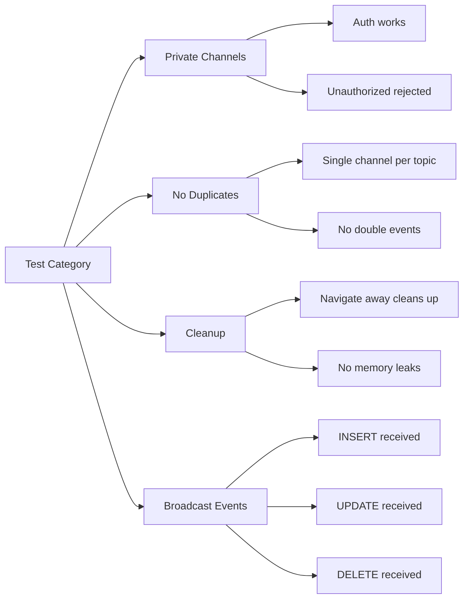

# Testing Checklist

> Verification steps for Supabase Realtime implementation

---

## Pre-Implementation Checks

- [ ] Backend triggers are deployed (check `broadcast_*_changes` triggers)
- [ ] RLS policies on `realtime.messages` are in place
- [ ] Edge functions are deployed and accessible
- [ ] Supabase client version is 2.x or higher

---

## Testing Matrix



---

## Test Cases by Feature

### 1. Private Channel Authentication

| Test | Steps | Expected | Status |
|------|-------|----------|--------|
| Authenticated user subscribes | Login → Open dashboard | Console: `[Realtime] Subscribed` | ⏳ |
| Unauthenticated rejected | Logout → Try subscribe | Channel error or no events | ⏳ |
| Cross-org isolation | Login as Org A → Check Org B events | No events from Org B | ⏳ |

### 2. No Duplicate Subscriptions

| Test | Steps | Expected | Status |
|------|-------|----------|--------|
| Single channel per page | Open dashboard | DevTools shows 1 channel per topic | ⏳ |
| Navigate and return | Dashboard → Tasks → Dashboard | Same single channel, no duplicates | ⏳ |
| Fast navigation | Rapidly switch pages | No console errors, proper cleanup | ⏳ |

### 3. Task Realtime

| Test | Steps | Expected | Status |
|------|-------|----------|--------|
| Task created | Create task in another tab | Task appears in list | ⏳ |
| Task updated | Update task title | Title updates live | ⏳ |
| Task deleted | Delete task | Task removed from list | ⏳ |
| Task status change | Move to "In Progress" | Status updates live | ⏳ |

### 4. Deal Realtime

| Test | Steps | Expected | Status |
|------|-------|----------|--------|
| Deal created | Create deal in CRM | Deal appears in pipeline | ⏳ |
| Deal stage change | Move deal to next stage | Pipeline updates live | ⏳ |
| Deal amount update | Change deal value | Amount updates | ⏳ |

### 5. Pitch Deck Generation

| Test | Steps | Expected | Status |
|------|-------|----------|--------|
| Generation progress | Start deck generation | Progress events received | ⏳ |
| Slide completed | Wait for slide | Slide appears in preview | ⏳ |
| Deck ready | Wait for completion | Redirect or ready banner | ⏳ |
| Generation failed | Trigger error | Error message displayed | ⏳ |

### 6. Onboarding Realtime

| Test | Steps | Expected | Status |
|------|-------|----------|--------|
| URL enrichment | Paste company URL | Enriched data appears | ⏳ |
| Readiness score | Complete step | Score updates | ⏳ |
| Co-founder presence | Two users on same session | Both see each other | ⏳ |

### 7. Cleanup

| Test | Steps | Expected | Status |
|------|-------|----------|--------|
| Navigate away | Open dashboard → Go to settings | Console: `[Realtime] Unsubscribing` | ⏳ |
| Logout | Logout while on realtime page | All channels cleaned up | ⏳ |
| Memory check | Navigate repeatedly | No memory growth | ⏳ |

---

## Browser DevTools Checks

### Network Tab
1. Open DevTools → Network → WS filter
2. Verify single WebSocket connection
3. Check frame messages for expected events

### Console
1. Enable all log levels
2. Look for:
   - `[Realtime] Subscribed to {topic}` on mount
   - `[Realtime] Unsubscribing from {topic}` on unmount
   - No `CHANNEL_ERROR` messages

### React DevTools
1. Check component state for `isSubscribed`
2. Verify `channelRef` is populated
3. Confirm cleanup on unmount

---

## Automated Test Commands

```bash
# Run realtime-specific tests
npm run test -- --grep "realtime"

# Check for duplicate channel names
grep -r "supabase.channel" src/hooks --include="*.ts" | \
  grep -oP "channel\(['\"]([^'\"]+)['\"]" | sort | uniq -d
```

---

## Rollback Verification

If issues arise, verify rollback works:

1. Remove `private: true` from channels
2. Remove `setAuth()` calls
3. Revert to `postgres_changes`
4. Test basic functionality restored

---

## Sign-Off

| Tester | Date | All Tests Pass | Notes |
|--------|------|----------------|-------|
| | | ⏳ | |
