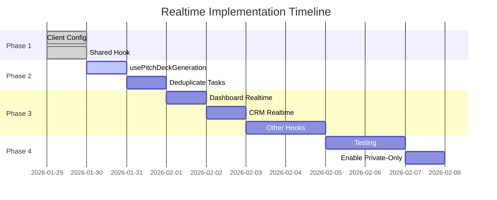

# Implementation Plan

> Step-by-step guide for implementing Supabase Realtime with private channels

---

## Phase Overview



---

## Completed ✅

### Task 1: Supabase Client Config
- [x] Added `realtime.params.log_level`
- [x] Dev: `'info'` / Prod: `'warn'`

### Task 2: Shared Realtime Hook
- [x] Created `useRealtimeChannel.ts`
- [x] Created `useTableChanges` helper
- [x] Exported from `src/hooks/realtime/index.ts`

---

## Next Steps 🔄

### Task 3: Update usePitchDeckGeneration

**File:** `src/hooks/usePitchDeckGeneration.ts`

```typescript
// Add at top
import { useRealtimeChannel } from '@/hooks/realtime';

// Replace existing realtime subscription with:
useRealtimeChannel({
  topic: `pitch_deck_generation:${deckId}`,
  onBroadcast: {
    step_progress: (payload) => handleStepProgress(payload),
    step_complete: (payload) => handleStepComplete(payload),
    generation_complete: (payload) => handleGenerationComplete(payload),
    generation_failed: (payload) => handleGenerationFailed(payload),
  },
  enabled: !!deckId && isGenerating,
});
```

### Task 4: Deduplicate Task Subscriptions

**Files to check:**
- `src/hooks/useRealtimeSubscription.ts` - has `useTasksRealtime`
- Look for duplicate task channels

**Action:** Consolidate into single pattern using `useTableChanges`:

```typescript
useTableChanges<Task>({
  table: 'tasks',
  scopeId: startupId,
  onInsert: (task) => queryClient.invalidateQueries(['tasks']),
  onUpdate: (task) => queryClient.invalidateQueries(['tasks']),
  onDelete: (task) => queryClient.invalidateQueries(['tasks']),
  enabled: !!startupId,
});
```

### Task 5: Update useDashboardRealtime

**File:** `src/hooks/useRealtimeSubscription.ts`

Replace `postgres_changes` with broadcast:

```typescript
// BEFORE
.on('postgres_changes', { event: '*', schema: 'public', table: 'tasks' }, callback)

// AFTER
useTableChanges<Task>({
  table: 'tasks',
  scopeId: startupId,
  onInsert: handleTaskInsert,
  onUpdate: handleTaskUpdate,
  onDelete: handleTaskDelete,
});
```

---

## Implementation Commands

### Step 1: Verify Current State
```bash
# Check for postgres_changes usage
grep -r "postgres_changes" src/hooks --include="*.ts" | wc -l

# Check current realtime hooks
ls -la src/hooks/realtime/
```

### Step 2: Test Shared Hook
```typescript
// Add to a test component
import { useRealtimeChannel } from '@/hooks/realtime';

const { isSubscribed, error } = useRealtimeChannel({
  topic: 'test:channel',
  onBroadcast: {
    test_event: (payload) => console.log('Received:', payload),
  },
});

console.log('Subscribed:', isSubscribed, 'Error:', error);
```

### Step 3: Migrate Hook by Hook
For each hook in `src/hooks/realtime/`:
1. Add `useRef` for channel state
2. Add `private: true` to config
3. Add `setAuth()` before subscribe
4. Replace `postgres_changes` with broadcast
5. Test the feature

---

## Verification Steps

After each migration:

1. **Check DevTools Console**
   - Look for `[Realtime] ✓ Subscribed to {topic}`
   - No duplicate subscription messages

2. **Check Network Tab**
   - Single WebSocket connection
   - Frames show expected events

3. **Test Feature**
   - Create/update/delete records
   - Verify real-time updates appear

4. **Test Cleanup**
   - Navigate away from page
   - Look for `[Realtime] Unsubscribing from {topic}`

---

## Rollback Plan

If issues occur:

```typescript
// 1. Remove private: true
supabase.channel(topic, {
  config: { /* private: true */ }
})

// 2. Remove setAuth() calls

// 3. Revert to postgres_changes if needed
.on('postgres_changes', {
  event: '*',
  schema: 'public',
  table: 'tasks',
  filter: `startup_id=eq.${startupId}`
}, callback)
```

---

## Success Criteria

- [ ] All hooks use private channels
- [ ] No duplicate subscriptions in DevTools
- [ ] All features work with real-time updates
- [ ] Clean console (no errors)
- [ ] Proper cleanup on navigation
- [ ] Ready for private-only mode in Supabase dashboard
