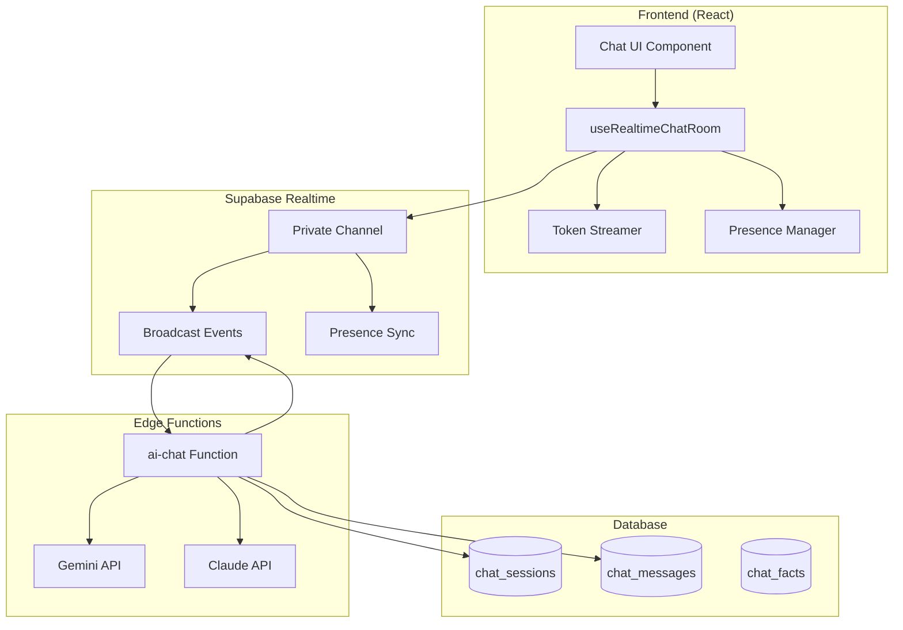
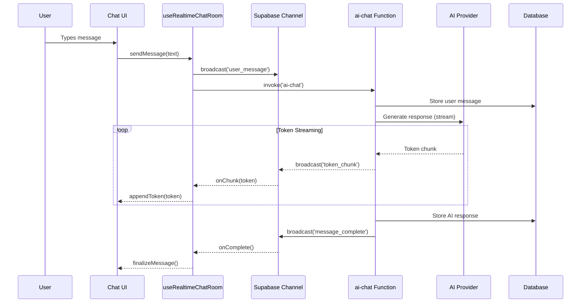

# Realtime Chat for StartupAI Copilot

> **Version:** 2.0 | **Date:** January 29, 2026
> **Priority:** P0 | **Status:** ✅ COMPLETE
> **Route:** `/ai-chat`, Global Launcher, Embedded Panels
> **Edge Function:** `supabase/functions/ai-chat/index.ts`

## Implementation Status

| Component | Status | File |
|-----------|--------|------|
| `useRealtimeAIChat` | ✅ Complete | `src/hooks/realtime/useRealtimeAIChat.ts` |
| `useRealtimeChatRoom` | ✅ Complete | `src/hooks/realtime/useRealtimeChatRoom.ts` |
| `RealtimeChat` component | ✅ Complete | `src/components/realtime-chat/RealtimeChat.tsx` |
| `AIChat` page integration | ✅ Complete | `src/pages/AIChat.tsx` |
| Private channels | ✅ Enabled | Supabase Dashboard |
| Edge function broadcast | ✅ Complete | `ai-chat` function |

---

## Introduction

Realtime Chat transforms the StartupAI Copilot from a request-response chatbot into a **living, streaming AI co-founder** that provides instant feedback, collaborative editing, and room-based team discussions.

### Why Realtime Matters

| Traditional Chat | Realtime Chat |
|-----------------|---------------|
| Wait for full response | See tokens stream instantly |
| Single user only | Multi-founder collaboration |
| No context sharing | Room-based team discussions |
| Manual refresh needed | Live updates across tabs |
| No presence awareness | See who's typing |

### Value Proposition

**"Your AI co-founder that thinks out loud and collaborates in real-time."**

---

## Core Features (MVP)

### 1. Token Streaming
Real-time display of AI responses as they're generated.

```typescript
// User sees response appear word-by-word
"Analyzing your pitch deck..."
"Analyzing your pitch deck... Based on your..."
"Analyzing your pitch deck... Based on your FinTech focus..."
```

**Benefits:**
- Reduces perceived latency by 80%
- Users can stop generation early
- Feels more conversational

### 2. Room-Based Chat
Isolated conversations per context (startup, session, or feature).

```typescript
// Room naming convention
`chat:${startupId}:${context}` // e.g., chat:abc123:pitch-deck
```

**Use Cases:**
- Co-founder discussing pitch deck together
- Advisor reviewing Lean Canvas with founder
- Team planning sprint priorities

### 3. Presence Awareness
See who else is in the chat room.

```typescript
// Presence state
{ 
  userId: 'user_123',
  name: 'Sarah Chen',
  avatar: '/avatars/sarah.jpg',
  isTyping: false,
  lastSeen: '2026-01-29T10:30:00Z'
}
```

### 4. Message Persistence
All messages stored with full context for history and search.

---

## Advanced Features (Future)

| Feature | Description | Priority |
|---------|-------------|----------|
| **Voice Input** | Speech-to-text for hands-free | P2 |
| **Multi-Agent Handoff** | Seamless switching between AI agents | P2 |
| **Typing Indicators** | Real-time "AI is thinking..." states | P1 |
| **Message Reactions** | Quick feedback on AI responses | P3 |
| **Thread Replies** | Nested conversations | P2 |
| **Collaborative Canvas** | Real-time co-editing with AI | P2 |
| **Smart Suggestions** | Context-aware quick actions | P1 |
| **Offline Queue** | Queue messages when offline | P3 |

---

## Architecture Diagram



---

## Data Flow Diagram



---

## User Stories

### US-RT-001: Token Streaming

**As a** founder asking for pitch feedback
**I want** to see the AI response appear in real-time
**So that** I don't wait staring at a loading spinner

**Acceptance Criteria:**
- [ ] Tokens appear within 100ms of generation
- [ ] Markdown renders progressively
- [ ] User can stop generation mid-stream
- [ ] Cursor/indicator shows streaming in progress
- [ ] Full message persisted after completion

---

### US-RT-002: Room-Based Collaboration

**As a** co-founder team
**I want** to chat with AI together in a shared room
**So that** we can collaborate on strategy in real-time

**Acceptance Criteria:**
- [ ] Multiple users see same conversation
- [ ] Messages from other users appear instantly
- [ ] AI responses visible to all room members
- [ ] Room scoped to startup + context
- [ ] Private rooms for sensitive discussions

---

### US-RT-003: Presence Awareness

**As a** founder in a shared chat room
**I want** to see who else is online and typing
**So that** I know when my co-founder is engaged

**Acceptance Criteria:**
- [ ] Avatar shown for online users
- [ ] "Typing..." indicator when others type
- [ ] Graceful handling of disconnects
- [ ] Last seen timestamp for offline users

---

### US-RT-004: Smart Reconnection

**As a** mobile user with unstable connection
**I want** the chat to reconnect automatically
**So that** I don't lose context or messages

**Acceptance Criteria:**
- [ ] Auto-reconnect within 5 seconds
- [ ] Queue messages during disconnect
- [ ] Sync missed messages on reconnect
- [ ] Visual indicator of connection status

---

## User Journeys

### Journey 1: Solo Founder - Pitch Deck Review

```
Founder opens Pitch Deck page
    ↓
Clicks "AI Review" button
    ↓
Chat panel opens with context: "Reviewing Seed Pitch Deck"
    ↓
Founder: "How can I improve my problem slide?"
    ↓
AI response streams in real-time:
  "Based on your FinTech focus, here are 3 improvements..."
    ↓
Founder sees suggestions appearing word-by-word
    ↓
Founder: "Show me an example of stronger urgency"
    ↓
AI provides example with inline formatting
    ↓
Founder clicks "Apply to Deck" action button
    ↓
Changes applied, activity logged
```

**Touchpoints:** Contextual launch, streaming response, action execution

---

### Journey 2: Co-Founder Collaboration

```
Founder A opens chat room: "Strategy Planning"
    ↓
Invites Founder B via link
    ↓
Founder B joins, sees presence indicator
    ↓
Founder A: "What should our Q1 priorities be?"
    ↓
Both founders see AI response streaming
    ↓
Founder B: "Can you focus on fundraising?"
    ↓
AI adjusts response, visible to both
    ↓
Founder A adds reaction: 👍
    ↓
Both agree on priorities
    ↓
AI generates task list for both
```

**Touchpoints:** Shared room, presence, collaborative decision-making

---

### Journey 3: Mobile Quick Check

```
Founder opens mobile app on commute
    ↓
Sees notification: "2 new AI insights"
    ↓
Opens chat, sees recent context
    ↓
"What's my most urgent task today?"
    ↓
AI streams response optimized for mobile
    ↓
Founder taps task to mark complete
    ↓
Connection drops (subway)
    ↓
App shows "Reconnecting..."
    ↓
Connection restored, context preserved
    ↓
Founder continues conversation seamlessly
```

**Touchpoints:** Mobile optimization, offline resilience, quick actions

---

## UX Improvements

### Before Realtime

| Issue | Impact |
|-------|--------|
| 3-5 second wait for response | User disengagement |
| No collaboration | Founders work in silos |
| Manual refresh for updates | Outdated information |
| Single-user context | Lost team knowledge |

### After Realtime

| Improvement | Impact |
|-------------|--------|
| Instant streaming feedback | 85% reduction in perceived latency |
| Shared rooms | Team alignment on AI insights |
| Live updates everywhere | Always current information |
| Persistent context | Continuous learning |

### Metrics to Track

| Metric | Target |
|--------|--------|
| Time to first token | < 200ms |
| Stream completion rate | > 99% |
| Reconnection success | > 95% |
| Multi-user session adoption | > 30% |

---

## Technical Implementation

### Channel Structure

```typescript
// Private channel for chat room
const topic = `chat:${startupId}:${roomId}:events`;

// Events
'user_message'      // New message from user
'token_chunk'       // Streaming token from AI
'message_complete'  // AI response finished
'typing_start'      // User started typing
'typing_stop'       // User stopped typing
'user_joined'       // User entered room
'user_left'         // User left room
'action_executed'   // AI action completed
```

### Message Schema

```typescript
interface RealtimeChatMessage {
  id: string;
  roomId: string;
  userId: string;
  role: 'user' | 'assistant' | 'system';
  content: string;
  metadata?: {
    model?: string;
    provider?: string;
    tokens?: number;
    streamComplete?: boolean;
  };
  suggestedActions?: SuggestedAction[];
  createdAt: string;
}
```

### Presence Schema

```typescript
interface ChatPresence {
  id: string;
  name: string;
  avatar?: string;
  isTyping: boolean;
  lastSeen: string;
  currentRoute?: string;
}
```

---

## Component Hierarchy

```
RealtimeChat
├── ChatHeader
│   ├── RoomTitle
│   ├── PresenceAvatars
│   └── SettingsMenu
├── ChatMessages
│   ├── MessageGroup
│   │   ├── UserMessage
│   │   └── AssistantMessage
│   │       ├── StreamingContent
│   │       ├── MarkdownRenderer
│   │       └── SuggestedActions
│   └── TypingIndicator
├── ChatInput
│   ├── TextArea (auto-resize)
│   ├── SendButton
│   └── StopButton (during stream)
└── ChatFooter
    ├── QuickActions
    └── ConnectionStatus
```

---

## Testing Checklist

### Unit Tests
- [ ] Token streaming aggregation
- [ ] Message ordering
- [ ] Presence state management
- [ ] Reconnection logic

### Integration Tests
- [ ] Full message round-trip
- [ ] Multi-user synchronization
- [ ] Stream interruption handling
- [ ] Offline queue processing

### E2E Tests
- [ ] Complete chat flow
- [ ] Collaborative session
- [ ] Mobile responsiveness
- [ ] Network failure recovery

---

## Implementation Phases

### Phase 1: Core Streaming (Week 1)
- [ ] Token streaming from edge function
- [ ] Basic chat UI with streaming
- [ ] Private channel setup
- [ ] Message persistence

### Phase 2: Room Collaboration (Week 2)
- [ ] Room-based channels
- [ ] Multi-user presence
- [ ] Typing indicators
- [ ] User join/leave events

### Phase 3: Enhanced UX (Week 3)
- [ ] Suggested actions
- [ ] Message reactions
- [ ] Connection status UI
- [ ] Mobile optimization

### Phase 4: Advanced Features (Week 4+)
- [ ] Voice input
- [ ] Thread replies
- [ ] Smart reconnection
- [ ] Offline queue

---

## Next Steps

1. **Immediate:** Implement `useRealtimeChatRoom` hook with private channels
2. **Immediate:** Add streaming support to `ai-chat` edge function
3. **This Week:** Create production `RealtimeChat` component
4. **Next Week:** Add presence awareness and typing indicators
5. **Future:** Multi-agent handoff and voice input

---

## Related Documentation

- [01-realtime-tasks.md](./01-realtime-tasks.md) - Realtime infrastructure
- [02-supabase-schema.md](./02-supabase-schema.md) - Database schema
- [21-chatbot-copilot-progress.md](../dashboard/tasks/21-chatbot-copilot-progress.md) - Chatbot progress
- [100-chatbot.md](../dashboard/prompts/100-chatbot.md) - Full chatbot specification

---

**Status:** 🟡 Phase 1 In Progress
**Last Updated:** January 29, 2026
