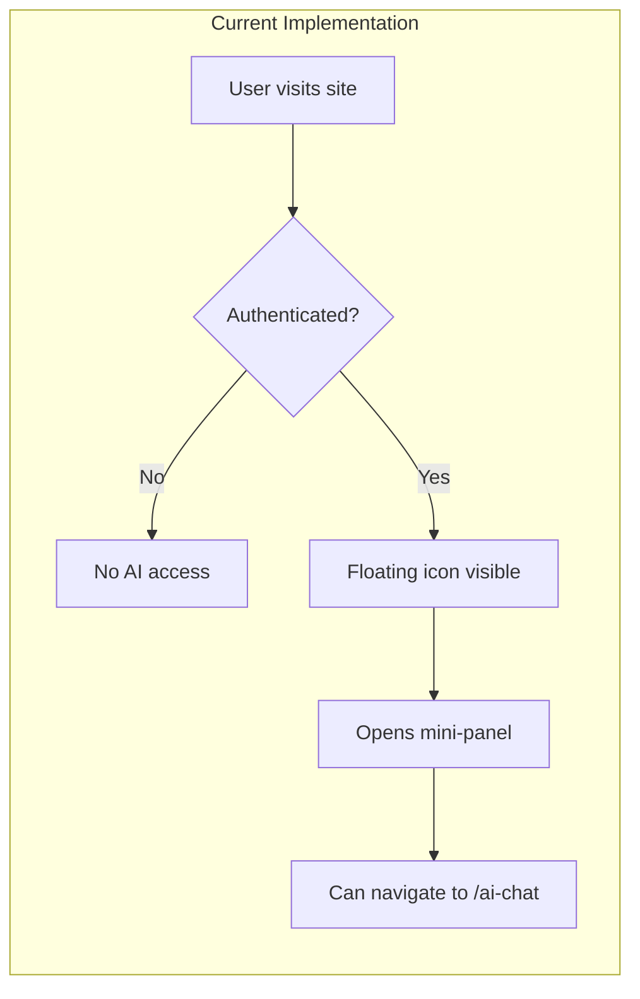
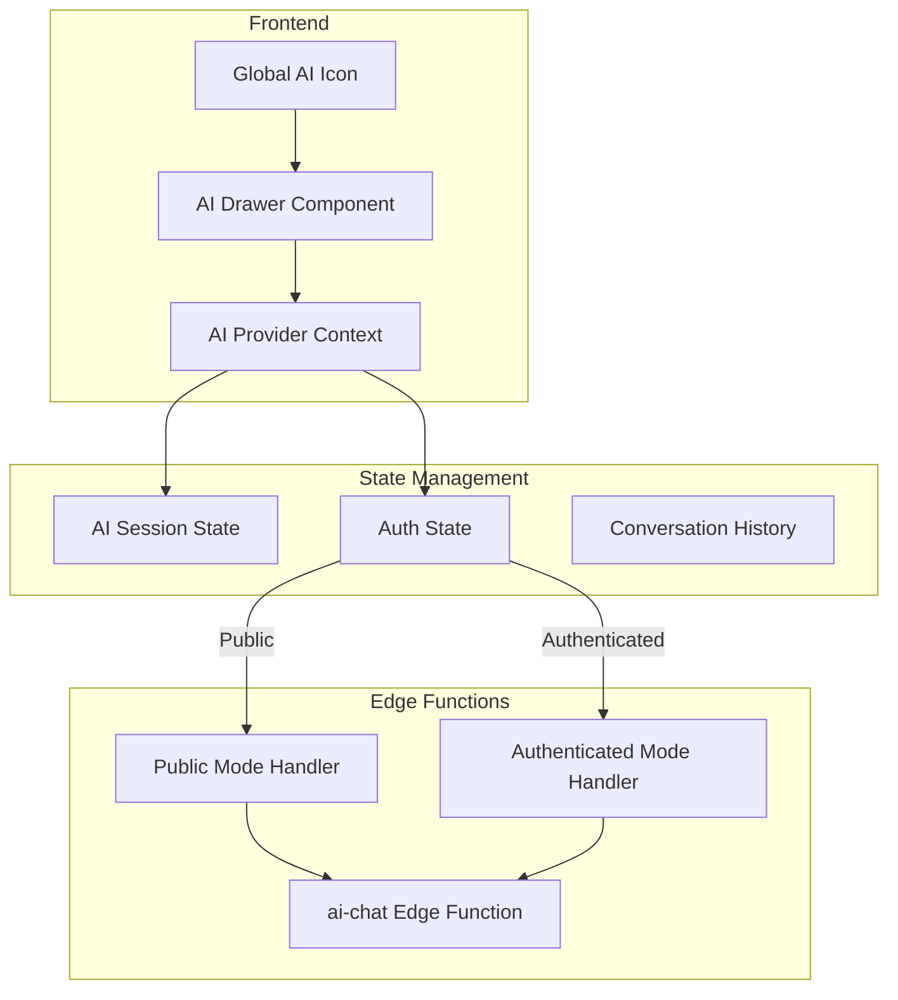

# Global AI Assistant — Implementation Plan

**Purpose:** Convert `/ai-chat` into a global floating AI assistant accessible from every screen, including the public marketing site.  
**Priority:** P0  
**Estimated Effort:** 16-24 hours  
**Last Updated:** 2026-01-30  
**Status:** ✅ IMPLEMENTED

---

## Table of Contents

1. [Executive Summary](#executive-summary)
2. [Current State Analysis](#current-state-analysis)
3. [Requirements Specification](#requirements-specification)
4. [Architecture Design](#architecture-design)
5. [Implementation Phases](#implementation-phases)
6. [File Changes](#file-changes)
7. [Verification Checklist](#verification-checklist)
8. [Related Features](#related-features)

---

## Executive Summary

### Goal

Transform the existing AI chat system from a dedicated page (`/ai-chat`) to an **always-present floating assistant** that:

1. **Public Mode** — Answers marketing questions for unauthenticated visitors
2. **Authenticated Mode** — Acts as a contextual startup advisor with full capabilities

### Key Deliverables

| Deliverable | Description |
|-------------|-------------|
| Global Floating Icon | Bottom-right corner on ALL pages (marketing + app) |
| Slide-in AI Drawer | Right-side drawer (desktop) / bottom sheet (mobile) |
| Public Mode | Feature FAQs, pricing, onboarding prompts |
| Authenticated Mode | Full contextual advisor with startup data |
| Single AI Provider | Centralized state management |
| Route Cleanup | Deprecate `/ai-chat` from navigation |

---

## Current State Analysis

### Existing Components

| Component | Location | Purpose | Status |
|-----------|----------|---------|--------|
| `ChatbotLauncher.tsx` | `src/components/chat/` | Floating icon + panel for authenticated users | ✅ Working |
| `AIChat.tsx` | `src/pages/` | Dedicated chat page with realtime | ✅ Working |
| `EmbeddedChatPanel.tsx` | `src/components/chat/` | Context-specific embedded chat | ✅ Working |
| `useAIChat.ts` | `src/hooks/` | Basic chat hook (non-streaming) | ✅ Working |
| `useRealtimeAIChat.ts` | `src/hooks/realtime/` | Realtime streaming chat | ✅ Working |
| `ai-chat` edge function | `supabase/functions/` | Backend AI processing | ✅ Working |

### Current Limitations

| Issue | Impact | Solution |
|-------|--------|----------|
| `ChatbotLauncher` only shows for authenticated users | Public visitors cannot access AI | Add public mode |
| No marketing site integration | AI not available on `/`, `/features`, `/pricing` | Add to `PublicLayout` |
| `/ai-chat` route in navigation | Confusing with floating assistant | Remove from nav, keep as debug |
| No capability gating | Same AI for public and private | Auth-based capability filtering |
| Duplicate chat logic | `useAIChat` vs `useRealtimeAIChat` | Consolidate to single provider |

### Current Flow



---

## Requirements Specification

### 1. Global Floating AI Icon

| Requirement | Details |
|-------------|---------|
| Position | Fixed bottom-right corner |
| Visibility | ALL pages including marketing |
| Z-index | Above all content (`z-[9999]`) |
| Animation | Pulse when new suggestion available |
| States | Idle, hover, active, loading |

### 2. Two AI Modes (CRITICAL)

#### A. Public Mode (Not Signed In)

**CAN DO:**
- Answer questions about StartupAI features
- Explain pricing and plans
- Describe what problems StartupAI solves
- Share founder success examples
- Guide to signup/login

**CANNOT DO:**
- Access dashboards or personalized data
- Perform planning, task generation, CRM actions
- Create pitch decks or documents
- View startup profile or metrics

**Gated Actions Response:**
```
"To [requested action], please sign up or sign in. 
I'm happy to tell you more about how StartupAI can help!"
```

#### B. Authenticated Mode (Signed In)

**Full Capabilities:**
- Access startup profile and stage
- Know current screen context (dashboard, tasks, CRM, pitch deck)
- Provide contextual recommendations
- Suggest actions based on completion %
- Generate drafts (with user confirmation)
- Explain insights and metrics

**Safety Rules:**
- ❌ Never write to database without explicit confirmation
- ❌ Never execute destructive actions automatically
- ✅ Always show preview before creating content
- ✅ Ask for confirmation on important actions

### 3. UX Behavior

| Behavior | Desktop | Mobile |
|----------|---------|--------|
| Trigger | Bottom-right floating icon | Same |
| Open | Right slide-in drawer | Bottom sheet |
| Persist | Stays open during navigation | Stays open |
| Close | Click X or press Escape | Swipe down or X |
| Mode Label | "Guest" / "Connected to [Startup]" | Same |
| Animation | Spring slide-in | Sheet slide-up |

### 4. Technical Architecture



### 5. Cleanup Tasks

| Task | Action |
|------|--------|
| `/ai-chat` route | Keep but remove from sidebar navigation |
| Duplicate hooks | Consolidate `useAIChat` + `useRealtimeAIChat` |
| Multiple launchers | Single `GlobalAIAssistant` component |
| Context providers | Centralize in `AIAssistantProvider` |

---

## Architecture Design

### Component Hierarchy

```
<App>
  <AIAssistantProvider>           <!-- NEW: Global state -->
    <Routes>
      <PublicLayout>               <!-- Marketing pages -->
        <GlobalAIAssistant />      <!-- MODIFIED: Works on all pages -->
      </PublicLayout>
      <DashboardLayout>            <!-- Authenticated pages -->
        <GlobalAIAssistant />      <!-- Same component -->
      </DashboardLayout>
    </Routes>
  </AIAssistantProvider>
</App>
```

### State Shape

```typescript
interface AIAssistantState {
  // UI State
  isOpen: boolean;
  isExpanded: boolean;
  
  // Mode
  mode: 'public' | 'authenticated';
  
  // Session
  sessionId: string | null;
  messages: AIMessage[];
  
  // Context
  currentRoute: string;
  startupContext: StartupContext | null;
  
  // Loading
  isLoading: boolean;
  isStreaming: boolean;
  error: string | null;
}

interface StartupContext {
  id: string;
  name: string;
  industry: string;
  stage: string;
  completionPercentage: number;
}
```

### Public Mode System Prompt

```
You are Atlas, StartupAI's friendly assistant on the public website.

CAPABILITIES:
- Explain StartupAI features and benefits
- Answer pricing and plan questions
- Share how founders use StartupAI (examples)
- Guide visitors to sign up or log in

RESTRICTIONS:
- You cannot access any user dashboards or data
- You cannot perform startup planning, tasks, or CRM actions
- You cannot create documents or pitch decks

When asked to perform restricted actions, respond:
"To [action], please sign up or sign in. I'm happy to explain how StartupAI can help with that!"

PERSONALITY:
- Friendly and helpful
- Concise responses (2-3 sentences when possible)
- Encourage exploration of features
- Highlight value propositions naturally
```

### Authenticated Mode System Prompt Enhancement

```
You are Atlas, a senior startup strategist helping {startup_name}.

CURRENT CONTEXT:
- Screen: {current_route}
- Stage: {startup_stage}
- Completion: {completion_percentage}%
- Items needing attention: {pending_items}

CAPABILITIES:
- Provide stage-specific guidance
- Explain metrics and insights on current screen
- Suggest next actions based on context
- Generate draft content (with confirmation)
- Answer strategic questions

RULES:
- Always consider the current screen context
- Offer specific, actionable advice
- Confirm before any database writes
- Reference actual startup data when relevant
```

---

## Implementation Phases

### Phase 1: Foundation (4-6 hours)

**Goal:** Create centralized AI state management

| # | Task | Files |
|---|------|-------|
| 1.1 | Create `AIAssistantProvider` context | `src/providers/AIAssistantProvider.tsx` |
| 1.2 | Create `useGlobalAIAssistant` hook | `src/hooks/useGlobalAIAssistant.ts` |
| 1.3 | Define public vs authenticated capabilities | `src/lib/ai-capabilities.ts` |
| 1.4 | Add capability gating middleware | Update `ai-chat` edge function |

**Verification:**
- [ ] Provider renders without errors
- [ ] Hook exposes correct state shape
- [ ] Capability check functions work

### Phase 2: Public Mode Backend (3-4 hours)

**Goal:** Enable AI for unauthenticated users

| # | Task | Files |
|---|------|-------|
| 2.1 | Create public AI endpoint handler | `supabase/functions/ai-chat/index.ts` |
| 2.2 | Add public system prompt | Edge function |
| 2.3 | Implement action gating | Edge function |
| 2.4 | Add anonymous session tracking | Edge function |

**Verification:**
- [ ] Public endpoint returns valid responses
- [ ] Gated actions return appropriate prompts
- [ ] No auth errors for anonymous users
- [ ] Sessions tracked correctly

### Phase 3: Global Component (4-5 hours)

**Goal:** Create unified floating assistant

| # | Task | Files |
|---|------|-------|
| 3.1 | Create `GlobalAIAssistant` component | `src/components/ai/GlobalAIAssistant.tsx` |
| 3.2 | Create `AIDrawer` (desktop) | `src/components/ai/AIDrawer.tsx` |
| 3.3 | Create `AIBottomSheet` (mobile) | `src/components/ai/AIBottomSheet.tsx` |
| 3.4 | Add mode indicator (Guest/Connected) | Within drawer |
| 3.5 | Add context header (screen, stage) | Within drawer |

**Verification:**
- [ ] Icon appears on all pages
- [ ] Drawer opens/closes smoothly
- [ ] Mode label updates based on auth
- [ ] Context shows current screen

### Phase 4: Integration (3-4 hours)

**Goal:** Wire up to all layouts

| # | Task | Files |
|---|------|-------|
| 4.1 | Add to `PublicLayout` | `src/components/layout/PublicLayout.tsx` |
| 4.2 | Update `DashboardLayout` | `src/components/layout/DashboardLayout.tsx` |
| 4.3 | Wrap app in `AIAssistantProvider` | `src/App.tsx` |
| 4.4 | Remove `/ai-chat` from sidebar | `src/components/layout/DashboardSidebar.tsx` |

**Verification:**
- [ ] Works on marketing pages (/, /features)
- [ ] Works on dashboard pages
- [ ] Persists during navigation
- [ ] Not visible on `/ai-chat` debug page

### Phase 5: Polish & Testing (2-3 hours)

**Goal:** Production readiness

| # | Task | Files |
|---|------|-------|
| 5.1 | Add loading/error states | Components |
| 5.2 | Add keyboard navigation | Components |
| 5.3 | Test public mode capability gating | Manual testing |
| 5.4 | Test authenticated mode context | Manual testing |
| 5.5 | Mobile responsive testing | Cross-device |

**Verification:**
- [ ] All error states handled gracefully
- [ ] Escape closes drawer
- [ ] Tab navigation works
- [ ] Mobile bottom sheet functions correctly

---

## File Changes

### New Files

| File | Purpose |
|------|---------|
| `src/providers/AIAssistantProvider.tsx` | Global AI state context |
| `src/hooks/useGlobalAIAssistant.ts` | Hook for AI assistant access |
| `src/lib/ai-capabilities.ts` | Capability definitions and checks |
| `src/components/ai/GlobalAIAssistant.tsx` | Main floating component |
| `src/components/ai/AIDrawer.tsx` | Desktop slide-in panel |
| `src/components/ai/AIBottomSheet.tsx` | Mobile bottom sheet |
| `src/components/ai/AIHeader.tsx` | Header with mode/context |
| `src/components/ai/AIMessageList.tsx` | Message display |
| `src/components/ai/AIInput.tsx` | Input with send button |
| `src/components/ai/AIQuickActions.tsx` | Contextual quick actions |

### Modified Files

| File | Changes |
|------|---------|
| `src/App.tsx` | Wrap with `AIAssistantProvider` |
| `src/components/layout/PublicLayout.tsx` | Add `GlobalAIAssistant` |
| `src/components/layout/DashboardLayout.tsx` | Replace `ChatbotLauncher` with `GlobalAIAssistant` |
| `src/components/layout/DashboardSidebar.tsx` | Remove AI Chat nav item |
| `supabase/functions/ai-chat/index.ts` | Add public mode handler |

### Deprecated (Keep for Debug)

| File | Action |
|------|--------|
| `src/pages/AIChat.tsx` | Keep route, remove from navigation |
| `src/components/chat/ChatbotLauncher.tsx` | Replace with `GlobalAIAssistant` |

---

## Verification Checklist

### Functional Tests

#### Public Mode
- [ ] Icon visible on `/` homepage
- [ ] Icon visible on `/features` page
- [ ] Icon visible on `/pricing` page
- [ ] Icon visible on `/login` page
- [ ] Drawer opens without auth errors
- [ ] Can ask about StartupAI features
- [ ] Can ask about pricing
- [ ] Gated actions show signup prompt
- [ ] "Sign Up" button in prompts works

#### Authenticated Mode
- [ ] Mode label shows "Connected to [Startup]"
- [ ] Context shows current screen
- [ ] Can access startup-specific insights
- [ ] Quick actions are contextual
- [ ] History persists during navigation
- [ ] Can generate content (with confirmation)

#### UX Tests
- [ ] Drawer persists across route changes
- [ ] Escape key closes drawer
- [ ] Mobile bottom sheet works
- [ ] Loading states display correctly
- [ ] Error states are user-friendly

#### Integration Tests
- [ ] No console errors on any page
- [ ] No layout shift on load
- [ ] No memory leaks from subscriptions
- [ ] Realtime connection stable

---

## Related Features

### Additional Implementation Tasks

The following features should be implemented after the Global AI Assistant:

#### 1. Notification System for Outreach Reminders

**Purpose:** Alert users when follow-up emails are due

| Task | Priority | Effort |
|------|----------|--------|
| Create `notifications` table | P1 | 2h |
| Create notification service | P1 | 3h |
| Add in-app notification bell | P1 | 2h |
| Connect to outreach sequences | P1 | 2h |
| Add email digest option | P2 | 3h |

#### 2. Calendar Sync for Investor Meetings

**Purpose:** Sync meetings with Google/Outlook calendars

| Task | Priority | Effort |
|------|----------|--------|
| Integrate Google Calendar OAuth | P1 | 4h |
| Create calendar sync edge function | P1 | 3h |
| Add "Add to Calendar" buttons | P1 | 2h |
| Implement bi-directional sync | P2 | 4h |
| Add Outlook support | P2 | 4h |

#### 3. Settings Page for AI Budget Limits

**Purpose:** Allow users to control AI spending

| Task | Priority | Effort |
|------|----------|--------|
| Add AI settings section to `/settings` | P1 | 2h |
| Create budget tracking hooks | P1 | 2h |
| Add usage display charts | P1 | 3h |
| Implement budget alerts | P1 | 2h |
| Add model preference settings | P2 | 2h |

---

## Success Metrics

| Metric | Target | Measurement |
|--------|--------|-------------|
| Public AI engagement | 30% of visitors interact | Analytics events |
| Signup conversion from AI | 10% improvement | A/B test |
| Authenticated AI sessions | 2x current usage | Session count |
| User satisfaction | 4.5+ stars | Feedback rating |
| Error rate | <1% | Error logs |

---

## Risk Assessment

| Risk | Likelihood | Impact | Mitigation |
|------|------------|--------|------------|
| AI costs increase | High | Medium | Budget limits, rate limiting |
| Public mode abuse | Medium | Medium | Rate limiting, CAPTCHA |
| Context confusion | Low | High | Clear mode indicators |
| Mobile performance | Medium | Medium | Optimize bundle, lazy load |

---

## Timeline

| Phase | Duration | Dependencies |
|-------|----------|--------------|
| Phase 1: Foundation | Day 1 | None |
| Phase 2: Backend | Day 1-2 | Phase 1 |
| Phase 3: Components | Day 2-3 | Phase 1 |
| Phase 4: Integration | Day 3 | Phase 2, 3 |
| Phase 5: Polish | Day 4 | Phase 4 |

**Total: 4-5 development days**

---

## Appendix: UI Reference

The reference image shows the target design:
- Header: "Atlas — Startup Strategist" with status indicator
- Context bar: Stage progress and items needing attention
- Messages: Clean chat bubbles with guidance labels
- Quick actions: Grid of contextual actions
- Input: Full-width with send button

Key design elements to match:
- Green accent color for AI branding
- Rounded card design
- Status indicators (Active in: Dashboard)
- Source citations where applicable

---

**Document Status:** Ready for Implementation  
**Next Action:** Begin Phase 1 — Foundation  
**Owner:** Frontend Team
