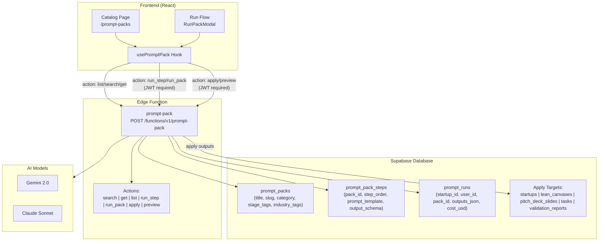
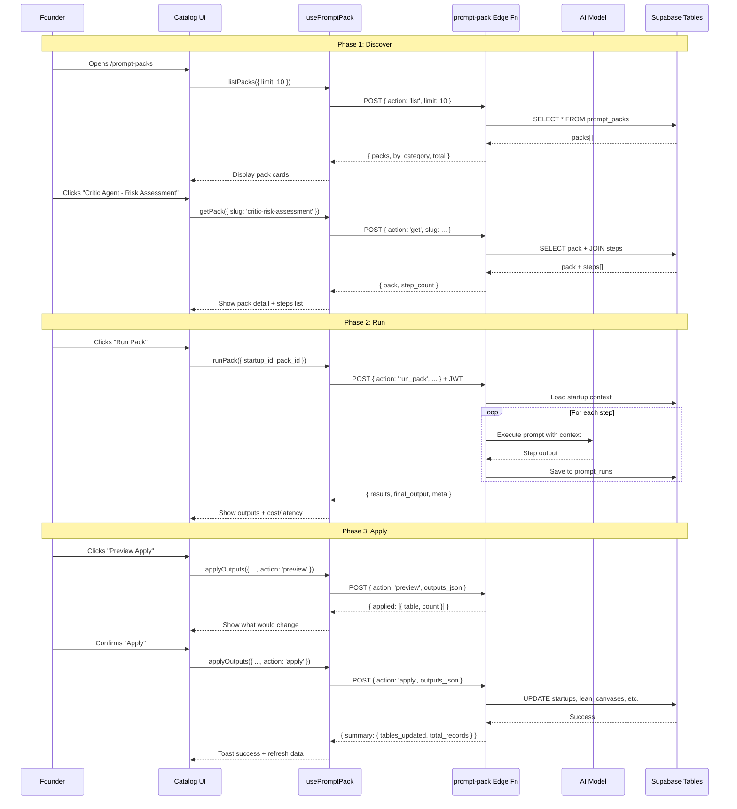
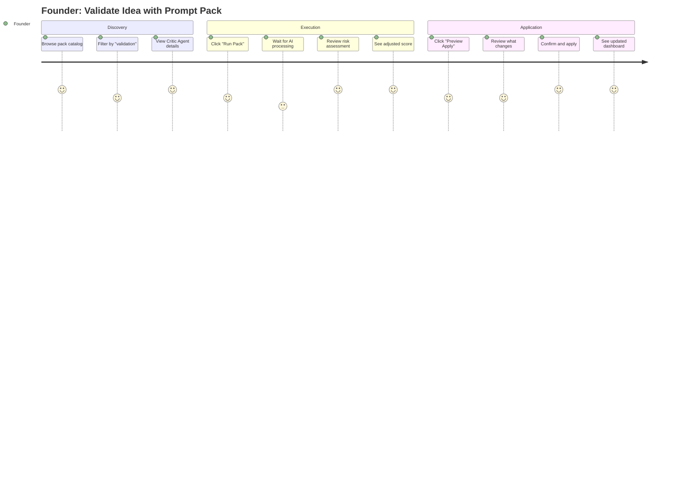

# Prompt Packs – Implementation Guide

> **Status:** ✅ PRODUCTION READY  
> **Last Updated:** 2026-01-29  
> **Priority:** P1 - Core Feature for AI-Powered Workflows

---

## Summary

Prompt Packs are reusable AI workflow templates that power validation, canvas generation, pitch refinement, and GTM planning. Users discover packs → run them with startup context → preview and apply outputs to their profile, canvas, slides, or tasks.

**Backend:** ✅ Complete – Edge function `prompt-pack` deployed  
**Frontend:** 🚧 Building – Hook, catalog, run, apply flows

---

## Architecture Diagram

---

## Data Flow Diagram

---

## User Stories

### Story 1: Founder Discovers Validation Packs

**As a** founder in the idea stage  
**I want to** browse prompt packs filtered by "validation" module  
**So that** I can find the best AI workflow to stress-test my idea

**Acceptance Criteria:**
- [ ] Catalog page loads packs without login (public catalog)
- [ ] Filter by category shows only validation packs
- [ ] Each card shows: title, description, industry tags, step count
- [ ] Click card shows detailed steps with purposes

---

### Story 2: Founder Runs Risk Assessment Pack

**As a** logged-in founder with a startup profile  
**I want to** run the "Critic Agent - Risk Assessment" pack  
**So that** I can identify blind spots and prepare for investor questions

**Acceptance Criteria:**
- [ ] Run button requires authentication
- [ ] Loading state shows during AI execution
- [ ] Results display: assumptions, risks, adjusted score, investor questions
- [ ] Cost and latency shown (e.g., "$0.02 • 8.5s")

---

### Story 3: Founder Applies Pack Outputs

**As a** founder who just ran a validation pack  
**I want to** preview then apply the outputs to my startup profile  
**So that** my validation score and risk data are saved without manual entry

**Acceptance Criteria:**
- [ ] Preview shows which tables will be updated (e.g., "startups: 1 record, validation_reports: 1 record")
- [ ] Apply button writes data and shows success summary
- [ ] Data is immediately visible in dashboard/profile

---

## User Journey Map

---

## Real-World Examples

### Example 1: SaaS Founder Validates B2B Idea

**Context:** Sarah has a B2B SaaS idea for HR automation. She's at pre-seed stage.

**Journey:**
1. Opens `/prompt-packs`, filters: category=validation, industry=saas, stage=pre-seed
2. Sees "Quick Validator" (60s assessment) and "Critic Agent" (deep dive)
3. Runs Quick Validator first → gets 72/100 score with top risks
4. Runs Critic Agent → gets detailed assumption testing, 15 investor questions
5. Previews apply → sees it will update `startups.traction_data`, create `critic_reviews` record
6. Applies → dashboard now shows risk matrix, prepared Q&A

**Outcome:** Sarah enters investor meetings prepared for tough questions.

---

### Example 2: Marketplace Founder Refines Lean Canvas

**Context:** Mike is building a two-sided marketplace. His canvas is incomplete.

**Journey:**
1. Opens `/prompt-packs`, filters: category=canvas
2. Finds "Canvas Completeness Analyzer" pack
3. Runs pack → AI identifies gaps in channels and key metrics
4. Gets suggested improvements with industry benchmarks
5. Applies → lean_canvases table updated with AI suggestions
6. Canvas now shows 85% completeness vs. 40% before

**Outcome:** Mike has a complete, benchmarked canvas for his pitch deck.

---

## Database Schema

### prompt_packs
| Column | Type | Description |
|--------|------|-------------|
| id | uuid | Primary key |
| title | text | Display name |
| slug | text | URL-friendly identifier |
| description | text | What the pack does |
| category | text | validation, canvas, pitch, gtm, etc. |
| stage_tags | text[] | idea, pre-seed, seed, series-a |
| industry_tags | text[] | saas, b2b, fintech, healthtech, etc. |
| version | integer | Pack version number |
| is_active | boolean | Whether pack is available |
| metadata | jsonb | { author, estimated_time_seconds, model } |

### prompt_pack_steps
| Column | Type | Description |
|--------|------|-------------|
| id | uuid | Primary key |
| pack_id | uuid | FK to prompt_packs |
| step_order | integer | Execution order (1, 2, 3...) |
| purpose | text | What this step does |
| prompt_template | text | Template with {{variables}} |
| input_schema | jsonb | Expected input shape |
| output_schema | jsonb | Required output shape |
| model_preference | text | gemini, claude-sonnet, etc. |
| temperature | float | AI temperature setting |

### prompt_runs
| Column | Type | Description |
|--------|------|-------------|
| id | uuid | Primary key |
| startup_id | uuid | FK to startups |
| user_id | uuid | FK to profiles |
| pack_id | uuid | FK to prompt_packs |
| step_id | uuid | FK to prompt_pack_steps (null for full pack) |
| inputs_json | jsonb | What was sent to AI |
| outputs_json | jsonb | What AI returned |
| model_used | text | Actual model used |
| tokens_input | integer | Input token count |
| tokens_output | integer | Output token count |
| cost_usd | numeric | Calculated cost |
| latency_ms | integer | Execution time |
| status | text | pending, completed, failed |

---

## API Reference

### Edge Function: `prompt-pack`

**Endpoint:** `POST /functions/v1/prompt-pack`

| Action | Auth | Body | Returns |
|--------|------|------|---------|
| `list` | No | `{ limit? }` | `{ packs, by_category, total }` |
| `search` | No | `{ module?, industry?, stage?, startup_id?, limit? }` | `{ pack, next_step, alternatives, meta }` |
| `get` | No | `{ pack_id? \| slug? }` | `{ pack, step_count }` |
| `run_step` | Yes | `{ startup_id, pack_id, step_id, context?, previous_outputs? }` | `{ success, outputs, tokens, cost_usd, latency_ms }` |
| `run_pack` | Yes | `{ startup_id, pack_id, context?, stop_on_error? }` | `{ results, final_output, meta }` |
| `preview` | Yes | `{ startup_id, outputs_json, apply_to? }` | `{ applied: [{ table, count }] }` |
| `apply` | Yes | `{ startup_id, outputs_json, apply_to? }` | `{ applied, summary }` |

---

## Implementation Plan

### Phase 1: Core Infrastructure ✅
- [x] Database tables: prompt_packs, prompt_pack_steps, prompt_runs
- [x] Edge function with all 7 actions
- [x] Seed data: 5+ validation packs with multi-step workflows
- [x] RLS policies for prompt_runs

### Phase 2: Frontend Hook ✅
- [x] Create `usePromptPack.ts` with all action methods
- [x] Handle auth for protected actions
- [x] Type definitions for all responses
- [x] Error handling and toast notifications

### Phase 3: Catalog UI ✅
- [x] `/prompt-packs` route with catalog page
- [x] PackCard component with tags, description, step count
- [x] Filter by category, industry, stage
- [x] Pack detail modal with steps list

### Phase 4: Run Flow ✅
- [x] RunPackModal with startup context
- [x] Loading states during AI execution
- [x] Results display with formatted outputs
- [x] Cost/latency metrics display

### Phase 5: Apply Flow ✅
- [x] Preview modal showing affected tables
- [x] Apply confirmation with success summary
- [x] Data refresh after apply

### Phase 6: Integration ✅
- [x] Sidebar navigation link added
- [ ] Dashboard "Suggested Packs" widget (optional enhancement)
- [ ] Validation page integration (optional enhancement)
- [ ] Canvas page integration (optional enhancement)

---

## Files to Create

| File | Purpose |
|------|---------|
| `src/hooks/usePromptPack.ts` | Hook for all prompt-pack actions |
| `src/pages/PromptPacks.tsx` | Catalog page at /prompt-packs |
| `src/components/prompt-pack/PackCard.tsx` | Individual pack card |
| `src/components/prompt-pack/PackDetailModal.tsx` | Pack detail with steps |
| `src/components/prompt-pack/RunPackModal.tsx` | Run flow with results |
| `src/components/prompt-pack/ApplyPreviewModal.tsx` | Preview and apply |
| `src/components/prompt-pack/index.ts` | Barrel exports |

---

## Testing Checklist

- [x] List packs without auth → returns packs ✅ (200 OK)
- [x] Search by category=validation → returns filtered results ✅ (200 OK)
- [x] Get pack by slug → returns pack with steps ✅ (200 OK)
- [ ] Run pack with valid startup_id → returns outputs (requires login)
- [ ] Run pack without auth → returns 401
- [ ] Preview apply → shows affected tables (no DB write)
- [ ] Apply outputs → writes to database
- [ ] Error handling for invalid pack_id
- [ ] Error handling for failed AI execution

---

## Quick Links

- [Realtime Tasks](./01-realtime-tasks.md)
- [Supabase Schema](./02-supabase-schema.md)
- [Edge Functions](./03-edge-functions.md)
- [Realtime Chat](./06-realtime-chat.md)
