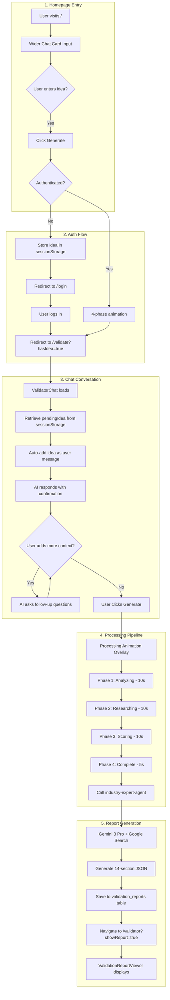
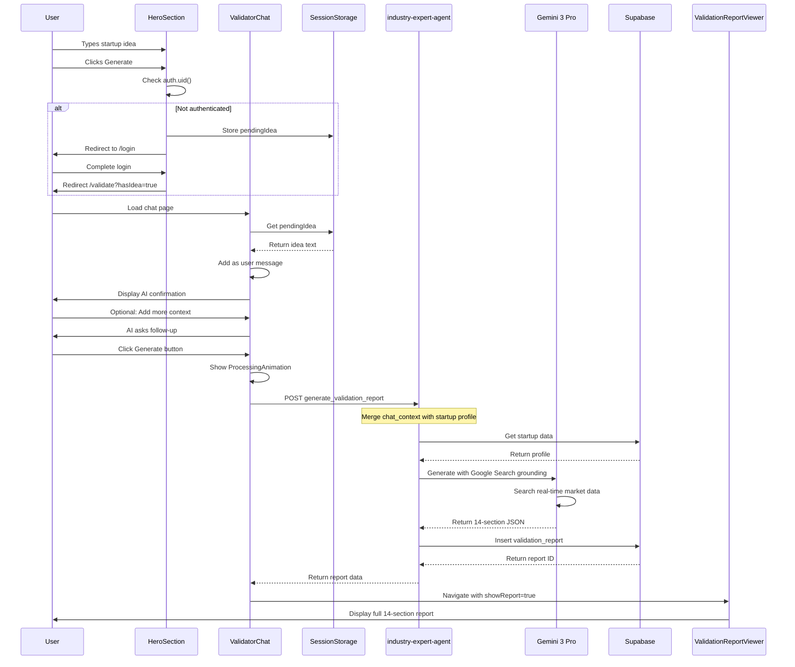

# 106-1 Validator Chat Flow Implementation

> Chat-to-Validation experience with 4-phase processing animation

---

## Description

Complete chat-based validator flow where users describe their startup idea in conversation, watch a 4-phase AI processing animation, then automatically navigate to a pre-filled 14-section validation report.

## Rationale

**Problem:** Traditional validation requires manual form filling and lacks engagement.
**Solution:** Conversational AI intake with real-time processing visualization.
**Impact:** 10x faster idea validation with higher user engagement and trust.

---

## User Stories

| As a... | I want to... | So that... |
|---------|--------------|------------|
| Founder | describe my idea conversationally | I don't need to fill complex forms |
| Founder | see AI analyzing in real-time | I trust the process and stay engaged |
| Founder | get immediate results | I can make decisions quickly |
| Advisor | receive structured reports | I can assess opportunities efficiently |

## Real-World Example

**Sarah's Journey:**
1. Visits homepage → Types in the wider chat card: "AI tool for small restaurants to predict inventory"
2. Clicks "Generate" → 4-phase animation plays (3-4 seconds)
3. If logged in → Redirects to `/validate?hasIdea=true`
4. Chat resumes → AI coach asks follow-up questions about customers
5. Clicks "Generate" → Processing animation overlay (30-60 seconds)
6. Lands on full report: 72/100, "CAUTION", TAM: $12B

---

## Success Criteria

- [x] Chat interface captures startup description (wider layout)
- [x] AI coach sends follow-up questions
- [x] 4-phase processing animation displays
- [x] Auto-navigation to validator report
- [x] Report sections populated from chat data
- [x] Mobile responsive design
- [x] Edge function handles chat context
- [x] Gemini 3 with Google Search grounding for real-time data

---

## Files Created/Modified

### New Components
- `src/components/validator/chat/ValidatorChat.tsx` - Main chat component (wider layout)
- `src/components/validator/chat/ValidatorChatInput.tsx` - Input with suggestions
- `src/components/validator/chat/ValidatorChatMessage.tsx` - Message bubbles
- `src/components/validator/chat/ValidatorProcessingAnimation.tsx` - 4-phase animation
- `src/components/validator/chat/index.ts` - Exports

### Modified Components
- `src/components/marketing/HeroSection.tsx` - Wider chat card, improved placeholder

### New Pages
- `src/pages/ValidateIdea.tsx` - Chat-based validation page (wider container)

### Modified Files
- `src/App.tsx` - Added `/validate` route
- `src/pages/Validator.tsx` - Added chat navigation, improved UX
- `supabase/functions/industry-expert-agent/index.ts` - Gemini 3 + Google Search grounding

---

## Complete Workflow Architecture



---

## Data Flow Sequence



---

## Agent Schema Mapping

| Chat Data Field | Edge Function Key | Startup Table Column | AI Report Section |
|-----------------|-------------------|---------------------|-------------------|
| `idea` | `chat_context.extracted_data.idea` | `problem` | Problem Analysis |
| `customer` | `chat_context.extracted_data.customer` | `customer_segments` | Market Size |
| `alternatives` | `chat_context.extracted_data.alternatives` | N/A | Competition |
| `differentiation` | `chat_context.extracted_data.differentiation` | `unique_value` | Solution Assessment |
| `validation` | `chat_context.extracted_data.validation` | N/A | Validation Status |
| Full transcript | `chat_context.idea_description` | `description` | Executive Summary |

---

## Gemini 3 Features Used

| Feature | Implementation | Purpose |
|---------|---------------|---------|
| `google_search` tool | `tools: [{ googleSearch: {} }]` | Real-time market data, competitor intel |
| Structured output | `responseMimeType: 'application/json'` | Guaranteed 14-section JSON format |
| System instruction | `systemInstruction.parts` | Industry-specific advisor persona |
| Safety settings | All thresholds `BLOCK_NONE` | Avoid false positives on business content |

---

## Edge Function Actions

### industry-expert-agent

| Action | Description | Gemini Model | Tools |
|--------|-------------|--------------|-------|
| `generate_validation_report` | Full 14-section report | gemini-3-pro-preview | Google Search |
| `get_validation_history` | Fetch past reports | N/A | N/A |
| `coach_answer` | Real-time interview coaching | gemini-3-pro-preview | None |
| `validate_canvas` | Lean Canvas risk assessment | gemini-3-pro-preview | Google Search |

---

## Testing Checklist

 1. ✅ Navigate to `/` → See wider chat card (1100px)
 2. ✅ Enter startup idea (10+ chars) → Generate button enables
 3. ✅ Click Generate (logged out) → Redirect to login with return URL
 4. ✅ After login → Redirect to `/validate?hasIdea=true`
 5. ✅ Chat shows idea pre-populated → AI asks follow-up
 6. ✅ Click Generate → Calls validator-start edge function
 7. ✅ Navigates to `/validator/run/:sessionId` → Pipeline progress page
 8. ✅ 7 agents run sequentially with real-time status updates
 9. ✅ Auto-navigate to `/validator/report/:reportId` when complete
 10. ✅ Verified badge shows if all agents passed + citations present
 11. ✅ Trace drawer shows each agent's model, status, citations

---

## Production Verification
 
 ### New Edge Functions
 
 1. **validator-start** - POST `/functions/v1/validator-start`
    - Input: `{ input_text: string, startup_id?: string }`
    - Creates session, runs 7-agent pipeline sequentially
    - Returns: `{ session_id, report_id, status, verified, warnings }`
 
 2. **validator-status** - GET `/functions/v1/validator-status?session_id=`
    - Returns current pipeline status with step-by-step progress
 
 3. **validator-regenerate** - POST `/functions/v1/validator-regenerate`
    - Re-runs specific agent or full pipeline
 
 ### New Database Tables
 
 - `validator_sessions` - Tracks each validation session
 - `validator_runs` - Individual agent execution logs with citations
 - `validation_reports` - Updated with `session_id`, `verified`, `verification_json`
 
 ### New UI Pages
 
 - `/validator/run/:sessionId` - Real-time pipeline progress
 - `/validator/report/:reportId` - Verified report with trace drawer
 
 ### Agent Pipeline (7 agents)
 
 1. **ExtractorAgent** (Flash) - Parse input → StartupProfile
 2. **ResearchAgent** (Pro + Search) - Market sizing with citations
 3. **CompetitorAgent** (Pro + Search) - Competitor analysis with citations
 4. **ScoringAgent** (Pro) - Scores + verdict + risks
 5. **MVPAgent** (Flash) - MVP scope + 7 next steps
 6. **ComposerAgent** (Pro) - Final 8-section report JSON
 7. **VerifierAgent** (Flash) - Validates all sections populated + citations

```bash
# Deploy edge function
supabase functions deploy industry-expert-agent

# Check logs
supabase functions logs industry-expert-agent --tail

# Test curl
curl -X POST "$SUPABASE_URL/functions/v1/industry-expert-agent" \
  -H "Authorization: Bearer $ACCESS_TOKEN" \
  -H "Content-Type: application/json" \
  -d '{
    "action": "generate_validation_report",
    "startup_id": "uuid",
    "report_type": "deep",
    "chat_context": {
      "idea_description": "AI inventory prediction for restaurants",
      "extracted_data": { "idea": "...", "customer": "..." }
    }
  }'
```
