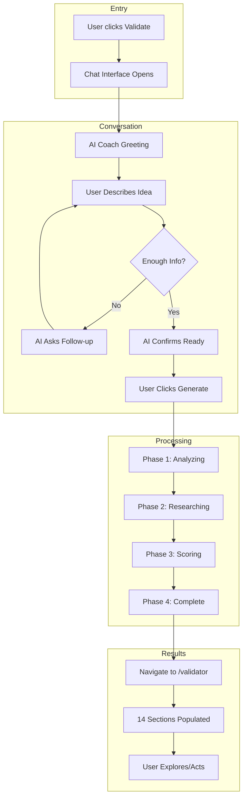
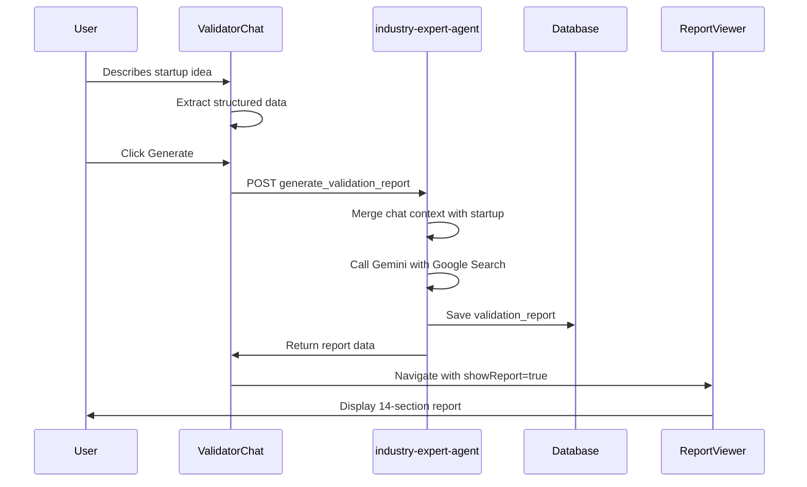

# 106-1 Validator Chat Flow Implementation

> Chat-to-Validation experience with 4-phase processing animation

---

## Description

Complete chat-based validator flow where users describe their startup idea in conversation, watch a 4-phase AI processing animation, then automatically navigate to a pre-filled 14-section validation report.

## Rationale

**Problem:** Traditional validation requires manual form filling and lacks engagement.
**Solution:** Conversational AI intake with real-time processing visualization.
**Impact:** 10x faster idea validation with higher user engagement and trust.

---

## User Stories

| As a... | I want to... | So that... |
|---------|--------------|------------|
| Founder | describe my idea conversationally | I don't need to fill complex forms |
| Founder | see AI analyzing in real-time | I trust the process and stay engaged |
| Founder | get immediate results | I can make decisions quickly |
| Advisor | receive structured reports | I can assess opportunities efficiently |

## Real-World Example

**Sarah's Journey:**
1. Clicks "Validate My Idea" → Chat opens
2. Types: "AI tool for small restaurants to predict inventory"
3. Coach asks about target customers and alternatives
4. Clicks "Generate" → 4-phase animation (3-4 seconds)
5. Lands on full report: 72/100, "CAUTION", TAM: $12B

---

## Success Criteria

- [x] Chat interface captures startup description
- [x] AI coach sends follow-up questions
- [x] 4-phase processing animation displays
- [x] Auto-navigation to validator report
- [x] Report sections populated from chat data
- [x] Mobile responsive design
- [x] Edge function handles chat context

---

## Files Created/Modified

### New Components
- `src/components/validator/chat/ValidatorChat.tsx` - Main chat component
- `src/components/validator/chat/ValidatorChatInput.tsx` - Input with suggestions
- `src/components/validator/chat/ValidatorChatMessage.tsx` - Message bubbles
- `src/components/validator/chat/ValidatorProcessingAnimation.tsx` - 4-phase animation
- `src/components/validator/chat/index.ts` - Exports

### New Pages
- `src/pages/ValidateIdea.tsx` - Chat-based validation page

### Modified Files
- `src/App.tsx` - Added `/validate` route
- `src/pages/Validator.tsx` - Added chat navigation, improved UX
- `supabase/functions/industry-expert-agent/index.ts` - Chat context support

---

## Architecture



---

## Data Flow



---

## API Changes

### industry-expert-agent

Added `chat_context` parameter to `generate_validation_report` action:

```typescript
interface ChatContext {
  messages?: Array<{ role: string; content: string }>;
  extracted_data?: Record<string, string>;
  idea_description?: string;
}

// Usage
{
  action: 'generate_validation_report',
  startup_id: 'uuid',
  report_type: 'deep',
  chat_context: {
    messages: [...],
    extracted_data: { idea: '...', customer: '...' },
    idea_description: 'Full transcript'
  }
}
```

The edge function merges chat data with existing startup profile for richer AI context.

---

## Testing

1. Navigate to `/validate` when authenticated
2. Type a startup idea description
3. Answer 1-2 follow-up questions
4. Click "Generate" button
5. Observe 4-phase animation (~4 seconds)
6. Verify automatic navigation to `/validator?showReport=true`
7. Confirm 14-section report is populated
