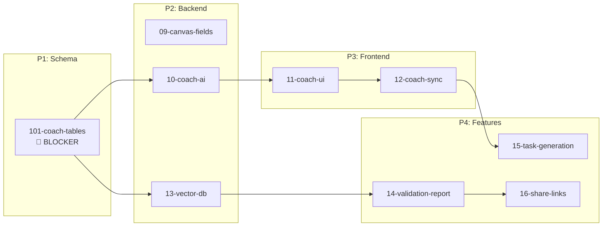
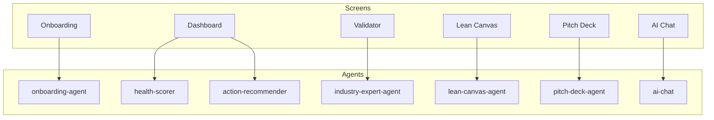

# StartupAI Tasks Documentation

> **Status:** Active Development  
> **Last Updated:** 2026-02-04  
> **Priority:** Coach System + Validation Reports

---

## 📊 Progress Tracker

**[→ 00-progress-tracker.md](./00-progress-tracker.md)** — Master tracker with mermaid diagrams, blockers, user journeys

---

## Documentation Index

| # | Document | Purpose | Status |
|---|----------|---------|:------:|
| 00 | **[00-progress-tracker.md](./00-progress-tracker.md)** | **Master progress tracker** | 🟢 Active |
| 01 | [01-realtime-tasks.md](./01-realtime-tasks.md) | Realtime implementation tasks | ✅ Complete |
| 02 | [02-supabase-schema.md](./02-supabase-schema.md) | Supabase schema reference | ✅ Complete |
| 03 | [03-edge-functions.md](./03-edge-functions.md) | Edge functions reference | ✅ Complete |
| 04 | [04-testing-checklist.md](./04-testing-checklist.md) | Testing checklist | ✅ Complete |
| 05 | [05-implementation-plan.md](./05-implementation-plan.md) | Implementation plan | ✅ Complete |
| 06 | [06-realtime-chat.md](./06-realtime-chat.md) | Realtime chat implementation | ✅ Complete |
| 07 | [07-global-ai-assistant.md](./07-global-ai-assistant.md) | Global AI (Atlas) | ✅ Complete |
| 08 | [08-gaps-blockers-analysis.md](./08-gaps-blockers-analysis.md) | Gaps analysis | ✅ Complete |
| **09** | **[09-canvas-fields.md](./09-canvas-fields.md)** | **Canvas Fields (6 questions)** | 🔴 Not Started |
| **10** | **[10-coach-ai.md](./10-coach-ai.md)** | **Coach AI (6 phases)** | 🔴 Not Started |
| **11** | **[11-coach-ui.md](./11-coach-ui.md)** | **Coach UI (3-panel)** | 🔴 Not Started |
| **12** | **[12-coach-sync.md](./12-coach-sync.md)** | **Coach Sync (bidirectional)** | 🔴 Not Started |
| **13** | **[13-vector-db.md](./13-vector-db.md)** | **Vector DB (200+ stats)** | 🔴 Not Started |
| **14** | **[14-validation-report.md](./14-validation-report.md)** | **Validation Report (14 sections)** | 🔴 Not Started |
| **15** | **[15-task-generation.md](./15-task-generation.md)** | **Task Generation (auto)** | 🔴 Not Started |
| **16** | **[16-share-links.md](./16-share-links.md)** | **Share Links (public URLs)** | 🔴 Not Started |
| 17 | [17-data-summary.md](./17-data-summary.md) | Data summary reference | ✅ Reference |

---

## 🎯 Current Focus: Coach System

### New Tasks (09-16)

### Quick Links

| Document | Description |
|----------|-------------|
| **[01-playbooks/](./01-playbooks/)** | Completed playbook integration tasks |
| [lovable-prompts/](./01-playbooks/lovable-prompts/) | 15 Lovable screen specifications |
| [CHECKLIST.md](./01-playbooks/lovable-prompts/CHECKLIST.md) | Implementation checklist |

---

## Overall Status

| Area | Status | Progress | Next Action |
|:-----|:------:|:--------:|:------------|
| **Core Platform** | 🟢 | 98% | Maintenance |
| **Playbook Integration** | 🟢 | 100% | Complete |
| **Coach System** | 🔴 | 0% | Create 101-coach-tables |
| **Vector DB** | 🔴 | 0% | Wait for coach tables |
| **Validation Reports** | 🔴 | 0% | Wait for vector db |

---

## Edge Functions (16 Deployed)

| Function | Purpose | Status |
|----------|---------|:------:|
| `ai-chat` | Conversational AI + Coach mode | ✅ |
| `onboarding-agent` | Wizard orchestration | ✅ |
| `industry-expert-agent` | Industry context & coaching | ✅ |
| `lean-canvas-agent` | Canvas generation | ✅ |
| `pitch-deck-agent` | Deck generation | ✅ |
| `crm-agent` | Contact enrichment | ✅ |
| `investor-agent` | Investor matching | ✅ |
| `task-agent` | Task generation | ✅ |
| `dashboard-metrics` | Health scoring | ✅ |
| `health-scorer` | 6-category scoring | ✅ |
| `action-recommender` | Today's Focus | ✅ |
| `insights-generator` | AI insights | ✅ |
| `stage-analyzer` | Stage classification | ✅ |
| `documents-agent` | Document processing | ✅ |
| `event-agent` | Event management | ✅ |
| `workflow-trigger` | Score-to-task triggers | ✅ |

---

## Screen → Agent Mapping

---

## ✅ Schema Ready

Coach system tables verified in database:
- `validation_sessions`, `validation_assessments`, `validation_campaigns`, `validation_sprints`
- `validation_experiments`, `validation_conversations`, `validation_reports`, `validation_verdicts`
- `knowledge_chunks` (for vector DB)

**All blockers resolved — Tasks 09-16 ready for implementation.**

---

**Last Updated:** 2026-02-04
