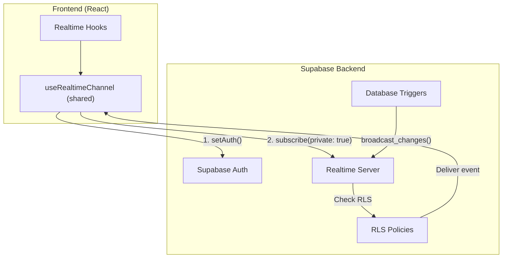

# StartupAI Tasks Documentation

> **Status:** Active Development  
> **Last Updated:** 2026-01-30  
> **Priority:** Industry & Prompt Packs integration

---

## Documentation Index

| Document | Purpose | Status |
|----------|---------|:------:|
| **[01-playbooks/](./01-playbooks/)** | Industry & Prompt Packs implementation | 🟡 Active |
| [01-realtime-tasks.md](./01-realtime-tasks.md) | Realtime implementation tasks | ✅ Complete |
| [02-supabase-schema.md](./02-supabase-schema.md) | Supabase schema reference | ✅ Complete |
| [03-edge-functions.md](./03-edge-functions.md) | Edge functions reference | ✅ Complete |
| [04-testing-checklist.md](./04-testing-checklist.md) | Testing checklist | ✅ Complete |
| [05-implementation-plan.md](./05-implementation-plan.md) | Implementation plan | ✅ Complete |
| [06-realtime-chat.md](./06-realtime-chat.md) | Realtime chat implementation | ✅ Complete |

---

## 🎯 Current Focus: Industry & Prompt Packs

### Quick Links

| Document | Description |
|----------|-------------|
| **[00-progress-tracker.md](./01-playbooks/00-progress-tracker.md)** | Master progress tracker |
| [prd-industry-prompt-playbooks.md](./01-playbooks/prd-industry-prompt-playbooks.md) | Product requirements |
| [roadmap.md](./01-playbooks/roadmap.md) | Implementation roadmap |
| [lovable-prompts/](./01-playbooks/lovable-prompts/) | 8 screen specifications |

### Overall Status

| Area | Status | Progress |
|:-----|:------:|:--------:|
| Backend (Migrations) | 🟢 | 100% |
| Backend (Seeds) | 🟢 | 100% |
| Edge Functions | 🟢 | 100% |
| Frontend Screens | 🔴 | 0% |

### Implementation Order

```
1. Main Dashboard (08)      ─ Core entry point
2. Onboarding Wizard (01)   ─ First-time user flow  
3. Validation Dashboard (02) ─ Core value prop
4. Lean Canvas Builder (03) ─ Data for pitch
5. Pitch Deck Generator (04) ─ Uses canvas data
6. Task Management (06)      ─ Work tracking
7. CRM & Contacts (07)       ─ Relationship tracking
8. AI Chat Assistant (05)    ─ Ties everything together
```

---

## ✅ Realtime Implementation (Complete)

All realtime hooks migrated to **private broadcast channels** with `setAuth()` pattern.

### Architecture



### Implementation Status

| Task | Status |
|------|:------:|
| Supabase client config | ✅ |
| Shared realtime hook | ✅ |
| Dashboard realtime | ✅ |
| Pitch deck generation | ✅ |
| Task subscriptions | ✅ |
| CRM realtime | ✅ |
| Presence hooks | ✅ |
| Realtime chat | ✅ |

### Database Triggers

| Table | Trigger |
|-------|---------|
| `contacts` | `broadcast_contacts_changes` |
| `deals` | `broadcast_deals_changes` |
| `documents` | `broadcast_documents_changes` |
| `events` | `broadcast_events_changes` |
| `investors` | `broadcast_investors_changes` |
| `lean_canvases` | `broadcast_lean_canvases_changes` |
| `pitch_decks` | `broadcast_pitch_decks_changes` |
| `projects` | `broadcast_projects_changes` |
| `tasks` | `broadcast_tasks_changes` |

---

## Edge Functions (13 Deployed)

| Function | Purpose | Status |
|----------|---------|:------:|
| `ai-chat` | Conversational AI | ✅ |
| `industry-expert-agent` | Industry context & coaching | ✅ |
| `onboarding-agent` | Wizard orchestration | ✅ |
| `lean-canvas-agent` | Canvas generation | ✅ |
| `pitch-deck-agent` | Deck generation | ✅ |
| `crm-agent` | Contact enrichment | ✅ |
| `investor-agent` | Investor matching | ✅ |
| `task-agent` | Task generation | ✅ |
| `dashboard-metrics` | Health scoring | ✅ |
| `insights-generator` | AI insights | ✅ |
| `stage-analyzer` | Stage classification | ✅ |
| `documents-agent` | Document processing | ✅ |
| `event-agent` | Event management | ✅ |

---

**Last Updated:** 2026-01-30
