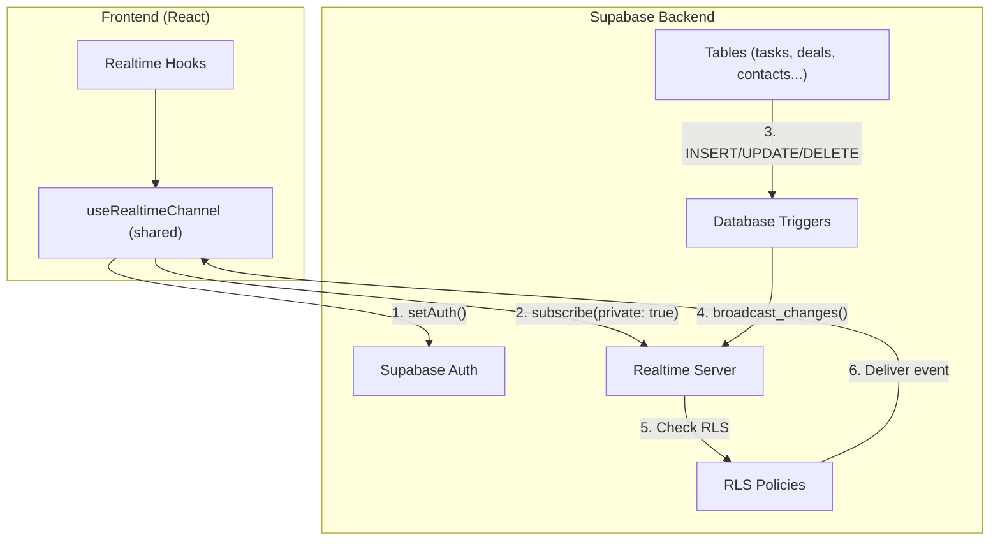
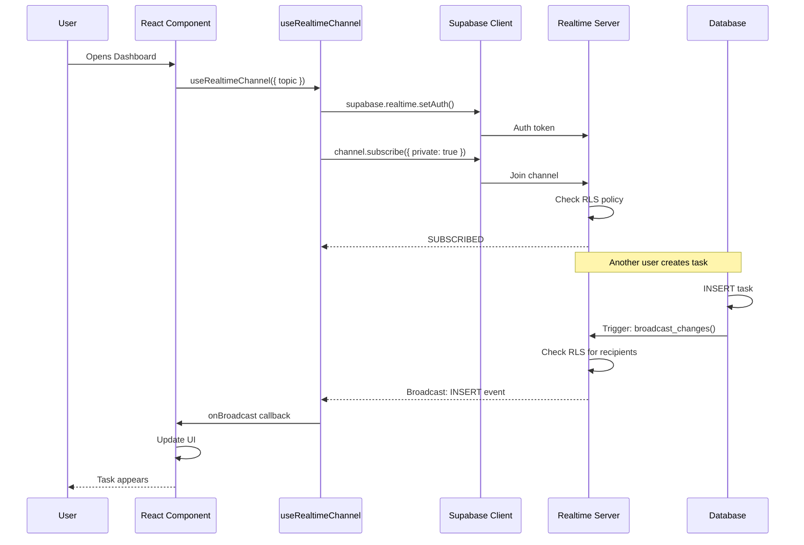

# Supabase Realtime Implementation Tasks

> **Status:** ✅ PRODUCTION COMPLETE  
> **Last Updated:** 2026-01-29  
> **Priority:** Complete - All realtime features implemented with private channels

---

## Summary

All realtime hooks migrated to **private broadcast channels** with `setAuth()` pattern. The AI Chat page now uses `useRealtimeAIChat` which bridges the AI edge function with realtime broadcast for live connection status and future streaming support.

## Architecture Diagram



## Data Flow Diagram



## Implementation Status

| Phase | Task | Status | File(s) |
|-------|------|--------|---------|
| 1 | Update Supabase client config | ✅ Done | `client.ts` |
| 2 | Create shared realtime hook | ✅ Done | `useRealtimeChannel.ts` |
| 3 | Update useDashboardRealtime | ✅ Done | `useRealtimeSubscription.ts` |
| 4 | Update usePitchDeckGeneration | ✅ Done | `usePitchDeckGeneration.ts` |
| 5 | Deduplicate task subscriptions | ✅ Done | Multiple files |
| 6 | Update usePitchDeckRealtime | ✅ Done | `usePitchDeckRealtime.ts` |
| 7 | Update useCRMRealtime | ✅ Done | `useCRMRealtime.ts` |
| 8 | Update useOnboardingRealtime | ✅ Done | `useOnboardingRealtime.ts` |
| 9 | Update remaining hooks | ✅ Done | Multiple files |
| 10 | Update presence hooks | ✅ Done | `useCofounderPresence.ts` |
| 11 | **Realtime Chat** | ✅ Done | `useRealtimeChatRoom.ts`, `RealtimeChat.tsx` |

## Quick Links

- [Task Details](./01-realtime-tasks.md)
- [Supabase Schema Reference](./02-supabase-schema.md)
- [Edge Functions Reference](./03-edge-functions.md)
- [Testing Checklist](./04-testing-checklist.md)
- [Implementation Plan](./05-implementation-plan.md)
- [**Realtime Chat**](./06-realtime-chat.md)
- [**Prompt Packs**](./07-prompt-packs.md) ← NEW

---

## Backend Status

### ✅ Completed (Backend Ready)

| Component | Status | Details |
|-----------|--------|---------|
| RLS on `realtime.messages` | ✅ | SELECT + INSERT policies |
| Broadcast triggers | ✅ | 10 tables configured |
| Publication setup | ✅ | `supabase_realtime` publication |
| Edge functions | ✅ | 13 functions deployed |

### Database Triggers

| Table | Trigger | Function |
|-------|---------|----------|
| `contacts` | `broadcast_contacts_changes` | `broadcast_table_changes()` |
| `deals` | `broadcast_deals_changes` | `broadcast_table_changes()` |
| `documents` | `broadcast_documents_changes` | `broadcast_table_changes()` |
| `events` | `broadcast_events_changes` | `broadcast_table_changes()` |
| `investors` | `broadcast_investors_changes` | `broadcast_table_changes()` |
| `lean_canvases` | `broadcast_lean_canvases_changes` | `broadcast_table_changes()` |
| `pitch_decks` | `broadcast_pitch_decks_changes` | `broadcast_table_changes()` |
| `projects` | `broadcast_projects_changes` | `broadcast_table_changes()` |
| `tasks` | `broadcast_tasks_changes` | `broadcast_table_changes()` |
| `tasks` | `task_event_broadcast` | `broadcast_task_event()` |

---

## Next Steps

1. **Phase 1**: Update Supabase client with realtime config
2. **Phase 2**: Create shared `useRealtimeChannel` hook
3. **Phase 3**: Migrate hooks one by one (priority order below)
4. **Phase 4**: Test and validate all realtime features
5. **Phase 5**: Enable private-only mode in Supabase dashboard

### Priority Order

```
┌─────────────────────────────────────────────────────────────┐
│ 1. Client config (low risk, adds logging)                  │
├─────────────────────────────────────────────────────────────┤
│ 2. Shared hook (no breaking changes)                       │
├─────────────────────────────────────────────────────────────┤
│ 3. usePitchDeckGeneration (critical for generation)        │
├─────────────────────────────────────────────────────────────┤
│ 4. Deduplicate tasks (fix duplicate subscriptions)         │
├─────────────────────────────────────────────────────────────┤
│ 5. useDashboardRealtime (main dashboard fix)               │
├─────────────────────────────────────────────────────────────┤
│ 6. usePitchDeckRealtime, useCRMRealtime, etc.              │
├─────────────────────────────────────────────────────────────┤
│ 7. Presence hooks                                          │
└─────────────────────────────────────────────────────────────┘
```
