# StartupAI Tasks Documentation

> **Status:** Active Development  
> **Last Updated:** 2026-02-04  
> **Priority:** Coach System → Validator Platform → Growth Tools

---

## 📊 Progress Tracker

**[→ 00-progress-tracker.md](./00-progress-tracker.md)** — Master tracker with mermaid diagrams, blockers, user journeys

---

## Documentation Index

### Core Documentation (01-08) ✅ Complete

| # | Document | Purpose | Status |
|---|----------|---------|:------:|
| 00 | **[00-progress-tracker.md](./00-progress-tracker.md)** | **Master progress tracker** | 🟢 Active |
| 01 | [01-realtime-tasks.md](./01-realtime-tasks.md) | Realtime implementation | ✅ Complete |
| 02 | [02-supabase-schema.md](./02-supabase-schema.md) | Supabase schema | ✅ Complete |
| 03 | [03-edge-functions.md](./03-edge-functions.md) | Edge functions | ✅ Complete |
| 04 | [04-testing-checklist.md](./04-testing-checklist.md) | Testing | ✅ Complete |
| 05 | [05-implementation-plan.md](./05-implementation-plan.md) | Implementation plan | ✅ Complete |
| 06 | [06-realtime-chat.md](./06-realtime-chat.md) | Realtime chat | ✅ Complete |
| 07 | [07-global-ai-assistant.md](./07-global-ai-assistant.md) | Global AI (Atlas) | ✅ Complete |
| 08 | [08-gaps-blockers-analysis.md](./08-gaps-blockers-analysis.md) | Gaps analysis | ✅ Complete |

### Coach System (09-16) 🔴 Not Started

| # | Document | Purpose | Status | Depends |
|---|----------|---------|:------:|:-------:|
| **09** | **[09-canvas-fields.md](./09-canvas-fields.md)** | **Canvas Fields (6 questions)** | 🔴 | — |
| **10** | **[10-coach-ai.md](./10-coach-ai.md)** | **Coach AI (6 phases)** | 🔴 | 09 |
| **11** | **[11-coach-ui.md](./11-coach-ui.md)** | **Coach UI (3-panel)** | 🔴 | 10 |
| **12** | **[12-coach-sync.md](./12-coach-sync.md)** | **Coach Sync (bidirectional)** | 🔴 | 10, 11 |
| **13** | **[13-vector-db.md](./13-vector-db.md)** | **Vector DB (200+ stats)** | 🔴 | — |
| **14** | **[14-validation-report.md](./14-validation-report.md)** | **Validation Report (14 sections)** | 🔴 | 13 |
| **15** | **[15-task-generation.md](./15-task-generation.md)** | **Task Generation (auto)** | 🔴 | 12 |
| **16** | **[16-share-links.md](./16-share-links.md)** | **Share Links (public URLs)** | 🔴 | 14 |

### Validator Platform (18-20) 🔴 Not Started

| # | Document | Purpose | Status | Depends |
|---|----------|---------|:------:|:-------:|
| 17 | [17-data-summary.md](./17-data-summary.md) | Data summary reference | ✅ Reference | — |
| **18** | **[18-market-analysis.md](./18-market-analysis.md)** | **TAM/SAM/SOM + trends** | 🔴 | 14 |
| **19** | **[19-competitor-intel.md](./19-competitor-intel.md)** | **Competitor positioning** | 🔴 | 18 |
| **20** | **[20-financial-projections.md](./20-financial-projections.md)** | **Unit economics + revenue** | 🔴 | 19 |

### Growth Tools (21-25) 🔴 Not Started

| # | Document | Purpose | Status | Depends |
|---|----------|---------|:------:|:-------:|
| **21** | **[21-traction-roadmap.md](./21-traction-roadmap.md)** | **Milestones + channels** | 🔴 | MVP |
| **22** | **[22-analytics-dashboard.md](./22-analytics-dashboard.md)** | **AARRR funnel + cohorts** | 🔴 | 21 |
| **23** | **[23-pmf-checker.md](./23-pmf-checker.md)** | **Sean Ellis survey** | 🔴 | 22 |
| **24** | **[24-channel-mapper.md](./24-channel-mapper.md)** | **Channel comparison** | 🔴 | 22 |
| **25** | **[25-growth-experiments.md](./25-growth-experiments.md)** | **A/B testing tracker** | 🔴 | 21 |

### Design Reference (26) ✅ Complete

| # | Document | Purpose | Status |
|---|----------|---------|:------:|
| **26** | **[26-validator-wireframe.md](./26-validator-wireframe.md)** | **Validator wireframe** | ✅ Reference |

---

## 🎯 Implementation Flow

```mermaid
flowchart TB
    subgraph Phase1["Phase 1: Coach System 🔴"]
        T09["09-canvas-fields"]
        T10["10-coach-ai"]
        T11["11-coach-ui"]
        T12["12-coach-sync"]
        T13["13-vector-db"]
        T14["14-validation-report"]
        T15["15-task-generation"]
        T16["16-share-links"]
    end
    
    subgraph Phase2["Phase 2: Validator Platform 🔴"]
        T18["18-market-analysis"]
        T19["19-competitor-intel"]
        T20["20-financial-projections"]
    end
    
    subgraph Phase3["Phase 3: Growth Tools 🔴"]
        T21["21-traction-roadmap"]
        T22["22-analytics-dashboard"]
        T23["23-pmf-checker"]
        T24["24-channel-mapper"]
        T25["25-growth-experiments"]
    end
    
    T09 --> T10
    T10 --> T11
    T11 --> T12
    T13 --> T14
    T12 --> T15
    T14 --> T16
    T14 --> T18
    T18 --> T19
    T19 --> T20
    T20 --> T21
    T21 --> T22
    T22 --> T23
    T22 --> T24
    T21 --> T25
```

---

## Overall Status

| Area | Status | Progress | Next Action |
|:-----|:------:|:--------:|:------------|
| **Core Platform** | 🟢 | 98% | Maintenance |
| **Playbook Integration** | 🟢 | 100% | Complete |
| **Coach System (09-16)** | 🔴 | 0% | Start 09-canvas-fields |
| **Validator Platform (18-20)** | 🔴 | 0% | Create schema, then 18 |
| **Growth Tools (21-25)** | 🔴 | 0% | Create schema, then 21 |

---

## Schema Status

### ✅ Tables Ready

| Table | Required By |
|-------|:-----------:|
| `validation_sessions` | 10-coach-ai |
| `validation_assessments` | 10-coach-ai |
| `validation_campaigns` | 10-coach-ai |
| `validation_sprints` | 10-coach-ai |
| `validation_reports` | 14-validation |
| `knowledge_chunks` | 13-vector-db |
| `competitor_profiles` | 19-competitor |
| `experiment_results` | 25-growth |
| `metric_snapshots` | 22-analytics |

### 🔴 Tables Needed (Blockers)

| Table | Required By |
|-------|:-----------:|
| `idea_market_analysis` | 18-market |
| `idea_market_segments` | 18-market |
| `idea_competitors` | 19-competitor |
| `idea_unit_economics` | 20-financial |
| `traction_milestones` | 21-traction |
| `channel_tests` | 21-traction |
| `pmf_surveys` | 23-pmf |
| `pmf_responses` | 23-pmf |
| `growth_experiments` | 25-growth |

---

## Edge Functions (16 Deployed)

| Function | Purpose | Status |
|----------|---------|:------:|
| `ai-chat` | Conversational AI + Coach mode | ✅ |
| `onboarding-agent` | Wizard orchestration | ✅ |
| `industry-expert-agent` | Industry context & coaching | ✅ |
| `lean-canvas-agent` | Canvas generation | ✅ |
| `pitch-deck-agent` | Deck generation | ✅ |
| `crm-agent` | Contact enrichment | ✅ |
| `investor-agent` | Investor matching | ✅ |
| `task-agent` | Task generation | ✅ |
| `dashboard-metrics` | Health scoring | ✅ |
| `health-scorer` | 6-category scoring | ✅ |
| `action-recommender` | Today's Focus | ✅ |
| `insights-generator` | AI insights | ✅ |
| `stage-analyzer` | Stage classification | ✅ |
| `documents-agent` | Document processing | ✅ |
| `event-agent` | Event management | ✅ |
| `workflow-trigger` | Score-to-task triggers | ✅ |

### 🔴 Edge Functions Needed

| Function | Required By |
|----------|:-----------:|
| `market-research-agent` | 18-market |
| `competitor-agent` | 19-competitor |
| `financial-agent` | 20-financial |
| `compute-metrics` | 22-analytics |

---

## Screen → Agent → Table Mapping

---

## Quick Links

| Document | Description |
|----------|-------------|
| **[01-playbooks/](./01-playbooks/)** | Completed playbook integration tasks |
| [lovable-prompts/](./01-playbooks/lovable-prompts/) | 15 Lovable screen specifications |
| [CHECKLIST.md](./01-playbooks/lovable-prompts/CHECKLIST.md) | Implementation checklist |

---

**Last Updated:** 2026-02-04
