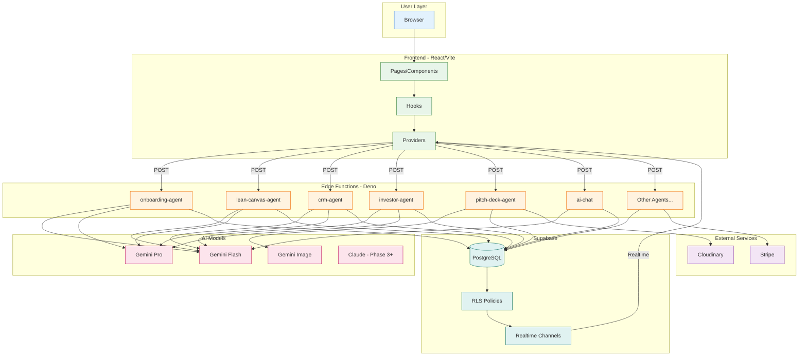

# System Architecture

> **Type:** Flowchart + C4
> **PRD Section:** 16. AI Architecture
> **Rule:** Frontend → Edge Functions → AI Models → Database

---

## End-to-End Flow

---

## Component Ownership

| Layer | Owner | Responsibility |
|-------|-------|----------------|
| User | End User | Input, approval, feedback |
| Frontend | React/TS | UI, state, hooks |
| Edge | Deno/Supabase | Business logic, AI calls |
| AI | Gemini/Claude | Analysis, generation, scoring |
| Data | PostgreSQL | Storage, RLS, realtime |
| External | Third-party | Images, payments |

---

## Edge Functions (14 Deployed)

| Function | Status | Purpose |
|----------|--------|---------|
| onboarding-agent | ✅ | Wizard enrichment |
| lean-canvas-agent | ✅ | Canvas prefill, validate |
| crm-agent | ✅ | Contact enrichment |
| investor-agent | ✅ | Investor search |
| pitch-deck-agent | ✅ | Deck generation |
| documents-agent | ✅ | Document generation |
| event-agent | ✅ | Event planning |
| ai-chat | ✅ | Chat assistant |
| generate-image | ✅ | Image generation |
| auth-check | ✅ | Auth verification |
| health | ✅ | Health check |
| stripe-webhook | ✅ | Payments |
| task-agent | ❌ | Missing |
| dashboard-metrics | ❌ | Missing |

---

## Verification

- [x] Start: User browser
- [x] End: Realtime updates to frontend
- [x] Ownership: Each layer clearly labeled
- [x] AI: Calls through Edge Functions only
- [x] Data: RLS enforced on all queries
