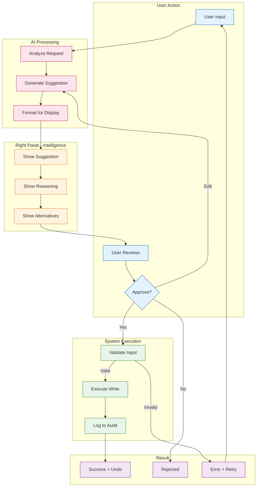
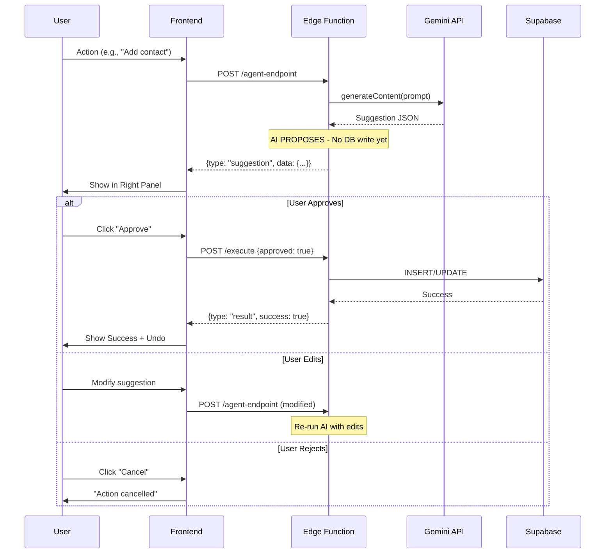

# AI Workflow - Propose → Approve → Execute

> **Type:** Flowchart + Sequence
> **PRD Section:** 10. Workflows
> **Hard Rule:** AI NEVER writes to database without user approval

---

## Core Workflow



---

## Sequence Diagram



---

## 3-Panel Layout Integration

```
┌─────────────────┬─────────────────────────────┬─────────────────┐
│   LEFT PANEL    │        MAIN PANEL           │   RIGHT PANEL   │
│    (Context)    │         (Work)              │  (Intelligence) │
├─────────────────┼─────────────────────────────┼─────────────────┤
│                 │                             │                 │
│ WHERE AM I?     │  User works here            │  AI PROPOSES    │
│                 │                             │                 │
│ • Navigation    │  • Forms                    │  • Suggestions  │
│ • Filters       │  • Tables                   │  • Reasoning    │
│ • Progress      │  • Editors                  │  • Alternatives │
│                 │                             │                 │
│                 │  HUMAN APPROVES             │                 │
│                 │  ↓                          │                 │
│                 │  SYSTEM EXECUTES            │                 │
│                 │                             │                 │
└─────────────────┴─────────────────────────────┴─────────────────┘
```

---

## Approval Rules by Action

| Action | Approval Required | Confirmation Level |
|--------|-------------------|-------------------|
| Read/Query | No | — |
| Create | Yes | Single click |
| Update | Yes | Single click |
| Delete | Yes + Confirm | Double confirm |
| Bulk | Yes + Extra Warning | Explicit list review |

---

## Verification

- [x] Start: User input
- [x] End: Success/Rejected/Error
- [x] AI: Never writes directly (suggestion only)
- [x] Failure: Invalid input → Error + Retry path
- [x] Ownership: User/AI/Display/Execution clearly separated
