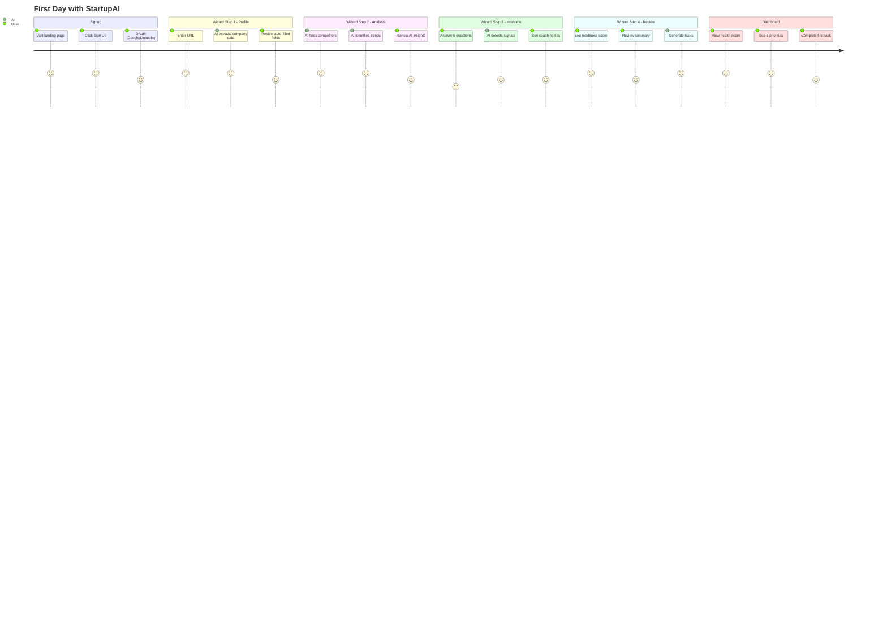

# User Journey - First Day Onboarding

> **Type:** Journey + State Diagram
> **PRD Section:** 9. User Journeys
> **Flow:** Signup → Wizard (4 steps) → Dashboard → First Task

---

## Journey Map

---

## Wizard State Machine

```mermaid
stateDiagram-v2
    [*] --> Landing

    Landing --> Signup: Click CTA
    Signup --> Auth: Submit
    Auth --> Step1: Success
    Auth --> Signup: Error

    state Step1 {
        [*] --> URLInput
        URLInput --> Extracting: Submit URL
        Extracting --> ReviewProfile: AI Complete
        Extracting --> ManualEntry: AI Fails
        ManualEntry --> ReviewProfile: User Fills
        ReviewProfile --> [*]: Next
    }

    Step1 --> Step2: Next

    state Step2 {
        [*] --> Analyzing
        Analyzing --> CompetitorsFound: AI Success
        Analyzing --> SkipAnalysis: AI Fails
        CompetitorsFound --> TrendsFound: Continue
        TrendsFound --> ReviewInsights: Complete
        SkipAnalysis --> ReviewInsights: Manual
        ReviewInsights --> [*]: Next
    }

    Step2 --> Step3: Next

    state Step3 {
        [*] --> Question1
        Question1 --> Question2: Answer
        Question2 --> Question3: Answer
        Question3 --> Question4: Answer
        Question4 --> Question5: Answer
        Question5 --> SignalsDetected: AI Process
        SignalsDetected --> [*]: Next
    }

    Step3 --> Step4: Next

    state Step4 {
        [*] --> CalculatingScore
        CalculatingScore --> ShowingSummary: Complete
        ShowingSummary --> GeneratingTasks: Continue
        GeneratingTasks --> ReadyForDashboard: Tasks Created
        ReadyForDashboard --> [*]: Finish
    }

    Step4 --> Dashboard: Complete Wizard
    Dashboard --> [*]: Using App
```

---

## Time to Value

| Stage | Target Time | Current |
|-------|-------------|---------|
| Signup → Wizard Start | <1 min | ✅ |
| Wizard Step 1 | 5 min | ✅ |
| Wizard Step 2 | 3 min | ✅ |
| Wizard Step 3 | 7 min | ✅ |
| Wizard Step 4 | 3 min | ✅ |
| **Total to Dashboard** | **<20 min** | **~18 min** |
| First Task Completed | <30 min | 🟡 ~45 min |

---

## AI Touchpoints

| Step | AI Action | Fallback |
|------|-----------|----------|
| Step 1 | Extract from URL | Manual entry |
| Step 2 | Find competitors, trends | Skip analysis |
| Step 3 | Detect signals from answers | No signals |
| Step 4 | Calculate score, generate tasks | Basic tasks |

---

## Error Handling

| Error | Recovery |
|-------|----------|
| URL extraction fails | Show manual form |
| Competitor search fails | Skip to next step |
| AI timeout | Retry with loading indicator |
| Auth fails | Clear error message + retry |
| Browser closes | Resume from wizard_sessions |

---

## Verification

- [x] Start: Landing page visit
- [x] End: Dashboard with tasks
- [x] Ownership: User actions vs AI actions labeled
- [x] AI: Assists but never blocks (fallbacks exist)
- [x] Failures: Each step has error recovery
