# Module Phases - 16 Modules

> **Type:** Flowchart
> **PRD Section:** 19. Implementation Phases
> **Current Progress:** 42% overall

---

## Module Dependencies

---

## Phase Gates

```mermaid
flowchart LR
    subgraph Gate0["P0 Gate"]
        G0[Auth works<br/>RLS tested<br/>Wizard completes]
    end

    subgraph Gate1["P1 Gate"]
        G1[Wizard → Dashboard<br/>Tasks visible<br/>Canvas populated<br/>Deck generated]
    end

    subgraph Gate2["P2 Gate"]
        G2[AI explainable<br/>Realtime working<br/>No data leaks]
    end

    subgraph Gate3["P3 Gate"]
        G3[Advanced AI value<br/>Orchestration works<br/>Performance OK]
    end

    Gate0 -->|Pass| Gate1
    Gate1 -->|Pass| Gate2
    Gate2 -->|Pass| Gate3

    classDef gate fill:#E3F2FD,stroke:#1565C0
    class G0,G1,G2,G3 gate
```

---

## Module Status Table

| Module | Phase | Backend | Frontend | Overall |
|--------|-------|---------|----------|---------|
| Security & Foundation | P0 | 🟡 | 🔴 | 16% |
| Onboarding Wizard | P0 | ✅ | ✅ | 95% |
| Cloudinary | P0 | ✅ | ✅ | 100% |
| Lean Canvas | P1 | 90% | 60% | 70% |
| CRM & Contacts | P1 | 100% | 0% | 50% |
| Project Management | P1 | 50% | 0% | 25% |
| Dashboards | P1 | 30% | 0% | 15% |
| Documents | P1 | 100% | 0% | 50% |
| Pitch Deck MVP | P1 | 70% | 0% | 35% |
| Events | P2 | 100% | 70% | 80% |
| Chat | P2 | 80% | 50% | 60% |
| Supabase Realtime | P2 | 10% | 0% | 5% |
| AI Enhancement | P3 | 0% | 0% | 0% |
| Investor Features | P3 | 50% | 0% | 25% |
| Infrastructure | P3 | 0% | 0% | 0% |

---

## Critical Path

**Blocking Issues:**
1. Security phase incomplete → blocks production
2. Dashboard low progress → blocks realtime features
3. Frontend gaps → user can't interact with completed backends

---

## Verification

- [x] All 16 modules represented
- [x] Dependencies show build order
- [x] Phase gates define ship criteria
- [x] Critical path identified
