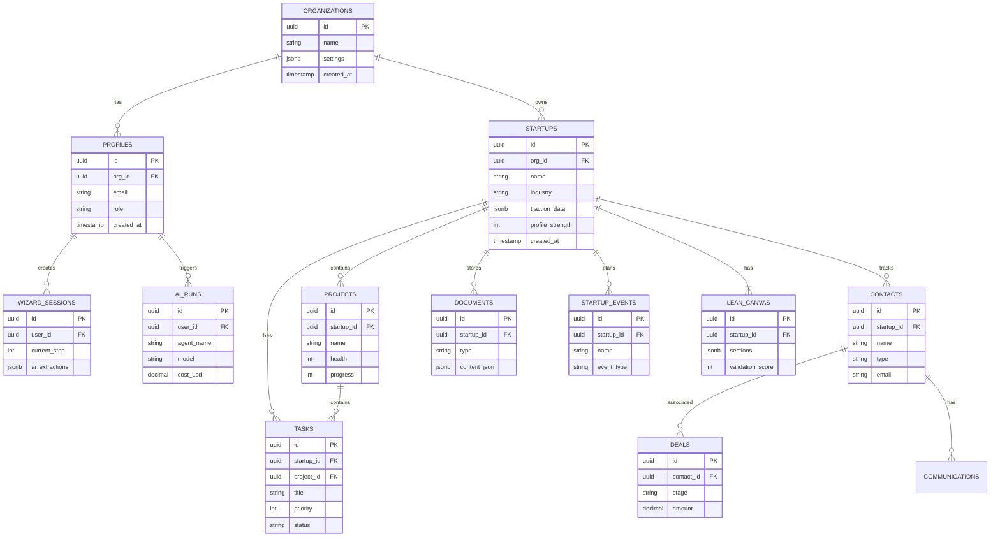
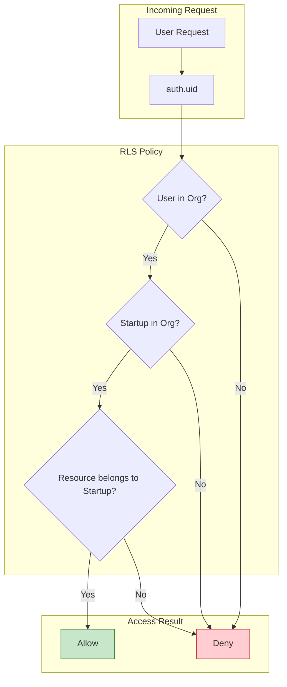

# Data Model - Core Tables

> **Type:** ER Diagram
> **PRD Section:** 15. Data Model
> **Database:** Supabase PostgreSQL with RLS

---

## Core Entity Relationships

---

## RLS Policy Pattern

---

## Multi-Tenant Isolation

| Level | Mechanism |
|-------|-----------|
| Organization | `org_id` on all tables |
| User | `auth.uid()` → profiles → org_id |
| Startup | `startup_id` → org_id check |
| Resource | Foreign key to startup + RLS |

---

## Key Indexes

| Table | Index | Purpose |
|-------|-------|---------|
| startups | org_id | Tenant isolation |
| tasks | startup_id, status | Task queries |
| contacts | startup_id, type | Contact filtering |
| deals | contact_id, stage | Pipeline views |
| ai_runs | user_id, created_at | Cost tracking |

---

## Verification

- [x] Core tables documented
- [x] Relationships show cardinality
- [x] RLS pattern explained
- [x] Multi-tenant isolation clear
