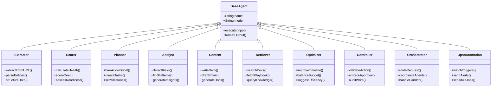

# Agent Architecture - 10 Agent Types

> **Type:** Class + Flowchart
> **PRD Section:** 17. AI Models & Agents
> **Strategy:** Gemini (Phase 1-2) + Claude (Phase 3+)

---

## Agent Hierarchy

---

## Agent Routing Flow

---

## Model Assignment

| Agent | Primary Model | Phase |
|-------|--------------|-------|
| Extractor | gemini-3-flash-preview | 1+ |
| Scorer | gemini-3-flash-preview | 1+ |
| Planner | gemini-3-pro-preview | 2+ |
| Analyst | gemini-3-pro-preview | 2+ |
| Content | gemini-3-flash-preview | 1+ |
| Retriever | gemini-3-flash-preview | 1+ |
| Optimizer | gemini-3-pro-preview | 2+ |
| Controller | gemini-3-pro-preview | 2+ |
| Orchestrator | claude-sonnet-4-5 | 3+ |
| OpsAutomation | claude-haiku-4-5 | 3+ |

---

## Edge Function → Agent Mapping

| Edge Function | Agents Used |
|---------------|-------------|
| onboarding-agent | Extractor, Scorer, Planner |
| lean-canvas-agent | Analyst, Content, Scorer |
| crm-agent | Extractor, Scorer |
| investor-agent | Retriever, Scorer, Analyst |
| pitch-deck-agent | Content, Retriever |
| ai-chat | Orchestrator, multiple |
| task-agent (missing) | Planner, Scorer |

---

## Controller Gate Rules

---

## Verification

- [x] 10 agent types documented
- [x] Routing flow shows decision points
- [x] Controller enforces approval gate
- [x] Model assignment by phase
- [x] Edge function mapping complete
