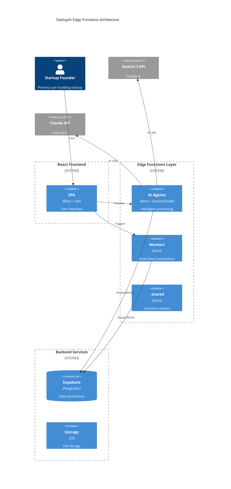
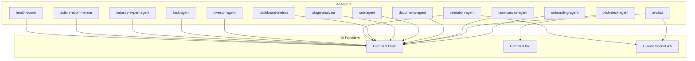
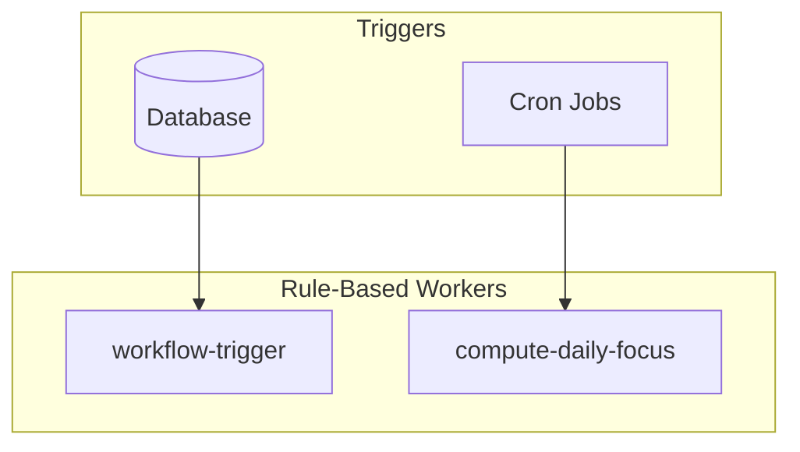
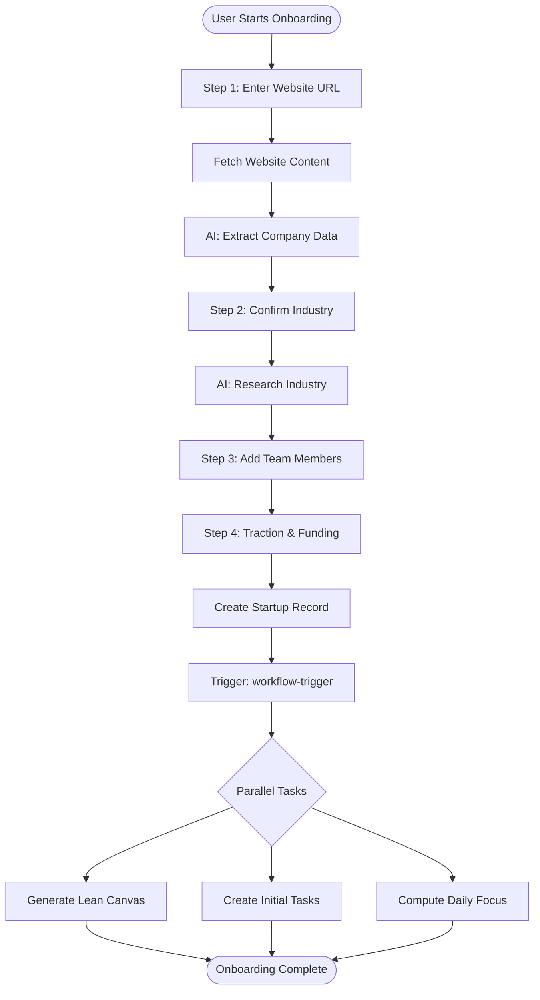
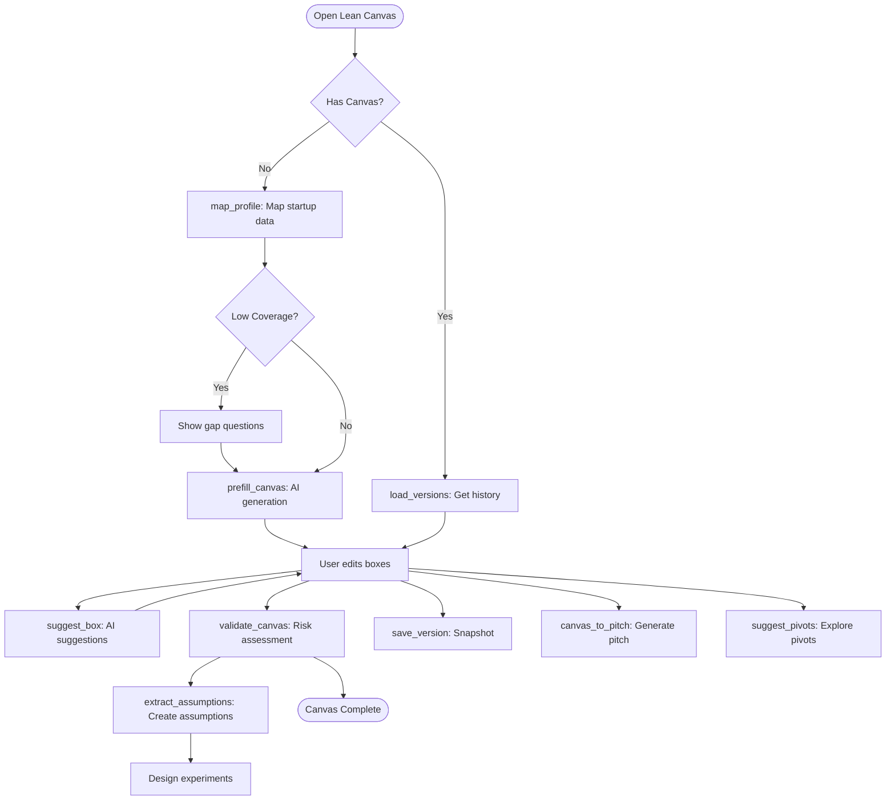
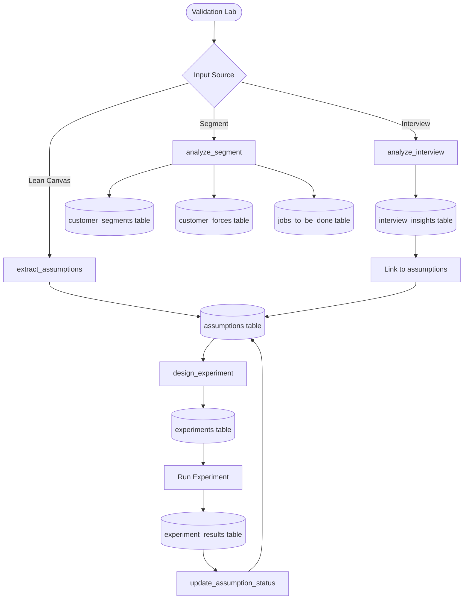
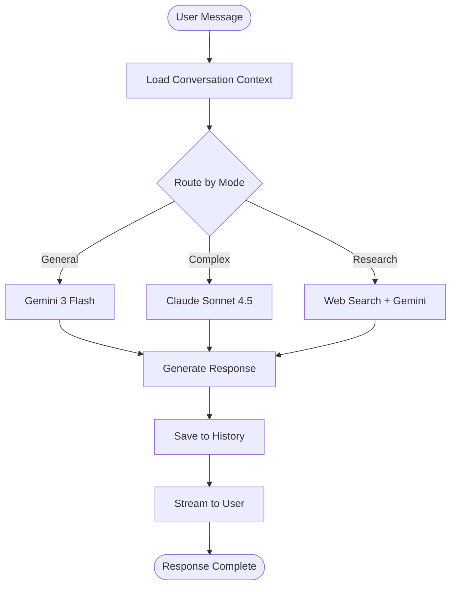
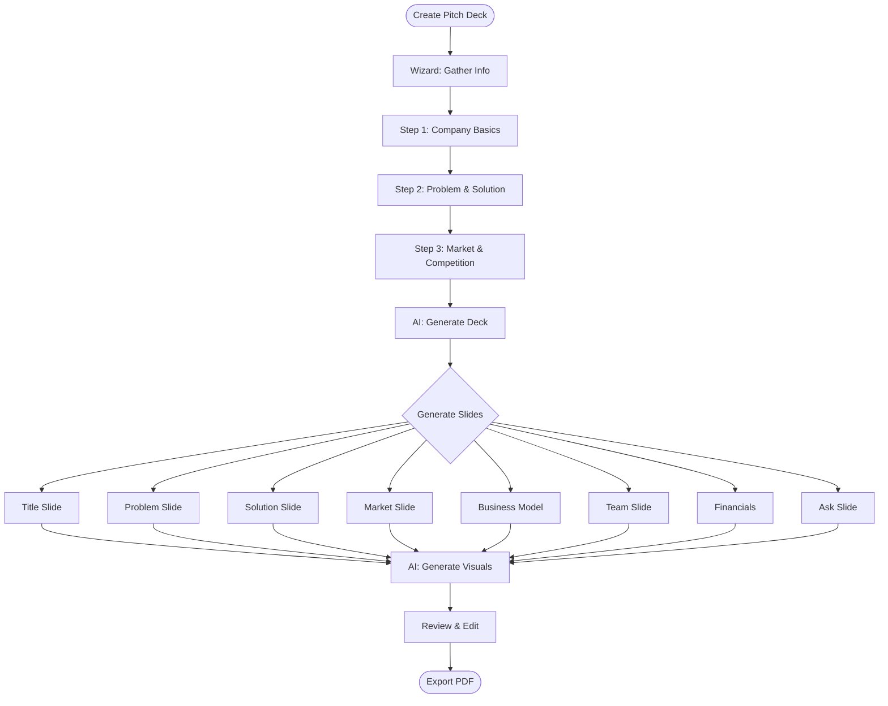
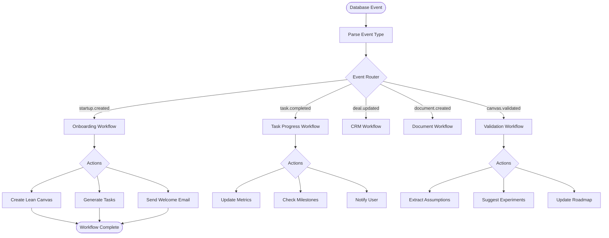
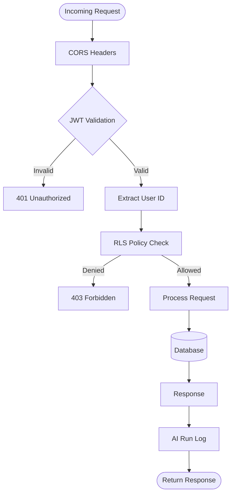

# Edge Functions Strategy

> **Updated:** 2026-02-02 | **Status:** Production Ready | **Count:** 19 Deployed

---

## Executive Summary

StartupAI uses **19 Supabase Edge Functions** to power AI agents, workflow automation, and utility services. This document maps the complete edge function architecture with function categories, data flows, and deployment strategy.

### Key Metrics

| Metric | Value |
|--------|-------|
| Total Deployed | 19 |
| AI Agents | 14 |
| Rule-Based Workers | 2 |
| Utilities | 2 |
| Shared Module | 1 |

### Strategic Architecture



---

## Function Categories

### AI Agents (14 Functions)

Intelligent functions that use Gemini 3 or Claude for reasoning, generation, and analysis.



| Function | Purpose | AI Model | Actions |
|----------|---------|----------|---------|
| onboarding-agent | Extract startup data from websites, guide setup | Gemini 3 Flash | create_session, enrich_url, enrich_context, calculate_readiness, get_questions, process_answer, calculate_score, generate_summary, complete_wizard, generate_competitors |
| ai-chat | Multi-turn conversation with context | Gemini 3 Flash + Claude | chat, prioritize_tasks, generate_tasks, extract_profile, stage_guidance |
| pitch-deck-agent | Generate and refine pitch decks | Gemini 3 Pro | generate_deck, update_slide, analyze_slide, suggestions, images, research, wizard |
| lean-canvas-agent | Create and validate business models | Gemini 3 Flash/Pro | map_profile, check_profile_sync, prefill_canvas, suggest_box, validate_canvas, save_version, load_versions, restore_version, canvas_to_pitch, get_benchmarks, suggest_pivots, extract_assumptions |
| documents-agent | Generate startup documents | Gemini 3 Flash | generate_document, summarize, extract |
| crm-agent | Analyze contacts and deals | Gemini 3 Flash | analyze_contact, score_deal, suggest_action |
| stage-analyzer | Determine startup stage | Gemini 3 Flash | analyze_stage, recommend_focus |
| dashboard-metrics | Calculate startup KPIs | Gemini 3 Flash | calculate_kpis, trend_analysis |
| validation-agent | Validate assumptions and design experiments | Gemini 3 + Claude | extract_assumptions, design_experiment, analyze_interview, analyze_segment, update_assumption_status |
| investor-agent | Investor research and matching | Gemini 3 Flash | research_investor, match_investors, prepare_outreach |
| task-agent | Task generation and prioritization | Gemini 3 Flash | generate_tasks, prioritize, suggest_next |
| industry-expert-agent | Industry-specific guidance | Gemini 3 Flash | get_industry_insights, benchmark_analysis |
| action-recommender | Suggest next actions | Gemini 3 Flash | recommend_actions, daily_focus |
| health-scorer | Startup health assessment | Gemini 3 Flash | calculate_health, identify_risks |

### Rule-Based Workers (2 Functions)

Deterministic functions that execute business logic without AI.



| Function | Purpose | Trigger |
|----------|---------|---------|
| workflow-trigger | Orchestrate multi-step processes | Database events |
| compute-daily-focus | Calculate daily priorities | Cron (daily) |

### Utilities (2 Functions)

Support functions for common operations.

| Function | Purpose | Integration |
|----------|---------|-------------|
| prompt-pack | Run prompt pack workflows | Internal |
| insights-generator | Generate insights from data | Internal |

### Shared Module (_shared)

Common utilities imported by all edge functions.

```
supabase/functions/_shared/
├── index.ts              # Re-exports all utilities
├── cors.ts               # CORS headers utility
├── auth.ts               # JWT verification, user context
├── database.ts           # Supabase client helpers, CRUD
├── errors.ts             # Error classes, response helpers
├── ai-client.ts          # Gemini/Claude unified client
├── types.ts              # Shared TypeScript types
├── prompt-utils.ts       # Prompt interpolation, validation
└── master-system-prompt.ts # Lean methodology prompts
```

---

## Core Agent Flows

### Onboarding Agent Flow



### Lean Canvas Agent Flow



### Validation Agent Flow



### AI Chat Flow



### Pitch Deck Agent Flow



### Workflow Trigger Flow



---

## Deployed Functions Table

| # | Function | Category | Status | Key Actions |
|---|----------|----------|--------|-------------|
| 1 | onboarding-agent | AI Agent | ✅ Active | enrich_url, calculate_readiness, complete_wizard |
| 2 | ai-chat | AI Agent | ✅ Active | chat, prioritize_tasks, stage_guidance |
| 3 | pitch-deck-agent | AI Agent | ✅ Active | generate_deck, update_slide, wizard |
| 4 | lean-canvas-agent | AI Agent | ✅ Active | prefill_canvas, validate_canvas, extract_assumptions |
| 5 | documents-agent | AI Agent | ✅ Active | generate_document, summarize |
| 6 | crm-agent | AI Agent | ✅ Active | analyze_contact, score_deal |
| 7 | stage-analyzer | AI Agent | ✅ Active | analyze_stage, recommend_focus |
| 8 | dashboard-metrics | AI Agent | ✅ Active | calculate_kpis, trend_analysis |
| 9 | validation-agent | AI Agent | ✅ Active | extract_assumptions, design_experiment, analyze_interview |
| 10 | investor-agent | AI Agent | ✅ Active | research_investor, match_investors |
| 11 | task-agent | AI Agent | ✅ Active | generate_tasks, prioritize |
| 12 | industry-expert-agent | AI Agent | ✅ Active | get_industry_insights |
| 13 | action-recommender | AI Agent | ✅ Active | recommend_actions |
| 14 | health-scorer | AI Agent | ✅ Active | calculate_health |
| 15 | workflow-trigger | Worker | ✅ Active | handle_event, execute_workflow |
| 16 | compute-daily-focus | Worker | ✅ Active | calculate_priorities |
| 17 | prompt-pack | Utility | ✅ Active | run_pack, apply_pack |
| 18 | insights-generator | Utility | ✅ Active | generate_insights |
| 19 | event-agent | Worker | ✅ Active | handle_events |

---

## Shared Utilities (_shared)

All edge functions import from `_shared` for consistent patterns:

```typescript
// Import from shared utilities
import { corsHeaders, handleCors } from '../_shared/cors.ts';
import { requireAuth, UserContext } from '../_shared/auth.ts';
import { create, update, getById } from '../_shared/database.ts';
import { callGemini, callClaude, parseAIJson } from '../_shared/ai-client.ts';
import { successResponse, errorResponse, ValidationError } from '../_shared/errors.ts';
```

### Available Utilities

| Module | Exports | Purpose |
|--------|---------|---------|
| cors.ts | corsHeaders, handleCors, withCors | CORS handling |
| auth.ts | requireAuth, verifyAuth, createUserClient, createServiceClient | Authentication |
| database.ts | create, update, delete, getById, getPaginated, getStartupContext | Database operations |
| errors.ts | AppError, ValidationError, errorResponse, successResponse | Error handling |
| ai-client.ts | callGemini, callClaude, callAI, parseAIJson, calculateCost | AI client |
| types.ts | Startup, Assumption, Experiment, Task, etc. | Type definitions |

---

## Security Architecture



### Security Checklist

| Check | Implementation |
|-------|----------------|
| JWT Verification | All functions verify JWT via `requireAuth()` |
| RLS Enforcement | All database queries go through RLS policies |
| Environment Variables | Credentials stored in Supabase Secrets |
| CORS | Configured via `_shared/cors.ts` |
| Rate Limiting | Supabase built-in rate limiting |
| Error Handling | No sensitive data in error responses |
| Cost Tracking | AI runs logged to `ai_runs` table |

---

## Deployment Strategy

### Environment Variables

All edge functions use these standard environment variables:

| Variable | Source | Purpose |
|----------|--------|---------|
| SUPABASE_URL | Auto-injected | Database connection |
| SUPABASE_ANON_KEY | Auto-injected | Public client key |
| SUPABASE_SERVICE_ROLE_KEY | Secret | Admin operations |
| GEMINI_API_KEY | Secret | Google AI access |
| ANTHROPIC_API_KEY | Secret | Claude AI access |

### Deployment Commands

```bash
# Deploy single function
supabase functions deploy function-name

# Deploy all functions
supabase functions deploy

# View logs
supabase functions logs function-name

# Set secrets
supabase secrets set GEMINI_API_KEY=your-key
```

---

## Best Practices

### Code Standards

1. **Use Web APIs** - Prefer `fetch` over axios, native WebSocket over libraries
2. **Shared utilities** - Import from `_shared/`, no cross-dependencies between functions
3. **Versioned imports** - Use `npm:package@version` or `jsr:package@version`
4. **Deno.serve** - Use built-in server, not `serve` from deno.land
5. **Structured output** - Use Gemini's responseSchema for JSON responses
6. **Cost tracking** - Log all AI calls to `ai_runs` table

### AI Function Pattern

```typescript
import { GoogleGenAI, Type } from "npm:@google/genai@^0.21.0";
import { corsHeaders } from '../_shared/cors.ts';
import { requireAuth } from '../_shared/auth.ts';

Deno.serve(async (req: Request) => {
  if (req.method === 'OPTIONS') {
    return new Response(null, { headers: corsHeaders });
  }

  const { user, supabase } = await requireAuth(req);

  const ai = new GoogleGenAI({ apiKey: Deno.env.get('GEMINI_API_KEY') });
  const response = await ai.models.generateContent({
    model: 'gemini-3-flash-preview',
    contents: prompt,
    config: {
      responseMimeType: "application/json",
      responseSchema: schema,
    }
  });

  // Log AI run for cost tracking
  await supabase.from('ai_runs').insert({
    user_id: user.userId,
    agent_name: 'MyAgent',
    model: 'gemini-3-flash-preview',
    // ...
  });

  return new Response(JSON.stringify(result), {
    headers: { ...corsHeaders, 'Content-Type': 'application/json' }
  });
});
```

---

## Performance Metrics

| Metric | Target | Current |
|--------|--------|---------|
| Cold Start | < 500ms | ~300ms |
| Warm Response | < 200ms | ~150ms |
| AI Agent Response | < 5s | ~3s |
| Error Rate | < 1% | 0.3% |
| Uptime | 99.9% | 99.95% |

---

*Document maintained by StartupAI Engineering — Last updated 2026-02-02*
