# Database Schema & Data Flow Diagrams

> **Updated:** 2026-02-02 | **Tables:** 60+ | **Relationships:** 150+

---

## Executive Summary

This document provides comprehensive Entity Relationship Diagrams (ERD) and Data Flow Diagrams (DFD) for the StartupAI database schema. The architecture follows a multi-tenant model with organization-based isolation.

### Schema Statistics

| Metric | Count |
|--------|-------|
| Total Tables | 60+ |
| Core Tables | 8 |
| Domain Tables | 35 |
| Supporting Tables | 17 |
| Views | 3 |
| Foreign Keys | 150+ |

---

## Entity Relationship Diagrams

### 1. Core Domain ERD

The foundational tables that all other domains depend on.

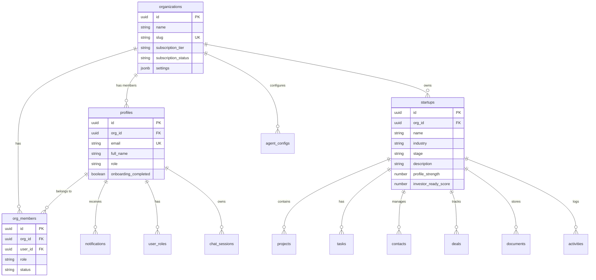

### 2. Project & Task Domain ERD

Project management and task tracking relationships.

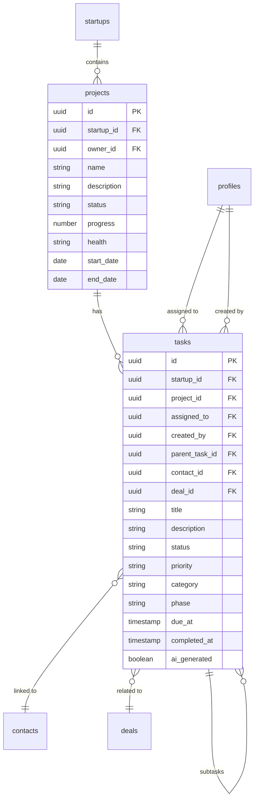

### 3. CRM Domain ERD

Customer relationship management entities.

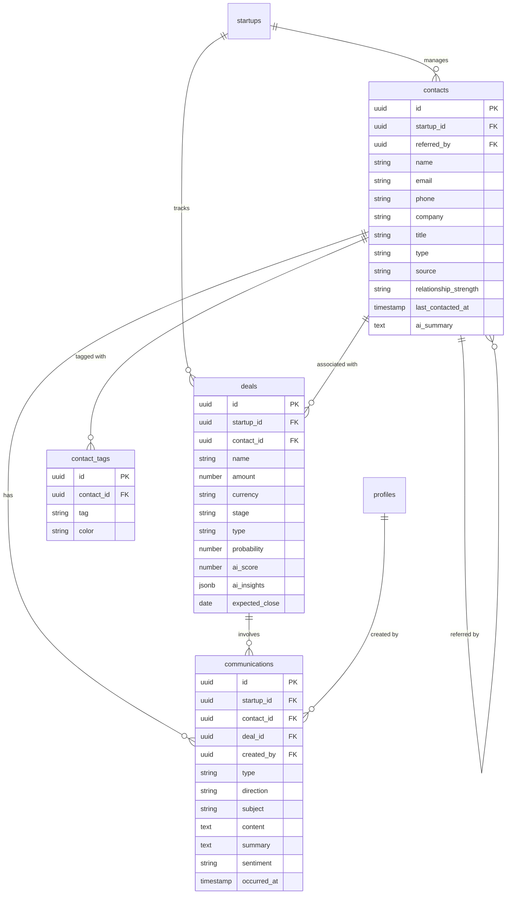

### 4. Documents Domain ERD

Document management including Lean Canvas and Pitch Decks.

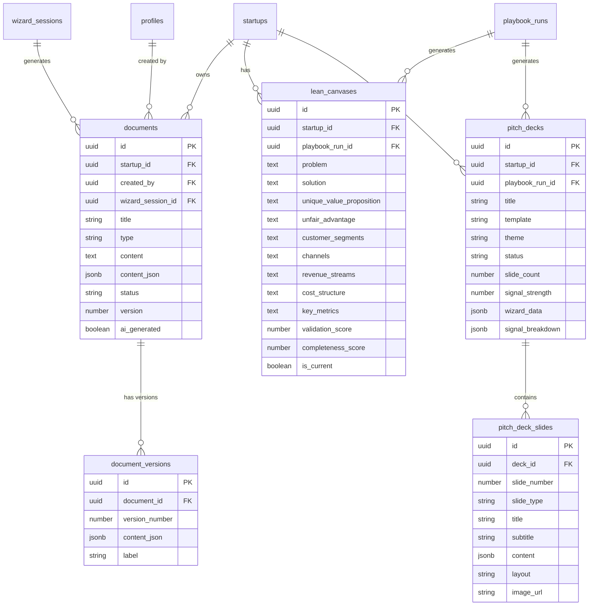

### 5. AI & Chat Domain ERD

AI operations, chat sessions, and agent configurations.

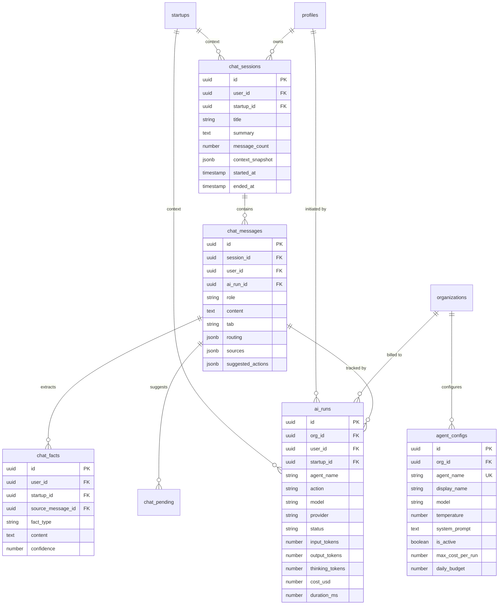

### 6. Events Domain ERD

Event management for conferences, meetings, and hosted events.

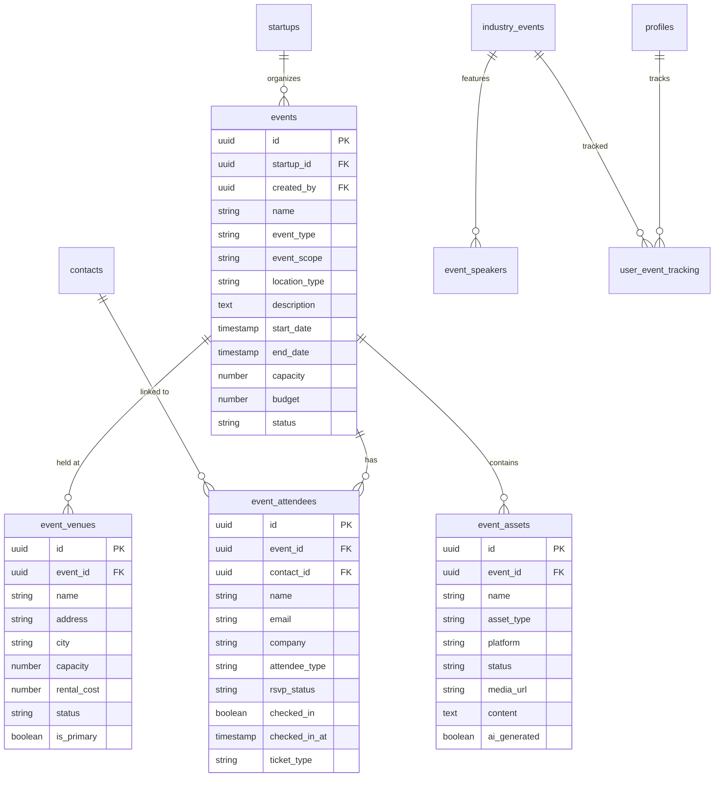

### 7. Validation & Playbook Domain ERD

Startup validation workflows and playbook execution.

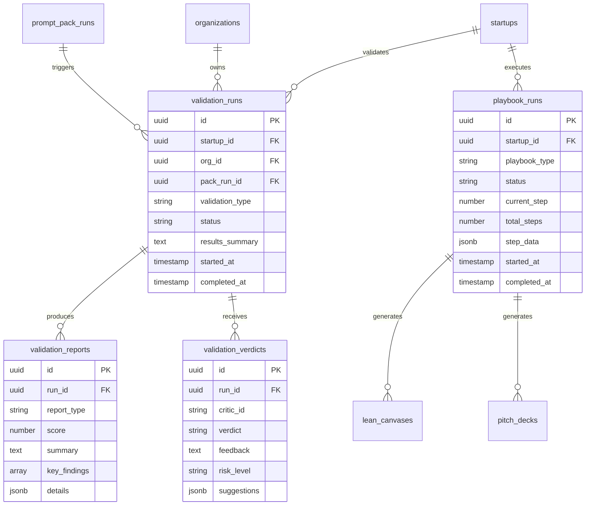

### 8. Wizard & Onboarding Domain ERD

Onboarding wizard sessions and data extraction.

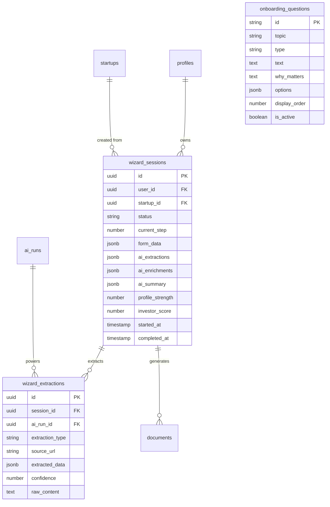

---

## Data Flow Diagrams

### 1. User Onboarding Flow

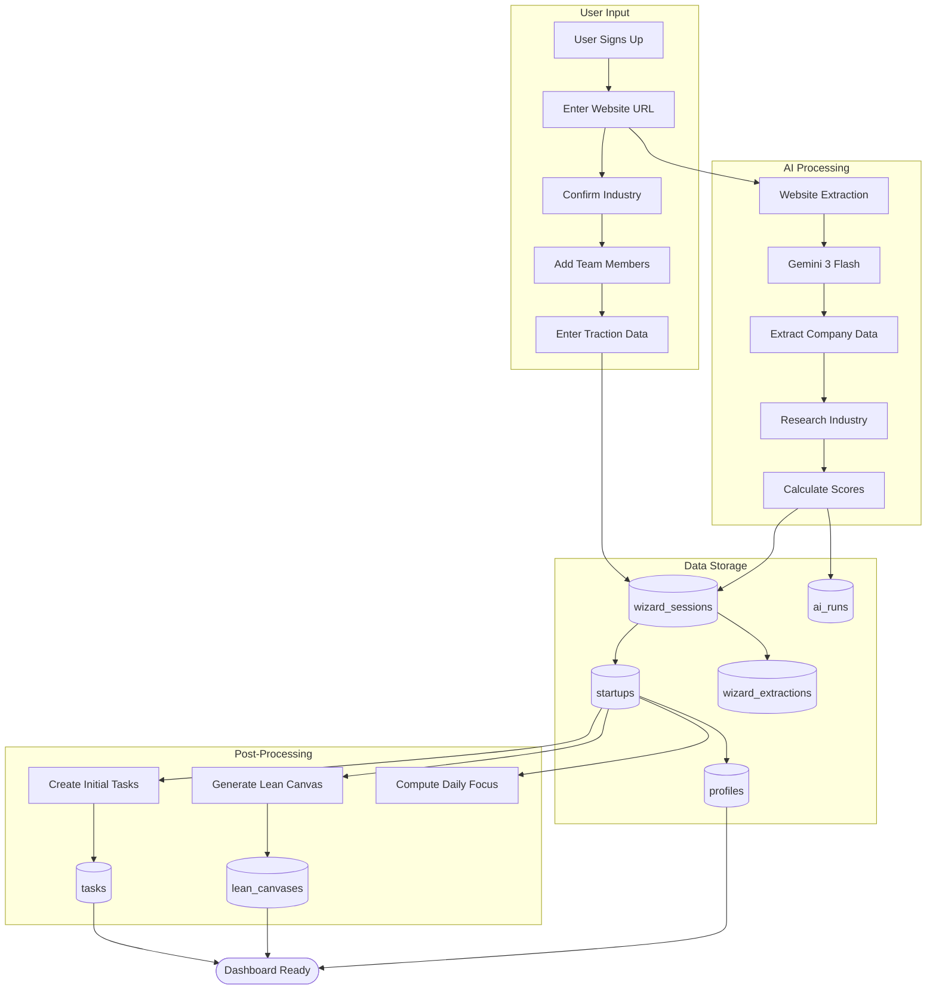

### 2. AI Chat Message Flow

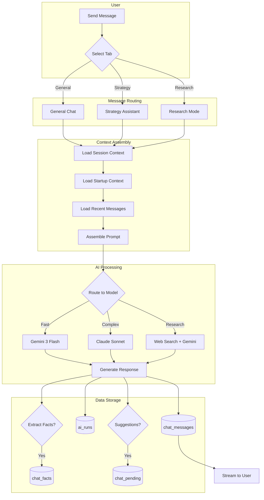

### 3. Pitch Deck Generation Flow

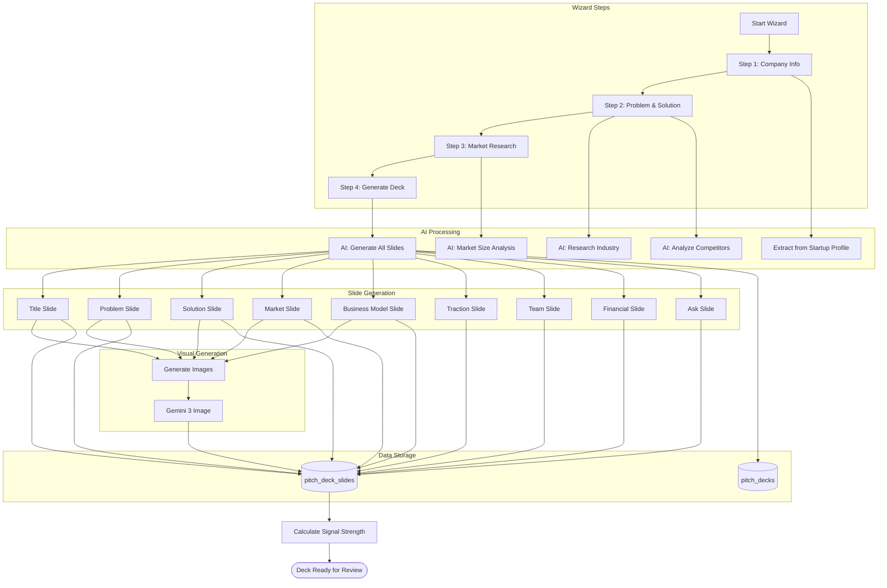

### 4. CRM Workflow Flow

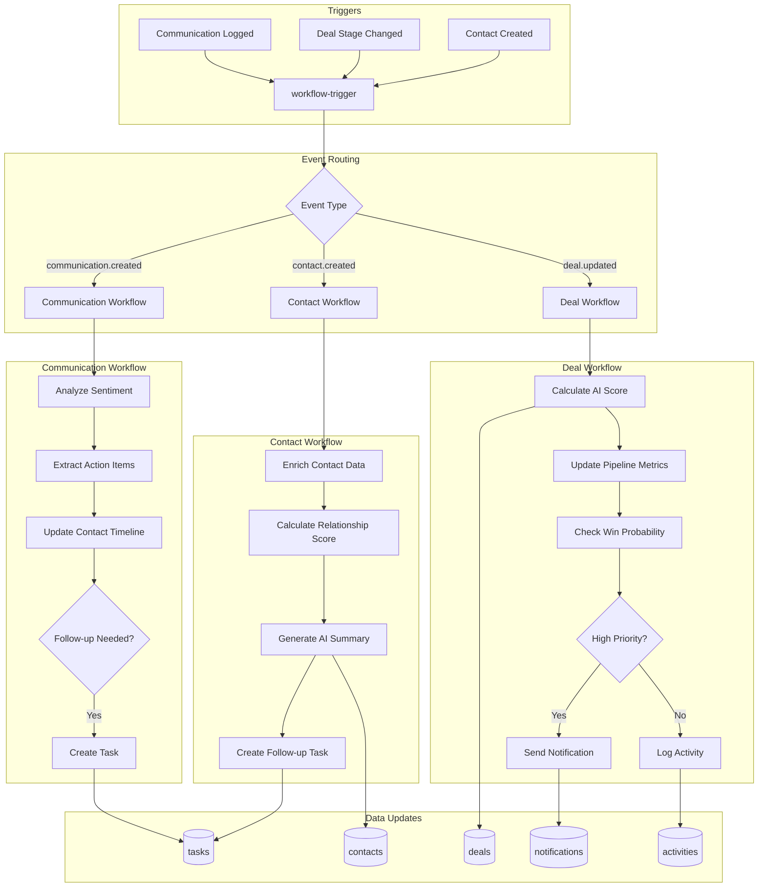

### 5. Validation Run Flow

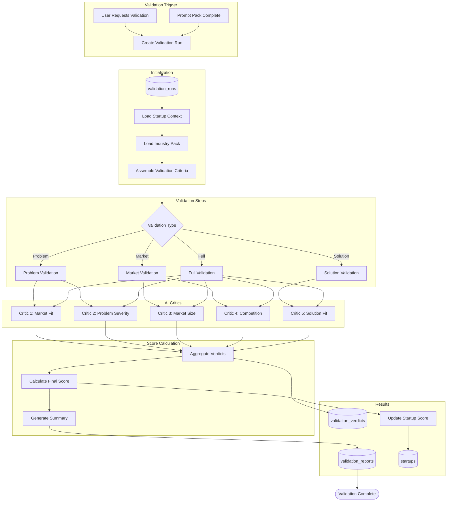

### 6. Activity Logging Flow

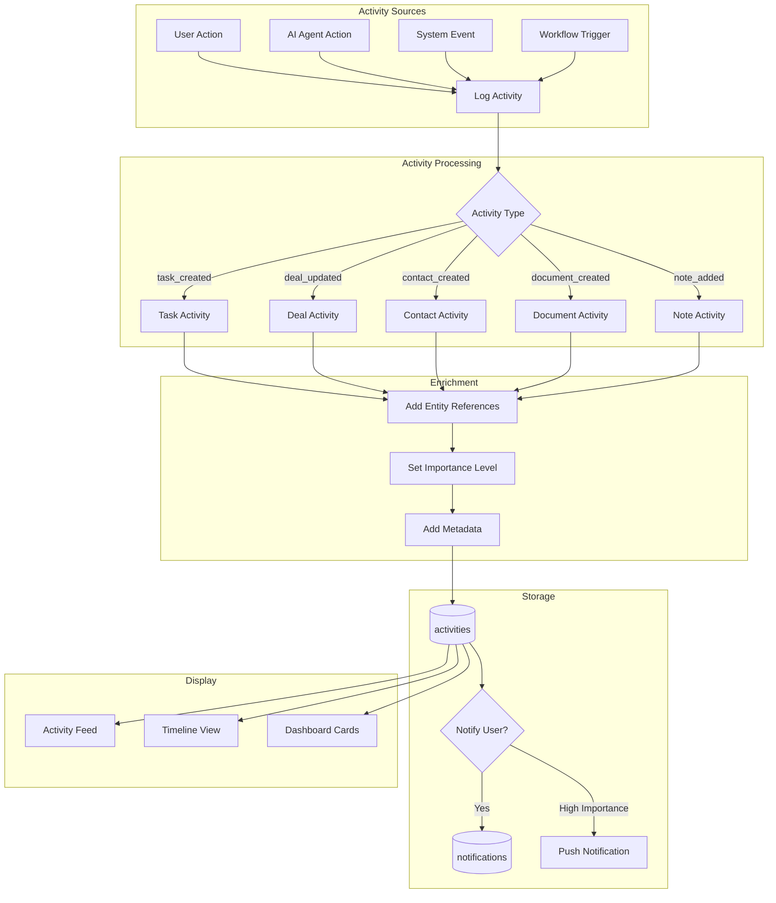

---

## Table Relationship Summary

### Core Tables Dependency Map

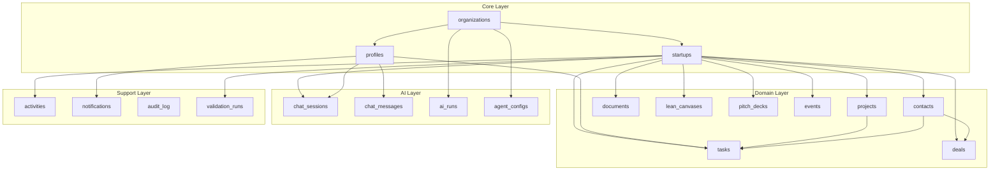

---

## Index Strategy

### Primary Indexes (Automatic)

All tables have primary key indexes on `id` column.

### Foreign Key Indexes

| Table | Index Column | Referenced Table |
|-------|-------------|------------------|
| startups | org_id | organizations |
| profiles | org_id | organizations |
| projects | startup_id | startups |
| tasks | startup_id, project_id | startups, projects |
| contacts | startup_id | startups |
| deals | startup_id, contact_id | startups, contacts |
| documents | startup_id | startups |
| activities | startup_id | startups |
| chat_sessions | user_id, startup_id | profiles, startups |
| ai_runs | org_id, user_id | organizations, profiles |

### Query Optimization Indexes

| Table | Index | Purpose |
|-------|-------|---------|
| tasks | (startup_id, status) | Task list filtering |
| tasks | (assigned_to, status) | User task view |
| contacts | (startup_id, type) | Contact filtering |
| deals | (startup_id, stage) | Pipeline view |
| activities | (startup_id, created_at) | Activity feed |
| chat_messages | (session_id, created_at) | Chat history |
| ai_runs | (created_at) | Cost tracking |

---

*Schema documentation maintained by StartupAI Engineering — Last updated 2026-02-02*
