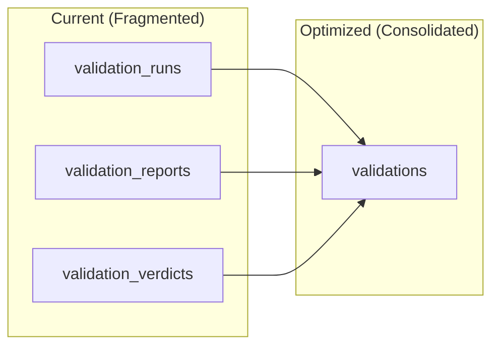
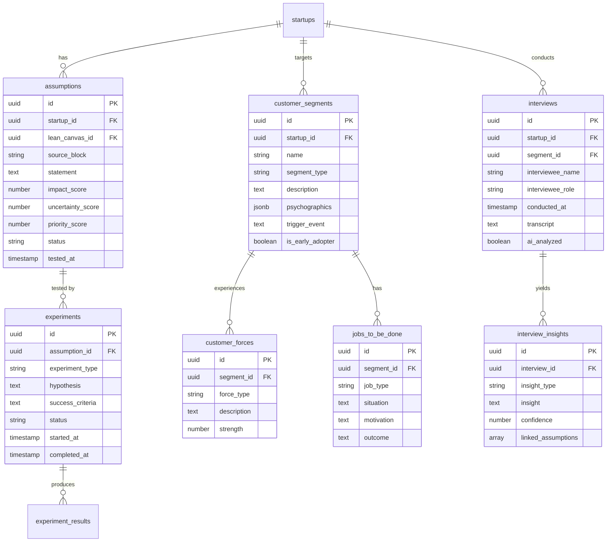
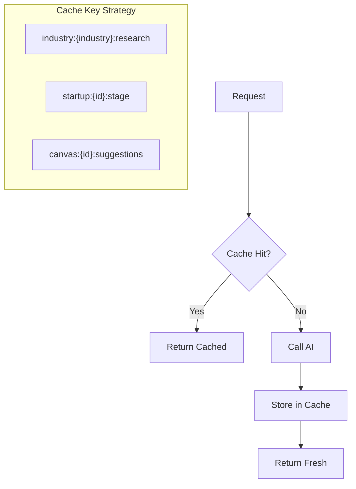
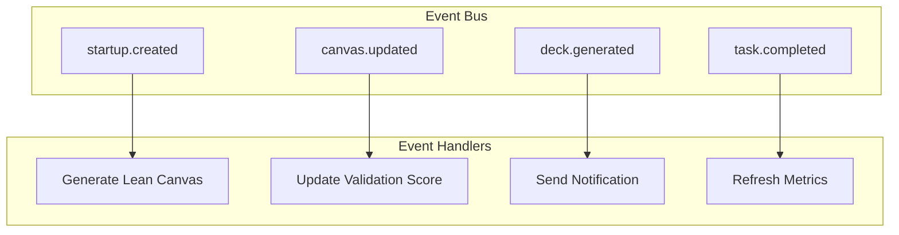
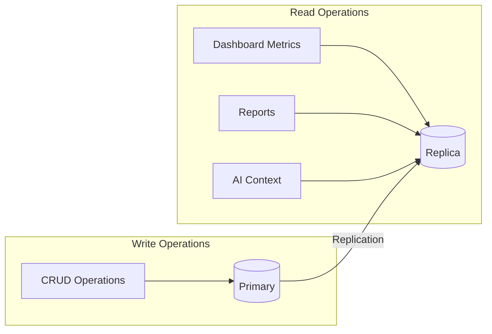

# Data System Optimization Recommendations

> **Updated:** 2026-02-02 | **Priority:** P1-P3 | **Impact:** High

---

## Executive Summary

After analyzing the current schema (60+ tables), edge functions (24 deployed), and UI requirements, this document outlines optimization opportunities across three areas:

1. **Schema Optimizations** - Reduce complexity, improve query performance
2. **Edge Function Optimizations** - Consolidate, add caching, improve patterns
3. **Missing Data Structures** - Support Lean Canvas wireframe features

### Quick Wins vs Strategic Changes

| Category | Quick Wins (1-2 days) | Strategic (1-2 weeks) |
|----------|----------------------|----------------------|
| Schema | Add indexes, fix JSONB usage | Consolidation, materialized views |
| Edge Functions | Add caching, shared utilities | Function consolidation, streaming |
| Architecture | Connection pooling | Event-driven triggers |

---

## Part 1: Schema Optimizations

### 1.1 Table Consolidation Opportunities

**Current Issue:** Some domains have excessive table fragmentation.



**Recommendations:**

| Current Tables | Consolidate To | Benefit |
|---------------|----------------|---------|
| validation_runs + validation_reports + validation_verdicts | validations (with JSONB reports/verdicts) | 2 fewer tables, simpler queries |
| chat_facts + chat_pending | chat_insights (type discriminator) | 1 fewer table, unified insights |
| contact_tags (separate table) | contacts.tags (JSONB array) | Already using tags array, remove redundant |

### 1.2 Missing Indexes (High Priority)

Based on query patterns from the UI wireframes:

```sql
-- Task filtering (most common query)
CREATE INDEX idx_tasks_startup_status_priority
ON tasks(startup_id, status, priority);

-- Lean Canvas versions (version selector in UI)
CREATE INDEX idx_lean_canvases_startup_current
ON lean_canvases(startup_id, is_current, version DESC);

-- Assumption tracking (Risk Board)
CREATE INDEX idx_assumptions_startup_status
ON assumptions(startup_id, status, priority_score DESC);

-- Activity feed (Dashboard)
CREATE INDEX idx_activities_startup_created
ON activities(startup_id, created_at DESC)
INCLUDE (activity_type, title);

-- Chat sessions (recent first)
CREATE INDEX idx_chat_sessions_user_started
ON chat_sessions(user_id, started_at DESC);

-- AI runs (cost tracking dashboard)
CREATE INDEX idx_ai_runs_org_created
ON ai_runs(org_id, created_at DESC)
INCLUDE (cost_usd, agent_name);
```

### 1.3 JSONB Optimization

**Issue:** Heavy JSONB usage without proper indexes.

**Current:**
```typescript
// lean_canvases uses text fields for each box
problem: string | null
solution: string | null
// etc.
```

**Recommendation:** Keep text fields (already good), but add for complex JSONB:

```sql
-- For startup.traction_data (frequently queried)
CREATE INDEX idx_startups_traction_mrr
ON startups USING GIN ((traction_data->'metrics'));

-- For wizard_sessions.form_data (wizard resume)
CREATE INDEX idx_wizard_sessions_step
ON wizard_sessions(user_id, status, current_step);

-- For ai_runs.request_metadata (debugging)
CREATE INDEX idx_ai_runs_metadata
ON ai_runs USING GIN (request_metadata)
WHERE status = 'error';
```

### 1.4 Missing Tables for UI Features

Based on the wireframes, these tables are needed:



### 1.5 Materialized Views for Dashboard

**Issue:** Dashboard metrics require expensive queries.

**Recommendation:** Add materialized views:

```sql
-- Dashboard metrics (refresh every 5 minutes)
CREATE MATERIALIZED VIEW mv_startup_metrics AS
SELECT
    s.id as startup_id,
    s.org_id,
    COUNT(DISTINCT t.id) FILTER (WHERE t.status = 'completed') as tasks_completed,
    COUNT(DISTINCT t.id) FILTER (WHERE t.status = 'pending') as tasks_pending,
    COUNT(DISTINCT d.id) as total_deals,
    SUM(d.amount) FILTER (WHERE d.stage = 'won') as revenue_won,
    COUNT(DISTINCT c.id) as total_contacts,
    MAX(a.created_at) as last_activity,
    lc.completeness_score as canvas_completeness,
    pd.signal_strength as deck_signal
FROM startups s
LEFT JOIN tasks t ON t.startup_id = s.id
LEFT JOIN deals d ON d.startup_id = s.id
LEFT JOIN contacts c ON c.startup_id = s.id
LEFT JOIN activities a ON a.startup_id = s.id
LEFT JOIN lean_canvases lc ON lc.startup_id = s.id AND lc.is_current = true
LEFT JOIN pitch_decks pd ON pd.startup_id = s.id AND pd.status = 'active'
GROUP BY s.id, s.org_id, lc.completeness_score, pd.signal_strength;

-- Refresh function
CREATE OR REPLACE FUNCTION refresh_startup_metrics()
RETURNS void AS $$
BEGIN
    REFRESH MATERIALIZED VIEW CONCURRENTLY mv_startup_metrics;
END;
$$ LANGUAGE plpgsql;
```

---

## Part 2: Edge Function Optimizations

### 2.1 Function Consolidation

**Current Issue:** 24 functions with overlapping functionality.

```mermaid
flowchart TB
    subgraph CURRENT["Current (24 Functions)"]
        A[onboarding-agent]
        B[ai-chat]
        C[pitch-deck-agent]
        D[lean-canvas-agent]
        E[documents-agent]
        F[crm-agent]
        G[stage-analyzer]
        H[dashboard-metrics]
        I[workflow-trigger]
        J[compute-daily-focus]
        K[deal-insights]
        L[contact-score]
        M[website-insights]
        N[logo-generator]
        O[task-generator]
    end

    subgraph OPTIMIZED["Optimized (15 Functions)"]
        P[startup-agent]
        Q[ai-chat]
        R[document-agent]
        S[crm-agent]
        T[analytics-agent]
        U[workflow-engine]
        V[media-generator]
    end

    A --> P
    G --> P
    M --> P

    C --> R
    D --> R
    E --> R

    F --> S
    K --> S
    L --> S

    H --> T
    J --> T

    I --> U
    O --> U

    N --> V
```



**Consolidation Map:**

| Current Functions | Merge Into | Rationale |
|------------------|------------|-----------|
| onboarding-agent, stage-analyzer, website-insights | startup-agent | All startup-context operations |
| pitch-deck-agent, lean-canvas-agent, documents-agent | document-agent | All document generation |
| crm-agent, deal-insights, contact-score | crm-agent | All CRM intelligence |
| dashboard-metrics, compute-daily-focus | analytics-agent | All metrics/analytics |
| workflow-trigger, task-generator | workflow-engine | All automation |
| logo-generator | media-generator | All media generation |

**Benefit:** 24 → 15 functions (37% reduction), easier maintenance.

### 2.2 Shared Utilities Pattern

**Current Issue:** Each function has duplicate code.

**Recommendation:** Create `_shared` module:

```
supabase/functions/
├── _shared/
│   ├── ai-client.ts        # Gemini/Claude client factory
│   ├── auth.ts             # JWT verification
│   ├── cors.ts             # CORS headers
│   ├── database.ts         # Supabase client factory
│   ├── errors.ts           # Error handling
│   ├── logging.ts          # Structured logging
│   ├── rate-limit.ts       # Rate limiting
│   └── cache.ts            # Response caching
├── startup-agent/
│   └── index.ts            # Import from _shared
└── ...
```

**Shared AI Client:**
```typescript
// _shared/ai-client.ts
export function createAIClient(model: 'flash' | 'pro' | 'sonnet') {
  const configs = {
    flash: { provider: 'gemini', model: 'gemini-3-flash-preview' },
    pro: { provider: 'gemini', model: 'gemini-3-pro-preview' },
    sonnet: { provider: 'anthropic', model: 'claude-sonnet-4-5' }
  };
  // ... client creation with proper API keys
}
```

### 2.3 Caching Strategy

**Current Issue:** No caching, repeated expensive AI calls.

**Recommendation:** Add Redis-like caching pattern:



**Implementation:**
```typescript
// _shared/cache.ts
const CACHE_TTL = {
  industry_research: 24 * 60 * 60,  // 24 hours
  stage_analysis: 1 * 60 * 60,       // 1 hour
  canvas_suggestions: 15 * 60,       // 15 minutes
};

export async function withCache<T>(
  key: string,
  ttl: number,
  fn: () => Promise<T>
): Promise<T> {
  const cached = await kv.get(key);
  if (cached) return JSON.parse(cached);

  const result = await fn();
  await kv.set(key, JSON.stringify(result), { ex: ttl });
  return result;
}
```

### 2.4 Streaming for Long Operations

**Current Issue:** Pitch deck generation times out.

**Recommendation:** Add streaming support:

```typescript
// pitch-deck-agent with streaming
Deno.serve(async (req) => {
  const stream = new ReadableStream({
    async start(controller) {
      // Send progress updates
      controller.enqueue(encode({ type: 'progress', step: 1, total: 10 }));

      // Generate each slide
      for (const slide of slides) {
        const content = await generateSlide(slide);
        controller.enqueue(encode({ type: 'slide', data: content }));
      }

      controller.enqueue(encode({ type: 'complete' }));
      controller.close();
    }
  });

  return new Response(stream, {
    headers: { 'Content-Type': 'text/event-stream' }
  });
});
```

### 2.5 Batch Operations

**Current Issue:** Multiple single-record operations.

**Recommendation:** Add batch endpoints:

```typescript
// Current: N calls for N tasks
POST /task-generator { startup_id, template: 'mvp-launch' }

// Optimized: 1 call for N tasks
POST /task-generator {
  action: 'batch_create',
  startup_id,
  tasks: [
    { template: 'mvp-launch' },
    { template: 'customer-discovery' },
    { template: 'fundraising' }
  ]
}
```

---

## Part 3: Architecture Improvements

### 3.1 Database Triggers vs Edge Functions

**Current Issue:** Some workflows are better as database triggers.

**Move to Triggers:**

| Current Edge Function | Move To | Trigger |
|----------------------|---------|---------|
| Activity logging | Database trigger | AFTER INSERT/UPDATE on any table |
| Notification creation | Database trigger | AFTER INSERT on tasks, deals |
| Cache invalidation | Database trigger | AFTER UPDATE on startups |
| Audit logging | Database trigger | AFTER ALL on audited tables |

**Example Trigger:**
```sql
CREATE OR REPLACE FUNCTION log_activity()
RETURNS TRIGGER AS $$
BEGIN
    INSERT INTO activities (
        startup_id,
        activity_type,
        entity_type,
        entity_id,
        title,
        is_system_generated
    ) VALUES (
        NEW.startup_id,
        TG_ARGV[0],
        TG_TABLE_NAME,
        NEW.id,
        COALESCE(NEW.title, NEW.name, 'Record updated'),
        true
    );
    RETURN NEW;
END;
$$ LANGUAGE plpgsql;

CREATE TRIGGER tasks_activity_trigger
AFTER INSERT OR UPDATE ON tasks
FOR EACH ROW EXECUTE FUNCTION log_activity('task_updated');
```

### 3.2 Event-Driven Architecture

**Recommendation:** Move to event-driven pattern:



**Implementation via pg_notify:**
```sql
-- Emit event on startup creation
CREATE OR REPLACE FUNCTION emit_startup_event()
RETURNS TRIGGER AS $$
BEGIN
    PERFORM pg_notify(
        'startup_events',
        json_build_object(
            'event', 'startup.created',
            'startup_id', NEW.id,
            'org_id', NEW.org_id
        )::text
    );
    RETURN NEW;
END;
$$ LANGUAGE plpgsql;
```

### 3.3 Connection Pooling

**Current Issue:** Each edge function creates new connection.

**Recommendation:** Use Supabase connection pooler:

```typescript
// Use transaction mode for short queries
const supabase = createClient(
  Deno.env.get("SUPABASE_URL")!,
  Deno.env.get("SUPABASE_ANON_KEY")!,
  {
    db: {
      schema: 'public'
    },
    global: {
      headers: { 'x-connection-mode': 'transaction' }
    }
  }
);
```

### 3.4 Read Replicas for Analytics

**Recommendation:** Route analytics queries to read replica:



---

## Part 4: Priority Implementation Order

### Phase 1: Quick Wins (Week 1)

| Task | Impact | Effort |
|------|--------|--------|
| Add missing indexes | High | Low |
| Create _shared utilities | Medium | Low |
| Add caching to industry research | High | Medium |
| Fix JSONB indexes | Medium | Low |

### Phase 2: Consolidation (Week 2)

| Task | Impact | Effort |
|------|--------|--------|
| Consolidate 24→15 edge functions | High | Medium |
| Add materialized views | High | Medium |
| Implement batch operations | Medium | Medium |
| Add database triggers for logging | Medium | Medium |

### Phase 3: New Features (Week 3)

| Task | Impact | Effort |
|------|--------|--------|
| Create assumptions table | High | Low |
| Create experiments table | High | Low |
| Create customer_segments table | Medium | Low |
| Create interviews table | Medium | Low |

### Phase 4: Architecture (Week 4)

| Task | Impact | Effort |
|------|--------|--------|
| Implement event-driven pattern | High | High |
| Add streaming to long operations | Medium | Medium |
| Set up connection pooling | Medium | Low |
| Configure read replicas | Low | Medium |

---

## Metrics to Track

| Metric | Current | Target | How to Measure |
|--------|---------|--------|----------------|
| Avg query time | ~200ms | <50ms | pg_stat_statements |
| Edge function cold start | ~500ms | <200ms | Function logs |
| AI cache hit rate | 0% | >60% | Cache metrics |
| Database connections | Peak 50 | Peak 20 | Connection pooler |
| Error rate | ~2% | <0.5% | Sentry/logs |

---

## Summary

### Schema
- Add 6 missing indexes for common queries
- Create 4 new tables for assumption/experiment tracking
- Add 2 materialized views for dashboard performance
- Consolidate 3 validation tables into 1

### Edge Functions
- Consolidate 24 → 15 functions
- Add shared utilities module
- Implement caching layer
- Add streaming for long operations

### Architecture
- Move activity logging to database triggers
- Implement event-driven pattern
- Configure connection pooling
- Add read replica routing

---

*Recommendations by StartupAI Engineering — 2026-02-02*
