# StartupAI System Diagrams

> **Version:** 2.0 | **Updated:** 2026-02-02 | **Diagrams:** 25+

---

## Table of Contents

1. [System Architecture](#1-system-architecture)
2. [AI Agents](#2-ai-agents)
3. [Edge Functions](#3-edge-functions)
4. [Database Schema](#4-database-schema)
5. [User Journeys](#5-user-journeys)
6. [State Machines](#6-state-machines)
7. [Data Flows](#7-data-flows)

---

## 1. System Architecture

### 1.1 System Context (C4 Level 1)

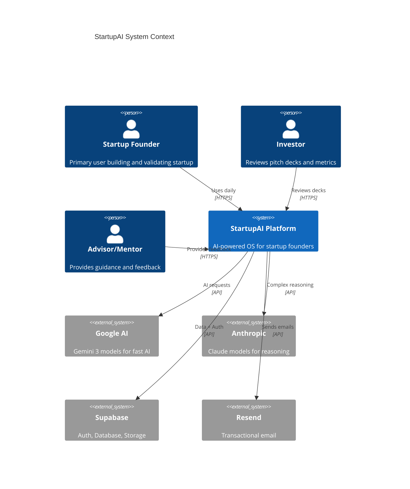
```mermaid
C4Context
    title StartupAI System Context

    Person(founder, "Startup Founder", "Primary user building and validating startup")
    Person(investor, "Investor", "Reviews pitch decks and metrics")
    Person(advisor, "Advisor/Mentor", "Provides guidance and feedback")

    System(startupai, "StartupAI Platform", "AI-powered OS for startup founders")

    System_Ext(google, "Google AI", "Gemini 3 models for fast AI")
    System_Ext(anthropic, "Anthropic", "Claude models for reasoning")
    System_Ext(supabase, "Supabase", "Auth, Database, Storage")
    System_Ext(resend, "Resend", "Transactional email")

    Rel(founder, startupai, "Uses daily", "HTTPS")
    Rel(investor, startupai, "Reviews decks", "HTTPS")
    Rel(advisor, startupai, "Provides feedback", "HTTPS")

    Rel(startupai, google, "AI requests", "API")
    Rel(startupai, anthropic, "Complex reasoning", "API")
    Rel(startupai, supabase, "Data + Auth", "API")
    Rel(startupai, resend, "Sends emails", "API")
```

### 1.2 Container Architecture (C4 Level 2)

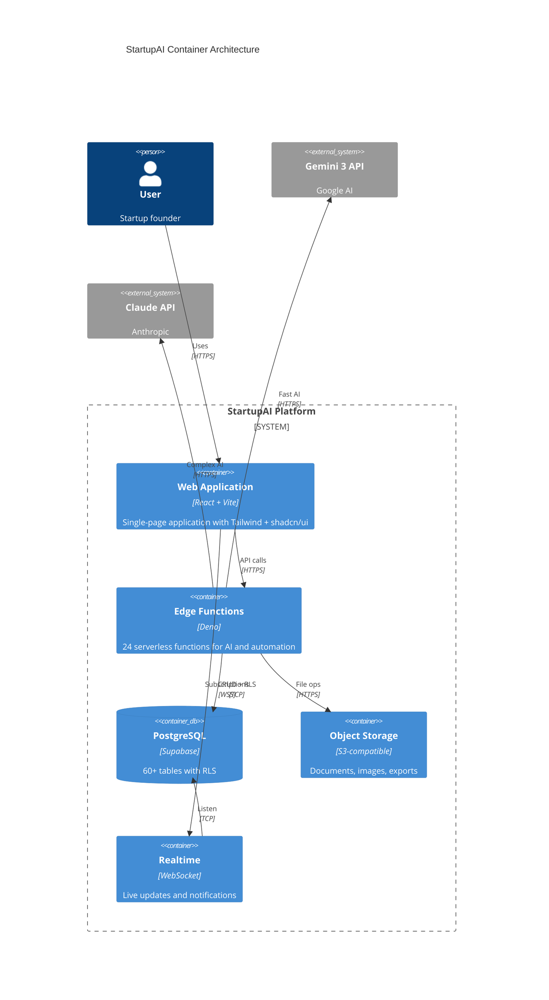
```mermaid
C4Container
    title StartupAI Container Architecture

    Person(user, "User", "Startup founder")

    System_Boundary(platform, "StartupAI Platform") {
        Container(spa, "Web Application", "React + Vite", "Single-page application with Tailwind + shadcn/ui")
        Container(edge, "Edge Functions", "Deno", "24 serverless functions for AI and automation")
        ContainerDb(db, "PostgreSQL", "Supabase", "60+ tables with RLS")
        Container(storage, "Object Storage", "S3-compatible", "Documents, images, exports")
        Container(realtime, "Realtime", "WebSocket", "Live updates and notifications")
    }

    System_Ext(gemini, "Gemini 3 API", "Google AI")
    System_Ext(claude, "Claude API", "Anthropic")

    Rel(user, spa, "Uses", "HTTPS")
    Rel(spa, edge, "API calls", "HTTPS")
    Rel(spa, realtime, "Subscriptions", "WSS")
    Rel(edge, db, "CRUD + RLS", "TCP")
    Rel(edge, storage, "File ops", "HTTPS")
    Rel(edge, gemini, "Fast AI", "HTTPS")
    Rel(edge, claude, "Complex AI", "HTTPS")
    Rel(realtime, db, "Listen", "TCP")
```

### 1.3 Component Architecture (C4 Level 3)

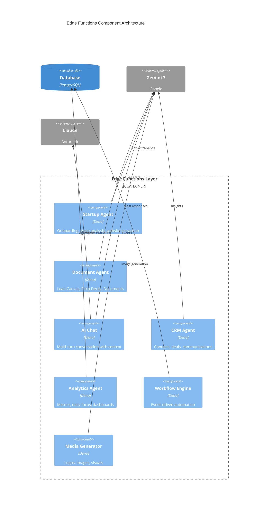
```mermaid
C4Component
    title Edge Functions Component Architecture

    Container_Boundary(edge, "Edge Functions Layer") {
        Component(startup_agent, "Startup Agent", "Deno", "Onboarding, stage analysis, website extraction")
        Component(document_agent, "Document Agent", "Deno", "Lean Canvas, Pitch Decks, Documents")
        Component(chat_agent, "AI Chat", "Deno", "Multi-turn conversation with context")
        Component(crm_agent, "CRM Agent", "Deno", "Contacts, deals, communications")
        Component(analytics_agent, "Analytics Agent", "Deno", "Metrics, daily focus, dashboards")
        Component(workflow_engine, "Workflow Engine", "Deno", "Event-driven automation")
        Component(media_gen, "Media Generator", "Deno", "Logos, images, visuals")
    }

    ContainerDb(db, "Database", "PostgreSQL")
    System_Ext(gemini, "Gemini 3", "Google")
    System_Ext(claude, "Claude", "Anthropic")

    Rel(startup_agent, gemini, "Extract/Analyze")
    Rel(document_agent, gemini, "Generate")
    Rel(chat_agent, gemini, "Fast responses")
    Rel(chat_agent, claude, "Complex reasoning")
    Rel(crm_agent, gemini, "Insights")
    Rel(analytics_agent, db, "Aggregate")
    Rel(workflow_engine, db, "Events")
    Rel(media_gen, gemini, "Image generation")
```

---

## 2. AI Agents

### 2.1 Agent Class Hierarchy

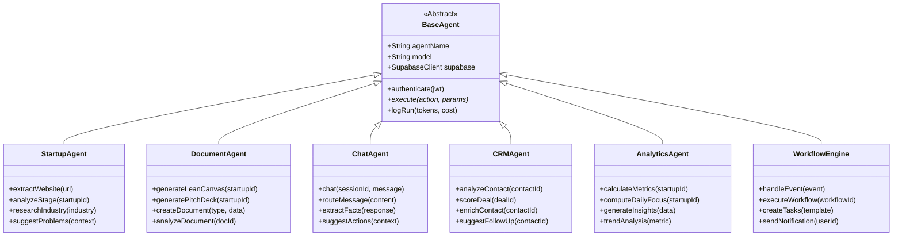
```mermaid
classDiagram
    class BaseAgent {
        <<Abstract>>
        +String agentName
        +String model
        +SupabaseClient supabase
        +authenticate(jwt)
        +execute(action, params)*
        +logRun(tokens, cost)
    }

    class StartupAgent {
        +extractWebsite(url)
        +analyzeStage(startupId)
        +researchIndustry(industry)
        +suggestProblems(context)
    }

    class DocumentAgent {
        +generateLeanCanvas(startupId)
        +generatePitchDeck(startupId)
        +createDocument(type, data)
        +analyzeDocument(docId)
    }

    class ChatAgent {
        +chat(sessionId, message)
        +routeMessage(content)
        +extractFacts(response)
        +suggestActions(context)
    }

    class CRMAgent {
        +analyzeContact(contactId)
        +scoreDeal(dealId)
        +enrichContact(contactId)
        +suggestFollowUp(contactId)
    }

    class AnalyticsAgent {
        +calculateMetrics(startupId)
        +computeDailyFocus(startupId)
        +generateInsights(data)
        +trendAnalysis(metric)
    }

    class WorkflowEngine {
        +handleEvent(event)
        +executeWorkflow(workflowId)
        +createTasks(template)
        +sendNotification(userId)
    }

    BaseAgent <|-- StartupAgent
    BaseAgent <|-- DocumentAgent
    BaseAgent <|-- ChatAgent
    BaseAgent <|-- CRMAgent
    BaseAgent <|-- AnalyticsAgent
    BaseAgent <|-- WorkflowEngine
```

### 2.2 Agent Tools Registry

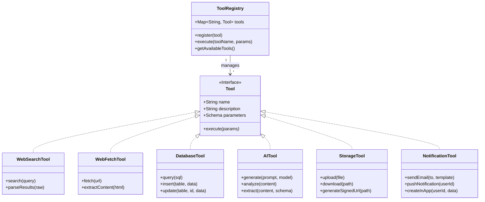
```mermaid
classDiagram
    class ToolRegistry {
        +Map~String, Tool~ tools
        +register(tool)
        +execute(toolName, params)
        +getAvailableTools()
    }

    class Tool {
        <<Interface>>
        +String name
        +String description
        +Schema parameters
        +execute(params)*
    }

    class WebSearchTool {
        +search(query)
        +parseResults(raw)
    }

    class WebFetchTool {
        +fetch(url)
        +extractContent(html)
    }

    class DatabaseTool {
        +query(sql)
        +insert(table, data)
        +update(table, id, data)
    }

    class AITool {
        +generate(prompt, model)
        +analyze(content)
        +extract(content, schema)
    }

    class StorageTool {
        +upload(file)
        +download(path)
        +generateSignedUrl(path)
    }

    class NotificationTool {
        +sendEmail(to, template)
        +pushNotification(userId)
        +createInApp(userId, data)
    }

    Tool <|.. WebSearchTool
    Tool <|.. WebFetchTool
    Tool <|.. DatabaseTool
    Tool <|.. AITool
    Tool <|.. StorageTool
    Tool <|.. NotificationTool

    ToolRegistry "1" --> "*" Tool : manages
```

### 2.3 Agent Execution Flow

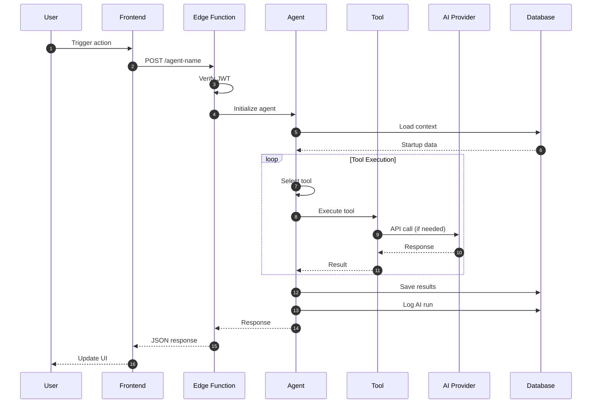
```mermaid
sequenceDiagram
    autonumber
    participant U as User
    participant F as Frontend
    participant E as Edge Function
    participant A as Agent
    participant T as Tool
    participant AI as AI Provider
    participant DB as Database

    U->>F: Trigger action
    F->>E: POST /agent-name
    E->>E: Verify JWT
    E->>A: Initialize agent

    A->>DB: Load context
    DB-->>A: Startup data

    loop Tool Execution
        A->>A: Select tool
        A->>T: Execute tool
        T->>AI: API call (if needed)
        AI-->>T: Response
        T-->>A: Result
    end

    A->>DB: Save results
    A->>DB: Log AI run
    A-->>E: Response
    E-->>F: JSON response
    F-->>U: Update UI
```

---

## 3. Edge Functions

### 3.1 Edge Functions Overview

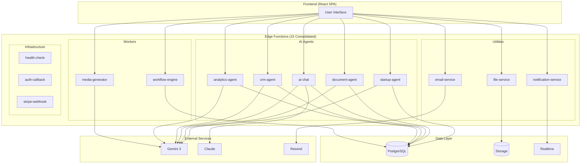
```mermaid
flowchart TB
    subgraph FRONTEND["Frontend (React SPA)"]
        UI[User Interface]
    end

    subgraph EDGE["Edge Functions (15 Consolidated)"]
        direction TB

        subgraph AI_AGENTS["AI Agents"]
            SA[startup-agent]
            DA[document-agent]
            CA[ai-chat]
            CRMA[crm-agent]
            AA[analytics-agent]
        end

        subgraph WORKERS["Workers"]
            WE[workflow-engine]
            MG[media-generator]
        end

        subgraph UTILS["Utilities"]
            EM[email-service]
            FS[file-service]
            NS[notification-service]
        end

        subgraph INFRA["Infrastructure"]
            HC[health-check]
            AC[auth-callback]
            SW[stripe-webhook]
        end
    end

    subgraph PROVIDERS["External Services"]
        GEM[Gemini 3]
        CLA[Claude]
        RES[Resend]
    end

    subgraph DATA["Data Layer"]
        DB[(PostgreSQL)]
        ST[(Storage)]
        RT[Realtime]
    end

    UI --> SA & DA & CA & CRMA & AA
    UI --> WE & MG
    UI --> EM & FS & NS

    SA & DA & CA --> GEM
    CA --> CLA
    CRMA & AA --> GEM
    MG --> GEM

    EM --> RES

    SA & DA & CA & CRMA & AA --> DB
    WE --> DB
    FS --> ST
    NS --> RT
```

### 3.2 Startup Agent Actions

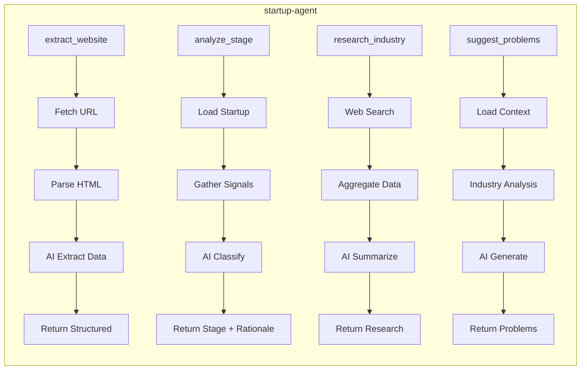
```mermaid
flowchart LR
    subgraph STARTUP_AGENT["startup-agent"]
        direction TB

        A[extract_website] --> A1[Fetch URL]
        A1 --> A2[Parse HTML]
        A2 --> A3[AI Extract Data]
        A3 --> A4[Return Structured]

        B[analyze_stage] --> B1[Load Startup]
        B1 --> B2[Gather Signals]
        B2 --> B3[AI Classify]
        B3 --> B4[Return Stage + Rationale]

        C[research_industry] --> C1[Web Search]
        C1 --> C2[Aggregate Data]
        C2 --> C3[AI Summarize]
        C3 --> C4[Return Research]

        D[suggest_problems] --> D1[Load Context]
        D1 --> D2[Industry Analysis]
        D2 --> D3[AI Generate]
        D3 --> D4[Return Problems]
    end
```

### 3.3 Document Agent Actions

```mermaid
flowchart LR
    subgraph DOCUMENT_AGENT["document-agent"]
        direction TB

        subgraph LEAN_CANVAS["Lean Canvas"]
            LC1[map_profile] --> LC2[prefill_canvas]
            LC2 --> LC3[suggest_box]
            LC3 --> LC4[validate_canvas]
            LC4 --> LC5[save_version]
        end

        subgraph PITCH_DECK["Pitch Deck"]
            PD1[save_wizard_step] --> PD2[generate_deck]
            PD2 --> PD3[update_slide]
            PD3 --> PD4[generate_images]
            PD4 --> PD5[get_signal_strength]
        end

        subgraph DOCUMENTS["Documents"]
            D1[create_document] --> D2[generate_content]
            D2 --> D3[save_document]
            D3 --> D4[export_pdf]
        end
    end
```

### 3.4 Workflow Engine Events

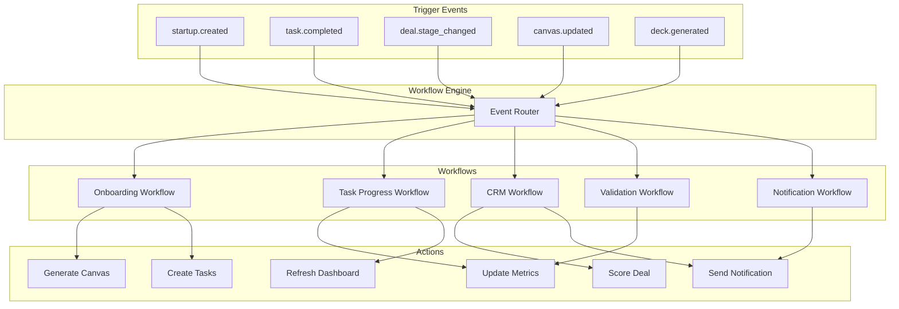
```mermaid
flowchart TD
    subgraph EVENTS["Trigger Events"]
        E1[startup.created]
        E2[task.completed]
        E3[deal.stage_changed]
        E4[canvas.updated]
        E5[deck.generated]
    end

    subgraph ENGINE["Workflow Engine"]
        R[Event Router]
    end

    subgraph WORKFLOWS["Workflows"]
        W1[Onboarding Workflow]
        W2[Task Progress Workflow]
        W3[CRM Workflow]
        W4[Validation Workflow]
        W5[Notification Workflow]
    end

    subgraph ACTIONS["Actions"]
        A1[Generate Canvas]
        A2[Create Tasks]
        A3[Update Metrics]
        A4[Score Deal]
        A5[Send Notification]
        A6[Refresh Dashboard]
    end

    E1 --> R
    E2 --> R
    E3 --> R
    E4 --> R
    E5 --> R

    R --> W1 & W2 & W3 & W4 & W5

    W1 --> A1 & A2
    W2 --> A3 & A6
    W3 --> A4 & A5
    W4 --> A3
    W5 --> A5
```

---

## 4. Database Schema

### 4.1 Core Domain ERD

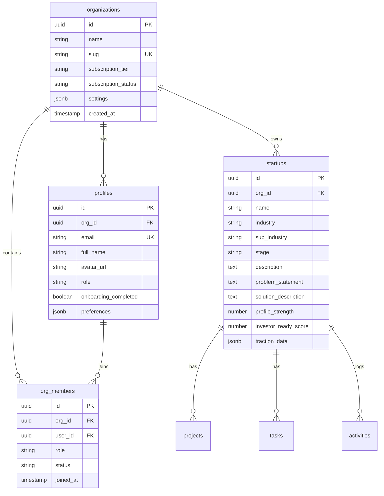
```mermaid
erDiagram
    organizations ||--o{ profiles : "has"
    organizations ||--o{ startups : "owns"
    organizations ||--o{ org_members : "contains"
    profiles ||--o{ org_members : "joins"
    startups ||--o{ projects : "has"
    startups ||--o{ tasks : "has"
    startups ||--o{ activities : "logs"

    organizations {
        uuid id PK
        string name
        string slug UK
        string subscription_tier
        string subscription_status
        jsonb settings
        timestamp created_at
    }

    profiles {
        uuid id PK
        uuid org_id FK
        string email UK
        string full_name
        string avatar_url
        string role
        boolean onboarding_completed
        jsonb preferences
    }

    startups {
        uuid id PK
        uuid org_id FK
        string name
        string industry
        string sub_industry
        string stage
        text description
        text problem_statement
        text solution_description
        number profile_strength
        number investor_ready_score
        jsonb traction_data
    }

    org_members {
        uuid id PK
        uuid org_id FK
        uuid user_id FK
        string role
        string status
        timestamp joined_at
    }
```

### 4.2 CRM Domain ERD

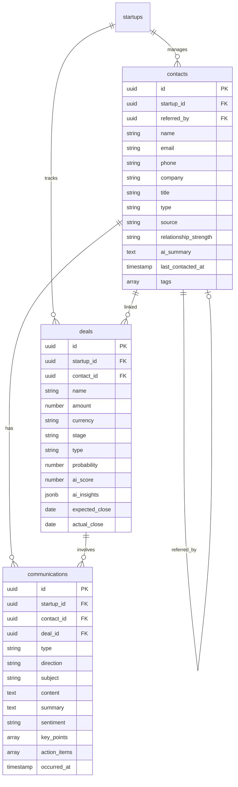
```mermaid
erDiagram
    startups ||--o{ contacts : "manages"
    startups ||--o{ deals : "tracks"
    contacts ||--o{ deals : "linked"
    contacts ||--o{ communications : "has"
    contacts ||--o| contacts : "referred_by"
    deals ||--o{ communications : "involves"

    contacts {
        uuid id PK
        uuid startup_id FK
        uuid referred_by FK
        string name
        string email
        string phone
        string company
        string title
        string type
        string source
        string relationship_strength
        text ai_summary
        timestamp last_contacted_at
        array tags
    }

    deals {
        uuid id PK
        uuid startup_id FK
        uuid contact_id FK
        string name
        number amount
        string currency
        string stage
        string type
        number probability
        number ai_score
        jsonb ai_insights
        date expected_close
        date actual_close
    }

    communications {
        uuid id PK
        uuid startup_id FK
        uuid contact_id FK
        uuid deal_id FK
        string type
        string direction
        string subject
        text content
        text summary
        string sentiment
        array key_points
        array action_items
        timestamp occurred_at
    }
```

### 4.3 Documents Domain ERD

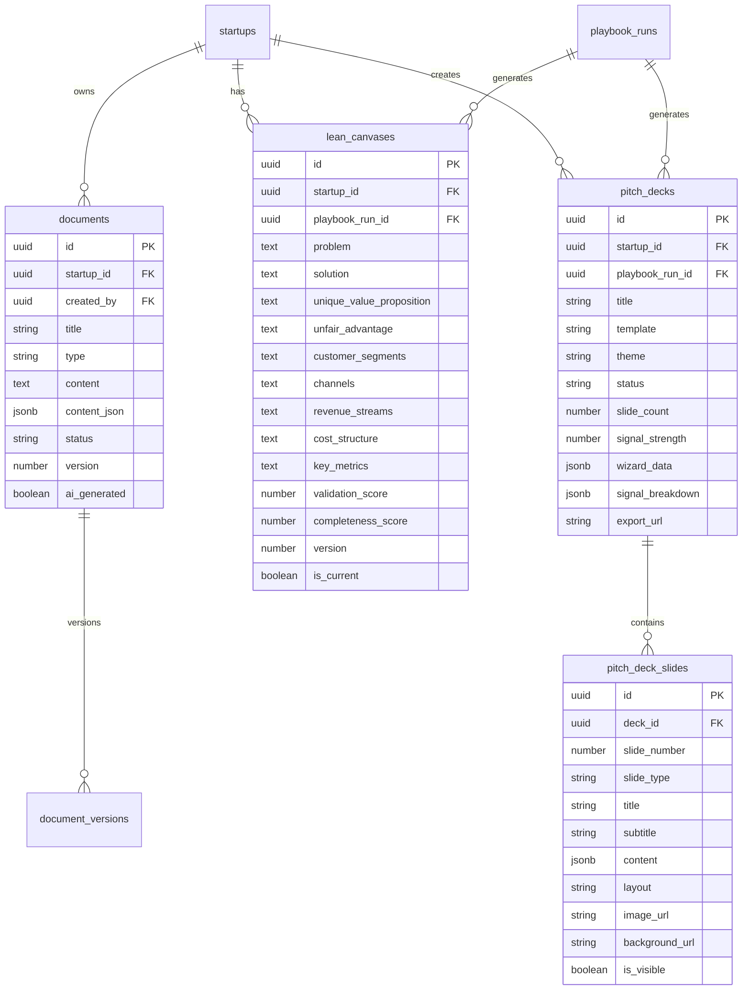
```mermaid
erDiagram
    startups ||--o{ documents : "owns"
    startups ||--o{ lean_canvases : "has"
    startups ||--o{ pitch_decks : "creates"
    documents ||--o{ document_versions : "versions"
    pitch_decks ||--o{ pitch_deck_slides : "contains"
    playbook_runs ||--o{ lean_canvases : "generates"
    playbook_runs ||--o{ pitch_decks : "generates"

    documents {
        uuid id PK
        uuid startup_id FK
        uuid created_by FK
        string title
        string type
        text content
        jsonb content_json
        string status
        number version
        boolean ai_generated
    }

    lean_canvases {
        uuid id PK
        uuid startup_id FK
        uuid playbook_run_id FK
        text problem
        text solution
        text unique_value_proposition
        text unfair_advantage
        text customer_segments
        text channels
        text revenue_streams
        text cost_structure
        text key_metrics
        number validation_score
        number completeness_score
        number version
        boolean is_current
    }

    pitch_decks {
        uuid id PK
        uuid startup_id FK
        uuid playbook_run_id FK
        string title
        string template
        string theme
        string status
        number slide_count
        number signal_strength
        jsonb wizard_data
        jsonb signal_breakdown
        string export_url
    }

    pitch_deck_slides {
        uuid id PK
        uuid deck_id FK
        number slide_number
        string slide_type
        string title
        string subtitle
        jsonb content
        string layout
        string image_url
        string background_url
        boolean is_visible
    }
```

### 4.4 AI & Chat Domain ERD

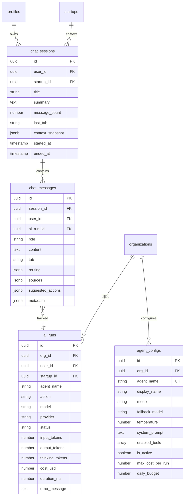
```mermaid
erDiagram
    profiles ||--o{ chat_sessions : "owns"
    startups ||--o{ chat_sessions : "context"
    chat_sessions ||--o{ chat_messages : "contains"
    chat_messages }o--|| ai_runs : "tracked"
    organizations ||--o{ ai_runs : "billed"
    organizations ||--o{ agent_configs : "configures"

    chat_sessions {
        uuid id PK
        uuid user_id FK
        uuid startup_id FK
        string title
        text summary
        number message_count
        string last_tab
        jsonb context_snapshot
        timestamp started_at
        timestamp ended_at
    }

    chat_messages {
        uuid id PK
        uuid session_id FK
        uuid user_id FK
        uuid ai_run_id FK
        string role
        text content
        string tab
        jsonb routing
        jsonb sources
        jsonb suggested_actions
        jsonb metadata
    }

    ai_runs {
        uuid id PK
        uuid org_id FK
        uuid user_id FK
        uuid startup_id FK
        string agent_name
        string action
        string model
        string provider
        string status
        number input_tokens
        number output_tokens
        number thinking_tokens
        number cost_usd
        number duration_ms
        text error_message
    }

    agent_configs {
        uuid id PK
        uuid org_id FK
        string agent_name UK
        string display_name
        string model
        string fallback_model
        number temperature
        text system_prompt
        array enabled_tools
        boolean is_active
        number max_cost_per_run
        number daily_budget
    }
```

### 4.5 Validation Domain ERD (New)

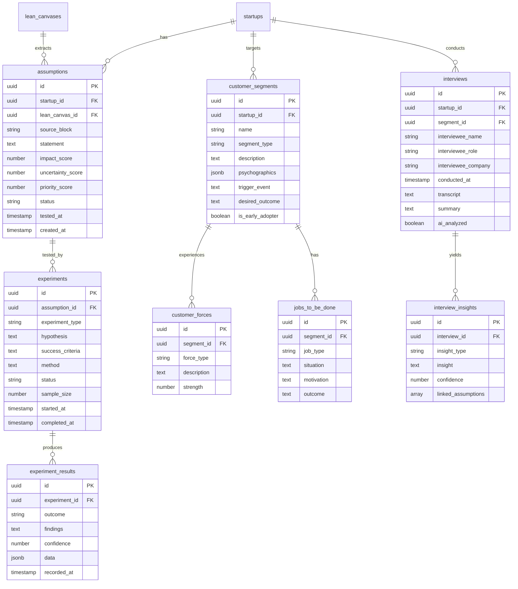
```mermaid
erDiagram
    startups ||--o{ assumptions : "has"
    lean_canvases ||--o{ assumptions : "extracts"
    assumptions ||--o{ experiments : "tested_by"
    experiments ||--o{ experiment_results : "produces"
    startups ||--o{ customer_segments : "targets"
    customer_segments ||--o{ customer_forces : "experiences"
    customer_segments ||--o{ jobs_to_be_done : "has"
    startups ||--o{ interviews : "conducts"
    interviews ||--o{ interview_insights : "yields"

    assumptions {
        uuid id PK
        uuid startup_id FK
        uuid lean_canvas_id FK
        string source_block
        text statement
        number impact_score
        number uncertainty_score
        number priority_score
        string status
        timestamp tested_at
        timestamp created_at
    }

    experiments {
        uuid id PK
        uuid assumption_id FK
        string experiment_type
        text hypothesis
        text success_criteria
        text method
        string status
        number sample_size
        timestamp started_at
        timestamp completed_at
    }

    experiment_results {
        uuid id PK
        uuid experiment_id FK
        string outcome
        text findings
        number confidence
        jsonb data
        timestamp recorded_at
    }

    customer_segments {
        uuid id PK
        uuid startup_id FK
        string name
        string segment_type
        text description
        jsonb psychographics
        text trigger_event
        text desired_outcome
        boolean is_early_adopter
    }

    customer_forces {
        uuid id PK
        uuid segment_id FK
        string force_type
        text description
        number strength
    }

    jobs_to_be_done {
        uuid id PK
        uuid segment_id FK
        string job_type
        text situation
        text motivation
        text outcome
    }

    interviews {
        uuid id PK
        uuid startup_id FK
        uuid segment_id FK
        string interviewee_name
        string interviewee_role
        string interviewee_company
        timestamp conducted_at
        text transcript
        text summary
        boolean ai_analyzed
    }

    interview_insights {
        uuid id PK
        uuid interview_id FK
        string insight_type
        text insight
        number confidence
        array linked_assumptions
    }
```

---

## 5. User Journeys

### 5.1 Founder Onboarding Journey

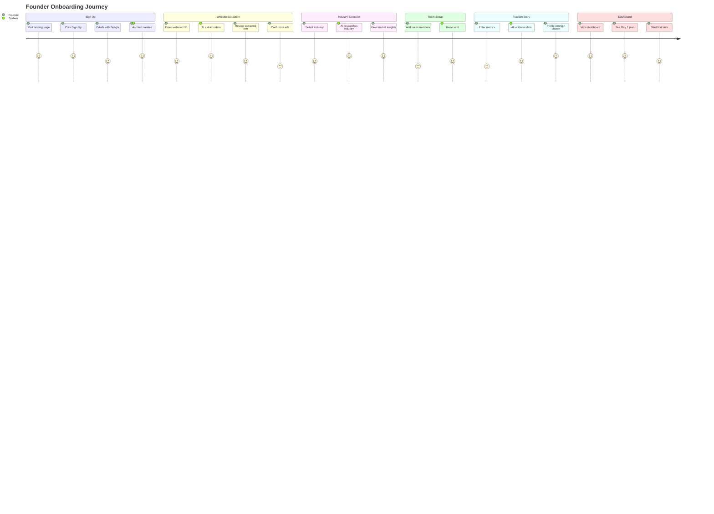
```mermaid
journey
    title Founder Onboarding Journey
    section Sign Up
        Visit landing page: 5: Founder
        Click Sign Up: 5: Founder
        OAuth with Google: 4: Founder
        Account created: 5: Founder, System
    section Website Extraction
        Enter website URL: 4: Founder
        AI extracts data: 5: System
        Review extracted info: 4: Founder
        Confirm or edit: 3: Founder
    section Industry Selection
        Select industry: 4: Founder
        AI researches industry: 5: System
        View market insights: 5: Founder
    section Team Setup
        Add team members: 3: Founder
        Invite sent: 4: System
    section Traction Entry
        Enter metrics: 3: Founder
        AI validates data: 4: System
        Profile strength shown: 5: Founder
    section Dashboard
        View dashboard: 5: Founder
        See Day 1 plan: 5: Founder
        Start first task: 4: Founder
```

### 5.2 Lean Canvas Creation Journey

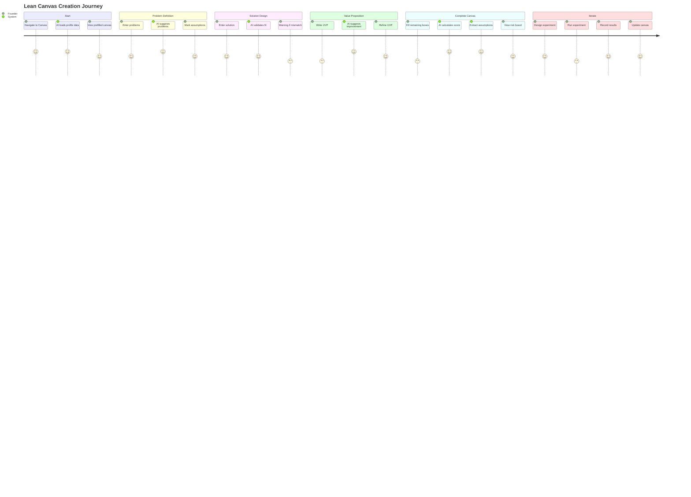
```mermaid
journey
    title Lean Canvas Creation Journey
    section Start
        Navigate to Canvas: 5: Founder
        AI loads profile data: 5: System
        View prefilled canvas: 4: Founder
    section Problem Definition
        Enter problems: 4: Founder
        AI suggests problems: 5: System
        Mark assumptions: 4: Founder
    section Solution Design
        Enter solution: 4: Founder
        AI validates fit: 4: System
        Warning if mismatch: 3: Founder
    section Value Proposition
        Write UVP: 3: Founder
        AI suggests improvement: 5: System
        Refine UVP: 4: Founder
    section Complete Canvas
        Fill remaining boxes: 3: Founder
        AI calculates score: 5: System
        Extract assumptions: 5: System
        View risk board: 4: Founder
    section Iterate
        Design experiment: 4: Founder
        Run experiment: 3: Founder
        Record results: 4: Founder
        Update canvas: 4: Founder
```

### 5.3 Pitch Deck Creation Journey

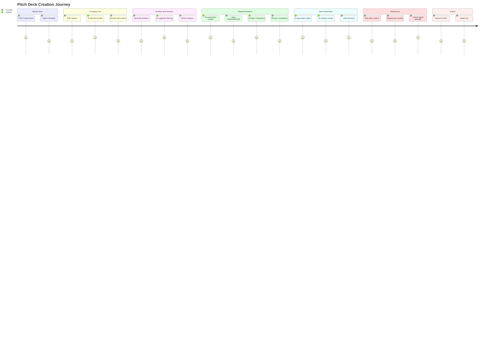
```mermaid
journey
    title Pitch Deck Creation Journey
    section Wizard Start
        Click Create Deck: 5: Founder
        Select template: 4: Founder
    section Company Info
        Enter basics: 4: Founder
        AI fills from profile: 5: System
        Review and confirm: 4: Founder
    section Problem and Solution
        Describe problem: 4: Founder
        AI suggests framing: 5: System
        Define solution: 4: Founder
    section Market Research
        AI researches market: 5: System
        View TAM/SAM/SOM: 4: Founder
        AI finds competitors: 5: System
        Review competition: 4: Founder
    section Deck Generation
        AI generates slides: 5: System
        AI creates visuals: 4: System
        View full deck: 5: Founder
    section Refinement
        Edit slide content: 4: Founder
        Regenerate visuals: 4: Founder
        Check signal strength: 5: Founder
    section Export
        Export to PDF: 4: Founder
        Share link: 4: Founder
```

### 5.4 Daily Workflow Journey

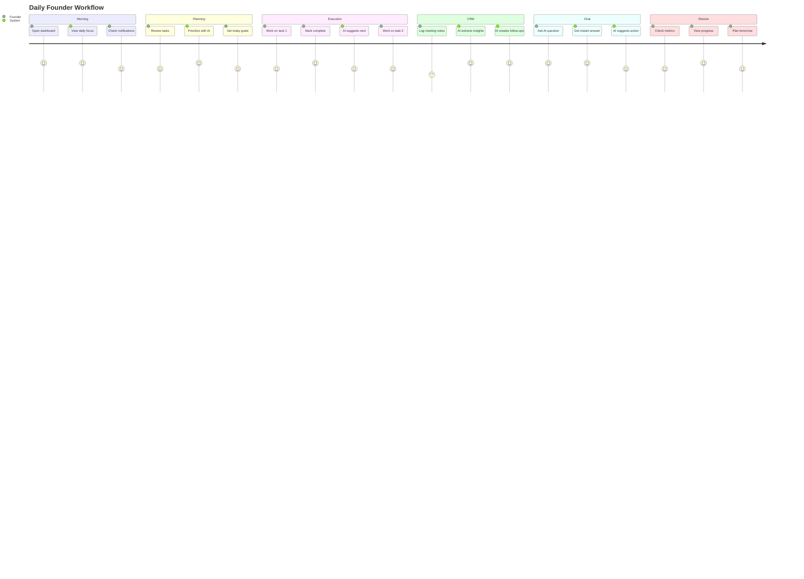
```mermaid
journey
    title Daily Founder Workflow
    section Morning
        Open dashboard: 5: Founder
        View daily focus: 5: System
        Check notifications: 4: Founder
    section Planning
        Review tasks: 4: Founder
        Prioritize with AI: 5: System
        Set today goals: 4: Founder
    section Execution
        Work on task 1: 4: Founder
        Mark complete: 5: Founder
        AI suggests next: 4: System
        Work on task 2: 4: Founder
    section CRM
        Log meeting notes: 3: Founder
        AI extracts insights: 5: System
        AI creates follow-ups: 5: System
    section Chat
        Ask AI question: 5: Founder
        Get instant answer: 5: System
        AI suggests action: 4: System
    section Review
        Check metrics: 4: Founder
        View progress: 5: Founder
        Plan tomorrow: 4: Founder
```

### 5.5 Investor Review Journey

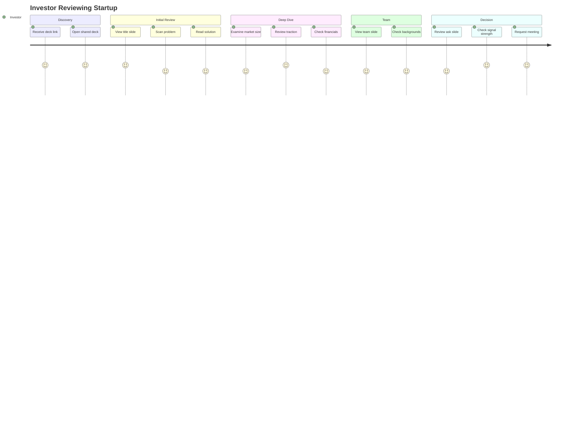
```mermaid
journey
    title Investor Reviewing Startup
    section Discovery
        Receive deck link: 5: Investor
        Open shared deck: 5: Investor
    section Initial Review
        View title slide: 5: Investor
        Scan problem: 4: Investor
        Read solution: 4: Investor
    section Deep Dive
        Examine market size: 4: Investor
        Review traction: 5: Investor
        Check financials: 4: Investor
    section Team
        View team slide: 4: Investor
        Check backgrounds: 4: Investor
    section Decision
        Review ask slide: 4: Investor
        Check signal strength: 5: Investor
        Request meeting: 5: Investor
```

---

## 6. State Machines

### 6.1 Startup Lifecycle State

```mermaid
stateDiagram-v2
    [*] --> Onboarding: User signs up

    Onboarding --> ProfileSetup: Website extracted
    ProfileSetup --> Active: Profile complete

    state Active {
        [*] --> Ideation
        Ideation --> Validation: Canvas created
        Validation --> Building: Assumptions validated
        Building --> Launching: MVP ready
        Launching --> Growing: Product launched
        Growing --> Scaling: PMF achieved
    }

    Active --> Paused: User inactive 30d
    Paused --> Active: User returns
    Paused --> Archived: User inactive 90d
    Archived --> [*]: Account deleted

    note right of Onboarding
        AI extracts website data
        Industry research runs
    end note

    note right of Validation
        Lean Canvas complete
        Experiments running
    end note
```

### 6.2 Pitch Deck State

```mermaid
stateDiagram-v2
    [*] --> Draft: Create new deck

    Draft --> WizardStep1: Start wizard
    WizardStep1 --> WizardStep2: Company info saved
    WizardStep2 --> WizardStep3: Problem/Solution saved
    WizardStep3 --> Generating: Market research done

    Generating --> Generated: AI completes slides
    Generated --> Editing: User reviews

    state Editing {
        [*] --> SlideEdit
        SlideEdit --> ImageRegen: Regenerate image
        ImageRegen --> SlideEdit: Image updated
        SlideEdit --> SlideEdit: Edit content
    }

    Editing --> Published: User publishes
    Published --> Editing: Edit published

    Published --> Shared: Create share link
    Shared --> Viewed: Investor opens

    Generated --> Abandoned: 7d no activity
    Editing --> Abandoned: 30d no activity
    Abandoned --> [*]: Auto cleanup
```

### 6.3 Task State Machine

```mermaid
stateDiagram-v2
    [*] --> Pending: Task created

    Pending --> InProgress: User starts
    Pending --> Blocked: Dependency added

    Blocked --> Pending: Blocker resolved

    InProgress --> Completed: User completes
    InProgress --> Paused: User pauses
    InProgress --> Blocked: Blocker found

    Paused --> InProgress: User resumes
    Paused --> Cancelled: User cancels

    Completed --> [*]: Done
    Cancelled --> [*]: Removed

    note right of Pending
        AI may auto-prioritize
    end note

    note right of Completed
        Triggers workflow event
        Updates metrics
    end note
```

### 6.4 Deal Pipeline State

```mermaid
stateDiagram-v2
    [*] --> Lead: Contact added

    Lead --> Qualified: Initial call done
    Lead --> Disqualified: Not a fit

    Qualified --> Proposal: Sent proposal
    Qualified --> Lost: No response

    Proposal --> Negotiation: Counter received
    Proposal --> Won: Accepted
    Proposal --> Lost: Rejected

    Negotiation --> Won: Agreement reached
    Negotiation --> Lost: Deal fell through

    Won --> [*]: Revenue recorded
    Lost --> [*]: Reason logged
    Disqualified --> [*]: Archived

    note right of Qualified
        AI calculates deal score
    end note

    note right of Won
        Triggers celebration
        Updates metrics
    end note
```

### 6.5 Validation Experiment State

```mermaid
stateDiagram-v2
    [*] --> Designed: Experiment created

    Designed --> Active: Started
    Designed --> Cancelled: Assumption changed

    state Active {
        [*] --> Recruiting
        Recruiting --> Running: Participants ready
        Running --> Collecting: Data coming in
        Collecting --> Analyzing: Collection complete
    }

    Active --> Paused: Pause needed
    Paused --> Active: Resume

    Analyzing --> Validated: Evidence supports
    Analyzing --> Invalidated: Evidence refutes
    Analyzing --> Inconclusive: Need more data

    Validated --> [*]: Assumption confirmed
    Invalidated --> [*]: Pivot triggered
    Inconclusive --> Active: Run again

    Cancelled --> [*]

    note right of Invalidated
        AI suggests pivot options
        Canvas update prompted
    end note
```

---

## 7. Data Flows

### 7.1 Onboarding Data Flow

```mermaid
flowchart TD
    subgraph USER_INPUT["User Input"]
        A[Website URL] --> B[Industry Confirmation]
        B --> C[Team Members]
        C --> D[Traction Data]
    end

    subgraph AI_EXTRACTION["AI Extraction"]
        A --> E[Fetch Website]
        E --> F[Gemini: Extract]
        F --> G{Confidence > 80%?}
        G -->|Yes| H[Auto-fill Fields]
        G -->|No| I[Manual Input Required]
    end

    subgraph DATA_CREATION["Data Creation"]
        D --> J[(wizard_sessions)]
        J --> K[(startups)]
        K --> L[(profiles)]
        K --> M[(lean_canvases)]
        K --> N[(tasks)]
    end

    subgraph SCORING["Scoring"]
        K --> O[Calculate Profile Strength]
        K --> P[Calculate Investor Score]
        O --> Q[(startups.profile_strength)]
        P --> R[(startups.investor_ready_score)]
    end

    subgraph POST_ONBOARDING["Post-Onboarding"]
        K --> S[workflow-trigger]
        S --> T[Generate Initial Tasks]
        S --> U[Compute Daily Focus]
        S --> V[Send Welcome Email]
    end

    H --> J
    I --> J
```

### 7.2 AI Chat Data Flow

```mermaid
flowchart TD
    subgraph INPUT["User Input"]
        A[Message] --> B{Tab Selection}
        B -->|General| C[General Context]
        B -->|Strategy| D[Strategy Context]
        B -->|Research| E[Research Context]
    end

    subgraph CONTEXT["Context Assembly"]
        C & D & E --> F[Load Session History]
        F --> G[Load Startup Profile]
        G --> H[Load Recent Activities]
        H --> I[Load Relevant Docs]
        I --> J[Assemble Full Context]
    end

    subgraph ROUTING["AI Routing"]
        J --> K{Complexity Check}
        K -->|Simple| L[Gemini 3 Flash]
        K -->|Complex| M[Claude Sonnet]
        K -->|Research| N[Web Search + Gemini]
    end

    subgraph PROCESSING["Response Processing"]
        L & M & N --> O[Generate Response]
        O --> P{Extract Facts?}
        P -->|Yes| Q[(chat_facts)]
        O --> R{Suggest Actions?}
        R -->|Yes| S[(chat_pending)]
    end

    subgraph STORAGE["Data Storage"]
        O --> T[(chat_messages)]
        T --> U[(ai_runs)]
    end

    subgraph OUTPUT["User Output"]
        O --> V[Stream Response]
        V --> W[Render Markdown]
        W --> X[Show Actions]
    end
```

### 7.3 Metrics Calculation Flow

```mermaid
flowchart TD
    subgraph TRIGGERS["Triggers"]
        A[Task Completed] --> B[Calculate]
        C[Deal Updated] --> B
        D[Contact Added] --> B
        E[Daily Cron] --> B
    end

    subgraph AGGREGATION["Data Aggregation"]
        B --> F[Query Tasks]
        B --> G[Query Deals]
        B --> H[Query Contacts]
        B --> I[Query Activities]

        F --> J[Task Metrics]
        G --> K[Pipeline Metrics]
        H --> L[CRM Metrics]
        I --> M[Engagement Metrics]
    end

    subgraph CALCULATION["Calculations"]
        J --> N[Completion Rate]
        J --> O[Velocity]
        K --> P[Pipeline Value]
        K --> Q[Win Rate]
        L --> R[Contact Growth]
        M --> S[Activity Score]
    end

    subgraph SCORING["AI Scoring"]
        N & O & P & Q & R & S --> T[Aggregate Scores]
        T --> U[Gemini: Analyze Trends]
        U --> V[Generate Insights]
    end

    subgraph OUTPUT["Output"]
        T --> W[(mv_startup_metrics)]
        V --> X[(notifications)]
        V --> Y[Dashboard Cards]
    end
```

### 7.4 Assumption to Experiment Flow

```mermaid
flowchart TD
    subgraph EXTRACTION["Assumption Extraction"]
        A[(lean_canvases)] --> B[AI: Extract Assumptions]
        B --> C{Each Box}
        C -->|Problem| D[Problem Assumptions]
        C -->|Solution| E[Solution Assumptions]
        C -->|Channels| F[Channel Assumptions]
        C -->|Revenue| G[Revenue Assumptions]
    end

    subgraph PRIORITIZATION["Prioritization"]
        D & E & F & G --> H[Calculate Impact]
        H --> I[Calculate Uncertainty]
        I --> J[Priority Score = Impact × Uncertainty]
        J --> K[Rank Assumptions]
    end

    subgraph EXPERIMENTATION["Experiment Design"]
        K --> L[Top Assumption]
        L --> M{Experiment Type}
        M -->|Interview| N[Design Interview]
        M -->|Survey| O[Design Survey]
        M -->|Landing Page| P[Design LP Test]
        M -->|Prototype| Q[Design Prototype Test]
    end

    subgraph EXECUTION["Execution"]
        N & O & P & Q --> R[(experiments)]
        R --> S[Run Experiment]
        S --> T[Collect Data]
        T --> U[(experiment_results)]
    end

    subgraph LEARNING["Learning Loop"]
        U --> V{Outcome}
        V -->|Validated| W[Mark Assumption Tested]
        V -->|Invalidated| X[Trigger Pivot]
        V -->|Inconclusive| Y[Refine Experiment]

        W --> Z[Update Canvas]
        X --> Z
        Y --> R
    end
```

---

## Diagram Index

| # | Diagram | Type | Section |
|---|---------|------|---------|
| 1 | System Context | C4Context | 1.1 |
| 2 | Container Architecture | C4Container | 1.2 |
| 3 | Component Architecture | C4Component | 1.3 |
| 4 | Agent Class Hierarchy | Class | 2.1 |
| 5 | Agent Tools Registry | Class | 2.2 |
| 6 | Agent Execution Flow | Sequence | 2.3 |
| 7 | Edge Functions Overview | Flowchart | 3.1 |
| 8 | Startup Agent Actions | Flowchart | 3.2 |
| 9 | Document Agent Actions | Flowchart | 3.3 |
| 10 | Workflow Engine Events | Flowchart | 3.4 |
| 11 | Core Domain ERD | ER | 4.1 |
| 12 | CRM Domain ERD | ER | 4.2 |
| 13 | Documents Domain ERD | ER | 4.3 |
| 14 | AI & Chat Domain ERD | ER | 4.4 |
| 15 | Validation Domain ERD | ER | 4.5 |
| 16 | Founder Onboarding | Journey | 5.1 |
| 17 | Lean Canvas Creation | Journey | 5.2 |
| 18 | Pitch Deck Creation | Journey | 5.3 |
| 19 | Daily Workflow | Journey | 5.4 |
| 20 | Investor Review | Journey | 5.5 |
| 21 | Startup Lifecycle State | State | 6.1 |
| 22 | Pitch Deck State | State | 6.2 |
| 23 | Task State Machine | State | 6.3 |
| 24 | Deal Pipeline State | State | 6.4 |
| 25 | Validation Experiment State | State | 6.5 |
| 26 | Onboarding Data Flow | Flowchart | 7.1 |
| 27 | AI Chat Data Flow | Flowchart | 7.2 |
| 28 | Metrics Calculation Flow | Flowchart | 7.3 |
| 29 | Assumption to Experiment Flow | Flowchart | 7.4 |

---

*System diagrams maintained by StartupAI Engineering — Last updated 2026-02-02*
