# StartupAI System Diagrams

> **Version:** 1.0 | **Created:** 2026-02-02
> **Purpose:** Visual system design for StartupAI using Mermaid diagrams
> **Phase Structure:** CORE → MVP → ADVANCED → PRODUCTION

---

## Diagram Index

| ID | Diagram | Type | Phase | Purpose |
|----|---------|------|-------|---------|
| D-01 | System Context | C4 Context | CORE | High-level system overview |
| D-02 | Container Architecture | C4 Container | CORE | Technical architecture |
| D-03 | Founder Journey | Journey | CORE | User experience mapping |
| D-04 | Lifecycle States | State | CORE | 10-stage startup lifecycle |
| D-05 | Onboarding Flow | Flowchart | CORE | New user onboarding |
| D-06 | Lean Canvas Flow | Flowchart | MVP | Canvas completion process |
| D-07 | Validation Lab Flow | Flowchart | MVP | Experiment design & execution |
| D-08 | AI Agent Architecture | Class | MVP | Agent system design |
| D-09 | Database Schema | ER | CORE | Data model |
| D-10 | Prompt Pack Flow | Sequence | MVP | Prompt pack execution |
| D-11 | Atlas Chat Flow | Sequence | MVP | Chatbot interaction |
| D-12 | Task Orchestration | Flowchart | ADVANCED | Task generation & priority |
| D-13 | Pitch Deck Generation | Sequence | ADVANCED | Deck builder flow |
| D-14 | PMF Assessment | Flowchart | ADVANCED | Product-market fit scoring |
| D-15 | Investor CRM Flow | Flowchart | ADVANCED | Fundraising pipeline |
| D-16 | Error Handling | State | PRODUCTION | System error states |
| D-17 | Monitoring Flow | Flowchart | PRODUCTION | Observability system |

---

## CORE PHASE DIAGRAMS

### D-01: System Context Diagram

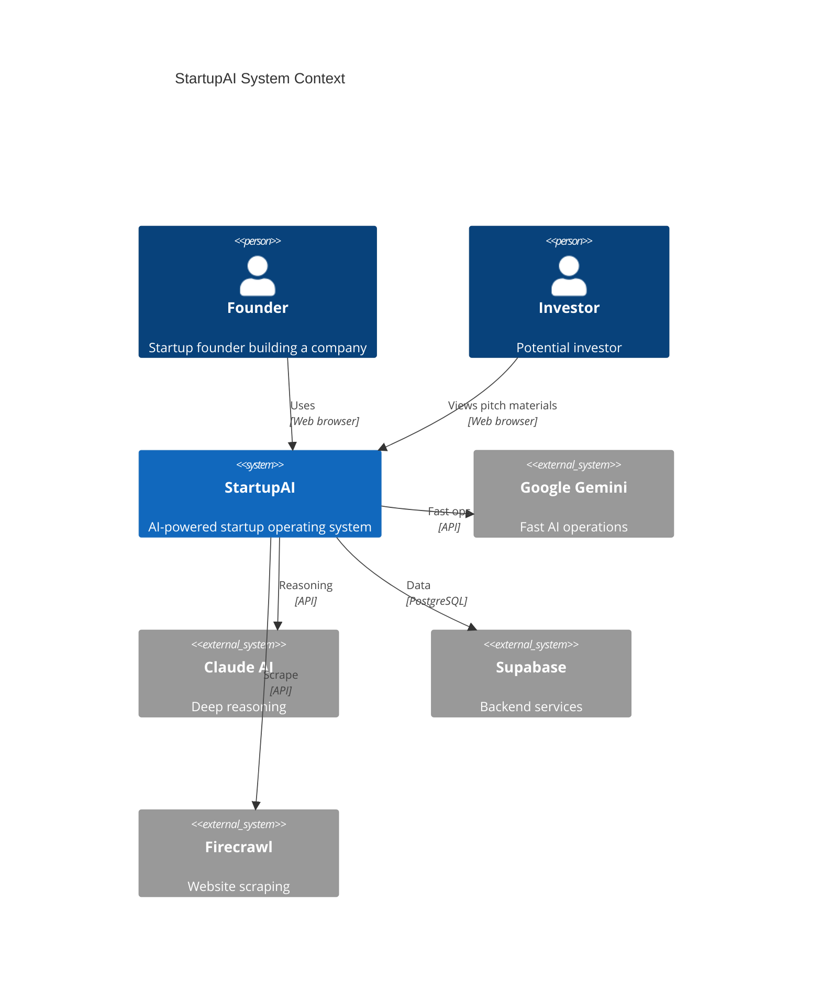

### D-02: Container Architecture

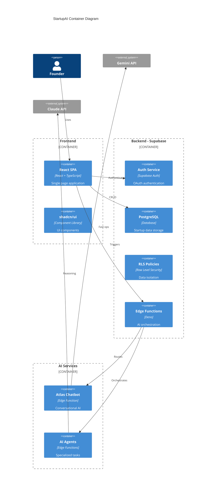

### D-03: Founder Journey

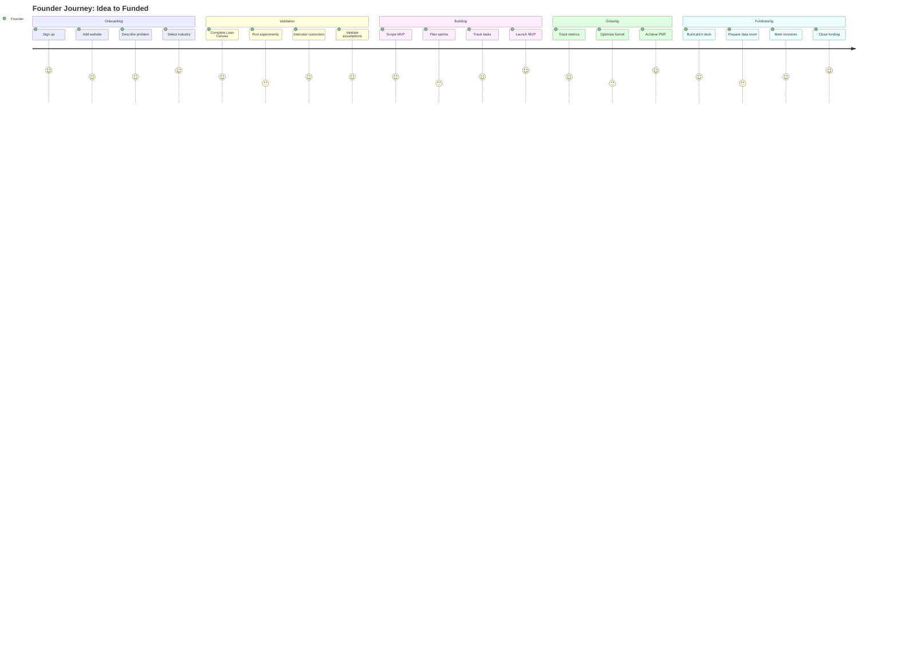

### D-04: Startup Lifecycle States

```mermaid
stateDiagram-v2
    [*] --> Idea

    Idea --> MarketDiscovery: Problem defined
    MarketDiscovery --> Strategy: Market validated
    Strategy --> PSF: Business model complete
    PSF --> MVP: Solution validated
    MVP --> GTM: Product shipped
    GTM --> Traction: First customers
    Traction --> Scale: PMF achieved
    Scale --> Fundraising: Growth proven
    Fundraising --> Maturity: Funded
    Maturity --> [*]: Exit or continue

    note right of Idea
        Gate: Clarity ≥70%
    end note

    note right of PSF
        Gate: 10+ interviews
        1+ assumption validated
    end note

    note right of Traction
        Gate: 40%+ PMF score
    end note

    state Idea {
        [*] --> ProblemDiscovery
        ProblemDiscovery --> ProblemValidated: 10+ interviews
    }

    state PSF {
        [*] --> Experimenting
        Experimenting --> Validated: Success criteria met
        Experimenting --> Pivot: Failed
        Pivot --> Experimenting: New hypothesis
    }
```

### D-05: Onboarding Flow

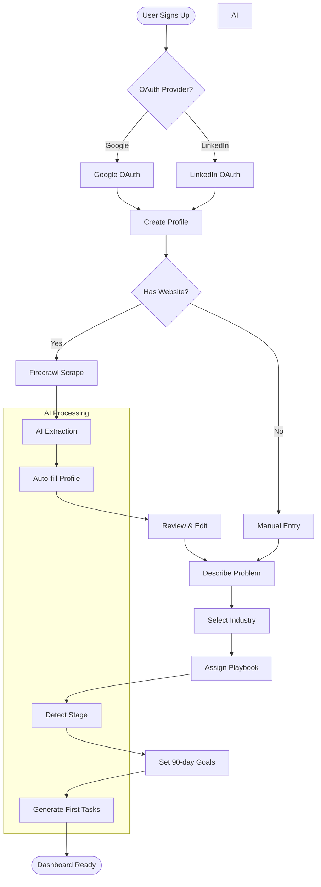

### D-09: Database Schema

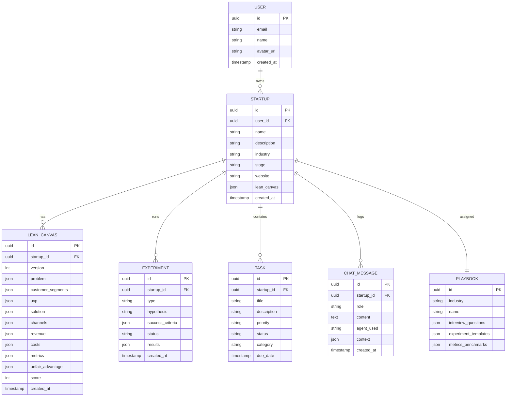

---

## MVP PHASE DIAGRAMS

### D-06: Lean Canvas Completion Flow

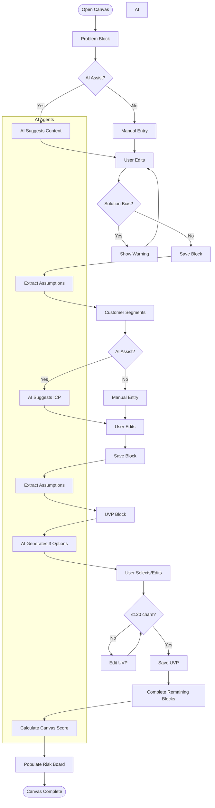

### D-07: Validation Lab Flow

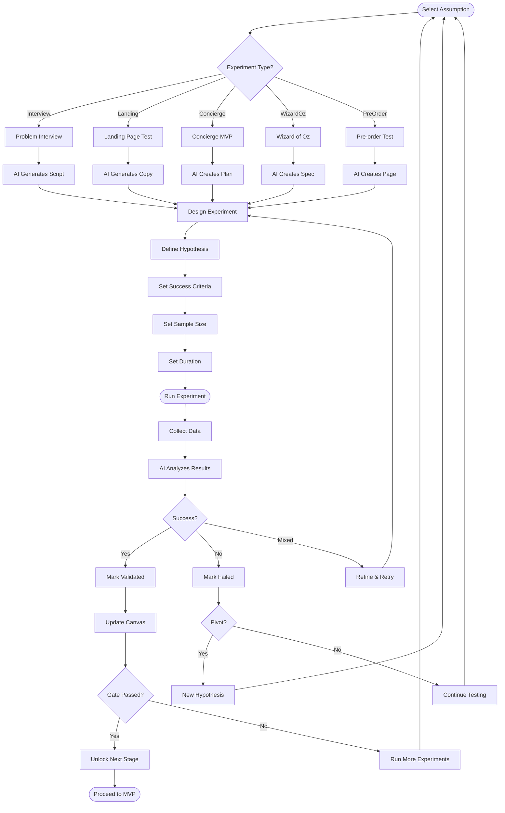

### D-08: AI Agent Architecture

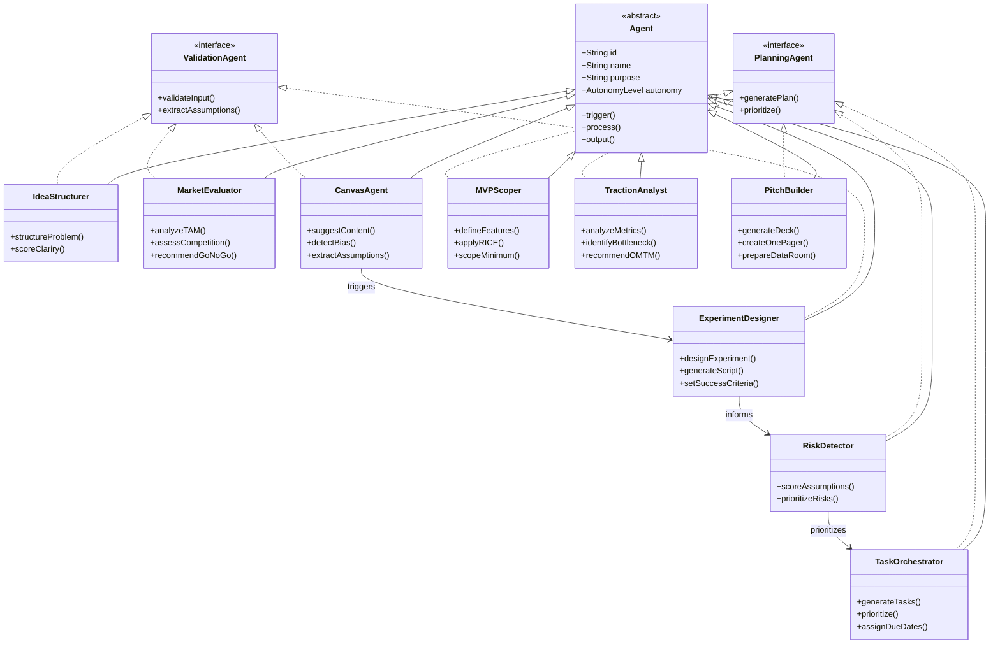

### D-10: Prompt Pack Execution Flow

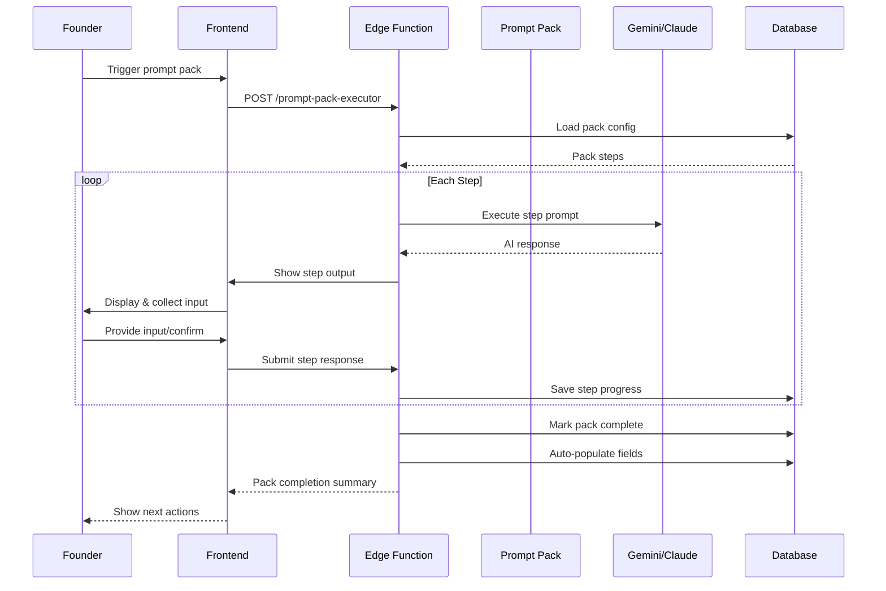

### D-11: Atlas Chat Interaction Flow

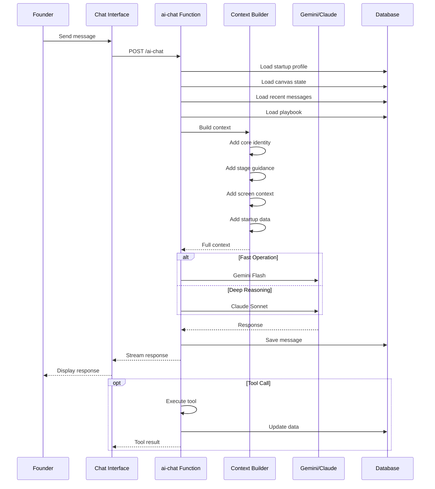

---

## ADVANCED PHASE DIAGRAMS

### D-12: Task Orchestration Flow

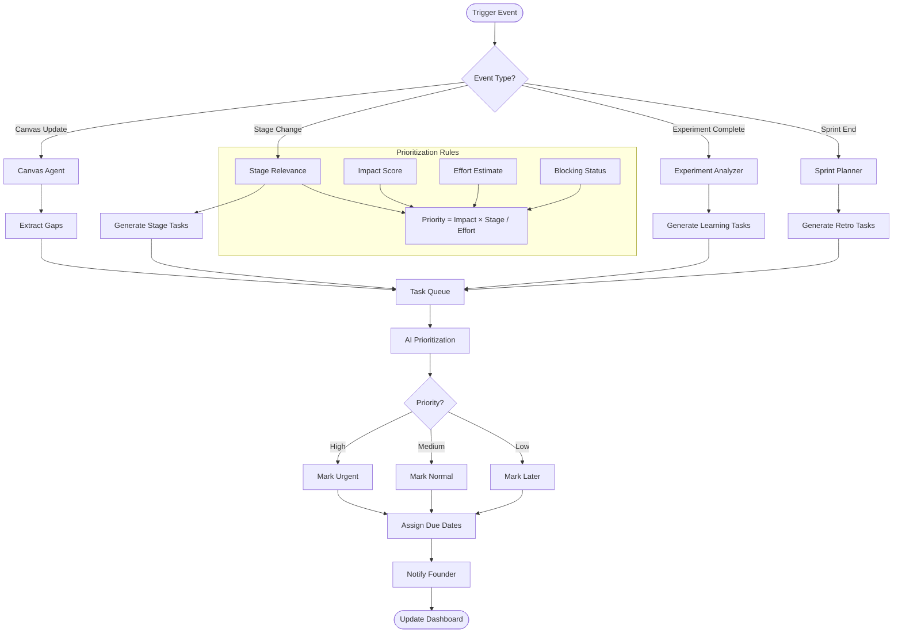

### D-13: Pitch Deck Generation Flow

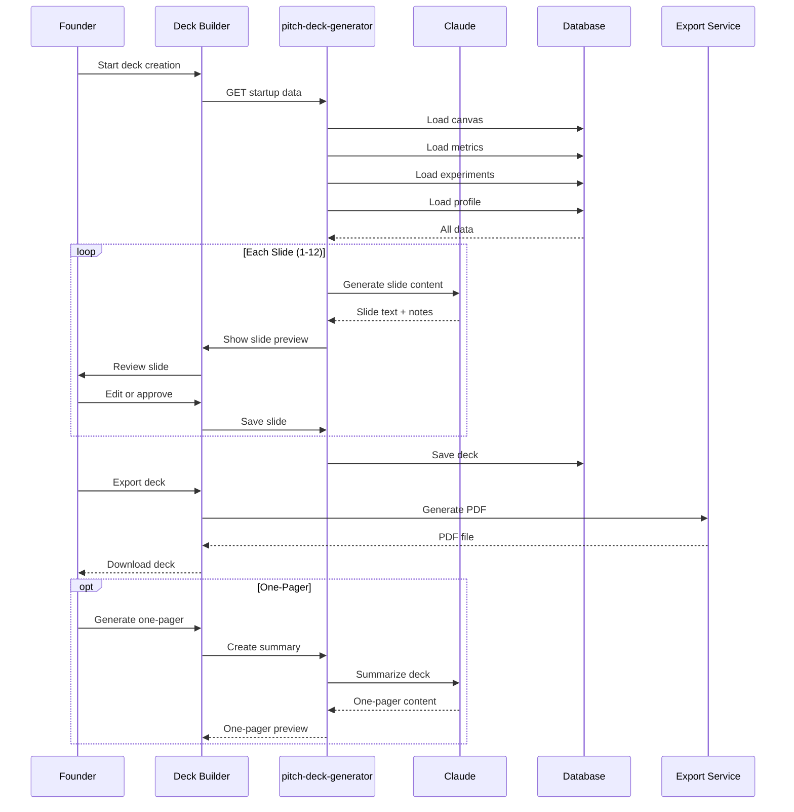

### D-14: PMF Assessment Flow

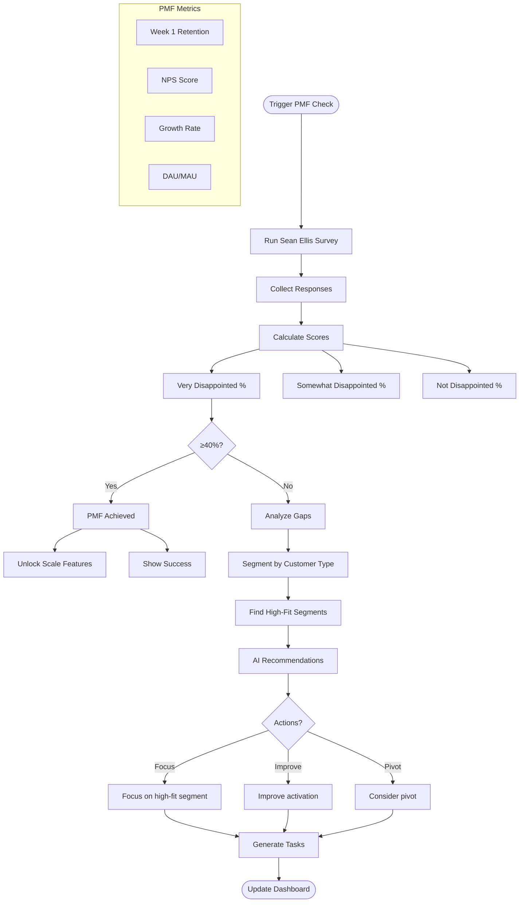

### D-15: Investor CRM Flow

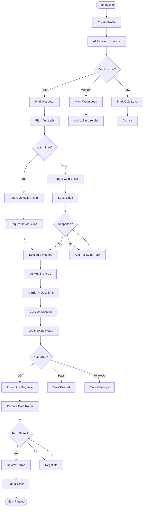

---

## PRODUCTION PHASE DIAGRAMS

### D-16: Error Handling States

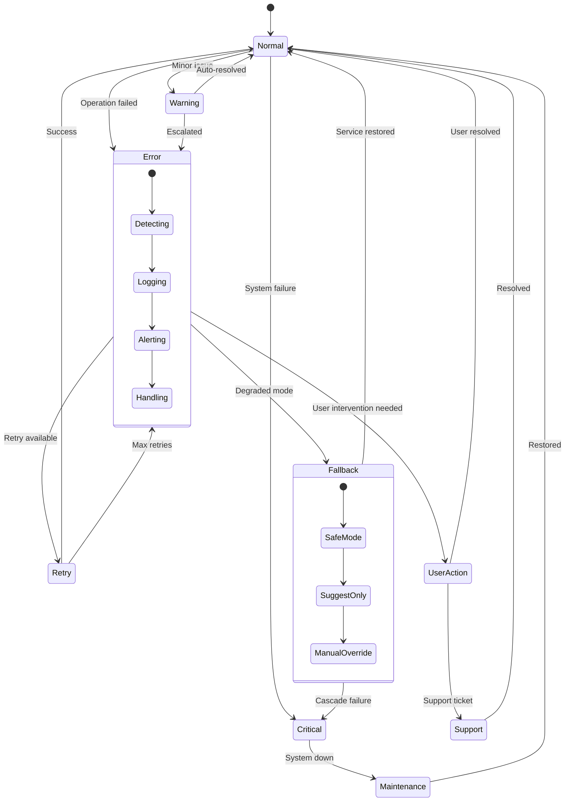

### D-17: Monitoring & Observability Flow

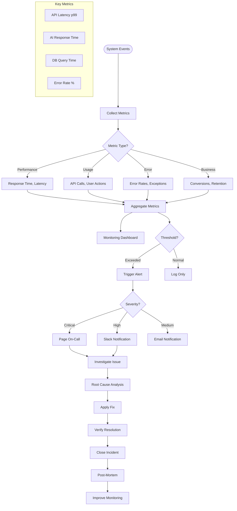

---

## Diagram Phase Summary

| Phase | Diagrams | Status | Milestone |
|-------|----------|--------|-----------|
| **CORE** | D-01 to D-05, D-09 | Required | Basic flow works end-to-end |
| **MVP** | D-06 to D-11 | Required | Users can validate ideas reliably |
| **ADVANCED** | D-12 to D-15 | Optional | System proactively assists |
| **PRODUCTION** | D-16, D-17 | Optional | System is stable at scale |

---

## Diagram to Skill Mapping

Each diagram maps to one or more Claude skills that implement the described behavior.

### CORE Phase Skills

| Diagram | Primary Skill | Secondary Skills |
|---------|---------------|------------------|
| D-01 System Context | - | - |
| D-02 Container Architecture | - | `supabase-cli`, `supabase-schema` |
| D-03 Founder Journey | `playbooks` | `lean-canvas`, `validation-lab` |
| D-04 Lifecycle States | `startup-expertise` | `lean-sprints`, `traction` |
| D-05 Onboarding Flow | `playbooks` | `idea-validator` |
| D-09 Database Schema | `supabase-schema` | `supabase-create-migration`, `supabase-seeding` |

### MVP Phase Skills

| Diagram | Primary Skill | Secondary Skills |
|---------|---------------|------------------|
| D-06 Lean Canvas Flow | `lean-canvas` | `idea-validator`, `validation-lab` |
| D-07 Validation Lab Flow | `validation-lab` | `lean-sprints`, `prompt-packs` |
| D-08 AI Agent Architecture | `atlas-chat` | `gemini`, `sdk-agent` |
| D-10 Prompt Pack Flow | `prompt-packs` | `playbooks` |
| D-11 Atlas Chat Flow | `atlas-chat` | `playbooks`, `prompt-packs` |

### ADVANCED Phase Skills

| Diagram | Primary Skill | Secondary Skills |
|---------|---------------|------------------|
| D-12 Task Orchestration | `lean-sprints` | `traction`, `playbooks` |
| D-13 Pitch Deck Generation | `pitch-deck` | `fundraising`, `prompt-packs` |
| D-14 PMF Assessment | `traction` | `startup-metrics`, `validation-lab` |
| D-15 Investor CRM Flow | `fundraising` | `pitch-deck`, `startup-metrics` |

### PRODUCTION Phase Skills

| Diagram | Primary Skill | Secondary Skills |
|---------|---------------|------------------|
| D-16 Error Handling | `performance-optimization` | `security-hardening` |
| D-17 Monitoring Flow | `performance-optimization` | `cicd-pipeline` |

### Supabase Skills (Infrastructure)

| Skill | Triggers | Description |
|-------|----------|-------------|
| `supabase-schema` | schema design | Database schema patterns |
| `supabase-create-migration` | migrations | Creating database migrations |
| `supabase-seeding` | seed data | Database seeding |
| `supabase-create-db-functions` | DB functions | PostgreSQL functions |
| `supabase-postgres-sql-style-guide` | SQL style | SQL conventions |
| `supabase-auth` | authentication | Auth patterns |
| `supabase-create-rls-policies` | RLS, security | Row-level security |
| `supabase-cli` | CLI, Supabase | CLI commands |
| `writing-supabase-edge-functions` | edge functions | Deno edge functions |
| `ai-Realtime-assistant-` | realtime, AI | AI + Realtime patterns |
| `test-supabase` | testing | Supabase testing |

---

## Usage Notes

1. **Rendering**: Use Mermaid Live Editor (https://mermaid.live) to test diagrams
2. **Updates**: When PRD changes, update affected diagrams first
3. **Tasks**: Generate tasks only from diagram behaviors
4. **Validation**: Each diagram should have clear inputs/outputs

---

*Generated by Claude Code — 2026-02-02*
