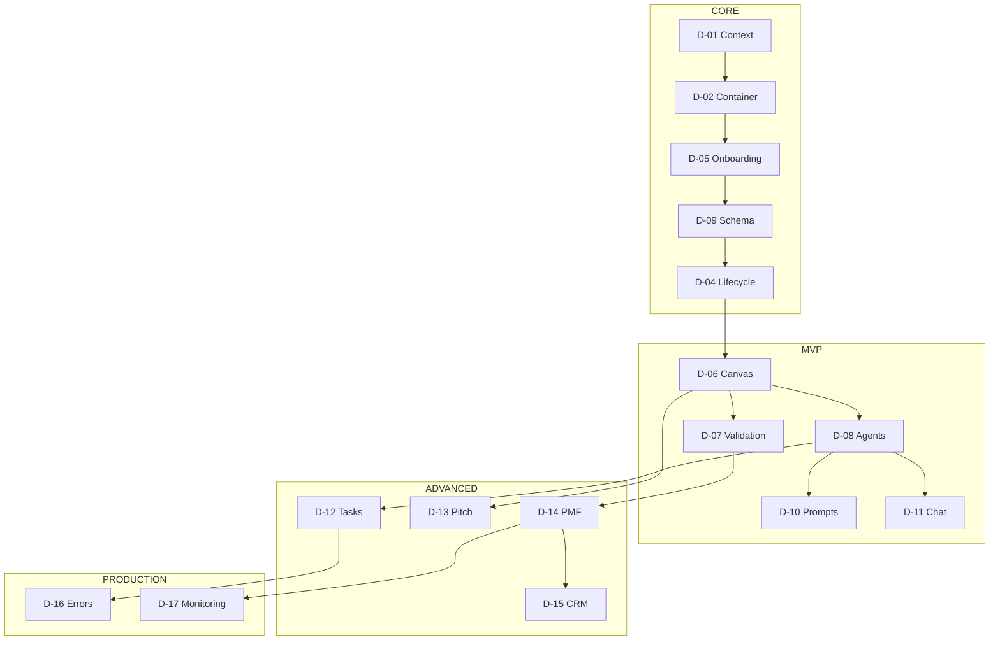

# StartupAI Diagram Index

> **Version:** 1.0 | **Created:** 2026-02-02
> **Purpose:** Organized index of all system diagrams by phase
> **Source:** `03-mermaid-diagrams.md`

---

## Phase Overview

```
PRD → Diagrams → Diagram Index → Tasks → Roadmap → Milestones
          ↓
    ┌─────────────────────────────────────────────────────────┐
    │                    DIAGRAM PHASES                        │
    ├─────────────────────────────────────────────────────────┤
    │  CORE      │  MVP       │  ADVANCED   │  PRODUCTION     │
    │  D-01      │  D-06      │  D-12       │  D-16           │
    │  D-02      │  D-07      │  D-13       │  D-17           │
    │  D-03      │  D-08      │  D-14       │                 │
    │  D-04      │  D-10      │  D-15       │                 │
    │  D-05      │  D-11      │             │                 │
    │  D-09      │            │             │                 │
    └─────────────────────────────────────────────────────────┘
```

---

## CORE Phase (Foundation)

> **Question:** Can it work at all?
> **Milestone:** Users can complete the basic flow end-to-end

| ID | Name | Type | Purpose | Status |
|----|------|------|---------|--------|
| D-01 | System Context | C4 Context | High-level system overview | ⬜ |
| D-02 | Container Architecture | C4 Container | Technical architecture | ⬜ |
| D-03 | Founder Journey | Journey | User experience mapping | ⬜ |
| D-04 | Lifecycle States | State | 10-stage startup lifecycle | ⬜ |
| D-05 | Onboarding Flow | Flowchart | New user onboarding | ⬜ |
| D-09 | Database Schema | ER | Data model | ⬜ |

**Behaviors Defined:**
- User can sign up via OAuth
- System can scrape and extract website data
- User can navigate 10-stage lifecycle
- User can complete onboarding wizard
- Data persists in PostgreSQL

---

## MVP Phase (Value Delivery)

> **Question:** Does it solve the main problem?
> **Milestone:** Users can achieve the main goal reliably

| ID | Name | Type | Purpose | Status |
|----|------|------|---------|--------|
| D-06 | Lean Canvas Flow | Flowchart | Canvas completion process | ⬜ |
| D-07 | Validation Lab Flow | Flowchart | Experiment design & execution | ⬜ |
| D-08 | AI Agent Architecture | Class | Agent system design | ⬜ |
| D-10 | Prompt Pack Flow | Sequence | Prompt pack execution | ⬜ |
| D-11 | Atlas Chat Flow | Sequence | Chatbot interaction | ⬜ |

**Behaviors Defined:**
- User can complete Lean Canvas with AI assistance
- User can design and run validation experiments
- AI agents can be triggered and orchestrated
- User can execute guided prompt packs
- User can chat with Atlas for advice

---

## ADVANCED Phase (Intelligence)

> **Question:** Does it help users do better?
> **Milestone:** System proactively assists users

| ID | Name | Type | Purpose | Status |
|----|------|------|---------|--------|
| D-12 | Task Orchestration | Flowchart | Task generation & priority | ⬜ |
| D-13 | Pitch Deck Generation | Sequence | Deck builder flow | ⬜ |
| D-14 | PMF Assessment | Flowchart | Product-market fit scoring | ⬜ |
| D-15 | Investor CRM Flow | Flowchart | Fundraising pipeline | ⬜ |

**Behaviors Defined:**
- System auto-generates prioritized tasks
- System creates pitch deck from validated data
- System scores PMF readiness
- System manages investor pipeline

---

## PRODUCTION Phase (Reliability)

> **Question:** Can it be trusted at scale?
> **Milestone:** System is stable under real-world usage

| ID | Name | Type | Purpose | Status |
|----|------|------|---------|--------|
| D-16 | Error Handling | State | System error states | ⬜ |
| D-17 | Monitoring Flow | Flowchart | Observability system | ⬜ |

**Behaviors Defined:**
- System handles errors gracefully
- System provides fallback modes
- System monitors health metrics
- System alerts on issues

---

## Diagram Dependencies



---

## Roadmap Integration

| Week | Diagrams to Complete | Milestone Check |
|------|---------------------|-----------------|
| 1-2 | D-01, D-02, D-09 | Architecture defined |
| 3-4 | D-05, D-04 | Onboarding works |
| 5-6 | D-03 | **CORE COMPLETE** |
| 7-8 | D-06, D-08 | Canvas + Agents |
| 9-10 | D-07, D-10 | Validation works |
| 11-12 | D-11 | **MVP COMPLETE** |
| 13-14 | D-12, D-14 | Task + PMF |
| 15-16 | D-13, D-15 | **ADVANCED COMPLETE** |
| 17-18 | D-16, D-17 | **PRODUCTION COMPLETE** |

---

## Task Generation Rules

1. **Tasks come from diagrams** — No task without a diagram reference
2. **Tasks inherit phase** — D-06 task = MVP phase task
3. **Tasks reference behaviors** — "Implement D-06 Step 3: AI suggests content"
4. **Tasks link to PRD** — "Per PRD Section 5.2: Canvas AI Features"

---

## Milestone Validation

| Phase | Milestone | Validation Criteria |
|-------|-----------|---------------------|
| CORE | Basic flow works | User completes onboarding → sees dashboard |
| MVP | Main goal achieved | User validates 1 assumption via experiment |
| ADVANCED | Proactive assistance | System generates tasks without user trigger |
| PRODUCTION | Stable at scale | 99.9% uptime, <2s p99 latency |

---

## Status Legend

| Symbol | Meaning |
|--------|---------|
| ⬜ | Not started |
| 🔄 | In progress |
| ✅ | Complete |
| ❌ | Blocked |

---

*Generated by Claude Code — 2026-02-02*
