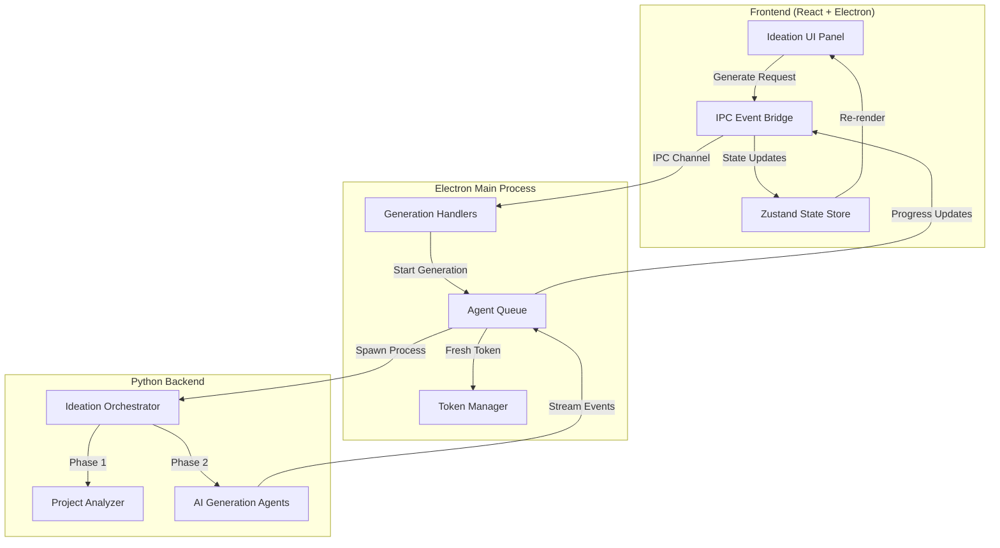
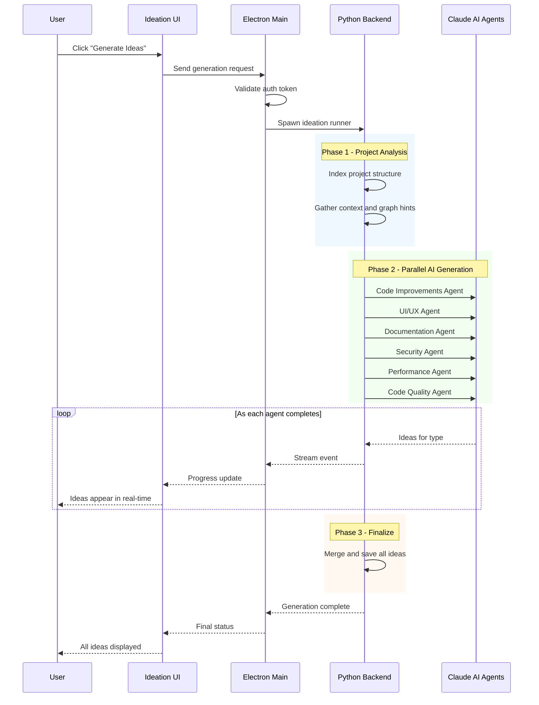
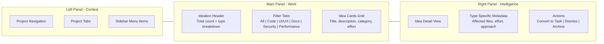
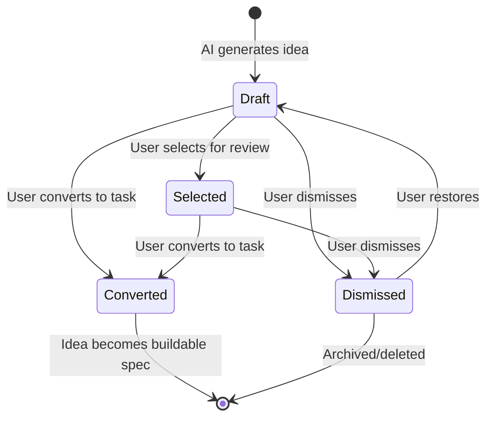
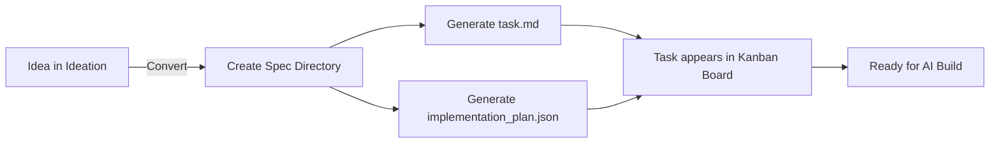
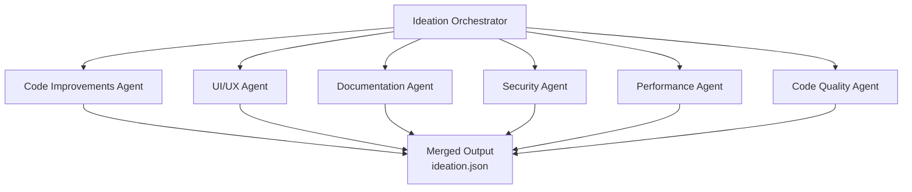

# Ideation Feature Guide

## Executive Summary

Ideation is Auto Claude's AI-powered feature discovery engine. It analyzes your entire codebase and generates actionable improvement ideas across six categories: Code, UI/UX, Documentation, Security, Performance, and Code Quality. Ideas stream in real-time as AI agents work in parallel, and any idea can be converted into a buildable task with one click.

---

## How It Works (High-Level)

| Step | What Happens | Who Does It |
|------|-------------|-------------|
| 1. User clicks Generate | Frontend sends request to Electron main process | User via UI |
| 2. Auth check | Fresh OAuth token is read from system credential store | Main process |
| 3. Python process spawns | Agent queue launches the ideation runner with project config | Electron main |
| 4. Project analysis | AI indexes project structure, files, and patterns | Python backend |
| 5. Parallel generation | Six AI agents run simultaneously, one per idea type | Claude Agent SDK |
| 6. Real-time streaming | Ideas appear in the UI as each agent completes | IPC event system |
| 7. Results saved | All ideas persist to project storage for future use | File system |

---

## Architecture

---

## The Six Idea Types

| Type | Icon | What AI Analyzes | Example Output |
|------|------|-----------------|----------------|
| Code Improvements | Zap (green) | Refactoring opportunities, DRY violations, design patterns | "Extract reusable useTableFilters hook for all list views" |
| UI/UX Improvements | Palette (blue) | User experience gaps, accessibility issues, visual design | "Add aria-labels to icon-only buttons across layout" |
| Documentation Gaps | Book (amber) | Missing docs, outdated guides, undocumented APIs | "Add API endpoint documentation for auth routes" |
| Security Hardening | Shield (red) | Vulnerabilities, OWASP top 10, auth weaknesses | "Add rate limiting to public API endpoints" |
| Performance Optimization | Gauge (purple) | Slow queries, bundle size, rendering bottlenecks | "Lazy load heavy dashboard components" |
| Code Quality | Terminal (cyan) | Best practices, test coverage, type safety | "Add unit tests for critical business logic" |

---

## Generation Pipeline

---

## 3-Panel Layout

### Panel Responsibilities

| Panel | Role | Contains |
|-------|------|----------|
| Left (Context) | Navigation and project switching | Sidebar with all project sections, project tabs at top |
| Main (Work) | Browse and manage ideas | Header with counts, filter tabs, scrollable idea card grid |
| Right (Intelligence) | Deep dive into selected idea | Full metadata, rationale, affected files, action buttons |

---

## Idea Lifecycle

| Status | Meaning | What Happens Next |
|--------|---------|-------------------|
| Draft | Freshly generated by AI | User reviews and decides |
| Selected | Marked for consideration | User converts or dismisses |
| Converted | Turned into a task | Spec directory created, ready to build |
| Dismissed | Hidden from main view | Can be restored or permanently deleted |

---

## Idea-to-Task Conversion

When a user clicks "Convert to Task" on an idea:

| What Gets Created | Content |
|-------------------|---------|
| Spec directory | `.auto-claude/specs/{number}-{idea-title}/` |
| Task document | Title, description, rationale, acceptance criteria |
| Implementation plan | Subtasks derived from idea metadata |
| Task metadata | Category, effort, affected files, approach |

---

## AI Agent Architecture

Each idea type has a dedicated AI agent with a specialized prompt:

### Agent Configuration

| Setting | Options | Default |
|---------|---------|---------|
| Model | Sonnet, Opus, Haiku | Sonnet |
| Thinking Level | None, Low, Medium, High | None |
| Max Ideas Per Type | 1-20 | 5 |
| Enabled Types | Any combination of 6 types | All enabled |
| Include Roadmap Context | Yes/No | No |
| Include Kanban Context | Yes/No | No |

---

## Real-Time Progress Tracking

During generation, the UI shows progress through distinct phases:

| Phase | Progress | What's Happening |
|-------|----------|-----------------|
| Idle | 0% | Waiting to start |
| Analyzing | 10% | Reading project structure |
| Discovering | 20% | Gathering context and patterns |
| Generating | 30-90% | AI agents producing ideas (progress scales with completed types) |
| Finalizing | 90% | Merging and validating results |
| Complete | 100% | All ideas ready |

Each idea type also has its own status indicator (pending, generating, completed) so users can see which categories are done.

---

## Data Storage

All ideation data persists per-project:

| File | Location | Content |
|------|----------|---------|
| Ideation session | `.auto-claude/ideation/ideation.json` | All ideas, config, project context, timestamps |
| Converted tasks | `.auto-claude/specs/{n}-{name}/` | Task docs and implementation plans |

Ideas survive app restarts and are loaded automatically when revisiting the Ideation page.

---

## User Actions Summary

| Action | Effect |
|--------|--------|
| Generate | Run AI analysis and create new ideas |
| Refresh | Regenerate with fresh analysis (keeps or replaces existing) |
| Stop | Halt generation mid-process |
| Filter by type | Show only Code, UI/UX, Docs, Security, or Performance ideas |
| Select ideas | Multi-select for bulk operations |
| Convert to task | Create buildable spec from idea |
| Dismiss | Hide idea from main view |
| Delete | Permanently remove idea |
| Show dismissed | Toggle visibility of dismissed ideas |
