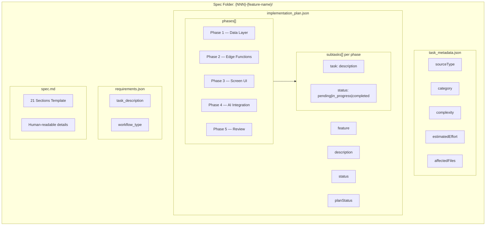
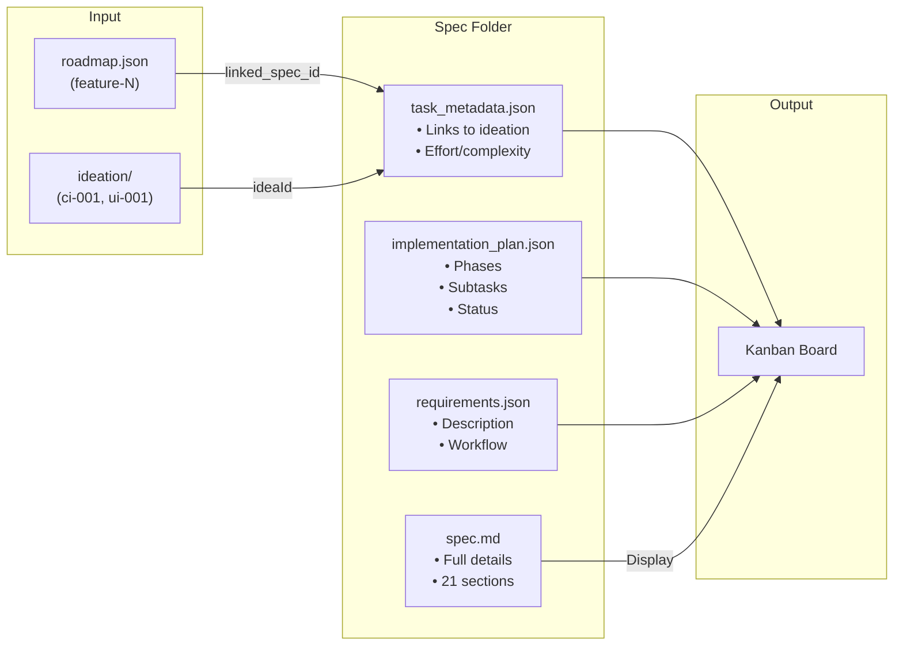
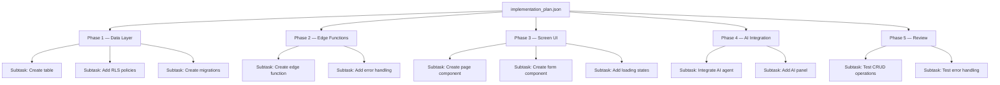
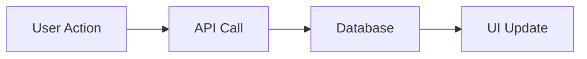
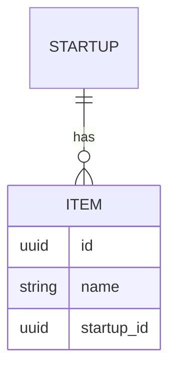

# Task/Feature Template

## How to Use This Template

> **Evaluate & Assess** — Not every task needs every section. Before writing:
>
> 1. **Assess the task** — What type? (feature, bug fix, refactor, docs)
> 2. **Determine scope** — Small fix or multi-phase feature?
> 3. **Include only what's needed:**
>    - Simple bug fix → Description, Affected Files, Acceptance Criteria
>    - UI component → Screens, 3-Panel Layout, User Journey
>    - Full feature → Most sections including Supabase, Edge Functions
>    - AI feature → Add AI Agents, Claude/Gemini Integration
> 4. **Skip unnecessary sections** — No mermaid diagram needed for a typo fix
> 5. **Add depth where it matters** — Complex logic needs workflows, simple CRUD doesn't
>
> **Rule:** Write what helps implement the task. Omit what doesn't add value.

---

## Quick Reference

| Field | Value |
|-------|-------|
| **Name** | `{NNN}-{kebab-case-name}` |
| **Category** | `feature` · `security` · `performance` · `ui_ux` · `documentation` |
| **Priority** | `must` · `should` · `could` |
| **Complexity** | `low` · `medium` · `high` |
| **Impact** | `low` · `medium` · `high` |
| **Tags** | `#dashboard` `#crm` `#ai` `#events` `#tasks` `#projects` |

---

## File Structure

```
.auto-claude/specs/{NNN}-{feature-name}/
├── implementation_plan.json   ← Phases & Subtasks
├── task_metadata.json         ← Source, Effort, Complexity
├── requirements.json          ← Task Description
└── spec.md                    ← Detailed Spec (this template)
```

### File Organization Diagram



### How Files Connect



### Subtask Structure



---

## JSON File Templates

### task_metadata.json

```json
{
  "sourceType": "manual | ideation",
  "ideationType": "code_improvements | ui_ux_improvements | security_hardening",
  "ideaId": "ci-001 | ui-001 | sec-001",
  "category": "feature | security | performance | documentation | quality | ui_ux",
  "complexity": "trivial | low | medium | high",
  "estimatedEffort": "trivial | small | medium | large",
  "affectedFiles": ["src/pages/Feature.tsx", "src/hooks/useFeature.ts"]
}
```

### implementation_plan.json

```json
{
  "feature": "Feature Name",
  "description": "# Feature Name\n\n## Rationale\n...\n\n## User Stories\n- As a founder...\n\n## Acceptance Criteria\n- [ ] ...",
  "created_at": "2026-01-19T00:00:00.000Z",
  "updated_at": "2026-01-19T00:00:00.000Z",
  "status": "backlog | pending | in_progress | completed",
  "planStatus": "pending | approved | rejected",
  "phases": [
    {
      "phase": "Phase 1 — Data Layer",
      "goal": "Create database tables and RLS",
      "deliverables": ["tables created", "RLS policies"],
      "subtasks": [
        { "task": "Create items table", "status": "pending" },
        { "task": "Add RLS policies", "status": "pending" }
      ]
    },
    {
      "phase": "Phase 2 — Edge Functions",
      "goal": "Create backend API",
      "deliverables": ["edge function deployed"],
      "subtasks": [
        { "task": "Create process-item function", "status": "pending" }
      ]
    },
    {
      "phase": "Phase 3 — Screen UI",
      "goal": "Build React components",
      "deliverables": ["page component", "form component"],
      "subtasks": [
        { "task": "Create FeaturePage component", "status": "pending" },
        { "task": "Create FeatureForm component", "status": "pending" }
      ]
    },
    {
      "phase": "Phase 4 — AI Integration",
      "goal": "Add AI capabilities",
      "deliverables": ["AI panel integrated"],
      "subtasks": [
        { "task": "Wire AI agent to panel", "status": "pending" }
      ]
    },
    {
      "phase": "Phase 5 — Review",
      "goal": "Verify end-to-end",
      "deliverables": ["all tests pass"],
      "subtasks": [
        { "task": "Test CRUD operations", "status": "pending" },
        { "task": "Test error handling", "status": "pending" }
      ]
    }
  ],
  "linked_roadmap_feature": "feature-N",
  "linked_prompts": ["prompts/NN-feature.md"]
}
```

### requirements.json

```json
{
  "task_description": "Brief description of the task",
  "workflow_type": "development | bug_fix | documentation | refactor"
}
```

---

## Spec Content (spec.md) — 21 Sections

---

## 1. Context & Role

Who you are, what you're building, the system context.

```
You are building [feature] for StartupAI, an AI-powered operating system for early-stage startup founders.
```

---

## 2. Description

What this feature/system does in 2-3 sentences.

---

## 3. Purpose

Why it exists, business value, problem it solves.

---

## 4. Goals

What success looks like (measurable outcomes).

- [ ] Goal 1
- [ ] Goal 2

---

## 5. Features

Detailed feature list with sub-items.

- **Feature A**
  - Sub-feature 1
  - Sub-feature 2
- **Feature B**

---

## 6. Screens & Wireframes

UI specifications, layout, visual references.

| Screen | Description |
|--------|-------------|
| List View | Shows all items with filters |
| Detail View | Shows single item details |
| Form | Create/edit form |

---

## 7. Screen Content & Data

What displays on each screen, data fields shown.

| Field | Type | Display |
|-------|------|---------|
| name | string | Header title |
| status | badge | Colored badge |
| date | date | Formatted date |

---

## 8. 3-Panel Layout Logic

How the three dashboard panels work together.

| Panel | Width | Content |
|-------|-------|---------|
| Left | 240px | Navigation, filters, context |
| Main | flex | Primary content, forms, tables |
| Right | 320px | AI recommendations, insights |

**Flow:** AI proposes (right) → Human approves (main) → System executes

---

## 9. AI Agents Utilized

Which AI agents interact with this feature.

| Agent | Purpose | Model |
|-------|---------|-------|
| QuickAssistant | General chat | Gemini Flash |
| TaskPrioritizer | Rank tasks | Claude Sonnet |

---

## 10. Workflows

Step-by-step flows for key actions.



---

## 11. User Journeys

Complete user flow stories.

**Journey: Create New Item**
1. User clicks "Add" button
2. Form modal opens
3. User fills required fields
4. User clicks "Save"
5. Item appears in list
6. Toast confirms success

---

## 12. Supabase Requirements

Database tables, columns, RLS policies.

```sql
-- Table
create table items (
  id uuid primary key default gen_random_uuid(),
  name text not null,
  startup_id uuid references startups(id),
  created_at timestamptz default now()
);

-- RLS
alter table items enable row level security;
create policy "Users see own startup items"
  on items for select using (startup_id = get_user_startup_id());
```

---

## 13. Edge Functions

Backend functions needed, their purpose.

| Function | Purpose | Trigger |
|----------|---------|---------|
| `process-item` | Process new items | On insert |
| `ai-analyze` | AI analysis | Manual call |

---

## 14. Claude SDK Integration

Claude agent setup for this feature.

```typescript
const agent = new ClaudeAgent({
  model: "claude-sonnet-4-5",
  systemPrompt: "You are helping with...",
  tools: [/* tools */]
});
```

---

## 15. Gemini Integration

Gemini features used.

| Feature | Model | Use Case |
|---------|-------|----------|
| Chat | gemini-3-flash | Quick responses |
| Analysis | gemini-3-pro | Deep reasoning |

---

## 16. Best Practices

Quality standards to follow.

- Use existing patterns from codebase
- Follow 3-panel layout conventions
- Implement loading/error states
- Add proper TypeScript types

---

## 17. Mermaid Diagrams

Visual workflows, ERD, data flow.



---

## 18. Real-World Examples

Concrete use cases.

**Example 1:** Founder creates a new project to track their MVP development...

**Example 2:** User filters tasks by priority to focus on urgent items...

---

## 19. User Stories

User perspective requirements.

- As a **founder**, I want to **[action]** so that **[benefit]**
- As a **solo founder**, I want to **[action]** so that **[benefit]**

---

## 20. Acceptance Criteria

How to verify completion.

- [ ] User can create new items
- [ ] Data persists to database
- [ ] List shows all user items
- [ ] Delete shows confirmation
- [ ] Error states display properly

---

## 21. Rationale

Why this approach was chosen.

---

## Metadata (for Auto-Claude)

```json
{
  "status": "backlog",
  "priority": "must",
  "complexity": "medium",
  "impact": "high",
  "category": "feature",
  "tags": ["#feature", "#dashboard"],
  "linked_roadmap_feature": "feature-N",
  "estimatedEffort": "medium"
}
```
