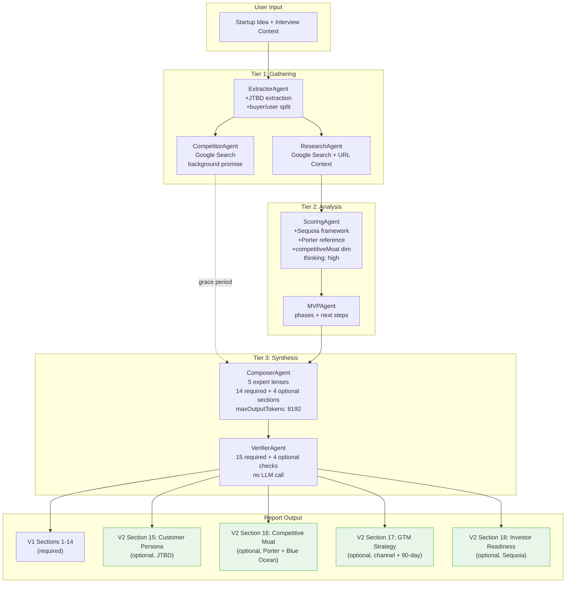
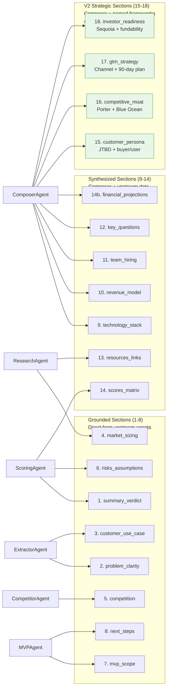
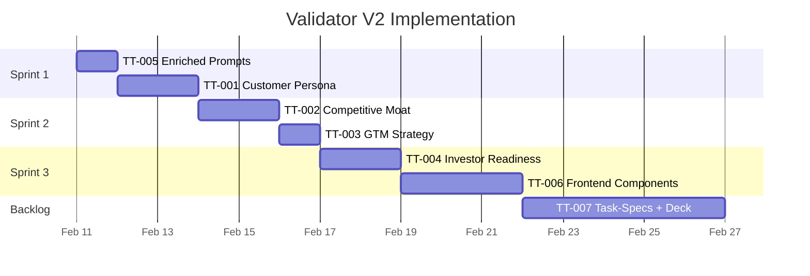

# TT-000: Validator V2 — Spec Index

> **Version:** 1.0 | **Date:** 2026-02-10
> **PRD:** `prd-validator.md`
> **Status:** Planning

---

## File Listing

| File | Ticket | Title | Priority | Effort | Status |
|------|--------|-------|----------|--------|--------|
| `prd-validator.md` | — | Master PRD | P0 | — | Draft |
| `TT-000-index.md` | — | This file: index + diagrams | P0 | — | Draft |
| `TT-005-enriched-agent-prompts.md` | SA-TT-005 | Enrich agent prompts with named frameworks | P0 | S | Not Started |
| `TT-001-customer-persona.md` | SA-TT-001 | Customer Persona report section | P1 | M | Not Started |
| `TT-002-competitive-moat.md` | SA-TT-002 | Competitive Moat section + scoring dimension | P1 | M | Not Started |
| `TT-003-gtm-strategy.md` | SA-TT-003 | GTM Strategy report section | P1 | M | Not Started |
| `TT-004-investor-readiness.md` | SA-TT-004 | Investor Readiness section + token compression | P1 | M | Not Started |
| `TT-006-frontend-sections.md` | SA-TT-006 | 4 new frontend components | P1 | M | Not Started |
| `TT-007-task-spec-layer.md` | SA-TT-007+008 | Task-spec architecture + deck export | P2 | L | Not Started |

---

## Dependency Graph

```
TT-005 (Prompts)         # Ships first, zero risk, no dependencies
   |
   v
TT-001 (Persona) ------> TT-006 (Frontend)
   |                         ^
   v                         |
TT-002 (Moat) -----------> TT-006
   |                         ^
   v                         |
TT-003 (GTM) ------------> TT-006
   |                         ^
   v                         |
TT-004 (Investor) -------> TT-006
                             |
                             v
                          TT-007 (Task-Specs + Deck Export)  [backlog]
```

### Dependency Rules

- **TT-005** has no dependencies — ships first as pure prompt changes
- **TT-001 through TT-004** each depend on TT-005 (enriched prompts provide context for new sections)
- **TT-001 through TT-004** are independent of each other — can ship in any order
- **TT-006** depends on all of TT-001 through TT-004 (needs types + schemas to build components)
- **TT-007** depends on TT-006 (task-specs + deck export build on the complete V2 report)

### Recommended Build Order

```
TT-005 -> TT-001 -> TT-002 -> TT-003 -> TT-004 -> TT-006 -> TT-007
```

TT-001 through TT-004 are ordered by complexity (persona is simplest, investor readiness includes token compression). TT-006 ships last because frontend components need all 4 types defined first.

---

## Sprint Allocation

| Sprint | Tickets | Duration | Deliverable |
|--------|---------|----------|-------------|
| Sprint 1 | TT-005, TT-001 | 2-3 days | Enriched prompts + customer persona section in report JSON |
| Sprint 2 | TT-002, TT-003 | 2-3 days | Competitive moat + GTM strategy sections in report JSON |
| Sprint 3 | TT-004, TT-006 | 3-4 days | Investor readiness + all 4 frontend components |
| Backlog | TT-007 | 5-7 days | Task-spec layer + deck export |

---

## Token Budget Summary

### Prompt Token Impact (Input)

| Agent | Current Prompt | V2 Addition | V2 Total | Timeout Budget |
|-------|---------------|-------------|----------|---------------|
| Extractor | ~350 tokens | +120 (JTBD, buyer/user) | ~470 | 10s (typical ~6s) |
| Scoring | ~500 tokens | +200 (Sequoia, Porter, moat dimension) | ~700 | 15s (typical ~13s) |
| Composer | ~600 tokens | +180 (expert lenses) + ~400 (4 new section specs) | ~1180 | 90s (typical ~40s) |
| Research | ~400 tokens | +0 | ~400 | 40s (typical ~20s) |
| Competitors | ~300 tokens | +0 | ~300 | 45s (background) |
| MVP | ~250 tokens | +0 | ~250 | 30s (typical ~11s) |
| Verifier | 0 (no LLM) | +0 | 0 | 5s (typical <1s) |

### Output Token Budget (Composer)

| Category | Tokens | Notes |
|----------|--------|-------|
| maxOutputTokens limit | 8192 | Hard cap in composer.ts |
| V1 output (14 sections) | ~6500 | Average across 3 E2E runs |
| Compression savings | ~-450 | monthly_y1 optional, resources capped, advisory capped |
| V1 after compression | ~6050 | |
| customer_persona | ~200 | Buyer/user/JTBD/triggers/objections |
| competitive_moat | ~250 | 5 dimensions + Porter summary |
| gtm_strategy | ~200 | Primary + channels + 90-day + loops |
| investor_readiness | ~200 | Score + stage + strengths/concerns + metrics + exits |
| **V2 total** | **~6900** | |
| **Margin** | **~1300** | 15.8% buffer |

---

## Diagram 1: Enhanced Pipeline Flow



---

## Diagram 2: Report Section Map



---

## Diagram 3: Implementation Sequence



---

## Critical Files Reference

| File | Role | Current Lines | Modified By |
|------|------|--------------|-------------|
| `supabase/functions/validator-start/types.ts` | TypeScript interfaces | 145 | TT-001, TT-002, TT-003, TT-004 |
| `supabase/functions/validator-start/schemas.ts` | Gemini JSON schemas (G1) | 393 | TT-001, TT-002, TT-003, TT-004 |
| `supabase/functions/validator-start/agents/extractor.ts` | Extraction + JTBD | 89 | TT-005 |
| `supabase/functions/validator-start/agents/scoring.ts` | Scoring + Porter + moat | 92 | TT-005, TT-002 |
| `supabase/functions/validator-start/agents/composer.ts` | 18-section synthesis | 116 | TT-005, TT-001-004 |
| `supabase/functions/validator-start/agents/verifier.ts` | Section validation | 132 | TT-001, TT-002, TT-003, TT-004 |
| `supabase/functions/validator-start/config.ts` | Agent configs (no changes) | 37 | — |
| `supabase/functions/validator-start/pipeline.ts` | Pipeline orchestrator (no changes) | 276 | — |
| `src/components/validator/ScoreCircle.tsx` | Reuse for fundability | ~40 | — (reference only) |
| `src/components/validator/ReportSection.tsx` | Reuse for section wrapper | ~30 | — (reference only) |
| `src/pages/ValidatorReport.tsx` | Add 4 new section renders | ~250 | TT-006 |
| `lean/repos/thinktank-adaptation-plan.md` | Source adaptation plan | 431 | — (reference only) |
| `lean/repos/agents-thinkai.md` | ThinkTank agent definitions | 528 | — (reference only) |
| `lean/prompts/TASK-TEMPLATE.md` | Task spec format | 488 | — (reference only) |

---

## Verification Checklist (All Tickets)

### Per-Ticket E2E Test Protocol

1. Run validator with: "AI-powered restaurant management platform for independent restaurants"
2. Run validator with: "SaaS tool that auto-generates investor update emails from Notion workspace"
3. Run validator with: "Healthtech wearable that predicts migraine attacks 2 hours before onset"
4. For each run, verify:
   - [ ] All 14 V1 sections present and non-empty
   - [ ] New V2 section(s) present (or gracefully absent with warning)
   - [ ] Overall score in 60-80 range (no inflation)
   - [ ] Pipeline time < 150s
   - [ ] Composer output tokens < 7800
   - [ ] Verifier reports `verified: true`
   - [ ] `npm run build` passes

### Regression Checklist

- [ ] Old reports (V1, no V2 sections) still render in frontend
- [ ] Scoring dimension_scores has 7 or 8 keys (never fails on 7)
- [ ] Frontend handles missing `customer_persona`, `competitive_moat`, `gtm_strategy`, `investor_readiness`
- [ ] No TypeScript errors in build
