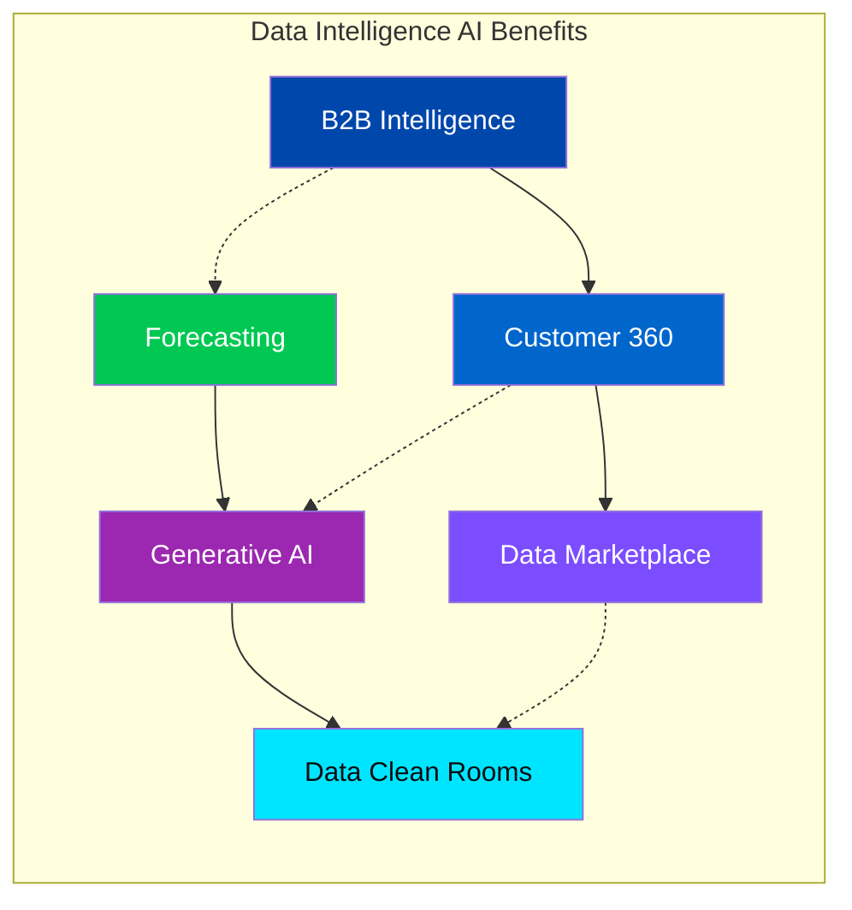

# BCG Data Intelligence AI — Design Specification

> **Source:** [BCG X Product Library](https://www.bcg.com/x/product-library/data-intelligence-ai)  
> **Aesthetic:** Luxury · Premium · Sophisticated · Intelligent  
> **Design Approach:** Lo-fi → Hi-fi wireframes, visual hierarchy, responsive layout

---

## 1. Color Palette (Wireframe & Diagram)

```
┌─────────────────────────────────────────────────────────────────────────────┐
│  PRIMARY PALETTE — Luxury High-End UI                                        │
├─────────────────────────────────────────────────────────────────────────────┤
│  ████ #0D0D12  Charcoal Black      — Headings, primary text                 │
│  ████ #1A1A2E  Deep Navy           — Hero backgrounds, cards               │
│  ████ #2D2D44  Slate               — Secondary surfaces                    │
│  ████ #0047AB  BCG Blue            — CTAs, links, accent (primary)          │
│  ████ #0066CC  Bright Blue         — Hover states, interactive              │
│  ████ #E8E8ED  Silver Mist         — Body text on dark                      │
│  ████ #F5F5F7  Off-White           — Light backgrounds, cards               │
│  ████ #FFFFFF  Pure White          — Clean surfaces, contrast               │
├─────────────────────────────────────────────────────────────────────────────┤
│  ACCENT PALETTE — Data & Analytics Focus                                    │
│  ████ #00C853  Success Green       — Value unlocked ($10B, $130M)           │
│  ████ #00E5FF  Cyan                — Data flows, connectors                │
│  ████ #7C4DFF  Deep Purple         — AI/ML, GenAI badges                   │
│  ████ #FF6D00  Amber               — Third-party data, partnerships        │
├─────────────────────────────────────────────────────────────────────────────┤
│  6-PILLAR DIAGRAM COLORS                                                    │
│  B2B Intelligence    → #0047AB   Customer 360  → #0066CC                     │
│  Data Marketplace    → #7C4DFF   Forecasting   → #00C853                    │
│  Generative AI       → #9C27B0   Data Clean Rooms → #00E5FF                  │
└─────────────────────────────────────────────────────────────────────────────┘
```

---

## 2. Typography Scale

| Token        | Font (Serif/Display) | Size | Weight | Use                    |
|-------------|------------------------|------|--------|------------------------|
| Display-1   | Playfair Display      | 56px | 600    | Hero headline           |
| Display-2   | Playfair Display      | 40px | 500    | Section titles          |
| Heading-1   | Inter                 | 28px | 600    | Card titles             |
| Heading-2   | Inter                 | 20px | 500    | Subsections             |
| Body-L      | Inter                 | 18px | 400    | Lead paragraph          |
| Body-M      | Inter                 | 16px | 400    | Body copy               |
| Body-S      | Inter                 | 14px | 400    | Captions, metadata      |
| Caption     | Inter                 | 12px | 500    | Labels, badges          |

---

## 3. ASCII Wireframe — Full Page Layout

```
╔═══════════════════════════════════════════════════════════════════════════════╗
║  HEADER (Sticky)                                                              ║
║  ┌────────┐  Our Services  Industries  Capabilities  BCG X  Insights  Join Us ║
║  │ BCG X  │  ─────────────────────────────────────────────────────────────  ║
║  └────────┘                                                                   ║
╠═══════════════════════════════════════════════════════════════════════════════╣
║                                                                               ║
║  HERO SECTION — Full-width gradient (navy → charcoal)                         ║
║  ┌─────────────────────────────────────────────────────────────────────────┐  ║
║  │                                                                         │  ║
║  │   A Data-to-Solutions Accelerator      ┌─────────────────┐              │  ║
║  │   That Illuminates New Paths to Value  │                 │              │  ║
║  │   [Display-1, white]                  │   Hero Image    │              │  ║
║  │                                        │   (3:4 ratio)   │              │  ║
║  │   Data fuels growth not by what it     │   [IMG]         │              │  ║
║  │   says but what it reveals. By         │                 │              │  ║
║  │   combining your org's data with       └─────────────────┘              │  ║
║  │   third-party datasets and AI...                                        │  ║
║  │                                                                         │  ║
║  │   [Share]  [Request Demo]                                               │  ║
║  │                                                                         │  ║
║  └─────────────────────────────────────────────────────────────────────────┘  ║
║                                                                               ║
║  METRICS STRIP — 4 stat cards, horizontal scroll on mobile                     ║
║  ┌──────────────┬──────────────┬──────────────┬──────────────┐                 ║
║  │    $10B      │    400+      │     10T      │     40+      │                 ║
║  │  unlocked    │ proprietary  │ data points  │ data sources │                 ║
║  │  200+ clients│   features   │  processed   │ & partners   │                 ║
║  └──────────────┴──────────────┴──────────────┴──────────────┘                 ║
║                                                                               ║
╠═══════════════════════════════════════════════════════════════════════════════╣
║                                                                               ║
║  ABOUT SECTION — Two-column (60/40)                                           ║
║  ┌────────────────────────────────────┬─────────────────────────────────┐     ║
║  │  About Data Intelligence AI        │  ┌─────────────────────────────┐     ║
║  │  [Heading-1]                        │  │   Introducing Data Intel AI  │     ║
║  │                                    │  │   [VIDEO 16:9]               │     ║
║  │  Successful companies don't use    │  └─────────────────────────────┘     ║
║  │  data, they transform it...         │                                     ║
║  │  Holistic yet modular ecosystem.    │  A Holistic Approach to Data Intel   ║
║  └────────────────────────────────────┴─────────────────────────────────┘     ║
║                                                                               ║
║  HOLISTIC APPROACH — Full-width infographic                                   ║
║  ┌─────────────────────────────────────────────────────────────────────────┐  ║
║  │  [Large diagram: data-to-solutions accelerator ecosystem]                │  ║
║  │  Proprietary models + real-time indicators + external datasets           │  ║
║  └─────────────────────────────────────────────────────────────────────────┘  ║
║                                                                               ║
╠═══════════════════════════════════════════════════════════════════════════════╣
║                                                                               ║
║  BENEFITS SECTION — 6-pillar grid (2×3 or 3×2 desktop)                        ║
║  ┌─────────────────────────────────────────────────────────────────────────┐  ║
║  │  The Benefits of Data Intelligence AI                                    │  ║
║  │  ┌─────────────┬─────────────┬─────────────┐                              │  ║
║  │  │ 1. B2B      │ 2. Customer │ 3. Data     │                              │  ║
║  │  │    Intel    │    360      │    Marketplace│                             │  ║
║  │  │ Leads,      │ Profiles    │ Self-service │                              │  ║
║  │  │ white space │ Unified     │ catalog      │                              │  ║
║  │  ├─────────────┼─────────────┼─────────────┤                              │  ║
║  │  │ 4. Forecast │ 5. Generative│ 6. Data     │                              │  ║
║  │  │ Demand,     │ AI          │ Clean Rooms │                              │  ║
║  │  │ churn       │ Dashboards  │ Secure collab│                              │  ║
║  │  └─────────────┴─────────────┴─────────────┘                              │  ║
║  └─────────────────────────────────────────────────────────────────────────┘  ║
║                                                                               ║
╠═══════════════════════════════════════════════════════════════════════════════╣
║                                                                               ║
║  DECODING SECTION — 3-video series                                            ║
║  ┌─────────────────────────────────────────────────────────────────────────┐  ║
║  │  Decoding Data Intelligence AI                                           │  ║
║  │  3-part video series: demystify building blocks                            │  ║
║  │  ┌─────────────────┬─────────────────┬─────────────────┐                 │  ║
║  │  │ [Video thumb]   │ [Video thumb]   │ [Video thumb]   │                 │  ║
║  │  │ Unlocking Secure│ Strengthening   │ Clarifying      │                 │  ║
║  │  │ Data Collab     │ Data Foundation │ Customer Journey│                 │  ║
║  │  └─────────────────┴─────────────────┴─────────────────┘                 │  ║
║  └─────────────────────────────────────────────────────────────────────────┘  ║
║                                                                               ║
╠═══════════════════════════════════════════════════════════════════════════════╣
║                                                                               ║
║  CASE STUDIES — 3 illustrated cards ($$ value focus)                          ║
║  ┌──────────────────┬──────────────────┬──────────────────┐                   ║
║  │ $25M             │ $130M            │ $250M            │                   ║
║  │ operating margin │ incremental rev  │ projected savings│                   ║
║  │ Leading Industrial│ Leading Consumer │ Leading Technology│                  ║
║  │ [IMG]            │ [IMG]           │ [IMG]            │                   ║
║  └──────────────────┴──────────────────┴──────────────────┘                   ║
║                                                                               ║
╠═══════════════════════════════════════════════════════════════════════════════╣
║                                                                               ║
║  EXPERTS SECTION — 4 avatars                                                   ║
║  Meet Our Data Intelligence AI Team                                           ║
║  ┌────┬────┬────┬────┐                                                        ║
║  │ 👤 │ 👤 │ 👤 │ 👤 │  Clark O'Niell · Mark Abraham · Aaron Arnoldsen · Japjit │  ║
║  │ SF │ Sea│ Sea│ SV │                                                        ║
║  └────┴────┴────┴────┘                                                        ║
║                                                                               ║
╠═══════════════════════════════════════════════════════════════════════════════╣
║                                                                               ║
║  INSIGHTS — Article cards                                                      ║
║  ┌─────────────────────┬─────────────────────┐                                ║
║  │ BCG Leader in AI     │ High-Frequency Data │                                ║
║  │ (Forrester)          │ & AI Enable Insurers │                               ║
║  └─────────────────────┴─────────────────────┘                                ║
║                                                                               ║
╠═══════════════════════════════════════════════════════════════════════════════╣
║                                                                               ║
║  FOOTER — Related services                                                    ║
║  Digital, Technology & Data | Artificial Intelligence | BCG X                 ║
║                                                                               ║
╚═══════════════════════════════════════════════════════════════════════════════╝
```

---

## 4. Flowchart — Content & User Journey

### 4a. Mermaid Diagram (implementable)

```mermaid
flowchart TD
    subgraph Hero[" "]
        A[Landing / Hero<br/>Data-to-Solutions Accelerator]
    end
    A --> B[Metrics Strip<br/>$10B · 400+ · 10T · 40+]
    A --> C[About / Intro<br/>Transform data → intelligence]
    A --> D[Request Demo CTA]
    B --> E[Introducing Video<br/>+ Holistic Approach diagram]
    C --> E
    E --> F[Benefits 6 Pillars<br/>B2B·360·Marketplace·Forecast·GenAI·Clean Rooms]
    F --> G[Decoding 3-Video Series]
    G --> H[Case Studies<br/>$25M · $130M · $250M]
    H --> I[Experts 4 profiles]
    I --> J[Insights 2 articles]
    J --> K[Related Services<br/>Digital Tech | AI | BCG X]
    style A fill:#1A1A2E,color:#fff
    style F fill:#2D2D44,color:#E8E8ED
    style G fill:#7C4DFF,color:#fff
    style H fill:#00C853,color:#fff
```

### 4b. ASCII Flowchart

```
                                    ┌─────────────────────┐
                                    │   LANDING / HERO    │
                                    │   Data-to-Solutions │
                                    └──────────┬──────────┘
                                               │
              ┌────────────────────────────────┼────────────────────────────────┐
              │                                │                                │
              ▼                                ▼                                ▼
     ┌─────────────────┐            ┌─────────────────┐            ┌─────────────────┐
     │  METRICS STRIP  │            │  ABOUT / INTRO   │            │  REQUEST DEMO   │
     │  $10B 400+ 10T  │            │  Transform data  │            │  [Primary CTA]  │
     └────────┬────────┘            └────────┬────────┘            └─────────────────┘
              │                              │
              └──────────────┬───────────────┘
                             │
                             ▼
                    ┌─────────────────────┐
                    │ INTRODUCING VIDEO    │
                    │ + Holistic diagram   │
                    └──────────┬──────────┘
                               │
                               ▼
                    ┌─────────────────────┐
                    │ BENEFITS (6 pillars) │
                    │ B2B·360·Market·      │
                    │ Forecast·GenAI·Clean  │
                    └──────────┬──────────┘
                               │
                               ▼
                    ┌─────────────────────┐
                    │ DECODING (3 videos)  │
                    │ Secure·Foundation·   │
                    │ Customer Journey     │
                    └──────────┬──────────┘
                               │
                               ▼
                    ┌─────────────────────┐
                    │ CASE STUDIES (3)     │
                    │ $25M · $130M · $250M │
                    └──────────┬──────────┘
                               │
                               ▼
                    ┌─────────────────────┐
                    │ EXPERTS (4)          │
                    │ INSIGHTS (2)         │
                    └──────────┬──────────┘
                               │
                               ▼
                    ┌─────────────────────┐
                    │ RELATED SERVICES     │
                    └─────────────────────┘
```

---

## 5. Six-Pillar Benefit Diagram (Flowchart)



---

## 6. Visual Cards — Illustrated Style Spec

```
┌─────────────────────────────────────────────────────────────────────────────┐
│  ILLUSTRATED VISUAL CARD PATTERN (Data Intelligence)                          │
├─────────────────────────────────────────────────────────────────────────────┤
│                                                                             │
│  BENEFIT CARD (6-pillar):                                                    │
│  ┌───────────────────────────────────────────────────────────────────────┐  │
│  │  [Icon: data flow / chart / connection diagram]                        │  │
│  │  #### B2B Intelligence | Customer 360 | Data Marketplace | etc.        │  │
│  │  Body: 2-3 lines, first + third-party data, AI decision-making          │  │
│  └───────────────────────────────────────────────────────────────────────┘  │
│                                                                             │
│  CASE STUDY CARD:                                                            │
│  ┌───────────────────────────────────────────────────────────────────────┐  │
│  │  $25 million | $130 million | $250 million                             │  │
│  │  [Large metric, bold]                                                  │  │
│  │  operating margin | incremental revenue | projected savings            │  │
│  │  Leading Industrial Goods | Consumer Electronics | Technology Company   │  │
│  │  Body: 3-4 lines, data sources, AI models, outcome                     │  │
│  └───────────────────────────────────────────────────────────────────────┘  │
│                                                                             │
│  DESIGN TOKENS: Same as 01-bcg-content (radius 12px, shadow, padding)        │
│                                                                             │
└─────────────────────────────────────────────────────────────────────────────┘
```

---

## 7. Responsive Breakpoints

| Breakpoint | Width   | Layout Changes                                            |
|------------|---------|-----------------------------------------------------------|
| Mobile     | 375px   | Single column, metrics scroll horizontal, 6 pillars stack |
| Tablet     | 768px   | 2-column benefits, 2-column case studies                  |
| Desktop    | 1280px  | 3×2 benefit grid, 3-column case studies                   |
| Wide       | 1920px  | Max-width container ~1400px, centered                     |

---

## 8. Diagrams & Charts Placement

| Section      | Diagram Type          | Purpose                                      |
|--------------|-----------------------|----------------------------------------------|
| Holistic     | Full-width infographic| Data-to-solutions ecosystem visual           |
| Benefits     | 6-pillar grid/flowchart| B2B, 360, Marketplace, Forecast, GenAI, Clean |
| Decoding     | 3-video cards         | Secure collab, Foundation, Customer Journey  |
| Case Studies | Illustrated $ cards   | $25M, $130M, $250M client outcomes           |

---

## 9. Hi-Fi Design Tokens (CSS Variables)

```css
:root {
  /* Colors (shared with Deep Customer Engagement) */
  --color-charcoal: #0D0D12;
  --color-navy: #1A1A2E;
  --color-slate: #2D2D44;
  --color-bcg-blue: #0047AB;
  --color-bright-blue: #0066CC;
  --color-silver: #E8E8ED;
  --color-off-white: #F5F5F7;
  --color-success: #00C853;
  --color-cyan: #00E5FF;
  --color-deep-purple: #7C4DFF;
  --color-violet: #9C27B0;
  --color-amber: #FF6D00;

  /* Data Intelligence accent overrides */
  --color-data-flow: #00E5FF;
  --color-ai-badge: #9C27B0;
  --color-value-metric: #00C853;

  /* Typography */
  --font-display: 'Playfair Display', Georgia, serif;
  --font-body: 'Inter', -apple-system, BlinkMacSystemFont, sans-serif;

  /* Spacing */
  --space-2: 0.5rem;
  --space-4: 1rem;
  --space-6: 1.5rem;
  --space-8: 2rem;
  --space-12: 3rem;
  --space-16: 4rem;
  --space-24: 6rem;

  /* Transitions */
  --transition-fast: 150ms ease;
  --transition-normal: 250ms ease;
}
```

---

## 10. Content Summary (from BCG source)

| Section   | Key Copy |
|-----------|----------|
| Hero      | "A Data-to-Solutions Accelerator That Illuminates New Paths to Value" — Data fuels growth not by what it says but what it reveals. Third-party datasets + AI. |
| Metrics   | $10B unlocked (200+ clients), 400+ features, 10T data points, 40+ sources |
| Benefits  | B2B Intel, Customer 360, Data Marketplace, Forecasting, GenAI, Data Clean Rooms |
| Decoding  | Unlocking Secure Data Collaboration · Strengthening Data Foundation · Clarifying Customer Journey |
| Case 1    | $25M operating margin — Industrial Goods, forecasting + third-party data |
| Case 2    | $130M incremental revenue — Consumer Electronics, 500 signals, 15 sources |
| Case 3    | $250M projected savings — Technology, 100+ sources, 10T data points |

---

**Status:** Draft wireframe + design spec  
**Cross-reference:** [01-bcg-content.md](./01-bcg-content.md) (Deep Customer Engagement AI)
