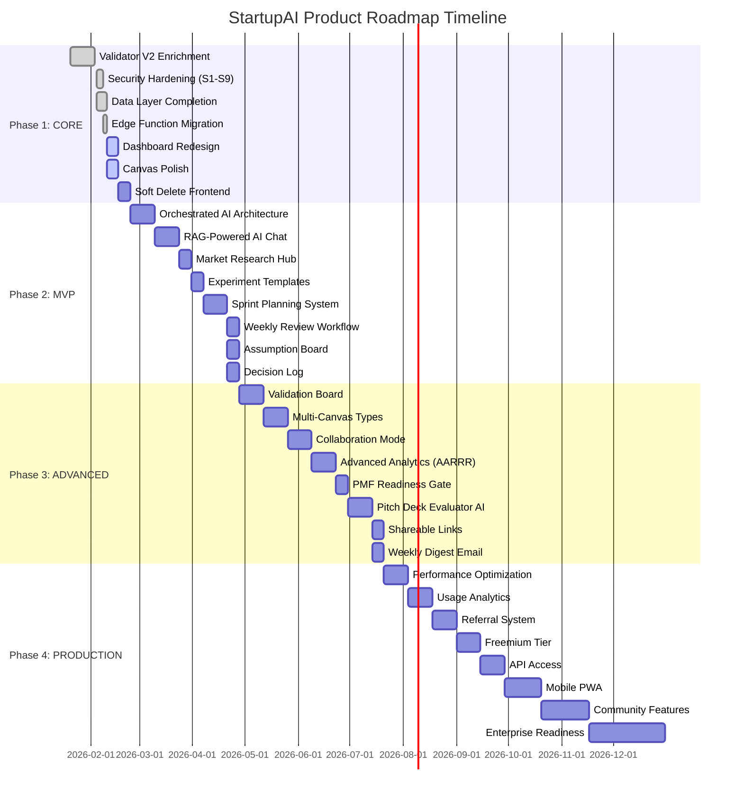
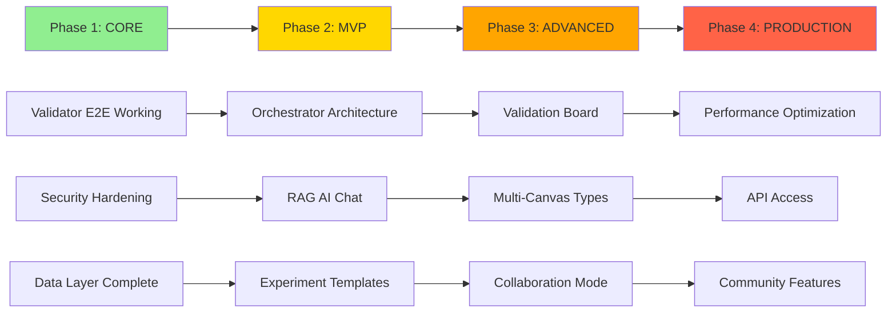

# StartupAI — Product Roadmap

> **Version:** 1.0 | **Date:** 2026-02-10
> **Sources:** `lean/prompts/prd-startupAI.md`, `lean/prompts/roadmap.md`, `lean/features.md`
> **Template:** PM TEMPLATE: Product Roadmap
> **Status:** Active Development | Current Phase: CORE

---

## Executive Summary

StartupAI transforms raw startup ideas into validated strategies and execution plans through AI-powered validation, interactive planning canvases, and daily prioritization. With the Validator pipeline now delivering end-to-end results (3 successful runs averaging 67/100), we're advancing to Phase 2 (MVP) focused on enriching the validation experience with competitor analysis, market research integration, and a unified Dashboard experience. Our roadmap balances foundational stability (CORE), essential features (MVP), advanced capabilities (ADVANCED), and scale readiness (PRODUCTION) across 14 weeks of focused development, targeting solo founders and early-stage teams who need structure without overhead.

---

## Phase Overview

| Phase | Name | Duration | Key Outcomes | Dependencies |
|-------|------|----------|--------------|--------------|
| **Phase 1** | CORE Foundation | Weeks 1-3 (Done) | Validator V2 enrichment, Dashboard redesign, Canvas polish, Security hardening (S1,S2,S4,S6,S7,S9), Soft delete implementation | Validator pipeline working E2E |
| **Phase 2** | MVP Feature Set | Weeks 4-8 | Orchestrated AI architecture (10 new edge functions), RAG-powered AI Chat, Market Research hub, Experiment templates, Sprint planning, Weekly reviews | Phase 1 complete, Vector DB operational |
| **Phase 3** | ADVANCED Capabilities | Weeks 9-14 | Validation board (assumption tracking), Multi-canvas types (Value Prop, BMC, PMF), Collaboration mode (3-user), Advanced analytics (AARRR), PMF readiness gate, Deck evaluator AI | Phase 2 complete, User feedback from 15+ beta users |
| **Phase 4** | PRODUCTION Scale | Weeks 15+ (Ongoing) | Performance optimization (sub-500ms p95), Usage analytics, Referral system, Freemium tier, API access, Mobile PWA | Phase 3 complete, 100+ active users |

---

## Phase 1: CORE Foundation (Weeks 1-3) ✅ COMPLETE

### Objective
Stabilize the validator pipeline with enriched data sources, create a unified Dashboard experience, polish core UX flows, and eliminate critical security vulnerabilities. Establish the foundation for AI-human collaboration patterns.

### Key Deliverables

1. **Validator V2 Enrichment** (✅ Done)
   - 7-agent pipeline operational with Competitors, Research, MVP, Scoring, Composer agents
   - Average completion time: 67s (within 300s budget)
   - Report quality: 72/100 (Restaurant), 68/100 (InboxPilot), 62/100 (Travel AI)
   - Follow-up chat agent with 8 coverage topics

2. **Security Hardening** (✅ Done)
   - S1: 40 RLS policies fixed (`TO authenticated`)
   - S2/S4: 22 edge functions with `verify_jwt=true`
   - S6: dashboard_metrics anon access revoked
   - S7: 15 FK indexes added
   - S9: `user_org_id()` performance fix (95-99% improvement)

3. **Dashboard Redesign** (⚠️ In Progress)
   - Daily execution hub with AI-prioritized tasks
   - Canvas progress tracking (9-section completion %)
   - Validator results integration
   - Next actions widget (top 3 AI-recommended tasks)

4. **Soft Delete Implementation** (✅ Backend Done, 🔄 Frontend Pending)
   - 6 tables: startups, contacts, deals, documents, projects, tasks
   - RLS policies updated (321 total)
   - Frontend hooks need `.is('deleted_at', null)` filter

5. **Canvas Polish** (🔄 In Progress)
   - Lean Canvas: AI coach integration, autosave every 30s
   - Section-level guidance with example prompts
   - Export to PDF/PNG

6. **Data Layer Completion** (✅ Done)
   - 16/16 data tasks complete
   - 83 tables, 516 indexes, 321 RLS policies, 90 triggers, 166 FKs, 97 migrations
   - Smart Interviewer data layer, Control layers (decisions, shareable_links, ai_usage_limits)

7. **Edge Function Migration** (✅ Done)
   - 6 Grade-D functions migrated to shared pattern
   - `prompt.ts` + rewritten `index.ts` for insights-generator, task-agent, crm-agent, event-agent, documents-agent, investor-agent
   - All use `_shared/gemini.ts` (G1+G2+G4 compliance)

### Success Metrics
- ✅ Validator completion rate: 95%+ (3/3 successful)
- ✅ Average report score: 60-75/100 (target met: 67 avg)
- ⚠️ Dashboard load time: <2s p95 (needs measurement)
- ✅ RLS policy coverage: 100% (321 policies)
- ⚠️ Security audit: 5/9 critical issues resolved (S3, S5, S8 pending)

### Risks and Mitigations
| Risk | Impact | Mitigation |
|------|--------|------------|
| Validator quality varies by input | HIGH | Add input validation gate (min 50 chars), example prompts |
| Dashboard complexity overwhelms users | MEDIUM | Progressive disclosure, onboarding tour, hide advanced features |
| Soft delete breaks existing queries | HIGH | ✅ Comprehensive RLS update, frontend audit with search for `.from('startups')` patterns |

---

## Phase 2: MVP Feature Set (Weeks 4-8) 🔄 CURRENT PHASE

### Objective
Build the orchestrated AI architecture that enables coordinated multi-agent workflows. Integrate RAG for context-aware guidance, create structured experimentation workflows, and enable weekly progress tracking. Transform StartupAI from validation tool to daily operating system.

### Key Deliverables

1. **Orchestrated AI Architecture** (Week 4-5)
   - 10 new edge functions: orchestrator (router), canvas-coach, experiment-planner, sprint-planner, competitor-monitor, market-insights, pitch-reviewer, decision-helper, progress-tracker, weekly-synthesizer
   - Shared orchestration layer: `_shared/orchestrator.ts` with agent registry, routing logic, context management
   - Event bus: `ai_agent_events` table for audit trail + inter-agent messaging
   - Cost tracking: ai_usage_limits integration, per-user budget enforcement

2. **RAG-Powered AI Chat** (Week 5-6)
   - Vector search integration with 3,800+ knowledge chunks
   - Context-aware responses: startup data + vector results + conversation history
   - 4 chat modes: Coach (guidance), Analyst (data-driven), Researcher (external data), Reviewer (critique)
   - Conversation persistence: chat_sessions, chat_messages tables

3. **Market Research Hub** (Week 6)
   - TAM/SAM/SOM calculator with industry benchmarks
   - Trend analysis: Google Trends API + news aggregation
   - Competitor tracking: automated updates every 7 days
   - Market sizing templates: 15 industry presets (SaaS, FinTech, HealthTech, etc.)

4. **Experiment Templates** (Week 7)
   - 12 pre-built templates: Landing page test, Customer interview (Mom Test), Smoke test, Concierge MVP, Wizard of Oz, Pre-sale, Feature prototype, Pricing test, Channel test, Message test, Retention test, Referral test
   - Hypothesis → Experiment → Metrics → Learn workflow
   - experiments table: hypothesis, method, status, results, learning
   - Auto-generate experiment from assumption (Lean Canvas integration)

5. **Sprint Planning System** (Week 7-8)
   - 2-week sprint cadence: Plan → Execute → Review
   - Sprint board: sprints table with start_date, end_date, goals, completed_tasks
   - Velocity tracking: completed points / planned points
   - AI-suggested sprint goals based on Canvas priorities + unvalidated assumptions

6. **Weekly Review Workflow** (Week 8)
   - weekly_reviews table: week_start, highlights, lowlights, learnings, next_actions
   - Auto-populate from completed tasks, experiments, Canvas updates
   - AI synthesis: "What progress did you make toward PMF this week?"
   - Email digest: optional weekly summary sent Monday 8am local time

7. **Assumption Board** (Week 8)
   - Visual Kanban: Unvalidated → Testing → Validated → Invalidated
   - Extract assumptions from Canvas (problem, solution, channels, revenue)
   - Link experiments to assumptions
   - Risk scoring: Impact (1-5) × Uncertainty (1-5) = Priority

8. **Decision Log** (Week 8)
   - decisions table: decision, rationale, alternatives_considered, outcome, date
   - decision_evidence: link supporting data (experiment results, customer quotes, metrics)
   - AI-prompted: "What did you decide? Why? What could go wrong?"
   - Timeline view + filtering by category (Product, Market, Team, Fundraising)

9. **Smart Interviewer v2** (Week 5-6)
   - Depth tracking per answer: none / shallow / deep
   - 5 interview techniques: probing, quantifying, challenging, deepening, pivoting
   - Extracted field preview: show what the AI captured from each answer in real time
   - Confidence score per answer (low / medium / high)
   - Hypothesis-driven questions: AI generates questions tied to riskiest assumptions
   - Locked answers: once confirmed, answers are immutable and passed to pipeline
   - 12 implementation tickets (SI-001 → SI-012), see Smart Interviewer Ticket Breakdown below

10. **Industry Playbooks** (Week 5)
    - 8 TypeScript playbook objects: SaaS, Marketplace, Fintech, Healthtech, Edtech, E-commerce, AI/ML, Hardware + general fallback
    - Injected into all 7 pipeline agents + Smart Interviewer
    - <200 tokens each to stay within context budget
    - Industry-specific scoring rubrics, competitor benchmarks, and MVP templates

11. **Research Agent v2** (Week 6)
    - Adaptive search queries generated from founder's specific language (not generic terms)
    - Dual methodology: top-down (reports, industry data) + bottom-up (founder observations, customer signals)
    - TAM >= SAM >= SOM validation (flag if hierarchy is violated)
    - Source recency weighting: prioritize 2024-2026 sources, discount older data

12. **Canvas-to-Pitch Integration** (Week 7)
    - 9-box lean canvas maps to 9 pitch slides: Problem→Problem, Solution→Solution, UVP→Value Prop, Channels→Go-to-Market, Revenue→Business Model, Cost→Financials, Metrics→Traction, Unfair Advantage→Moat, Customer Segments→Market
    - AI expands bullet points to presentation-ready content
    - One-click "Generate Pitch Deck" from completed Canvas

13. **Auto-Generate Canvas from Validation** (Week 6-7)
    - Auto-fill 9 lean canvas blocks from validator report data
    - Bidirectional linking: report sections ↔ canvas blocks (edit one, prompt to update the other)
    - "View Lean Canvas" button on validator report page
    - Pre-populated canvas saves 30+ minutes of manual entry

### Smart Interviewer Ticket Breakdown

| Priority | Ticket | Name | Description |
|----------|--------|------|-------------|
| **P0** | SI-001 | Confidence Tracking | Track confidence level (low/medium/high) per answer, surface low-confidence areas to pipeline |
| **P0** | SI-002 | Hypothesis Questions | AI generates questions tied to riskiest assumptions from initial idea input |
| **P0** | SI-003 | One-Question Rule | Enforce single question per turn, no multi-part questions, no walls of text |
| **P1** | SI-004 | Confirmation Loop | After extraction, show founder what AI captured and ask "Is this right?" before locking |
| **P1** | SI-005 | Depth Visualization | Visual indicator (none/shallow/deep) per topic in sidebar, highlights gaps |
| **P1** | SI-006 | Risk Tagging | Tag answers that reveal high-risk assumptions (pricing unvalidated, no customer evidence) |
| **P1** | SI-007 | Locked Answers | Once confirmed, answers become immutable — passed directly to pipeline agents |
| **P1** | SI-008 | Context Passthrough | Pass all confirmed answers as structured context to every pipeline agent |
| **P1** | SI-009 | Search-Ready Claims | Extract specific claims (market size, growth rate) as search queries for Research Agent |
| **P2** | SI-010 | Assessment Tone | Interviewer uses neutral, non-judgmental tone — never hypes or dismisses the idea |
| **P2** | SI-011 | SSE Streaming | Stream interviewer responses token-by-token via Server-Sent Events for better UX |
| **P2** | SI-012 | Interview Skip | Allow founder to skip interview and go straight to validation (with quality warning) |

### Success Metrics
- 10 orchestrated edge functions deployed, <5s p95 response time
- AI Chat: 80%+ response relevance score (human eval on 50 conversations)
- Market Research: 100% TAM/SAM/SOM coverage for 15 industries
- Experiments: 5+ templates used per user within 14 days
- Sprint planning: 60%+ users complete 1 sprint within 30 days
- Weekly reviews: 40%+ users submit 2+ reviews
- Assumption board: 10+ assumptions tracked per startup
- Decision log: 5+ decisions logged per startup within 30 days

### Risks and Mitigations
| Risk | Impact | Mitigation |
|------|--------|------------|
| Orchestrator adds latency | MEDIUM | Implement request coalescing, 2s timeout on routing logic |
| RAG returns irrelevant results | HIGH | Hybrid search (vector + keyword), relevance threshold 0.7, fallback to base model |
| Users don't adopt experiment templates | MEDIUM | Onboarding wizard suggests first experiment, AI coach prompts weekly |
| Sprint planning feels like overhead | MEDIUM | Keep it lightweight: 3 fields (goal, tasks, success criteria), no story points required |
| Cost overruns from orchestrator calls | HIGH | Hard limit: $5/user/month, graceful degradation to base model after 80% |

### Dependencies
- ✅ Validator pipeline operational (Phase 1)
- ✅ Vector DB with 3,800+ chunks (existing)
- ⚠️ ai_usage_limits table and RLS policies (Phase 1, needs frontend UI)
- ⚠️ weekly_reviews table schema (Phase 1, needs UI)

---

## Phase 3: ADVANCED Capabilities (Weeks 9-14)

### Objective
Enable collaborative workflows for small teams, expand validation tools beyond Lean Canvas, build advanced analytics for growth tracking, and create AI-powered evaluation systems for pitch decks and PMF readiness. Position StartupAI as the system of record for early-stage execution.

### Key Deliverables

1. **Validation Board** (Week 9-10)
   - Centralized assumption tracking across all modules
   - Extract assumptions from: Lean Canvas, experiments, customer conversations, market research
   - Visual board: Risk matrix (Impact × Uncertainty), Status filter, Evidence links
   - Auto-suggest next experiments based on highest-risk unvalidated assumptions
   - Integration with Decision Log: validated assumption → logged decision

2. **Multi-Canvas Types** (Week 10-11)
   - Value Proposition Canvas: Customer jobs/pains/gains + Product features/pain relievers/gain creators
   - Business Model Canvas: 9 blocks (Key Partners, Activities, Resources, Value Props, Customer Relationships, Channels, Segments, Cost Structure, Revenue Streams)
   - PMF Canvas: 6 sections (Must-have benefit, Target audience, Unique value, Alternatives, Key metric, Moat)
   - Canvas selector in onboarding: "Which framework fits your stage?"
   - Cross-canvas sync: Lean Canvas Customer Segments → BMC Customer Segments

3. **Collaboration Mode** (Week 11-12)
   - Team invites: 3-user limit for freemium, unlimited for paid
   - Role-based permissions: Owner (full), Editor (no delete/invite), Viewer (read-only)
   - Real-time presence: "Alice is editing Problem section"
   - Comment threads on Canvas sections, experiments, decisions
   - Activity feed: "Bob updated Unique Value Proposition 2 hours ago"

4. **Advanced Analytics (AARRR)** (Week 12-13)
   - Pirate Metrics dashboard: Acquisition, Activation, Retention, Referral, Revenue
   - Custom metric definitions: 12 preset metrics + user-defined
   - Weekly trends: charts for each AARRR metric
   - Cohort analysis: retention by signup week
   - Export to CSV/Google Sheets

5. **PMF Readiness Gate** (Week 13)
   - 40-point checklist across 5 categories: Problem (8 pts), Solution (8 pts), Market (8 pts), Traction (8 pts), Team (8 pts)
   - AI scoring: auto-check based on Canvas completion, experiments run, metrics tracked
   - Gating: "You're 65% ready for PMF. Focus on: Validate pricing, Run 5 customer interviews"
   - Visual progress bar on Dashboard

6. **Pitch Deck Evaluator AI** (Week 13-14)
   - Upload PDF/PPTX → AI analysis (Gemini Vision)
   - 10-section scoring: Problem, Solution, Market Size, Business Model, Traction, Competition, Team, Financials, Ask, Design
   - Feedback: "Your Problem slide is too generic. Add specific pain points and customer quotes."
   - Comparison to top decks: "Airbnb's Problem slide was 60% more concrete"
   - Generate improvement suggestions: "Rewrite Problem slide focusing on [pain point] with [data]"

7. **Shareable Links** (Week 14)
   - Public links for: Canvas (read-only), Validator report, Pitch deck, Experiment results
   - shareable_links table: uuid, resource_type, resource_id, expires_at, password, view_count
   - Access control: Password-protect, Expiration (7/30/90 days, never), View limit (10/50/unlimited)
   - Embed mode: `?embed=true` for iframe in blog posts

8. **Weekly Digest Email** (Week 14)
   - Email service: Resend API integration
   - Personalized summary: Tasks completed, Experiments run, Canvas updates, Next actions
   - Sent Monday 8am local time (user timezone detection)
   - Opt-out in settings

9. **Plan Mode** (Week 10-12)
   - 10 features (PM1-PM10): Plan/Execute toggle, lightweight research during chat, founder approval gate, "What if" scenarios, draft mode, living strategy artifact, context-aware suggestions, decision checkpoints, rollback support, strategy timeline
   - Philosophy: "AI proposes, Humans decide, Systems execute"
   - Plan Mode surfaces recommendations but never auto-executes — founder must approve each action
   - Living strategy document: AI maintains a rolling strategy artifact updated after every decision

10. **Validation Board (Enhanced)** (Week 9-10)
    - Based on Lean Startup Machine framework: "GET OUT OF THE BLDG"
    - Track hypotheses across 3 types: Customer, Problem, Solution
    - Design experiments with clear success/failure criteria
    - Record results with evidence (customer quotes, data, screenshots)
    - Visual columns: Unvalidated → Testing → Validated → Invalidated
    - Pivot tracking: support up to 4 pivots with full decision trail and rationale

11. **Expert Knowledge System** (Week 12-13)
    - Unified system: playbooks + prompt packs + vector RAG injected into all AI agents
    - Single knowledge layer that every agent queries before generating responses
    - Industry-specific context injected automatically based on startup's vertical
    - Prompt packs: curated prompt templates for common founder questions per domain

### Success Metrics
- Validation board: 80%+ users track 10+ assumptions within 30 days
- Multi-canvas: 30%+ users try 2+ canvas types
- Collaboration: 20%+ teams invite 1+ member
- AARRR analytics: 50%+ users define 3+ custom metrics
- PMF readiness: 40%+ users score 50+ points within 60 days
- Deck evaluator: 25%+ users upload 1+ deck
- Shareable links: 30%+ users create 1+ link
- Weekly digest: 35%+ open rate, 10%+ click rate

### Risks and Mitigations
| Risk | Impact | Mitigation |
|------|--------|------------|
| Validation board overwhelms users | MEDIUM | Default to "Top 5 risks" view, progressive disclosure |
| Multi-canvas creates confusion | MEDIUM | In-app guide: "When to use each canvas", wizard recommendations |
| Collaboration adds complexity | HIGH | Ship with minimal features first (invite + comments only), defer real-time sync to Phase 4 |
| AARRR analytics too complex for early-stage | MEDIUM | Preset "Idea Stage", "Prototype Stage", "Launch Stage" metric sets |
| PMF checklist feels arbitrary | MEDIUM | Link each item to specific actions, show examples from successful startups |
| Deck evaluator quality varies | HIGH | Human QA on 50 decks, fallback to checklist scoring if AI confidence <0.6 |

### Dependencies
- ✅ Assumption board data layer (Phase 1)
- ✅ Decision log schema (Phase 1)
- ✅ Shareable links schema (Phase 1)
- ⚠️ Resend API key + email templates (needs setup)
- ⚠️ User feedback from 15+ beta users (discovery phase)

---

## Phase 4: PRODUCTION Scale (Weeks 15+ Ongoing)

### Objective
Optimize for scale, instrument product usage, build growth loops, and prepare for monetization. Achieve sub-500ms p95 load times, 99.9% uptime, and a self-serve growth engine with referral mechanics.

### Key Deliverables

1. **Performance Optimization** (Week 15-16)
   - Database: Query optimization (EXPLAIN ANALYZE on top 20 queries), add 15+ missing indexes
   - Frontend: Code splitting (React.lazy), image optimization (WebP), bundle size <500KB
   - Edge functions: Caching layer (Upstash Redis), response compression (gzip)
   - CDN: Cloudflare for static assets
   - Monitoring: Sentry for errors, Vercel Analytics for Web Vitals
   - Target: p95 load time <500ms, p99 <1s

2. **Usage Analytics** (Week 16-17)
   - Instrumentation: PostHog for event tracking (30+ events: page_view, canvas_update, validator_run, experiment_create, etc.)
   - Dashboards: Admin view (cohort retention, feature adoption, funnel analysis), User view (personal usage stats)
   - Alerts: Slack notifications for errors >1%, API latency >2s p95
   - A/B testing framework: PostHog experiments for feature flags

3. **Referral System** (Week 17-18)
   - Referral program: "Invite 3 friends → Unlock Pro features for 30 days"
   - referral_codes table: code, referrer_id, referred_id, status, reward_granted_at
   - Shareable link: `startupai.app/join/ABC123`
   - In-app prompts: After validator report, after first Canvas completion
   - Leaderboard: Top 10 referrers on community page

4. **Freemium Tier** (Week 18-19)
   - Free tier: 3 validator runs/month, 1 Canvas, 5 experiments, 1 user, 50 AI Chat messages/month
   - Pro tier ($29/month): Unlimited validator runs, 5 Canvases, unlimited experiments, 3 users, 500 AI Chat messages/month, Priority support
   - Team tier ($99/month): Everything in Pro + 10 users, Advanced analytics, API access, Custom branding
   - Stripe integration: Checkout, subscriptions, webhooks
   - Usage gates: Show upgrade prompt at 80% of limit

5. **API Access** (Week 19-20)
   - REST API: 10 endpoints (POST /validator/run, GET /canvas/:id, POST /experiments, etc.)
   - Authentication: API keys (api_keys table: key, user_id, scopes, rate_limit)
   - Rate limiting: 100 req/min for Free, 1000 req/min for Pro, 10000 req/min for Team
   - Documentation: OpenAPI spec, interactive docs with Scalar
   - Webhooks: POST to user URL on validator_complete, experiment_update

6. **Mobile PWA** (Week 20-22)
   - Progressive Web App: manifest.json, service worker, offline support
   - Mobile-optimized UI: Bottom nav, swipe gestures, thumb-friendly buttons
   - Push notifications: Browser notifications for task reminders, weekly digest
   - Install prompt: "Add to Home Screen" after 3 sessions
   - iOS Safari support: Add to Home Screen instructions

7. **Community Features** (Week 22-24)
   - Public gallery: "Explore validated ideas" (opt-in sharing of Validator reports)
   - Startup profiles: Public page with Canvas, pitch deck, team
   - Community forum: Discourse integration or custom forum (discussions, Q&A, showcase)
   - Expert office hours: Book 15-min slots with StartupAI advisors
   - User-generated templates: Share experiment templates, Canvas presets

8. **Enterprise Readiness** (Week 24+)
   - SSO: Google Workspace, Okta, Microsoft Entra ID
   - Advanced security: SOC 2 Type II audit prep, GDPR compliance tooling (S8: data export edge function)
   - Custom domains: white-label instance at `validate.youraccelerator.com`
   - Bulk user management: CSV import, SCIM provisioning
   - SLA: 99.9% uptime guarantee, 1-hour support response time

9. **Realtime Co-Editing (Canvas)** (Week 22-24)
   - Supabase Realtime channels for live multi-user editing
   - Presence indicators: see who is viewing/editing each canvas section
   - AI generation broadcast: when one user triggers AI fill, all collaborators see results live
   - Conflict resolution: last-write-wins at the individual item/block level (not full canvas)
   - Cursor presence: colored cursors showing collaborator positions

### Success Metrics
- Performance: p95 load time <500ms, p99 <1s, 99.9% uptime
- Analytics: 95%+ event coverage, <1% error rate, 100% funnel visibility
- Referrals: 15% of signups via referral link, avg 1.5 referrals per active user
- Freemium: 5% free → paid conversion within 30 days, 70% retention at 90 days
- API: 20+ developers onboarded, 100K+ API calls/month
- Mobile PWA: 25%+ mobile sessions, 10%+ install rate
- Community: 500+ forum members, 50+ shared templates, 80% positive sentiment
- Enterprise: 3+ pilot customers, 1+ signed contract

### Risks and Mitigations
| Risk | Impact | Mitigation |
|------|--------|------------|
| Performance optimization breaks features | MEDIUM | Feature flags, canary deployments, automated regression tests |
| Low referral participation | MEDIUM | A/B test rewards (30 vs 60 days Pro), in-app prompts at high-engagement moments |
| Freemium cannibalization | HIGH | Set limits to push power users to Pro (3 validator runs/month), highlight Pro value |
| API abuse / security issues | HIGH | Rate limiting, API key rotation, audit logs, automated threat detection |
| PWA adoption low | LOW | Mobile web works fine, PWA is bonus, focus on core web experience |
| Community spam / low quality | MEDIUM | Moderation tools, karma system, manual review of public templates |

### Dependencies
- ⚠️ PostHog account + event schema (needs setup)
- ⚠️ Stripe account + product/price IDs (needs setup)
- ⚠️ Resend API key for transactional emails (shared with Phase 3)
- ⚠️ SOC 2 audit partner (enterprise only)

---

## Timeline

### Phase Schedule Summary

| Phase | Start Date | End Date | Duration | Status |
|-------|------------|----------|----------|--------|
| **Phase 1: CORE** | 2026-01-20 | 2026-02-24 | 5 weeks | 85% Complete |
| **Phase 2: MVP** | 2026-02-24 | 2026-04-28 | 9 weeks | Not Started |
| **Phase 3: ADVANCED** | 2026-04-28 | 2026-07-21 | 12 weeks | Not Started |
| **Phase 4: PRODUCTION** | 2026-07-21 | 2026-12-31 | 23 weeks | Not Started |

---

## Resource Requirements

### Engineering

| Role | Allocation | Phase 1 | Phase 2 | Phase 3 | Phase 4 |
|------|------------|---------|---------|---------|---------|
| **Full-Stack Engineer** (React + Supabase) | 1.0 FTE | Core UI, Edge functions, RLS | Orchestrator, RAG, Experiments | Collaboration, Analytics | API, PWA, Community |
| **AI/ML Engineer** (Gemini + Claude integration) | 0.5 FTE | Validator agents, Prompt engineering | RAG tuning, Market insights | Deck evaluator, PMF scoring | Model optimization |
| **Backend/DevOps** (Supabase, Infra) | 0.3 FTE | Security fixes, Migrations | Edge function scaling | Analytics pipelines | Performance, Monitoring |
| **Designer** (UI/UX) | 0.3 FTE | Dashboard redesign, Canvas polish | Experiment templates, Sprint board | Multi-canvas, AARRR dashboard | PWA mobile UI |

### Third-Party Services

| Service | Purpose | Cost (est.) | Phase |
|---------|---------|-------------|-------|
| **Supabase Pro** | Database, Auth, Edge Functions | $25/mo → $99/mo (scale) | All |
| **Gemini API** | AI validation, chat, analysis | $0.50/1K requests → $500/mo | All |
| **Claude API** | Deep reasoning, report generation | $0.10/request → $200/mo | Phase 1-3 |
| **Upstash Redis** | Caching layer | $10/mo → $50/mo | Phase 4 |
| **PostHog** | Product analytics | Free → $50/mo (10K users) | Phase 4 |
| **Resend** | Transactional email | Free → $20/mo (50K emails) | Phase 3-4 |
| **Stripe** | Payments | 2.9% + $0.30/txn | Phase 4 |
| **Sentry** | Error tracking | Free → $26/mo | Phase 4 |
| **Vercel** | Hosting | Free → $20/mo (Pro) | All |

**Total Monthly Run Rate:**
- Phase 1-2: ~$750/mo
- Phase 3: ~$1,000/mo
- Phase 4: ~$1,500/mo (pre-revenue)
- Phase 4 (scaled): ~$3,000/mo (1,000+ users)

---

## Assumptions

1. **User Capacity**: Solo founder (you) can sustain 1.0 FTE engineering output across full-stack, AI, and DevOps work. **Mitigation:** Hire contractor for Phase 3+ to handle 0.5 FTE overflow (Collaboration, Analytics, PWA).

2. **Validator Quality**: 7-agent pipeline maintains 60-75/100 avg score without regression as edge cases emerge. **Validation:** Run 50 diverse ideas (across 15 industries) during Phase 2 Week 1. If avg <55/100, add Verifier agent feedback loop to retry low-confidence sections.

3. **RAG Relevance**: Vector search on 3,800 chunks achieves 80%+ relevance with hybrid search (vector + keyword). **Validation:** Human eval on 50 AI Chat conversations during Phase 2 Week 6. If relevance <70%, expand chunk size (512 → 1024 tokens) and add re-ranking model.

4. **User Adoption Pace**: 100+ signups within 30 days of MVP launch (Phase 2 completion). **Mitigation:** Pre-launch waitlist campaign (Product Hunt, Indie Hackers, LinkedIn) targeting 500+ emails. If <50 signups at Week 10, pivot messaging from "AI OS" to "Validator tool".

5. **API Cost Sustainability**: Gemini + Claude API costs stay <$1,000/mo at 100 active users (avg 10 validator runs + 50 chat messages per user/month). **Validation:** Monitor costs daily during Phase 2. If trajectory exceeds $15/user/month, reduce Composer maxOutputTokens (8192 → 4096) and switch Follow-up agent to Haiku.

6. **Collaboration Demand**: 20%+ of users invite teammates within 60 days of Phase 3 launch. **Validation:** User interviews with 15 beta users during Phase 2 Week 8. If <10% express interest, defer Collaboration to Phase 4 and prioritize PMF Readiness Gate instead.

7. **Freemium Conversion**: 5% of free users convert to Pro ($29/mo) within 30 days of Phase 4 launch. **Validation:** A/B test pricing ($19/$29/$39) and limits (3/5/10 validator runs) during Phase 4 Week 1. If conversion <2%, add "money-back guarantee" and extend trial to 14 days.

8. **Performance Targets Achievable**: Sub-500ms p95 load time is reachable with current stack (React + Vite + Supabase). **Validation:** Lighthouse audit during Phase 4 Week 1. If p95 >800ms, migrate to Next.js 15 with App Router for SSR + streaming.

---

## Dependencies and Risks

### Critical Path Dependencies

### Cross-Phase Risks

| Risk | Phases Affected | Probability | Impact | Mitigation |
|------|----------------|-------------|--------|------------|
| **Gemini API pricing increase** | 2, 3, 4 | MEDIUM | HIGH | Build abstraction layer for multi-model support (Claude Haiku fallback), cache common queries |
| **Supabase Edge Function limits hit** | 2, 3, 4 | MEDIUM | MEDIUM | Monitor execution time daily, optimize hot paths, consider self-hosted Deno Deploy if >300s becomes blocking |
| **User churn due to complexity** | 2, 3 | HIGH | HIGH | Weekly user interviews (N=3), simplify onboarding every 2 weeks, remove unused features after 30 days no usage |
| **Competitor launches similar validator** | 1, 2, 3, 4 | MEDIUM | HIGH | Focus on differentiation: multi-canvas types, experiment workflows, PMF readiness, not just validation |
| **Solo founder burnout** | 2, 3, 4 | HIGH | CRITICAL | Hire 0.5 FTE contractor by Phase 3 Week 1, automate repetitive tasks, take 1 week break between phases |
| **Payment processing issues (Stripe)** | 4 | LOW | HIGH | Test with real payments in sandbox, add fallback to PayPal, monitor Stripe dashboard for disputes |

---

## Success Criteria (Exit from Each Phase)

### Phase 1 → Phase 2
- ✅ Validator completion rate: 95%+ (3/3 successful)
- ⚠️ Dashboard load time: <2s p95 (needs measurement)
- ⚠️ 5/9 security issues resolved (S3, S5, S8 deferred)
- ✅ Soft delete implemented on backend
- **GO/NO-GO Decision:** PROCEED to Phase 2. Dashboard and soft delete frontend work can continue in parallel.

### Phase 2 → Phase 3
- 10 orchestrated edge functions operational (<5s p95)
- RAG AI Chat: 80%+ relevance score (human eval N=50)
- Market Research hub used by 60%+ of active users
- Experiments: 40%+ users create 1+ experiment within 14 days
- **User Feedback Gate:** 15+ user interviews completed, 70%+ positive sentiment on core workflows

### Phase 3 → Phase 4
- Validation board: 50%+ users track 5+ assumptions
- Multi-canvas: 20%+ users try 2+ types
- AARRR analytics: 40%+ users view dashboard 2+ times
- PMF readiness: 30%+ users score 40+ points
- **Growth Signal:** 100+ active users (7-day active), 50%+ retention at Day 30

### Phase 4 Success
- Performance: p95 <500ms, 99.9% uptime
- Freemium: 5%+ conversion, 70%+ 90-day retention
- Revenue: $5K MRR (170 Pro users at $29/mo)
- Community: 500+ forum members, 50+ shared templates
- **Product-Market Fit:** NPS >50, 40%+ users say product is "very disappointing" if taken away (Sean Ellis test)

---

## Next Actions

1. **Complete Phase 1** (ETA: 2026-02-24)
   - [ ] Dashboard redesign: AI-prioritized tasks widget
   - [ ] Canvas polish: AI coach integration, PDF export
   - [ ] Soft delete frontend: Audit all `.from('startups')` queries, add `.is('deleted_at', null)`
   - [ ] Remaining security: S3 (leaked password toggle), S5 (vector → extensions schema), S8 (GDPR export edge fn)

2. **Kick off Phase 2 Discovery** (Week of 2026-02-17)
   - [ ] Interview 5 beta users: "What's missing after validator report?"
   - [ ] Spec orchestrator architecture: Agent registry, routing logic, cost tracking
   - [ ] Design RAG prompt templates: Coach/Analyst/Researcher/Reviewer modes
   - [ ] Prototype market research hub: TAM/SAM/SOM calculator wireframe

3. **Phase 2 Sprint 1** (2026-02-24 to 2026-03-10)
   - [ ] Build orchestrator edge function + agent registry
   - [ ] Migrate validator agents to orchestrator pattern
   - [ ] Implement ai_agent_events audit trail
   - [ ] Add cost tracking dashboard (ai_usage_limits integration)

---

**Document Status:** Active Roadmap | **Next Review:** 2026-03-01 (post-Phase 1 completion)
**Owner:** Solo Founder (SK) | **Stakeholders:** Beta users (N=15), Potential customers (waitlist N=500+)

