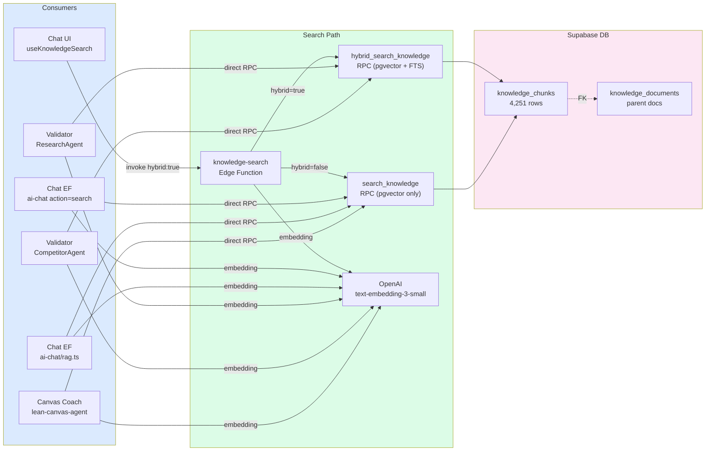

# 09 — Vector Storage Flow (Chat & Validator)

> How chat UI, chat EF, and validator pipeline consume the knowledge base (pgvector).
> Audited 2026-03-08 against actual code.

## Auth Matrix

| Consumer | Auth Method | Hybrid? | Status |
|----------|-----------|---------|--------|
| Chat UI (`useKnowledgeSearch`) | User JWT via EF | Yes (after fix) | Working |
| Chat EF (`ai-chat` search action) | User JWT → direct RPC | No (semantic only) | Working |
| Chat EF (`rag.ts`) | Service role → direct RPC | No | Working |
| Validator Research | Admin client → direct RPC | **Yes** (after fix) | **Fixed** |
| Validator Competitors | Admin client → direct RPC | **Yes** (after fix) | **Fixed** |
| Canvas Coach | Service role → direct RPC | No | Working |

## What Changed (2026-03-08)

| Before | After | Impact |
|--------|-------|--------|
| Validator called `knowledge-search` EF with Bearer service-role key | Validator calls `hybrid_search_knowledge` RPC directly via admin client | No 401, no HTTP round-trip, hybrid search |
| Chat UI used semantic-only search | Chat UI sends `hybrid: true` to EF | Better recall (semantic + full-text) |
| `KnowledgeSearchResult` type had no citation fields | Added `documentId`, `documentTitle`, `sectionTitle`, `pageStart`, `pageEnd` | UI can show citation sources |

## Remaining Gaps

| # | Gap | Severity | Next Step |
|---|-----|----------|-----------|
| 1 | `ai-chat/rag.ts` uses `search_knowledge` (semantic only) | Low | Switch to `hybrid_search_knowledge` for better recall |
| 2 | Chat UI has no circuit breaker for failed searches | Medium | Add retry/skip logic in `useKnowledgeSearch` |
| 3 | `ai-chat` search action uses `search_knowledge` (semantic only) | Low | Switch to hybrid when ready |
