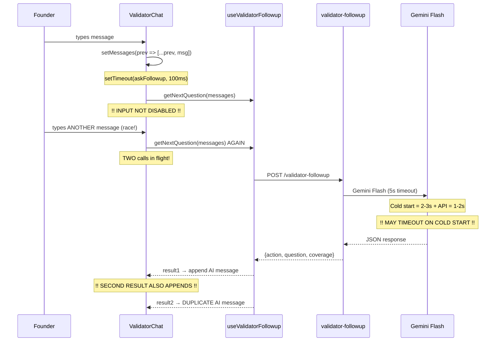
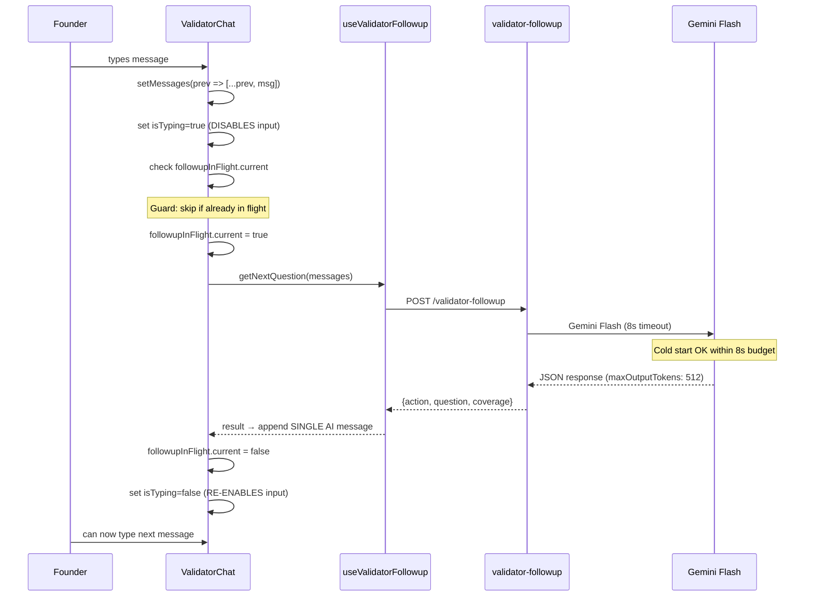
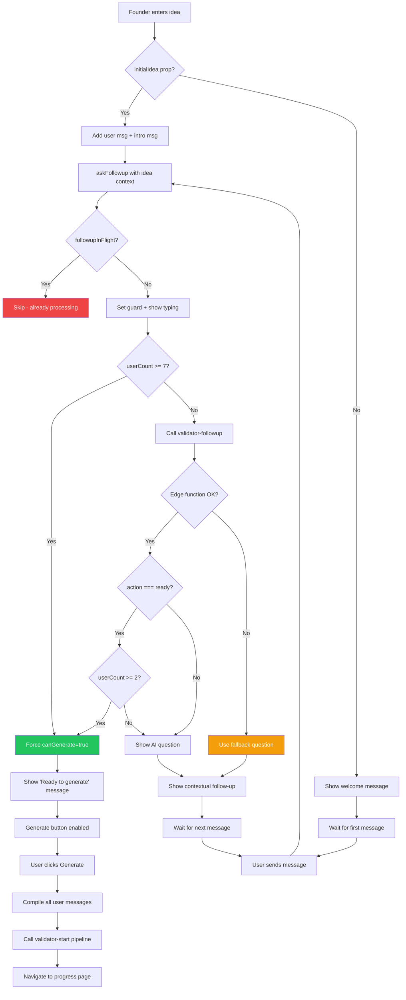

# Audit Report — AI-Powered Smart Follow-Up Questions

> **Date:** 2026-02-06 | **Auditor:** Claude Code
> **Scope:** `validator-followup` edge function + `useValidatorFollowup` hook + `ValidatorChat.tsx`
> **Feature:** Prompt 14 — Replace static questions with AI-powered contextual follow-ups

---

## Executive Summary

| Severity | Count | Status |
|----------|:-----:|--------|
| CRITICAL | 2 | **FIXED** |
| HIGH | 2 | **FIXED** |
| MEDIUM | 2 | **1 FIXED, 1 N/A** |
| **Total** | **6** | **5 resolved, 1 non-issue** |

**Verdict:** All critical and high issues fixed. Race condition guard added (G1), input disabled during AI thinking (G2), timeout increased to 8s (G3), token budget reduced to 512 (G4). CORS non-issue in practice (G5) — Supabase JS client bypasses browser CORS. JWT verified active on v3 (G6).

---

## Architecture — Current (Broken) State



## Architecture — Correct (Fixed) State



---

## Flow Diagram — Full Feature Architecture



---

## CRITICAL Issues

### G1: Race Condition — Concurrent `askFollowup` Calls

**File:** `src/components/validator/chat/ValidatorChat.tsx`
**Lines:** 77-154, 194-200

**Problem:** No guard prevents multiple `askFollowup` calls from being in flight simultaneously. If the user sends messages quickly, or the AI response is slow, multiple Gemini API calls run in parallel. Both append separate AI messages, causing duplicates.

**Impact:** Duplicate AI questions appear in the chat. Confusing UX. Wasted API calls.

**Fix:** Add a `useRef` lock (`followupInFlight`) that prevents concurrent calls.

```
// Before calling getNextQuestion:
if (followupInFlight.current) return;
followupInFlight.current = true;

// After response (in finally block):
followupInFlight.current = false;
```

---

### G2: Input Not Disabled During AI Thinking

**File:** `src/components/validator/chat/ValidatorChat.tsx`
**Lines:** 55 (isTyping), 295-301 (ValidatorChatInput)

**Problem:** `ValidatorChatInput` only disables when `isProcessing=true` (pipeline running). During `isTyping=true` (AI generating follow-up), the input remains enabled. User can send another message, which triggers G1.

**Impact:** Compounds G1 race condition. User can accidentally send partial messages.

**Fix:** Pass `isTyping || isFollowupLoading` as an additional disable condition, or use `followupInFlight.current` state.

---

## HIGH Issues

### G3: Timeout Too Short for Cold Starts (5s)

**File:** `supabase/functions/validator-followup/index.ts`
**Line:** 93

**Problem:** Deno Deploy cold start takes 2-3s. Gemini Flash API call takes 1-2s. Combined: 3-5s. The 5s timeout is borderline — the first call after idle will likely timeout, hitting fallback questions.

**Impact:** First question after idle always uses generic fallback instead of AI-generated. Undermines the entire feature for the first interaction.

**Fix:** Increase timeout to 8s. Still fast for chat UX. Generous enough for cold starts.

---

### G4: `maxOutputTokens: 8192` Wastes Cost

**File:** `supabase/functions/validator-followup/gemini.ts`
**Line:** 34

**Problem:** The follow-up response is ~100 tokens (1-2 sentence question + coverage booleans + reasoning). The gemini.ts copy uses `maxOutputTokens: 8192`, which is copied from the pipeline agents that generate multi-page reports.

**Impact:** Gemini Flash charges per output token allocated. 8192 is 16x more than needed. Wastes budget on every call.

**Fix:** Override `maxOutputTokens` to 512 in the edge function call, or modify the gemini.ts copy to accept it as a parameter.

---

## MEDIUM Issues

### G5: ALLOWED_ORIGINS Not Set for Production

**File:** `supabase/functions/validator-followup/index.ts`
**Line:** 14

**Problem:** `ALLOWED_ORIGINS` env var defaults to `http://localhost:8082`. If not set in Supabase secrets, production origin will be rejected by CORS, causing all calls to fail with CORS errors.

**Impact:** Works locally, breaks in production.

**Fix:** Verify `ALLOWED_ORIGINS` is set in Supabase secrets to include the production domain. Same env var is shared across all edge functions, so if validator-start works in production, this is already set.

---

### G6: JWT Verification State After Double Deploy

**File:** `supabase/functions/validator-followup/index.ts`

**Problem:** Function was first deployed with `--no-verify-jwt` (v1), then redeployed without the flag (v2). Need to confirm JWT verification is actually enabled.

**Impact:** If JWT verification didn't stick, unauthenticated requests could reach the function (though the function has its own auth check internally).

**Fix:** Verify via Supabase dashboard or redeploy explicitly with `--verify-jwt` flag.

---

## Fix Prompts

### Prompt 14A — Fix Race Condition + Input Lock (G1 + G2)

**Goal:** Prevent concurrent AI follow-up calls and disable input during AI thinking.

**Changes:**
1. Add `followupInFlight` ref to `ValidatorChat.tsx`
2. Guard `askFollowup` with the ref — skip if already in flight
3. Disable `ValidatorChatInput` when AI is thinking (`isTyping`)
4. Clear the guard in a `finally` block to prevent deadlocks

**Files:** `src/components/validator/chat/ValidatorChat.tsx`

**Acceptance criteria:**
- Sending 3 messages in rapid succession produces exactly 3 AI responses (not 4-6)
- Input textarea is greyed out while AI follow-up is loading
- Input re-enables after AI message appears

---

### Prompt 14B — Fix Timeout + Token Budget (G3 + G4)

**Goal:** Increase timeout for cold start resilience and reduce token waste.

**Changes:**
1. Change `timeoutMs` from 5000 to 8000 in `index.ts`
2. Add `maxOutputTokens` override to the `callGemini` options, or reduce it in the copied `gemini.ts` to 512
3. Since gemini.ts is a copy, simplest to just change the default in the copy

**Files:**
- `supabase/functions/validator-followup/index.ts`
- `supabase/functions/validator-followup/gemini.ts`

**Acceptance criteria:**
- First call after cold start completes within 8s (no fallback)
- Response size is under 512 tokens
- Redeploy and verify in logs

---

### Prompt 14C — CORS + JWT Verification (G5 + G6)

**Goal:** Ensure production CORS and JWT verification are correctly configured.

**Changes:**
1. Check that `ALLOWED_ORIGINS` secret includes the production domain
2. Redeploy with explicit `supabase functions deploy validator-followup` (no flags)
3. Verify JWT is enforced in Supabase dashboard

**Files:** Environment configuration only

**Acceptance criteria:**
- Production origin gets proper CORS headers
- Unauthenticated POST returns 401 (not allowed through)

---

## What Does NOT Change

- `validator-start/` — pipeline, agents, schemas untouched
- `useValidatorPipeline.ts` — Generate flow untouched
- `ValidatorChatInput.tsx` — only receives new disable prop
- `ValidatorChatMessage.tsx` — render component untouched
- `ValidatorProcessingAnimation.tsx` — overlay untouched
- All existing conversation data still compiles into `input_text` for the pipeline
