# Validator Prompts — Diagrams

> **Updated:** 2026-02-06 | **Source:** `tasks/validator/prompts/00-index.md` v2.0

## Diagrams

### Status & Planning (01-04)

| # | Diagram | Type | File |
|---|---------|------|------|
| 01 | Implementation Timeline | Gantt | `01-implementation-timeline.svg` |
| 02 | Phase Dependencies | Flowchart | `02-phase-dependencies.svg` |
| 03 | Task Distribution | Pie Chart | `03-task-distribution.svg` |
| 04 | Kanban Board | Kanban | `04-kanban-board.svg` |

### Feature Workflows (05-10)

| # | Diagram | Type | Prompts | File |
|---|---------|------|---------|------|
| 05 | Full Pipeline Sequence | Sequence | 01, 02 | `05-full-pipeline-sequence.svg` |
| 06 | Agent Data Flow | Flowchart | 01, 02 | `06-agent-data-flow.svg` |
| 07 | Export & Sharing Workflows | Flowchart | 03 | `07-export-sharing-workflows.svg` |
| 08 | Knowledge & RAG Pipeline | Flowchart | 04 | `08-knowledge-rag-pipeline.svg` |
| 09 | Agent Intelligence | Flowchart | 05 | `09-agent-intelligence.svg` |
| 10 | URL Context Real-World Example | Sequence | 01 | `10-url-context-real-world.svg` |

### Real-World Examples (11-12)

| # | Diagram | Type | Industry | File |
|---|---------|------|----------|------|
| 11 | Fashion AI Strategy Overview | Flowchart | Fashion/Retail | `11-fashion-strategy-overview.svg` |
| 12 | Fashion Pipeline Sequence | Sequence | Fashion/Retail | `12-fashion-pipeline-sequence.svg` |

**Documentation:** `11-fashion-retail-real-world-example.md` — Full walkthrough of StyleSync AI (markdown optimization for mid-market fashion brands) through the 7-agent pipeline with data from McKinsey, BCG, K3 research.

---

## 01 — Implementation Timeline (Gantt)

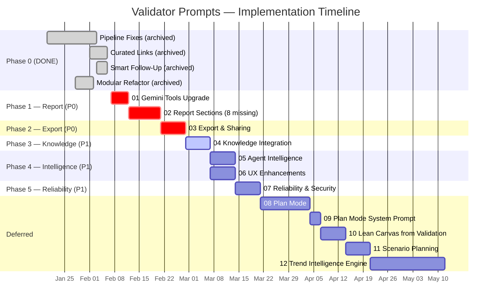

---

## 02 — Phase Dependencies (Flowchart)

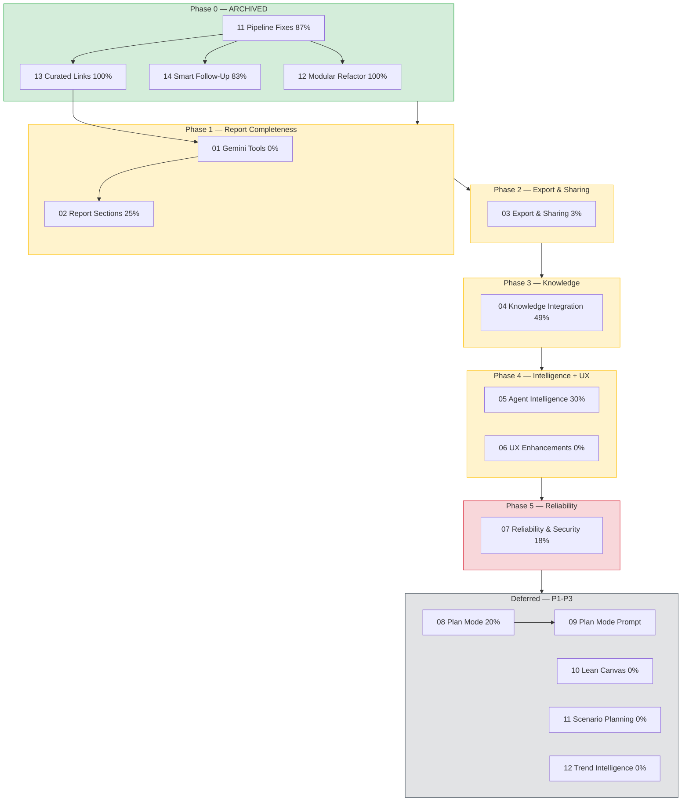

---

## 03 — Task Distribution (Pie)

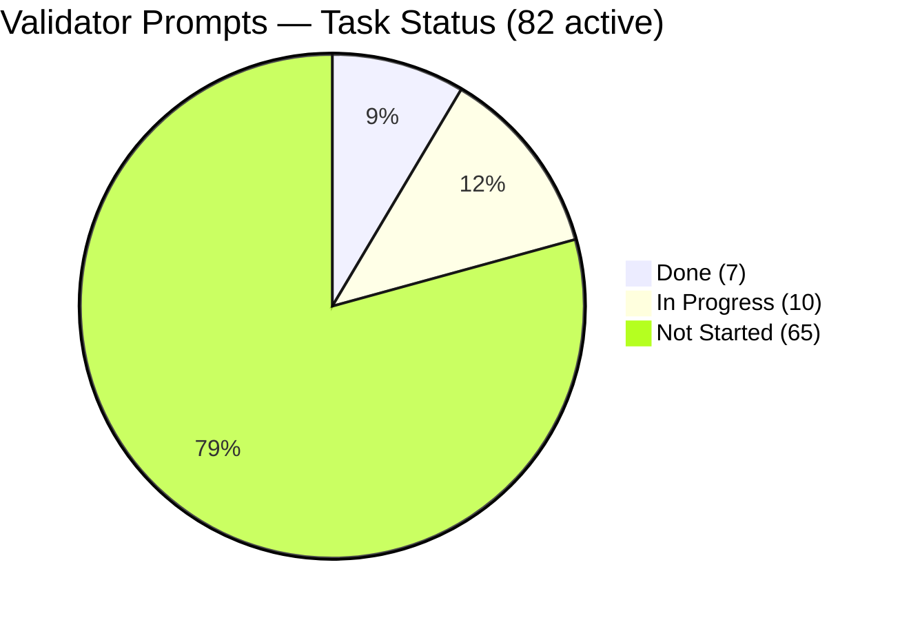

---

## 04 — Kanban Board

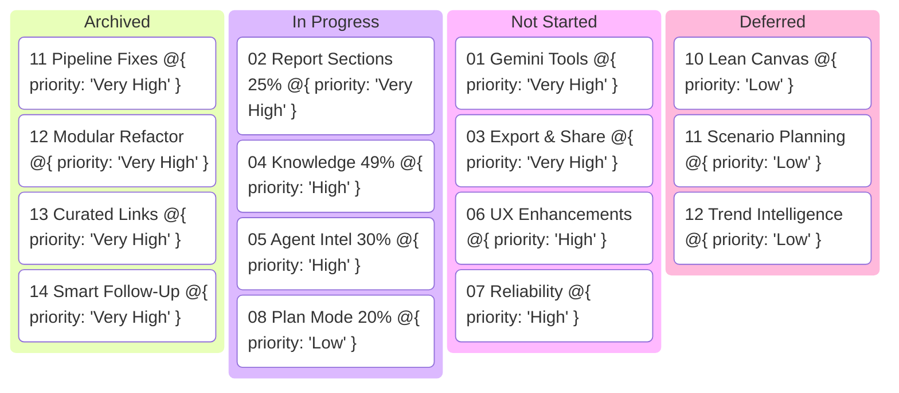

---

## 05 — Full Pipeline Sequence (Prompts 01 + 02)

Shows the complete end-to-end flow: founder chat -> follow-up questions -> 7-agent pipeline -> report.

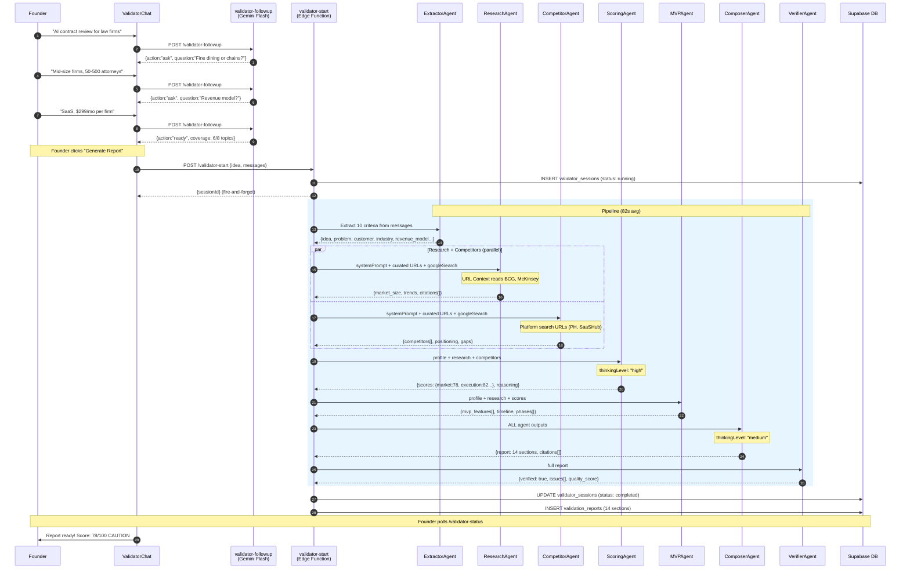

---

## 06 — Agent Data Flow (Prompts 01 + 02)

Shows what data flows between agents and the 14-section report output.

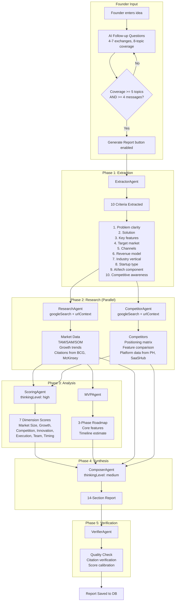

---

## 07 — Export & Sharing Workflows (Prompt 03)

Three features: PDF export, shareable links, competitive radar chart.

```mermaid
flowchart TD
    subgraph PDF["Prompt 03A — PDF Export"]
        P1[Founder clicks Download PDF] --> P2[Client-side generation<br/>html2canvas + jsPDF]
        P2 --> P3["Cover Page<br/>Logo, Score, Verdict, Date"]
        P3 --> P4["Content Pages 2-10"]
        P4 --> P5["Styled PDF<br/>McKinsey/BCG quality"]
        P5 --> P6[Download .pdf file]
    end

    subgraph SHARE["Prompt 03B — Shareable Links"]
        S1[Founder clicks Share] --> S2[Generate UUID link]
        S2 --> S3[INSERT shared_reports<br/>uuid, report_id, expires_at]
        S3 --> S4["Public URL<br/>startupai.app/report/uuid"]
        S4 --> S5{Visitor opens link}
        S5 --> S6[Read-only report view<br/>No login required]
        S5 --> S7[Expired? Show 404]
    end

    subgraph RADAR["Prompt 03C — Competitive Radar"]
        R1[CompetitorAgent output] --> R2["Parse competitor data"]
        R2 --> R3["Radar Chart (Recharts)"]
        R3 --> R4["Your startup vs 3-5 competitors<br/>across 5-7 dimensions"]
    end
```

---

## 08 — Knowledge & RAG Pipeline (Prompt 04)

Three stages: seed knowledge base, wire RAG into agents, continuous embedding pipeline.

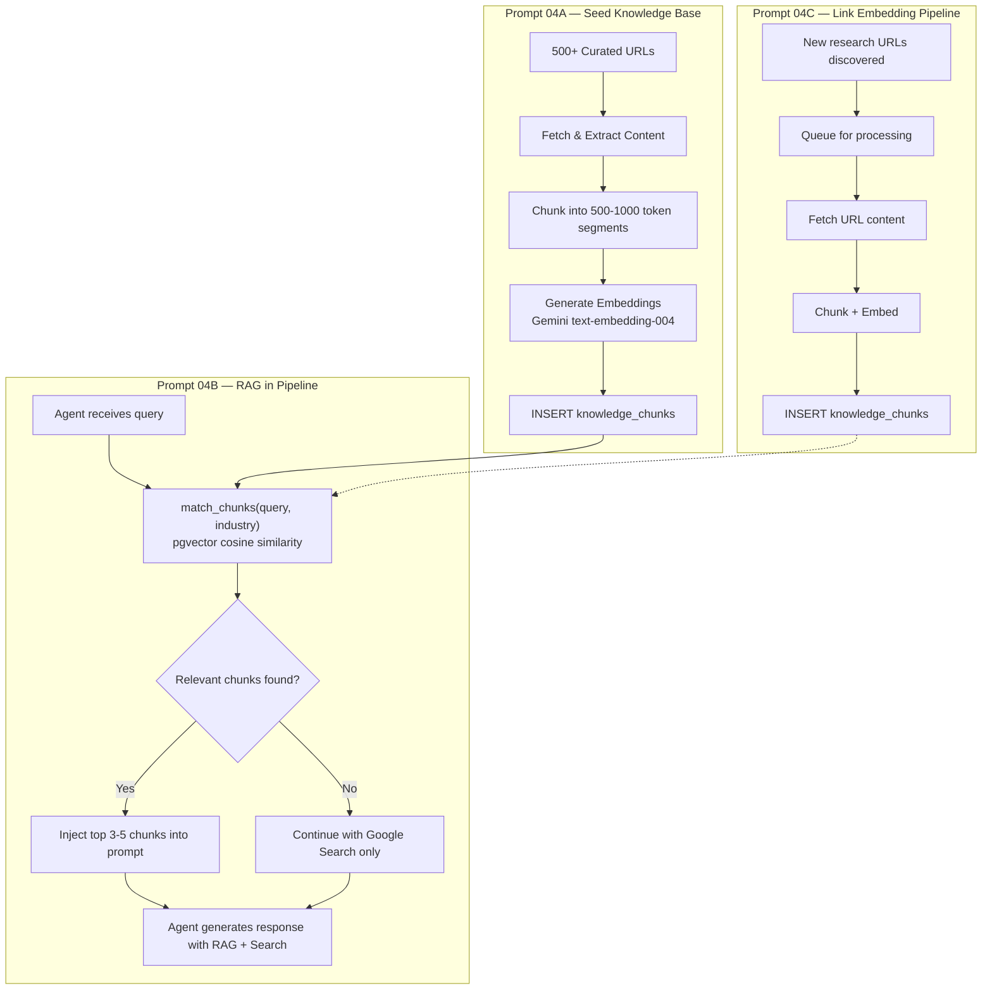

---

## 09 — Agent Intelligence (Prompt 05)

ExtractorAgent expansion from 5 to 10 criteria, and selective per-agent retry.

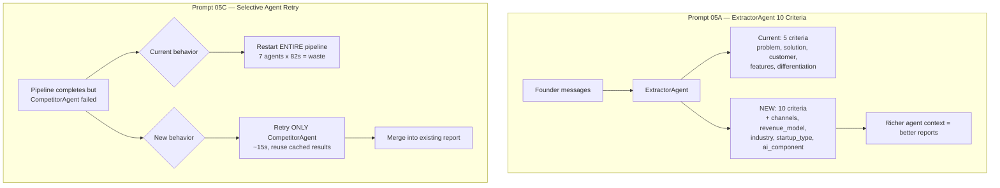

---

## 10 — URL Context Real-World Example (Prompt 01)

Step-by-step sequence showing how a law firm AI startup validation uses URL Context and Thinking.

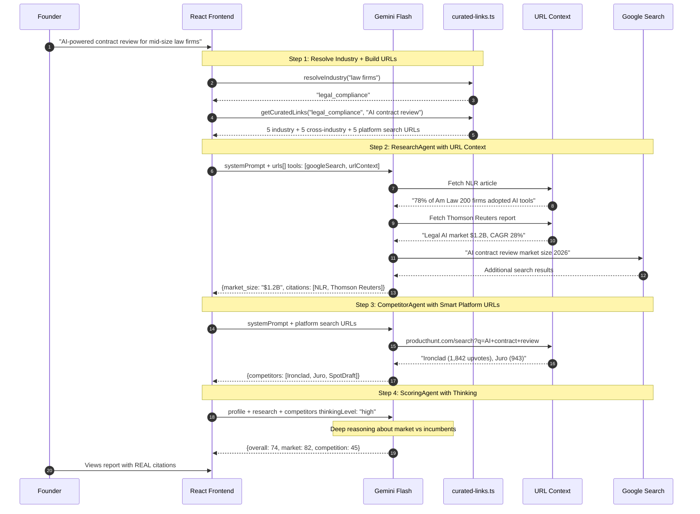

---

## 11 — Fashion AI Strategy Overview

Market-to-pipeline strategy diagram for fashion retail AI, showing market forces, value chain, opportunities, pipeline, and buyer mapping.

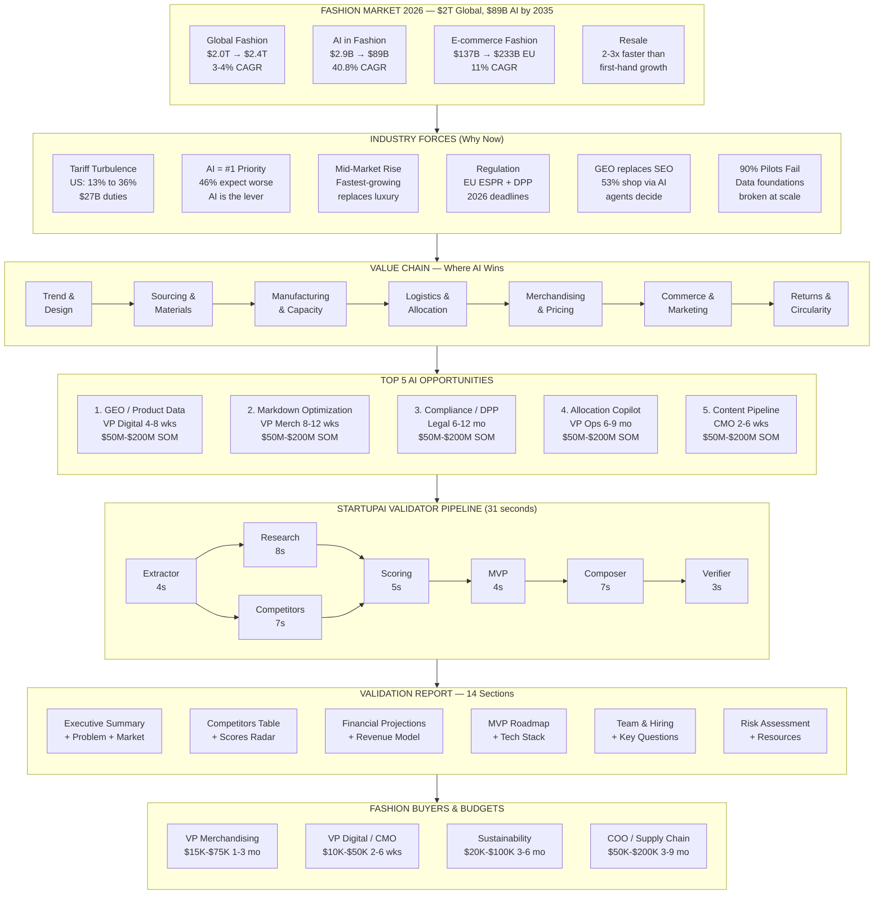

---

## 12 — Fashion Pipeline Sequence (StyleSync AI)

Full pipeline walkthrough for a fashion markdown optimization startup, showing 7-agent execution with curated URLs from McKinsey, BCG, K3.

See `11-fashion-retail-real-world-example.md` for the complete narrative walkthrough.

```mermaid
sequenceDiagram
    autonumber
    participant F as Founder
    participant UI as StartupAI Chat
    participant EX as ExtractorAgent
    participant RE as ResearchAgent
    participant CO as CompetitorAgent
    participant SC as ScoringAgent
    participant MV as MVPAgent
    participant CM as ComposerAgent
    participant VE as VerifierAgent
    participant DB as Supabase DB
    participant GEM as Gemini 3 Pro
    participant URLs as Curated Links<br/>McKinsey, BCG, K3

    rect rgb(30, 30, 50)
        Note over F,UI: Founder describes StyleSync AI
        F->>UI: "AI for mid-market fashion brands...<br/>markdown timing... 12 VP interviews...<br/>Shopify Plus... $2K-$8K/mo SaaS"
        UI->>DB: Create session + store input
    end

    rect rgb(50, 30, 30)
        Note over EX,GEM: Phase 1 — Extract 10 Criteria (4s)
        UI->>EX: Parse founder input
        EX->>GEM: Extract structured profile
        GEM-->>EX: 10 criteria: problem, solution,<br/>channels, revenue, industry...
        EX->>DB: Store profile
    end

    rect rgb(30, 30, 60)
        Note over UI,EX: Adaptive Follow-Up (2 questions)
        UI->>F: Team ML + fashion expertise?
        F->>UI: Ex-Stitch Fix + ex-Nordstrom
        UI->>F: How do Blue Yonder fail mid-market?
        F->>UI: $200K+ cost, no fashion logic
    end

    rect rgb(30, 50, 30)
        Note over RE,CO: Phase 2 — Parallel Research (8s)
        par Research reads curated URLs
            UI->>RE: Market research with URL Context
            RE->>URLs: Read McKinsey State of Fashion 2026
            RE->>URLs: Read BCG AI-first fashion
            RE->>URLs: Read K3 Fashion Solutions
            RE->>DB: Store research output
        and Competitor analysis
            UI->>CO: Competitor landscape
            CO->>GEM: Google Search grounding
            GEM-->>CO: Blue Yonder, Revionics, EDITED
            CO->>DB: Store competitor matrix
        end
    end

    rect rgb(50, 30, 50)
        Note over SC,GEM: Phase 3 — Scoring (5s, thinkingLevel: high)
        SC->>DB: Read profile + research + competitors
        SC->>GEM: Score 10 dimensions
        GEM-->>SC: Problem 85, Timing 88,<br/>Solution 82, Overall 76/100
        SC->>DB: Store scores
    end

    rect rgb(30, 40, 50)
        Note over MV,GEM: Phase 4 — MVP (4s)
        MV->>GEM: Design MVP scope
        GEM-->>MV: Shopify Plus, single category,<br/>8-10 wk build, RICE: 65
        MV->>DB: Store MVP plan
    end

    rect rgb(40, 30, 40)
        Note over CM,GEM: Phase 5 — 14-Section Report (7s)
        CM->>DB: Read ALL upstream outputs
        CM->>GEM: Generate full report
        GEM-->>CM: 14 sections with citations
        CM->>DB: Store report
    end

    rect rgb(30, 50, 40)
        Note over VE,GEM: Phase 6 — Verify (3s)
        VE->>GEM: Cross-check consistency
        GEM-->>VE: PASS — 1 warning, 1 gap
        VE->>DB: Store verification
    end

    rect rgb(40, 40, 20)
        Note over F,DB: Report Delivered — 31s total
        UI->>F: Score: 76/100 — Strong validation
        F->>UI: Export PDF + Share link
    end
```
