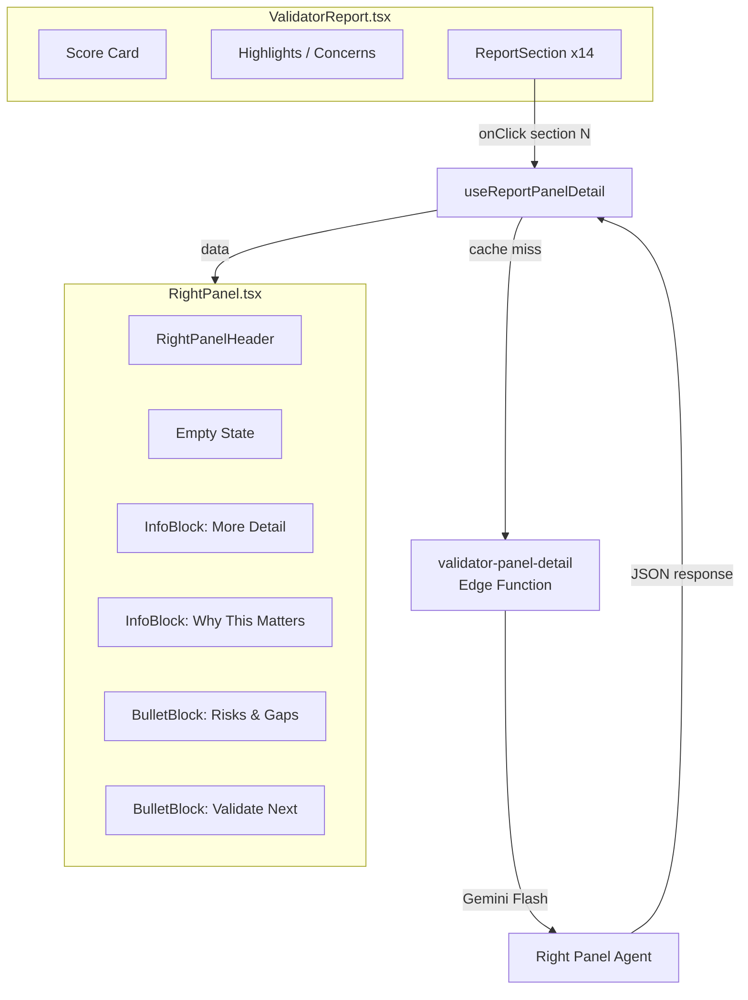
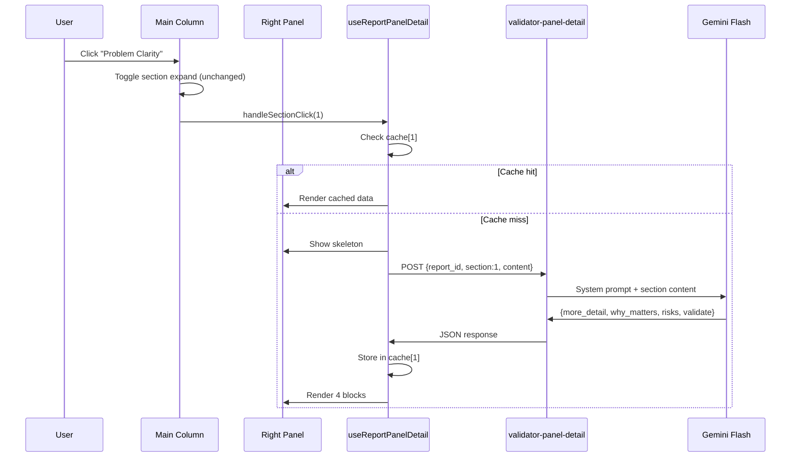
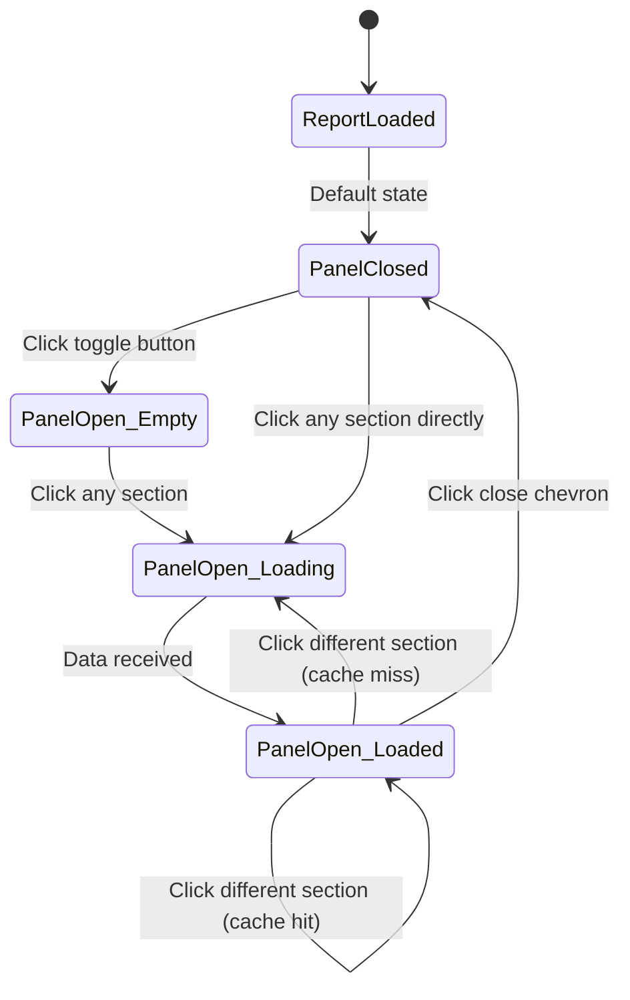

# Validator Report -- Right Panel Intelligence Plan

> Status: PLAN ONLY -- do not implement
> Date: 2026-02-08
> Depends on: Working 14-section report (restore point 02-report.md)

---

## Overview

Add a collapsible right panel that shows deeper context when a user clicks any section in the main column. The main column content never changes -- the right panel adds explanation, validation ideas, and risk analysis.

**Rule: Main column = summary. Right panel = deeper context + validation. Nothing is replaced.**

---

## Layout (3-Column)

```
+------------------+---------------------------+---------------------+
| App Sidebar      | Main Column (existing)    | Right Panel (NEW)   |
| (DashboardLayout)| 14 report sections        | Additional Details  |
|                  | Score card, charts         | Context per section |
|                  | Strengths/Concerns         |                     |
| ~200px fixed     | flex-1 (scrollable)        | ~320px collapsible  |
+------------------+---------------------------+---------------------+
```

### Right Panel States

| State | Behavior |
|-------|----------|
| Collapsed (default) | Panel hidden, floating toggle button visible on right edge |
| Expanded, no selection | Empty state: "Select a section to see deeper context and validation ideas." |
| Expanded, section selected | Shows 4 info blocks for the selected section |
| Mobile (<1024px) | Panel hidden, accessible via Sheet/drawer |

---

## Right Panel Components

### RightPanelHeader
- Title: "Additional Details"
- Subtext: "This expands on the summary shown in the main column."
- Close button (chevron) to collapse

### Content Blocks (per section)

Each selected section shows exactly 4 blocks:

#### 1. More Detail
- Type: `InfoBlock` (paragraph)
- Content: Additional clarity not in the main summary
- Max: ~40 words

#### 2. Why This Matters
- Type: `InfoBlock` (paragraph)
- Content: One sentence explaining impact on score, risk, or outcome
- Max: ~25 words

#### 3. Risks & Gaps
- Type: `BulletBlock` (list)
- Content: Max 3 bullets -- what is missing or uncertain
- Max: 3 items

#### 4. Validate Next
- Type: `BulletBlock` (list)
- Content: 1-3 concrete actions to reduce uncertainty
- Max: 3 items

### Total max: ~120 words per section

---

## Wireframe -- Right Panel (Section Selected)

```
+---------------------------------------+
| Additional Details              [ < ] |
| This expands on the summary shown     |
| in the main column.                   |
+---------------------------------------+
|                                       |
| MORE DETAIL                           |
| The 82% failure rate cited is from    |
| a 2023 Fed survey of businesses       |
| under $5M revenue. Cash flow gaps     |
| average 47 days in services.          |
|                                       |
| -----------------------------------   |
|                                       |
| WHY THIS MATTERS                      |
| Problem severity directly drives      |
| willingness to pay -- scoring weight  |
| is 20% of final score.               |
|                                       |
| -----------------------------------   |
|                                       |
| RISKS & GAPS                          |
| * No primary research with SMB owners |
| * Stat source not independently       |
|   verified by Research agent          |
| * Problem may be seasonal (Q4 heavy)  |
|                                       |
| -----------------------------------   |
|                                       |
| VALIDATE NEXT                         |
| * Interview 5 SMB owners about        |
|   invoice payment timelines           |
| * Survey 50 services businesses on    |
|   cash flow pain severity             |
| * Check Fed data source directly      |
|                                       |
+---------------------------------------+
```

---

## Wireframe -- Empty State

```
+---------------------------------------+
| Additional Details              [ < ] |
| This expands on the summary shown     |
| in the main column.                   |
+---------------------------------------+
|                                       |
|                                       |
|    [icon: click]                      |
|                                       |
|    Select a section to see deeper     |
|    context and validation ideas.      |
|                                       |
|                                       |
+---------------------------------------+
```

---

## Data Flow

### Where Right Panel Content Comes From

| Approach | Description | Pros | Cons |
|----------|-------------|------|------|
| **A. Pre-generated (pipeline)** | ComposerAgent generates right panel data for all 14 sections during pipeline run | Instant display, no extra API call | Increases Composer output by ~1700 words, adds latency |
| **B. On-demand (edge function)** | New edge function generates panel content when user clicks a section | No pipeline changes, can iterate independently | 2-5s delay per click, extra Gemini calls |
| **C. Hybrid** | Pipeline generates for top 5 sections; on-demand for rest | Fast for key sections, lighter pipeline | More complex logic |

### Recommended: Approach B (On-demand)

Reasons:
- No changes to working pipeline (protect restore point)
- Separate edge function can be iterated independently
- Only generates content user actually views (cost-efficient)
- Can cache results in report details after first generation

---

## AI Agent: Right Panel Intelligence Agent

### Edge Function: `validator-panel-detail`

| Setting | Value |
|---------|-------|
| Model | gemini-3-flash-preview |
| Timeout | 10s |
| maxOutputTokens | 512 |
| Temperature | 1.0 |
| JWT | verified |

### Input

```typescript
interface PanelDetailRequest {
  report_id: string;        // validation_reports.id
  section_number: number;   // 1-14
  section_title: string;    // "Problem Clarity"
  section_content: string;  // Main column content (for context)
  score?: number;           // Overall report score
  dimension_score?: number; // Score for this dimension if available
}
```

### Output Schema

```typescript
interface PanelDetailResponse {
  section_number: number;
  more_detail: string;        // ~40 words
  why_this_matters: string;   // ~25 words
  risks_gaps: string[];       // max 3 items
  validate_next: string[];    // max 3 items
}
```

### System Prompt

```
You are the Right Panel Intelligence Agent in a startup validation report.

Given a section's summary content, generate additional context that helps
a founder understand deeper implications and take action.

Rules:
- NEVER repeat or rewrite the summary content
- Add NEW information: root causes, underlying dynamics, market context
- Be specific and actionable
- Use plain language, no hype, no emojis
- Max ~120 words total across all 4 blocks

Output 4 blocks:
1. more_detail: Additional clarity not in the summary (~40 words)
2. why_this_matters: One sentence on impact to score/risk/outcome (~25 words)
3. risks_gaps: Max 3 bullets on what's missing or uncertain
4. validate_next: 1-3 concrete actions to reduce uncertainty
```

### Gemini Response Schema

```typescript
const panelDetailSchema = {
  type: "object",
  required: ["section_number", "more_detail", "why_this_matters",
             "risks_gaps", "validate_next"],
  properties: {
    section_number: { type: "integer" },
    more_detail: {
      type: "string",
      description: "Additional context not in summary, ~40 words"
    },
    why_this_matters: {
      type: "string",
      description: "Impact on score/risk/outcome, ~25 words"
    },
    risks_gaps: {
      type: "array",
      items: { type: "string" },
      maxItems: 3,
      description: "What is missing or uncertain"
    },
    validate_next: {
      type: "array",
      items: { type: "string" },
      maxItems: 3,
      description: "Concrete actions to reduce uncertainty"
    }
  }
};
```

---

## Section-Specific Context (What the Agent Should Focus On)

| # | Section | Right Panel Focus |
|---|---------|-------------------|
| 1 | Problem Clarity | Root cause, why existing solutions fail, proof the problem is real |
| 2 | Customer Use Case | Buyer persona depth, purchase triggers, switching costs |
| 3 | Market Sizing | Data source reliability, growth drivers, timing signals |
| 4 | Competition | Competitive moat gaps, positioning risks, what incumbents are building |
| 5 | Risks & Assumptions | Which assumptions are testable vs untestable, consequence of being wrong |
| 6 | MVP Scope | Build vs buy decisions, scope creep risks, what to cut |
| 7 | Next Steps | Dependencies between steps, timeline risks, resource requirements |
| 8 | Scores Matrix | What is dragging the score down, easiest dimensions to improve |
| 9 | Tech Stack | Technical debt risks, scaling concerns, undisclosed complexity |
| 10 | Revenue Model | Pricing power, competitive pricing benchmarks, unit economics sensitivity |
| 11 | Team & Hiring | Skill gaps vs execution risk, hire sequence, advisor leverage |
| 12 | Key Questions | Why each question is fatal/important, what "good" answers look like |
| 13 | Resources | Source credibility assessment, what research is missing |
| 14 | Financial Projections | Assumption sensitivity, what breaks the model, comparable benchmarks |

---

## Frontend Components

### New Files

| File | Purpose |
|------|---------|
| `src/components/validator/RightPanel.tsx` | Container with header, empty state, content blocks |
| `src/components/validator/InfoBlock.tsx` | Paragraph block (More Detail, Why This Matters) |
| `src/components/validator/BulletBlock.tsx` | List block (Risks & Gaps, Validate Next) |
| `src/hooks/useReportPanelDetail.ts` | Hook to fetch/cache panel detail per section |

### State Management

```typescript
// In ValidatorReport.tsx
const [selectedSection, setSelectedSection] = useState<number | null>(null);
const [panelOpen, setPanelOpen] = useState(false);

// Click handler on ReportSection
const handleSectionClick = (sectionNumber: number) => {
  setSelectedSection(sectionNumber);
  setPanelOpen(true);
};
```

### Cache Strategy

```typescript
// useReportPanelDetail.ts
const cache = useRef<Map<number, PanelDetailResponse>>(new Map());

// On section click:
// 1. Check cache -- if hit, show instantly
// 2. If miss, call validator-panel-detail edge function
// 3. Store result in cache
// 4. Optionally persist to report.details.panel_details[section_number]
```

---

## Interaction Flow

```
User clicks section header in Main column
  |
  v
Main column: Section expands/collapses (existing behavior, unchanged)
  |
  v
Right panel: Opens if closed, highlights selected section
  |
  v
Check cache for section N
  |
  +-- Cache hit --> Render 4 blocks instantly
  |
  +-- Cache miss --> Show skeleton loader (4 pulsing blocks)
                     |
                     v
                Call validator-panel-detail edge function
                  (report_id, section_number, section_content)
                     |
                     v
                Parse JSON response
                     |
                     v
                Render: More Detail, Why This Matters,
                        Risks & Gaps, Validate Next
                     |
                     v
                Store in cache map
```

---

## Hard Constraints

- Main column content NEVER changes when right panel opens
- Right panel NEVER duplicates main column text word-for-word
- Right panel NEVER opens modals or triggers navigation
- Right panel NEVER adds new report sections
- Max ~120 words per section in right panel
- Panel is purely additive context
- Mobile: Use Sheet/drawer, not inline panel
- Zero changes to existing pipeline or edge functions

---

## Implementation Sequence

| Step | Task | Files | Estimate |
|------|------|-------|----------|
| 1 | Create edge function `validator-panel-detail` | `supabase/functions/validator-panel-detail/` | 1hr |
| 2 | Deploy and test with curl | Edge function only | 30min |
| 3 | Create `RightPanel.tsx` + `InfoBlock` + `BulletBlock` | `src/components/validator/` | 1hr |
| 4 | Create `useReportPanelDetail.ts` hook with cache | `src/hooks/` | 30min |
| 5 | Wire into `ValidatorReport.tsx` -- click handler + right panel | `src/pages/ValidatorReport.tsx` | 1hr |
| 6 | Add skeleton loader + error states | Components | 30min |
| 7 | Test all 14 sections E2E | Browser | 30min |
| 8 | Mobile Sheet fallback for <1024px | Component | 30min |

---

## Risk Assessment

| Risk | Mitigation |
|------|------------|
| Pipeline regression | Right panel is separate edge function, zero pipeline changes |
| Gemini latency (>5s) | 10s timeout, skeleton loader, cache prevents repeat calls |
| Content quality | System prompt is tight; Gemini schema enforces structure |
| Cost per click | Flash model, 512 max tokens, cache after first generation |
| Layout breakage | Right panel uses `order-2` in flex, does not affect main content |
| Content duplication | System prompt explicitly forbids repeating summary |

---

## Mermaid Diagrams

### Component Architecture



### Data Flow



### User Journey


