# Validator Report — Architecture, Data Flow & Enhancement Plan

> **Updated:** 2026-02-08 | **Status:** Active
> **Scope:** ValidatorReport page, pipeline agents, edge functions, visualizations
> **Stack:** React 18 + Vite + Supabase Edge Functions + Gemini 3 Flash + recharts

---

## Table of Contents

1. [Feature Overview](#1-feature-overview)
2. [User Journey](#2-user-journey)
3. [User Stories](#3-user-stories)
4. [Real-World Examples](#4-real-world-examples)
5. [System Architecture](#5-system-architecture)
6. [AI Agent Map](#6-ai-agent-map)
7. [Agent-to-Screen Map](#7-agent-to-screen-map)
8. [Data Flow](#8-data-flow)
9. [Pipeline Orchestration](#9-pipeline-orchestration)
10. [Wireframes & Screen Layout](#10-wireframes--screen-layout)
11. [14-Section Content Map](#11-14-section-content-map)
12. [Chart & Visualization Components](#12-chart--visualization-components)
13. [Database Schema](#13-database-schema)
14. [File Inventory](#14-file-inventory)
15. [Enhancement Roadmap](#15-enhancement-roadmap)
16. [Optimization Opportunities](#16-optimization-opportunities)
17. [Prompts for Implementation](#17-prompts-for-implementation)
18. [Troubleshooting Guide](#18-troubleshooting-guide)
19. [Best Practices Reference](#19-best-practices-reference)

---

## 1. Feature Overview

The Validator Report is the culmination of StartupAI's core value proposition: an AI-powered, multi-agent pipeline that takes a founder's idea description and produces a comprehensive 14-section validation report with scores, market sizing, competitive analysis, financial projections, and actionable next steps.

**Three screens form the complete flow:**

1. **ValidateIdea** — Chat-based idea intake with AI follow-up questions
2. **ValidatorProgress** — Real-time pipeline execution tracker (7 agents)
3. **ValidatorReport** — Final rendered report with charts, scores, and PDF export

---

## 2. User Journey

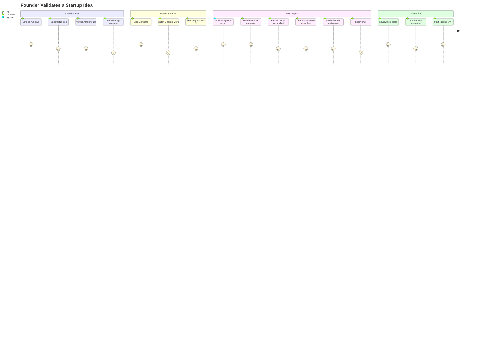

---

## 3. User Stories

| ID | As a... | I want to... | So that... | Screen |
|----|---------|-------------|-----------|--------|
| US-01 | First-time founder | Describe my idea in plain language | I don't need to fill forms or know frameworks | ValidateIdea |
| US-02 | Founder | Get AI questions that probe gaps in my thinking | My report covers all critical dimensions | ValidateIdea |
| US-03 | Founder | See which topics are covered in real-time | I know when I've provided enough info | ValidateIdea |
| US-04 | Founder | Watch the pipeline execute step by step | I understand what's happening and trust the process | ValidatorProgress |
| US-05 | Founder | See a GO / CAUTION / NO-GO verdict | I get a clear signal on viability | ValidatorReport |
| US-06 | Founder | View TAM/SAM/SOM as concentric circles | I can visualize market opportunity at a glance | ValidatorReport |
| US-07 | Founder | See a radar chart of 7 scoring dimensions | I know exactly where my idea is strong or weak | ValidatorReport |
| US-08 | Founder | Review competitor SWOT and feature comparison | I understand my competitive landscape | ValidatorReport |
| US-09 | Founder | See revenue projections as a chart | I can visualize growth trajectories for investors | ValidatorReport |
| US-10 | Founder | Export the report as a PDF | I can share it with co-founders and advisors | ValidatorReport |
| US-11 | Founder | See strengths and red flags prominently | I know what to double down on and what to fix | ValidatorReport |
| US-12 | Repeat founder | Run multiple validations | I can compare different pivot directions | ValidateIdea |
| US-13 | Investor | Read a concise executive summary | I can quickly assess deal quality | ValidatorReport |
| US-14 | Founder | See key questions I need to answer | I have a research agenda for de-risking | ValidatorReport |

---

## 4. Real-World Examples

### Example 1: AI Travel Planning App

> **Input:** "An AI-powered travel planning app that creates personalized itineraries based on your preferences, budget, and past trips. Uses Gemini to analyze flight deals and hotel reviews in real-time."

**Pipeline produces:**
- **Score:** 62/100 (CAUTION)
- **TAM:** $1.8T global travel market | **SAM:** $45B online travel planning | **SOM:** $120M
- **Key Competitors:** TripAdvisor, Mindtrip.ai, Google Travel, Hopper
- **Top Red Flag:** Competing with Google's built-in travel features
- **Key Next Step:** Interview 20 frequent travelers about pain points with current booking tools

### Example 2: Restaurant Inventory Management

> **Input:** "A SaaS platform that helps restaurant owners predict ingredient demand using AI, reducing food waste by 30%. Connects to POS systems to track what sells."

**Pipeline produces:**
- **Score:** 72/100 (GO)
- **TAM:** $340B restaurant tech | **SAM:** $8.5B inventory software | **SOM:** $85M
- **Key Competitors:** MarketMan, BlueCart, Lightspeed
- **Top Highlight:** Clear pain point with measurable ROI (30% waste reduction)
- **Key Next Step:** Build POS integration with 3 local restaurants for pilot

### Example 3: Email Productivity Tool

> **Input:** "InboxPilot — AI that reads your email, drafts replies in your voice, and schedules meetings. Saves 2 hours per day for executives."

**Pipeline produces:**
- **Score:** 68/100 (CAUTION)
- **TAM:** $12B email productivity | **SAM:** $3.2B AI writing tools | **SOM:** $48M
- **Key Competitors:** Superhuman, Shortwave, Google Gemini in Gmail
- **Top Red Flag:** Gmail's native AI features may commoditize this space
- **Key Next Step:** Survey 50 executives on willingness to pay for email automation

---

## 5. System Architecture

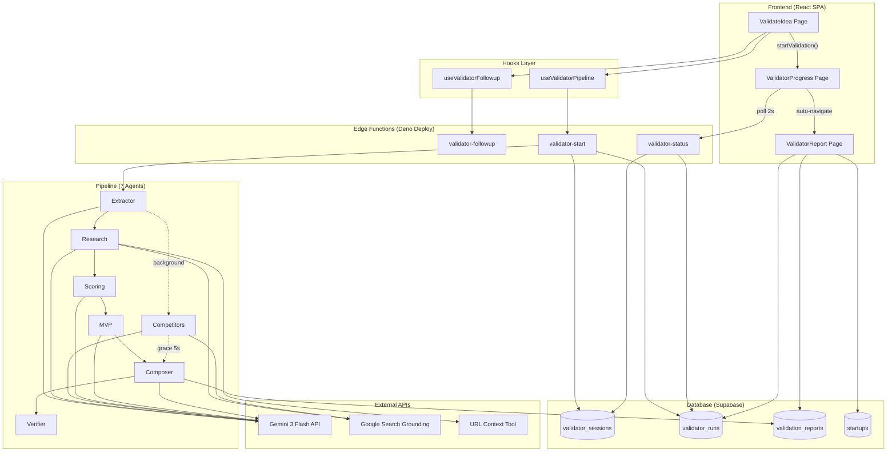

---

## 6. AI Agent Map

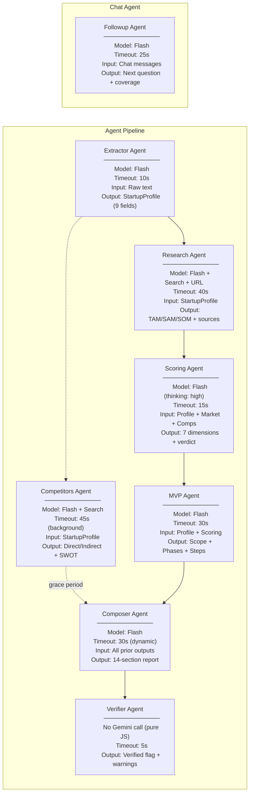

### Agent Budget Breakdown

```mermaid
gantt
    title Pipeline Timeline (115s budget)
    dateFormat ss
    axisFormat %Ss

    section Critical Path
    Extractor (10s)      :ext, 00, 08
    Research (40s)       :res, after ext, 20
    Scoring (15s)        :score, after res, 13
    MVP (30s)            :mvp, after score, 11
    Grace Period (5s)    :grace, after mvp, 05
    Composer (30s)       :compose, after grace, 20
    Verifier (5s)        :verify, after compose, 01
    DB Writes            :db, after verify, 03

    section Background
    Competitors (45s)    :comp, 08, 20
```

---

## 7. Agent-to-Screen Map

```mermaid
graph TB
    subgraph "ValidateIdea Screen"
        C1[Chat Interface]
        C2[Coverage Panel]
        C3[Extraction Panel]
    end

    subgraph "ValidatorProgress Screen"
        P1[Step 1: Extracting Profile]
        P2[Step 2: Market Research]
        P3[Step 3: Competitor Analysis]
        P4[Step 4: Scoring Dimensions]
        P5[Step 5: MVP Planning]
        P6[Step 6: Composing Report]
        P7[Step 7: Verification]
    end

    subgraph "ValidatorReport Screen"
        S1[Section 1: Problem Clarity]
        S2[Section 2: Customer Use Case]
        S3[Section 3: Market Sizing]
        S4[Section 4: Competition]
        S5[Section 5: Risks]
        S6[Section 6: MVP Scope]
        S7[Section 7: Next Steps]
        S8[Section 8: Scores Matrix]
        S9[Section 9: Tech Stack]
        S10[Section 10: Revenue Model]
        S11[Section 11: Team & Hiring]
        S12[Section 12: Key Questions]
        S13[Section 13: Resources]
        S14[Section 14: Financials]
    end

    subgraph Agents
        FA[Followup Agent]
        EA[Extractor]
        RA[Research]
        CA[Competitors]
        SA[Scoring]
        MA[MVP Agent]
        CO[Composer]
        VE[Verifier]
    end

    FA -->|"questions + coverage"| C1 & C2
    EA -->|"profile"| P1
    RA -->|"market data"| P2
    CA -->|"competitors"| P3
    SA -->|"scores"| P4
    MA -->|"mvp plan"| P5
    CO -->|"full report"| P6
    VE -->|"verification"| P7

    EA -->|"populates"| S1 & S2
    RA -->|"populates"| S3 & S13
    CA -->|"populates"| S4
    SA -->|"populates"| S5 & S8
    MA -->|"populates"| S6 & S7
    CO -->|"populates"| S9 & S10 & S11 & S12 & S14
```

---

## 8. Data Flow

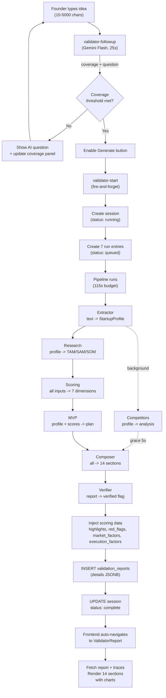

### Data Enrichment Flow

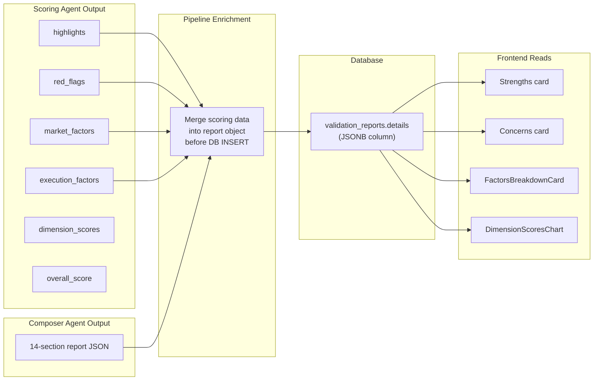

---

## 9. Pipeline Orchestration

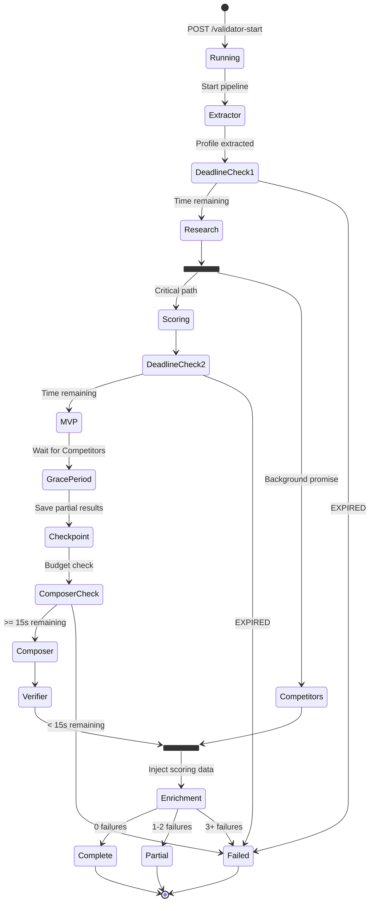

---

## 10. Wireframes & Screen Layout

### ValidateIdea — 3-Panel Chat

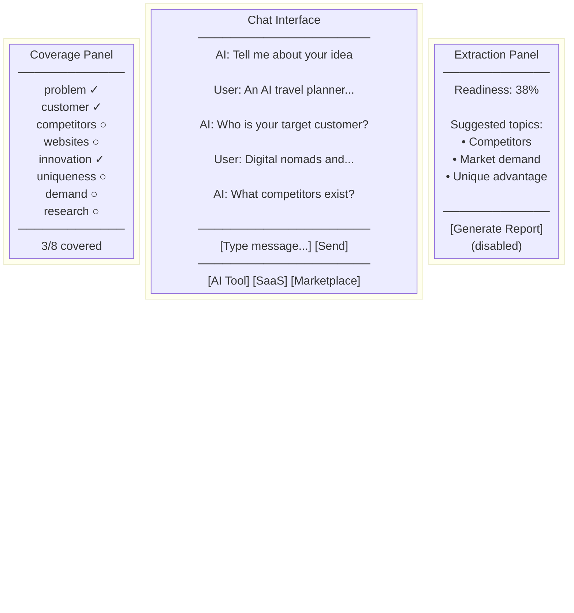

### ValidatorReport — 2-Column Layout

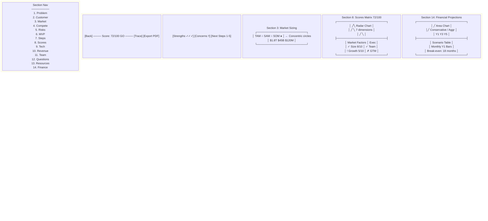

---

## 11. 14-Section Content Map

| # | Section | Source Agent | Visualization | Data Type |
|---|---------|------------|---------------|-----------|
| 1 | Problem Clarity | Extractor | Text paragraph | string |
| 2 | Customer Use Case | Extractor | Text paragraph | string |
| 3 | Market Sizing | Research | TAMSAMSOMChart (concentric circles) | tam/sam/som numbers |
| 4 | Competition Deep Dive | Competitors | Competitor cards + SWOT grid + Feature table + Positioning matrix | arrays + objects |
| 5 | Risks & Assumptions | Scoring | Bulleted list | string[] |
| 6 | MVP Scope | MVP | Text paragraph | string |
| 7 | Next Steps | MVP | Numbered list | string[] |
| 8 | Scores Matrix | Scoring | DimensionScoresChart (radar) + FactorsBreakdownCard | dimensions[] + factors[] |
| 9 | Technology Stack | Composer | Feasibility badge + component cards + risk cards | objects |
| 10 | Revenue Model | Composer | Recommended model card + unit economics grid + alternatives | objects |
| 11 | Team & Hiring | Composer | Burn rate + gap badges + prioritized role cards | objects |
| 12 | Key Questions | Composer | Risk-leveled question cards (fatal/important/minor) | objects[] |
| 13 | Resources & Links | Research/Composer | Categorized external links | objects[] |
| 14 | Financial Projections | Composer | Revenue AreaChart + scenario table + monthly bars + break-even | objects |

---

## 12. Chart & Visualization Components

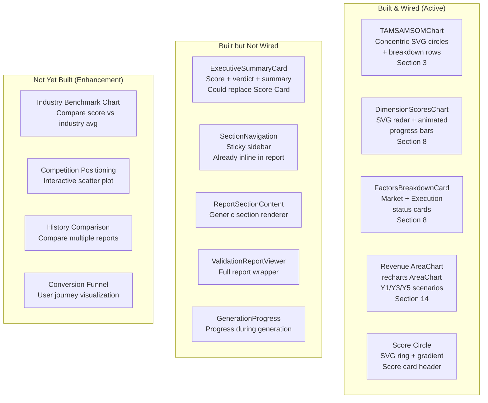

---

## 13. Database Schema

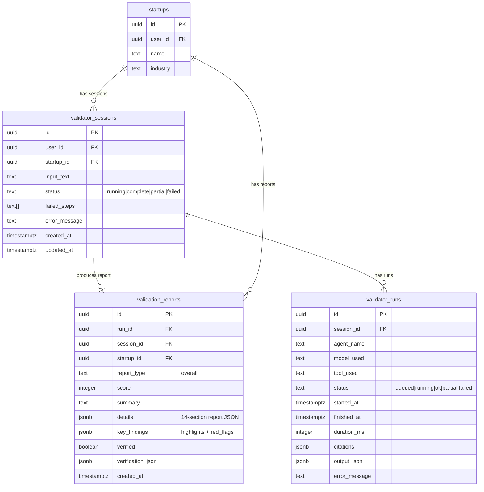

---

## 14. File Inventory

### Frontend Files

| File | Purpose | Touches |
|------|---------|---------|
| `src/pages/ValidateIdea.tsx` | Chat-based idea intake, 3-panel layout | Coverage, chat, extraction |
| `src/pages/ValidatorProgress.tsx` | Live pipeline tracking, 7-step visualization | Polling, auto-navigate |
| `src/pages/ValidatorReport.tsx` | 14-section report renderer with charts | All visualizations |
| `src/hooks/useValidatorPipeline.ts` | Start validation, invoke edge function | Pipeline trigger |
| `src/hooks/useValidatorFollowup.ts` | AI follow-up questions during chat | Followup agent |
| `src/components/validator/chat/ValidatorChat.tsx` | Chat orchestration, fallback questions | Messages, coverage |
| `src/components/validator/chat/ValidatorChatInput.tsx` | Input area with suggestion chips | User input |
| `src/components/validator/chat/ContextPanel.tsx` | 8-topic coverage visualization | Coverage state |
| `src/components/validator/chat/ExtractionPanel.tsx` | Readiness percentage, topic suggestions | Coverage threshold |
| `src/components/validation-report/TAMSAMSOMChart.tsx` | Concentric circles market sizing | Section 3 |
| `src/components/validation-report/DimensionScoresChart.tsx` | Radar chart + progress bars | Section 8 |
| `src/components/validation-report/FactorsBreakdownCard.tsx` | Market/execution factor cards | Section 8 |
| `src/components/validation-report/ExecutiveSummaryCard.tsx` | Score + verdict summary (unused) | Potential Section 0 |
| `src/components/validator/ScoreCircle.tsx` | SVG ring score indicator | Report header |
| `src/components/validator/ReportScorePanel.tsx` | Sidebar scoring dashboard | Report sidebar |
| `src/types/validation-report.ts` | All report type definitions | Shared types |
| `src/types/validation.ts` | Validation state machine types | State mgmt |
| `src/lib/validationReportPdf.ts` | PDF export via jsPDF | Export feature |

### Edge Function Files

| File | Purpose | Touches |
|------|---------|---------|
| `supabase/functions/validator-start/index.ts` | HTTP entry point, session creation | Auth, rate limit |
| `supabase/functions/validator-start/pipeline.ts` | 7-agent orchestrator with deadlines | All agents |
| `supabase/functions/validator-start/config.ts` | Agent models, timeouts, tools | Configuration |
| `supabase/functions/validator-start/types.ts` | Pipeline type definitions | Shared types |
| `supabase/functions/validator-start/schemas.ts` | Gemini JSON schemas per agent | Structured output |
| `supabase/functions/validator-start/gemini.ts` | Re-exports shared Gemini client | API calls |
| `supabase/functions/validator-start/db.ts` | Run status update helpers | DB writes |
| `supabase/functions/validator-start/curated-links.ts` | Industry-specific research URLs | Research agent |
| `supabase/functions/validator-start/knowledge-search.ts` | Vector DB search for RAG | Research agent |
| `supabase/functions/validator-start/agents/extractor.ts` | Parse idea into StartupProfile | Agent 1 |
| `supabase/functions/validator-start/agents/research.ts` | TAM/SAM/SOM + sources | Agent 2 |
| `supabase/functions/validator-start/agents/competitors.ts` | Direct/indirect competitors | Agent 3 |
| `supabase/functions/validator-start/agents/scoring.ts` | 7-dimension scoring + verdict | Agent 4 |
| `supabase/functions/validator-start/agents/mvp.ts` | MVP scope + phases + next steps | Agent 5 |
| `supabase/functions/validator-start/agents/composer.ts` | 14-section report assembly | Agent 6 |
| `supabase/functions/validator-start/agents/verifier.ts` | Section completeness check (JS only) | Agent 7 |
| `supabase/functions/validator-followup/index.ts` | Follow-up question generation | Chat flow |
| `supabase/functions/validator-followup/prompt.ts` | System prompt for follow-up AI | Prompt eng |
| `supabase/functions/validator-followup/schema.ts` | JSON schema for follow-up response | Structured output |
| `supabase/functions/validator-status/index.ts` | Pipeline status polling endpoint | Progress page |
| `supabase/functions/_shared/gemini.ts` | Single source of truth for Gemini API | All agents |
| `supabase/functions/_shared/cors.ts` | CORS headers utility | All functions |
| `supabase/functions/_shared/rate-limit.ts` | In-memory rate limiter | All functions |

---

## 15. Enhancement Roadmap

### Phase 1: Visual Polish (Current Sprint)

| Enhancement | Impact | Effort | Files |
|-------------|--------|--------|-------|
| Wire ExecutiveSummaryCard as optional top section | Medium | Small | ValidatorReport.tsx |
| Add industry benchmark overlay to radar chart | High | Medium | DimensionScoresChart.tsx, scoring.ts |
| Interactive competition positioning (click to expand) | Medium | Medium | ValidatorReport.tsx |
| Animate score counters on load | Low | Small | ValidatorReport.tsx |
| Dark mode chart color tuning | Medium | Small | All chart components |

### Phase 2: Data Depth

| Enhancement | Impact | Effort | Files |
|-------------|--------|--------|-------|
| SAM > TAM validation in Scoring agent | High | Small | scoring.ts, schemas.ts |
| Add citations count badge per section | Medium | Small | ValidatorReport.tsx |
| Source quality indicators (academic vs blog) | Medium | Medium | research.ts, types.ts |
| Historical score tracking across reports | High | Large | New DB table, new hook, dashboard |
| Report comparison view (side-by-side) | High | Large | New page, new components |

### Phase 3: AI Improvements

| Enhancement | Impact | Effort | Files |
|-------------|--------|--------|-------|
| Industry-specific scoring weights | High | Medium | scoring.ts, config.ts |
| Follow-up question quality scoring | Medium | Small | validator-followup/prompt.ts |
| Competitor threat scoring with evidence | High | Medium | competitors.ts, types.ts |
| Auto-suggest pivot directions on NO-GO | High | Medium | New agent or Composer extension |
| Investor-mode report (different sections) | High | Large | New report type, Composer variant |

### Phase 4: Platform Features

| Enhancement | Impact | Effort | Files |
|-------------|--------|--------|-------|
| Report sharing via public link | High | Medium | New RLS policy, new page |
| Email report delivery | Medium | Medium | New edge function |
| Report commenting / annotations | Medium | Large | New DB table, new UI |
| Team collaboration on validation | High | Large | Org-level features |
| Webhook on report completion | Low | Small | pipeline.ts |

---

## 16. Optimization Opportunities

### Frontend Performance

| Area | Current | Opportunity | Impact |
|------|---------|-------------|--------|
| recharts bundle | 385KB (auto-split) | Lazy import only on Section 14 visibility | -200KB initial |
| PDF export | 413KB jsPDF (lazy) | Already lazy-imported, consider html2pdf | Smaller bundle |
| Section rendering | All 14 rendered | Virtualize collapsed sections | Faster paint |
| Image assets | SVG inline | Extract repeated SVGs to shared defs | Smaller DOM |
| Animation | All sections animate on load | Intersect observer for scroll-triggered | Smoother UX |

### Pipeline Performance

| Area | Current | Opportunity | Impact |
|------|---------|-------------|--------|
| Critical path | ~67s | Run Scoring in parallel with Research | -12s |
| Composer tokens | 4096 max | Reduce to 3072 with tighter prompts | -5s |
| Research timeout | 40s (URL Context slow) | Disable URL Context, rely on Search only | -10s |
| Competitors | Background, 45s | Already optimized | N/A |
| DB writes | Sequential | Batch INSERT for runs | -2s |

### Database Performance

| Area | Current | Opportunity | Impact |
|------|---------|-------------|--------|
| Report fetch | Single query + traces query | Use Supabase JOIN with select | -1 round trip |
| JSONB details | Unindexed | GIN index on details->>score | Faster filtering |
| RLS on reports | Per-user | Already scoped | N/A |
| Session polling | Per-request auth | Cache session status in-memory | Fewer DB reads |

---

## 17. Prompts for Implementation

### Prompt: Add Industry Benchmark to Radar Chart

> "Read the DimensionScoresChart component and the scoring agent. Add an optional `benchmarks` prop that accepts industry average scores for each dimension. Render a second, semi-transparent polygon on the radar chart showing the benchmark overlay. Add a legend distinguishing 'Your Score' from 'Industry Average'. The benchmark data should come from the Scoring agent — add an industry_benchmarks field to ScoringResult that returns average scores for the detected industry."

### Prompt: Build Report Comparison View

> "Create a new page at /validator/compare that accepts 2 report IDs as query params. Fetch both reports and render them side-by-side with a diff-style view: green highlights where the newer report improved, red where it declined. Show score delta prominently. Reuse the DimensionScoresChart with both datasets overlaid. Add a 'Compare' button to ValidatorReport that links to this page with the current report + previous report IDs."

### Prompt: Add Interactive Positioning Chart

> "Replace the static CSS-positioned competitive positioning matrix in Section 4 with a recharts ScatterChart. Each competitor should be a labeled dot with the founder's startup highlighted in primary color. Add zoom on hover to show competitor details. The x-axis and y-axis labels should come from details.competition.positioning.x_axis and y_axis."

### Prompt: Implement Report Sharing

> "Add a 'Share' button to ValidatorReport that generates a unique public link. Create a new RLS policy on validation_reports that allows SELECT where a new `public_token` column matches the URL token. Create a /validator/shared/:token page that renders a read-only version of the report without the Trace drawer or Export button. Add a migration for the public_token column."

### Prompt: Add Report History Dashboard

> "Create a report history view at /validator/history. Query all validation_reports for the current user ordered by created_at descending. Show cards with score, verdict badge, company name, and date. Add a trend line showing score improvement over time using recharts LineChart. Include a filter by startup_id if the user has multiple startups."

### Prompt: Fix SAM > TAM Validation

> "In the Scoring agent (scoring.ts), add validation that SAM must be less than TAM and SOM must be less than SAM. If the Research agent returns invalid values (SAM > TAM), cap SAM at 30% of TAM and SOM at 10% of SAM. Log a warning. Also add this check to the Verifier agent as a warning."

---

## 18. Troubleshooting Guide

### Pipeline Failures

| Symptom | Root Cause | Fix |
|---------|-----------|-----|
| Session stuck "running" forever | Deno Deploy isolate killed at 150s before DB write | Zombie cleanup in validator-status marks stuck sessions as failed after 3 min |
| "Pipeline exceeded wall-clock limit" | Total agent time > 115s | Check which agent is slow in validator_runs; reduce timeouts or skip slow agents |
| Composer timeout | Composer budget < 15s after prior agents used too much time | Reduce Research timeout (currently 40s); consider disabling URL Context |
| Empty report sections | Gemini returned malformed JSON | Check extractJSON fallback in _shared/gemini.ts; verify responseJsonSchema matches types |
| Strengths/Concerns show "Run a new report" | Scoring data not injected into report | Fixed: pipeline.ts now merges scoring.highlights/red_flags into report before INSERT |
| All agents fail | GEMINI_API_KEY expired or quota exceeded | Check Supabase edge function logs; verify API key in dashboard secrets |
| Rate limit error (429) | >5 validations per 5 minutes | Wait 5 minutes; rate limit is per-user in-memory |

### Frontend Issues

| Symptom | Root Cause | Fix |
|---------|-----------|-----|
| Charts not rendering | recharts not imported or data undefined | Check import; add null guards around chart data |
| Progress page polls forever | Session ID mismatch or network error | Check session_id in URL matches DB; verify validator-status CORS |
| PDF export blank | Report data not loaded yet | Ensure report state is non-null before enabling export button |
| Coverage panel stuck | Followup agent returning same coverage | Check anti-repetition rules in prompt.ts; verify keyword-based fallback |
| Radar chart has no points | scores_matrix.dimensions empty | Verify Composer outputs scores_matrix; check Verifier warnings |

### Edge Function Issues

| Symptom | Root Cause | Fix |
|---------|-----------|-----|
| AbortSignal doesn't stop body read | Deno Deploy streams body over 30-60s despite headers arriving fast | Fixed: Promise.race() with hard timeout in _shared/gemini.ts |
| Gemini looping on same output | Temperature set below 1.0 | Always use temperature 1.0 for Gemini 3 (G2 rule) |
| responseJsonSchema 400 error | Schema too complex for Gemini | Use responseMimeType: 'application/json' without schema + extractJSON fallback |
| Citations missing from report | Grounding metadata not extracted | Check groundingChunks extraction in _shared/gemini.ts (G5 rule) |
| Competitors agent slow | URL Context enabled | Disabled in P02 — use Google Search only; verify config.ts |
| CORS errors | Origin not in ALLOWED_ORIGINS | Add origin to SUPABASE_ALLOWED_ORIGINS env var |

### Database Issues

| Symptom | Root Cause | Fix |
|---------|-----------|-----|
| Report INSERT fails | JSONB payload too large | P04 optimization trims input; reduce Composer maxOutputTokens |
| RLS blocks report fetch | User ID mismatch | Verify auth.uid() matches report's user_id via session's user_id |
| Duplicate sessions | User double-clicks Generate | Add isStarting guard in useValidatorPipeline (already implemented) |

---

## 19. Best Practices Reference

### Supabase PostgreSQL Best Practices

> Source: `.agents/skills/supabase-postgres-best-practices/SKILL.md` + 30 reference files

**Critical for Validator:**

- **RLS at Database Level** — Every table (validator_sessions, validator_runs, validation_reports) must have RLS enabled with policies using `auth.uid()` to scope data to the current user
- **Wrap auth functions in SELECT** — Use `USING ((SELECT auth.uid()) = user_id)` not `USING (auth.uid() = user_id)` for 5-10x faster RLS queries (function called once, cached)
- **Index columns used in RLS** — Create indexes on user_id, session_id, startup_id columns
- **Keep transactions short** — Pipeline DB writes are small and fast; external API calls happen before transaction
- **Batch INSERTs** — Create all 7 run entries in a single INSERT statement, not 7 separate calls
- **Connection pooling** — Edge functions use single connection per isolate via supabase-js client
- **Configure idle timeouts** — Prevent stuck connections from hogging pool slots

**Reference files:**
- `references/security-rls-basics.md` — RLS policy patterns
- `references/security-rls-performance.md` — Optimizing RLS queries
- `references/conn-pooling.md` — Connection pool sizing
- `references/query-missing-indexes.md` — Index strategy
- `references/data-batch-inserts.md` — Batch INSERT patterns
- `references/lock-short-transactions.md` — Transaction duration

### Edge Function Best Practices

> Source: `knowledge/supabase/best-practices-edge/` (18 documents)

**Critical for Validator:**

- **Architecture** — Each function in its own directory, shared code in `_shared/`. Use `Deno.serve()` not deprecated `serve` from std
- **JWT Verification** — Use Supabase client for auth, pass user's JWT to client with Authorization header. Service role key for admin operations only
- **Error Handling** — Consistent error response format `{ error, message, code }`. Use proper HTTP status codes. Log errors to console but don't expose stack traces
- **Timeouts** — Always set timeouts on external API calls. Use AbortController + Promise.race for guaranteed timeout enforcement
- **AI Integration** — Use `responseJsonSchema` with `responseMimeType: 'application/json'` for guaranteed JSON. Temperature 1.0 for Gemini 3. Track costs to `ai_runs` table
- **Performance** — Lazy load heavy dependencies. Create connection pool once outside handler. Cache expensive operations. Limit result sets

**Reference files:**
- `01-architecture-setup.md` — Project structure and patterns
- `02-security-authentication.md` — JWT verification and key management
- `04-error-handling.md` — Error response patterns
- `06-database-connections.md` — Connection management
- `09-ai-integration.md` — Gemini 3 integration patterns
- `13-performance-optimization.md` — Cold start and caching

### Gemini 3 Rules (from Audit Findings G1-G6)

| Rule | What | Why |
|------|------|-----|
| G1 | Always use `responseJsonSchema` + `responseMimeType` | Guarantees valid JSON output |
| G2 | Keep temperature at 1.0 | Lower values cause looping in Gemini 3 |
| G3 | Use `thinking: 'high'` or `'low'` only | `'medium'` is not supported |
| G4 | API key in `x-goog-api-key` header | Not as query parameter |
| G5 | Extract citations from `groundingChunks` | Not from response text |
| G6 | AbortSignal.timeout() unreliable on Deno Deploy | Use Promise.race with hard timeout |

---

## Appendix: Quick Reference

### Routes

| Route | Page | Purpose |
|-------|------|---------|
| `/validate` | ValidateIdea | Chat-based idea intake |
| `/validator/run/:sessionId` | ValidatorProgress | Live pipeline tracking |
| `/validator/report/:reportId` | ValidatorReport | Final report display |

### Edge Function Endpoints

| Endpoint | Method | Rate Limit | Purpose |
|----------|--------|-----------|---------|
| `validator-start` | POST | 5/5min | Start pipeline |
| `validator-followup` | POST | 30/60s | AI follow-up question |
| `validator-status` | GET | 120/60s | Poll pipeline status |

### Key Timeouts

| Component | Timeout | Why |
|-----------|---------|-----|
| Pipeline total | 115s | Deno Deploy kills at 150s |
| Composer budget | 30s max | Most expensive agent |
| Followup agent | 25s | Fast enough for chat UX |
| Progress polling | 2s interval, 3min max | Balance freshness vs load |
| Zombie cleanup | 3min threshold | Catch stuck sessions |
