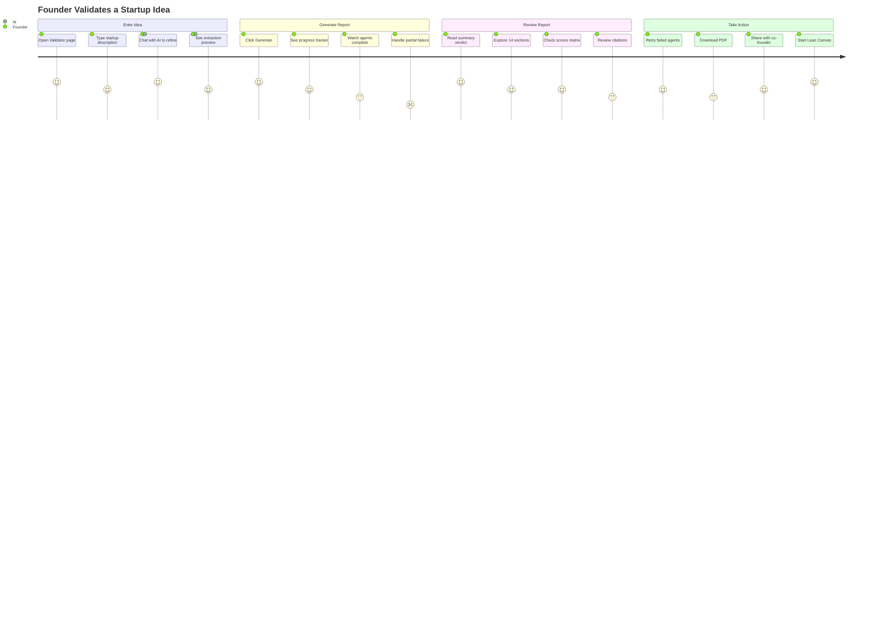
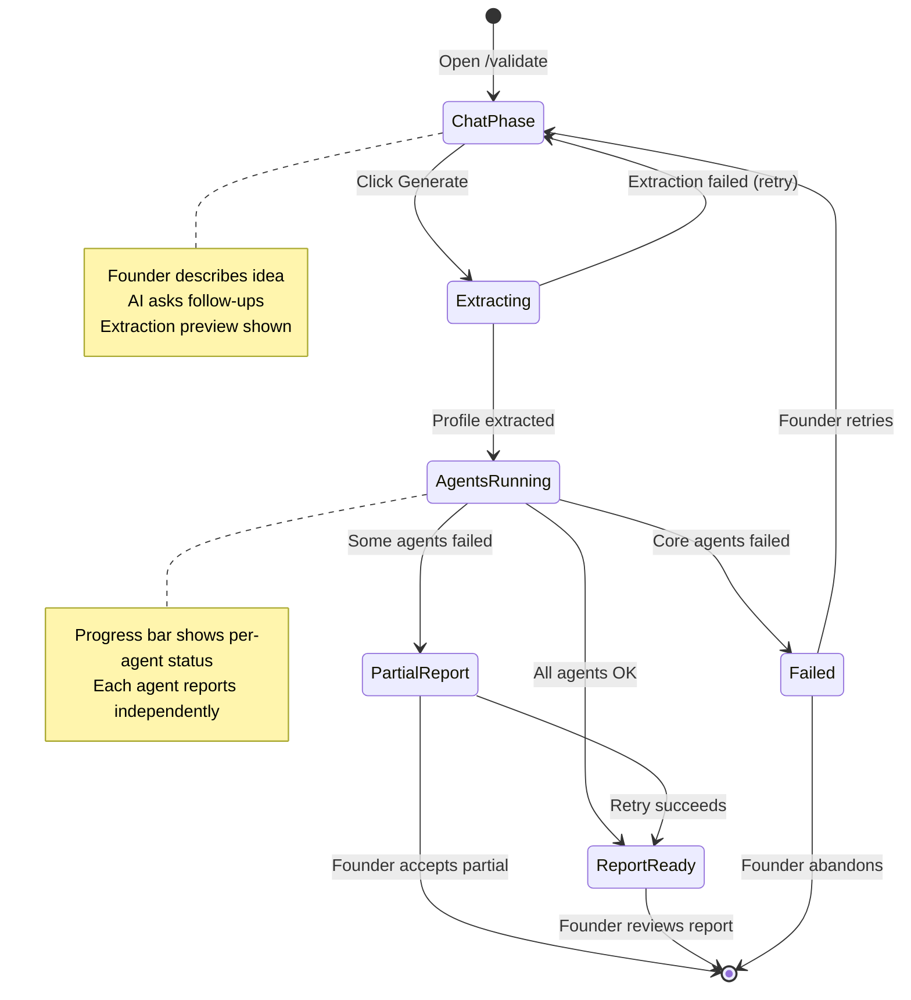
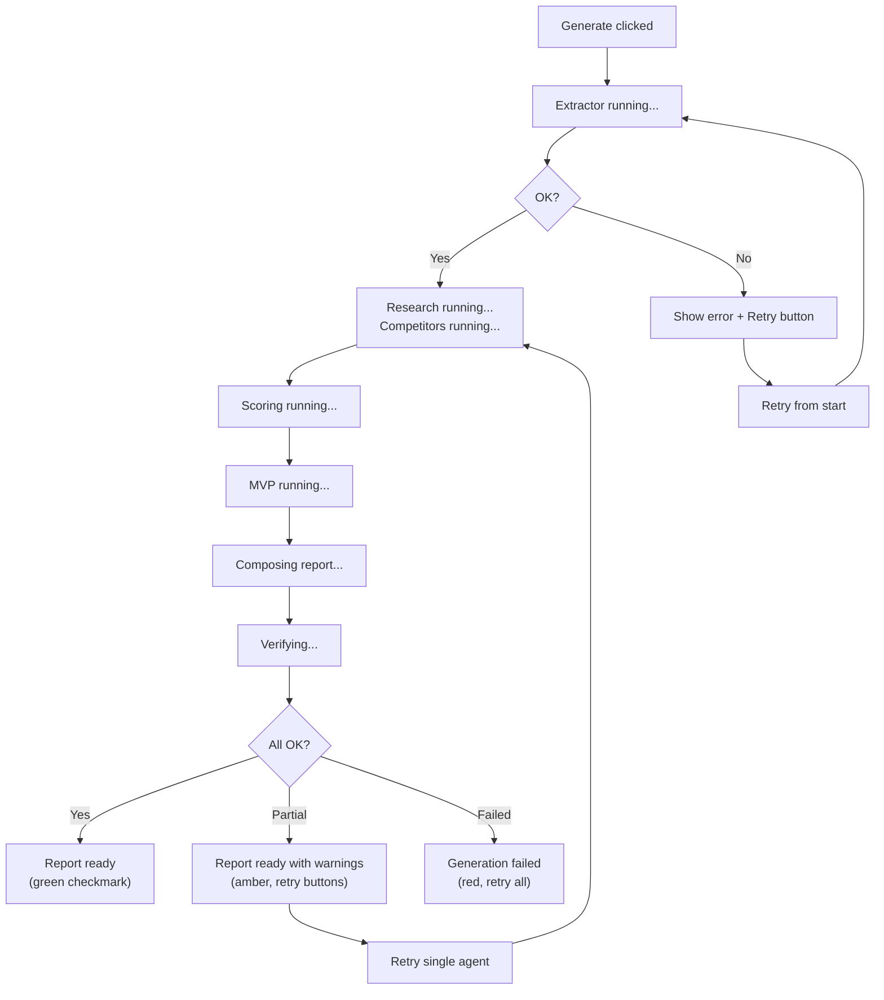
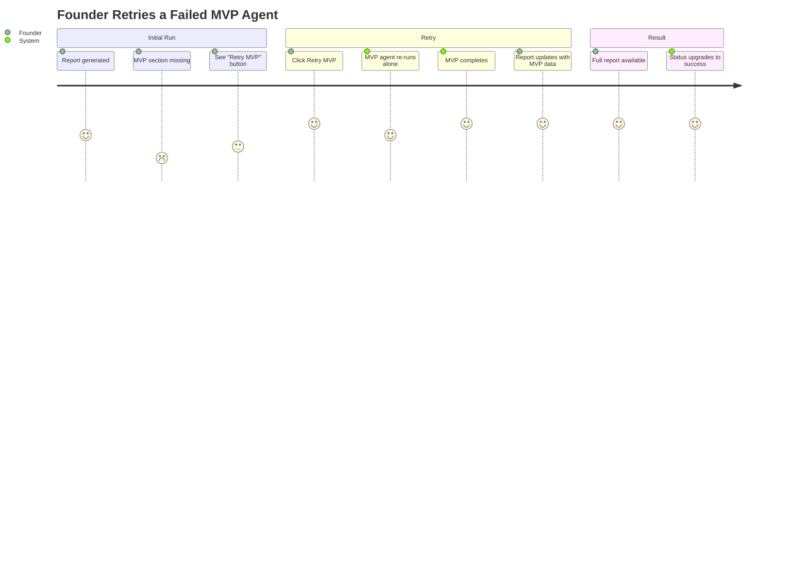

# Validator v2 — User Journey

> Founder experience from idea input to actionable report.

---

## Founder Validation Journey

---

## Session Lifecycle (Founder Perspective)

---

## Progress Tracker UX Flow

What the founder sees during pipeline execution:

---

## Retry Experience

When an agent fails, the founder should never lose work from agents that succeeded.

---

## Key UX Principles

1. **Always show something** — even if 3 agents fail, the founder gets partial data
2. **Per-agent retry** — no need to re-run the entire pipeline
3. **Real-time progress** — each agent status updates independently via polling
4. **Clear attribution** — each report section shows which agent produced it
5. **Graceful degradation** — missing optional sections are marked, not hidden
